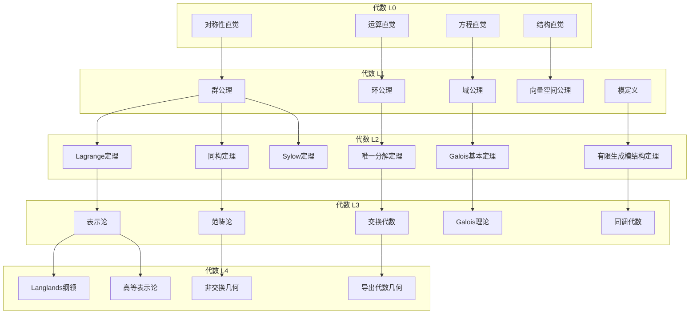
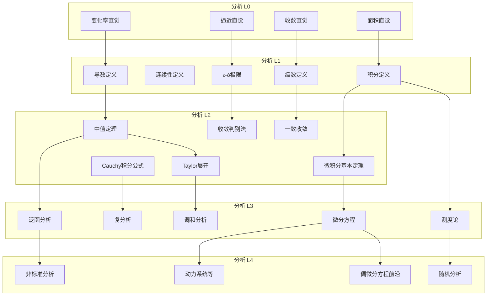
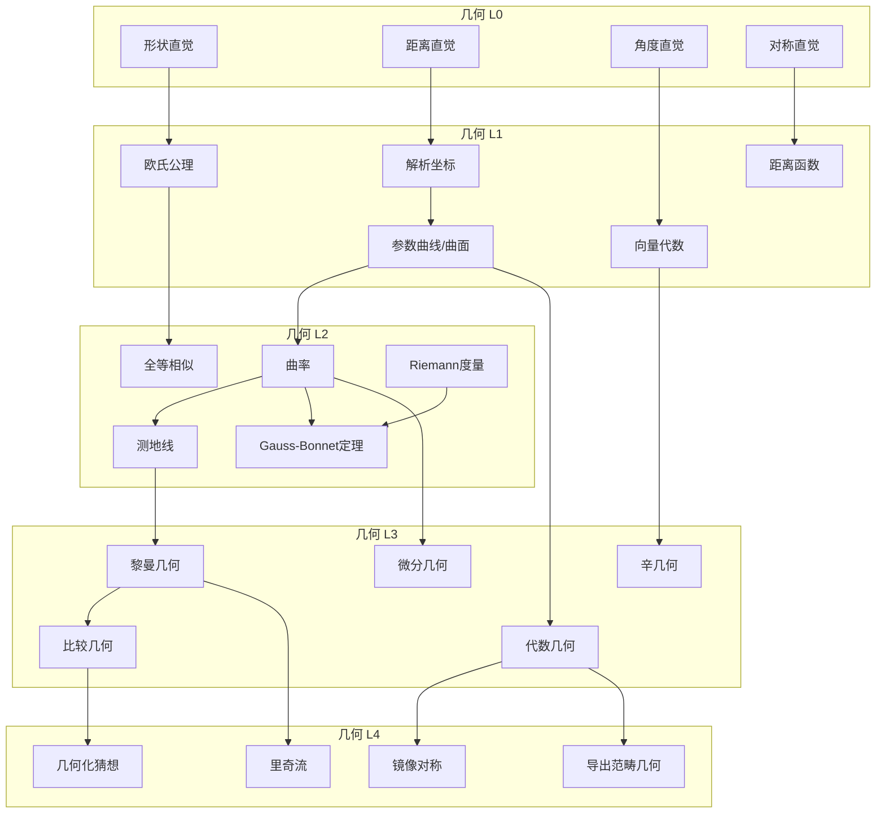
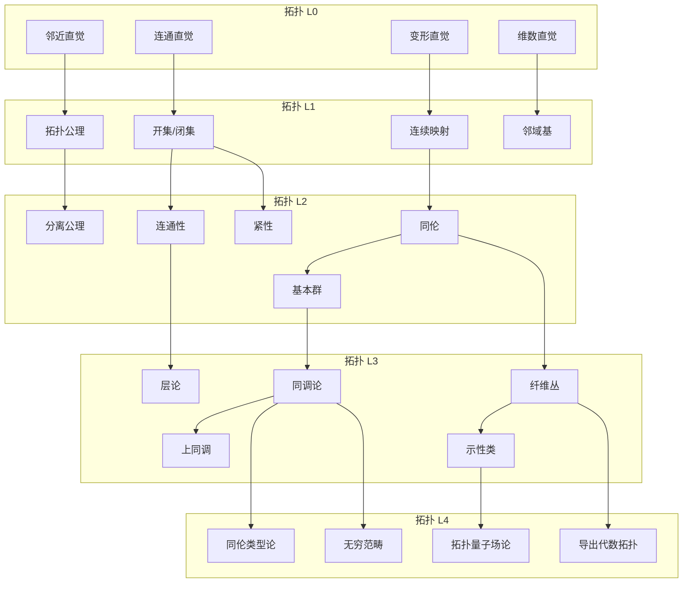
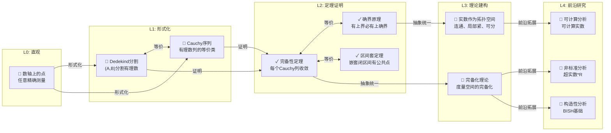
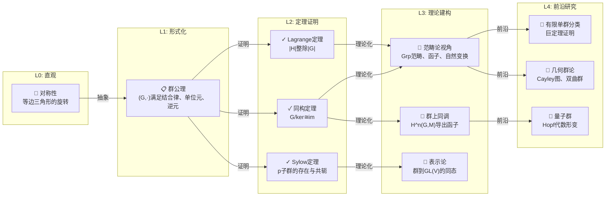
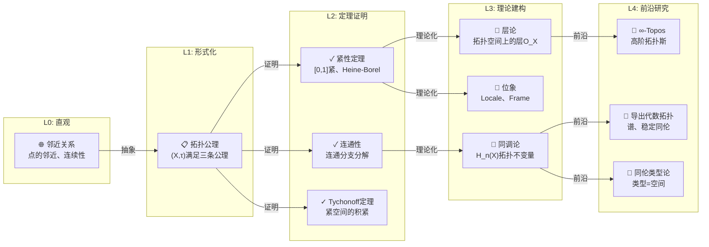
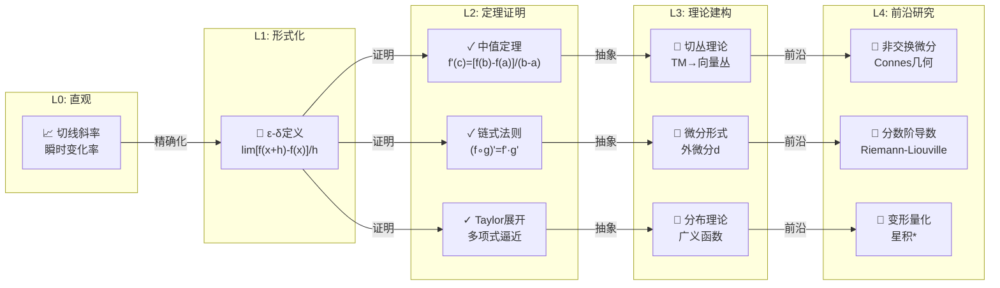

# 层次递进关系总图

**文档编号**: FM.HIERARCHY.02
**创建日期**: 2026年4月3日

---

## 📋 目录

- [层次递进关系总图](#层次递进关系总图)
  - [📋 目录](#-目录)
  - [1. 整体层次结构图](#1-整体层次结构图)
  - [2. 代数分支层次图](#2-代数分支层次图)
  - [3. 分析分支层次图](#3-分析分支层次图)
  - [4. 几何分支层次图](#4-几何分支层次图)
  - [5. 拓扑分支层次图](#5-拓扑分支层次图)
  - [6. 典型概念层次跃迁示例](#6-典型概念层次跃迁示例)

---

## 一、整体层次结构图

```mermaid
flowchart TB
    subgraph "L4: 前沿研究层次"
        L4A["🔬 Langlands纲领"]
        L4B["🔬 完美oid空间"]
        L4C["🔬 同伦类型论"]
        L4D["🔬 导出代数几何"]
        L4E["🔬 无穷范畴"]
        L4F["🔬 Riemann假设"]
    end
    
    subgraph "L3: 理论建构层次"
        L3A["📚 范畴论"]
        L3B["📚 层理论"]
        L3C["📚 同调代数"]
        L3D["📚 泛函分析"]
        L3E["📚 黎曼几何"]
        L3F["📚 代数几何"]
        L3G["📚 代数拓扑"]
    end
    
    subgraph "L2: 定理证明层次"
        L2A["📖 中值定理"]
        L2B["📖 Lagrange定理"]
        L2C["📖 Cauchy积分公式"]
        L2D["📖 同构定理"]
        L2E["📖 秩-零化度定理"]
        L2F["📖 紧性定理"]
        L2G["📖 完备性定理"]
    end
    
    subgraph "L1: 形式化定义层次"
        L1A["📝 ε-δ定义"]
        L1B["📝 群公理"]
        L1C["📝 拓扑公理"]
        L1D["📝 向量空间公理"]
        L1E["📝 环公理"]
        L1F["📝 域公理"]
        L1G["📝 测度定义"]
    end
    
    subgraph "L0: 直观/经验层次"
        L0A["💡 几何直观"]
        L0B["💡 数感"]
        L0C["💡 代数直觉"]
        L0D["💡 分析直觉"]
        L0E["💡 空间直觉"]
        L0F["💡 逼近直觉"]
    end
    
    L0A -->|形式化| L1C
    L0B -->|形式化| L1A
    L0C -->|形式化| L1B
    L0D -->|形式化| L1A
    L0E -->|形式化| L1D
    L0F -->|形式化| L1G
    
    L1A -->|证明构造| L2A
    L1B -->|证明构造| L2B
    L1B -->|证明构造| L2D
    L1C -->|证明构造| L2F
    L1D -->|证明构造| L2E
    L1E -->|证明构造| L2G
    
    L2A -->|抽象统一| L3D
    L2B -->|抽象统一| L3A
    L2C -->|抽象统一| L3B
    L2D -->|抽象统一| L3C
    L2E -->|抽象统一| L3A
    L2F -->|抽象统一| L3G
    
    L3A -->|前沿拓展| L4E
    L3B -->|前沿拓展| L4B
    L3C -->|前沿拓展| L4C
    L3F -->|前沿拓展| L4D
    L3G -->|前沿拓展| L4A
    
    L4A -.->|反馈| L0C
    L4B -.->|应用| L2B
    L4C -.->|基础重构| L0B

    style L0A fill:#e8f5e9
    style L0B fill:#e8f5e9
    style L0C fill:#e8f5e9
    style L0D fill:#e8f5e9
    style L0E fill:#e8f5e9
    style L0F fill:#e8f5e9
    style L1A fill:#fff3e0
    style L1B fill:#fff3e0
    style L1C fill:#fff3e0
    style L1D fill:#fff3e0
    style L1E fill:#fff3e0
    style L1F fill:#fff3e0
    style L1G fill:#fff3e0
    style L2A fill:#e3f2fd
    style L2B fill:#e3f2fd
    style L2C fill:#e3f2fd
    style L2D fill:#e3f2fd
    style L2E fill:#e3f2fd
    style L2F fill:#e3f2fd
    style L2G fill:#e3f2fd
    style L3A fill:#f3e5f5
    style L3B fill:#f3e5f5
    style L3C fill:#f3e5f5
    style L3D fill:#f3e5f5
    style L3E fill:#f3e5f5
    style L3F fill:#f3e5f5
    style L3G fill:#f3e5f5
    style L4A fill:#ffebee
    style L4B fill:#ffebee
    style L4C fill:#ffebee
    style L4D fill:#ffebee
    style L4E fill:#ffebee
    style L4F fill:#ffebee

```

---

## 二、代数分支层次图



---

## 三、分析分支层次图



---

## 四、几何分支层次图



---

## 五、拓扑分支层次图



---

## 六、典型概念层次跃迁示例

### 6.1 实数概念的层次跃迁



### 6.2 群概念的层次跃迁



### 6.3 拓扑空间概念的层次跃迁



### 6.4 导数概念的层次跃迁



---

**文档信息**
- **创建**: 2026年4月3日
- **图表数量**: 10个Mermaid流程图
- **适用范围**: FormalMath项目可视化导航
- **维护状态**: 持续更新
