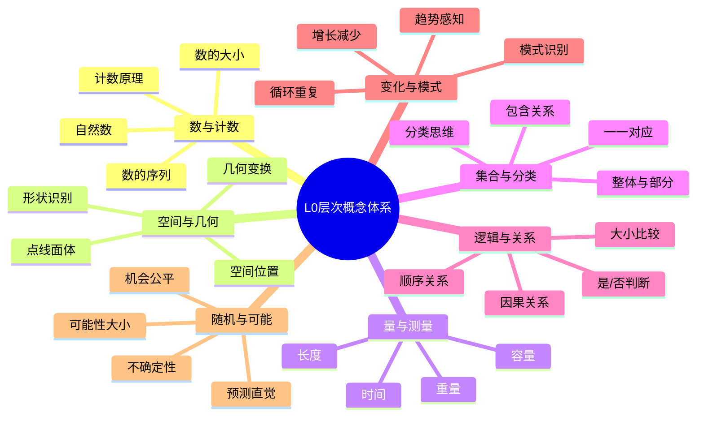
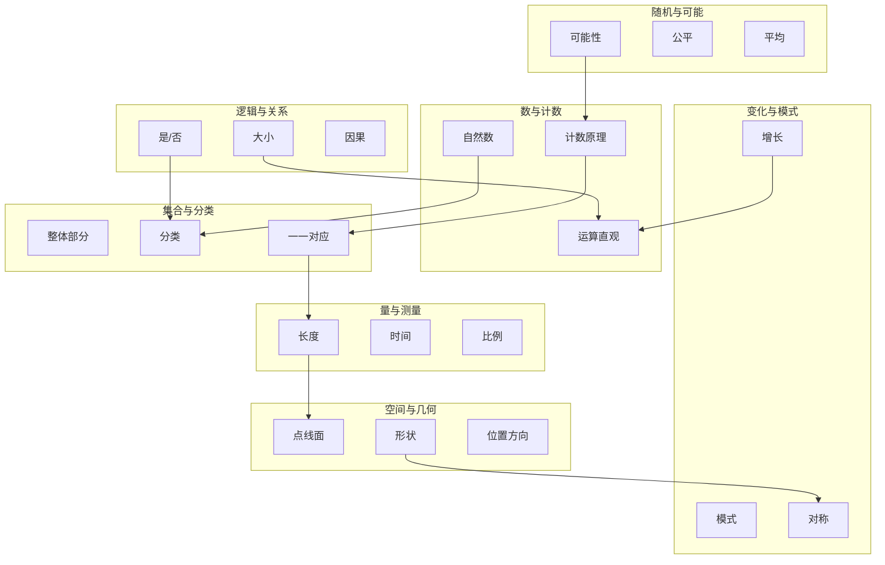
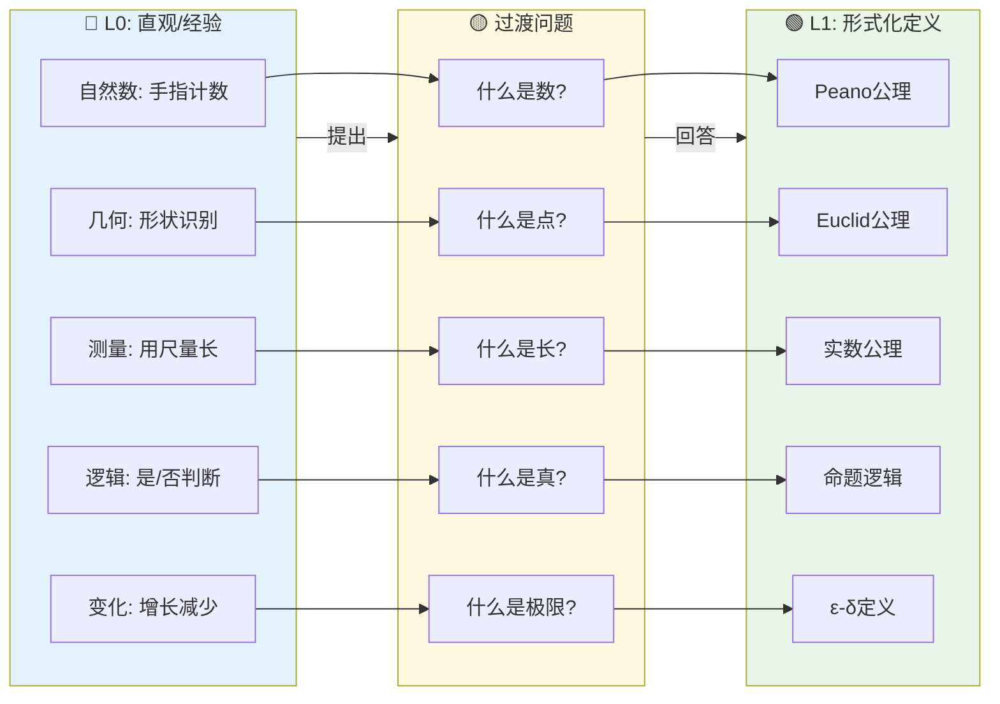
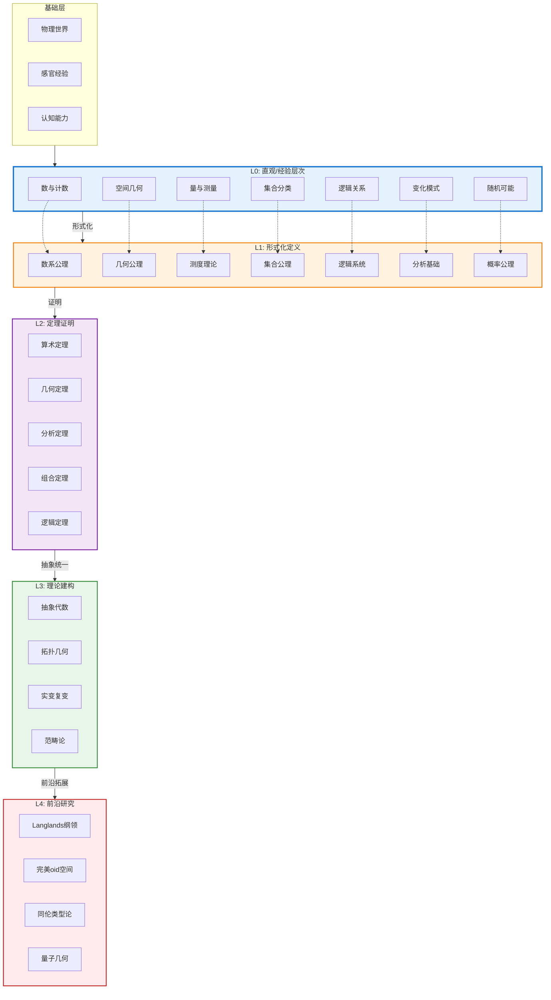

# L0层次总览：直观/经验层次

**文档编号**: FM.L0.OVERVIEW
**创建日期**: 2026年4月3日
**版本**: 1.0
**概念数量**: 50个核心概念

---

## 📋 目录

- [L0层次总览：直观/经验层次](#l0层次总览直观经验层次)
  - [📋 目录](#目录)
  - [1. 层次定位](#1-层次定位)
    - [1.1 定义](#11-定义)
    - [1.2 认知科学视角](#12-认知科学视角)
    - [1.3 与高层次的关系](#13-与高层次的关系)
  - [2. 核心特征](#2-核心特征)
    - [2.1 六大核心特征](#21-六大核心特征)
    - [2.2 与L1层次的关键区别](#22-与l1层次的关键区别)
  - [3. 概念分类体系](#3-概念分类体系)
    - [3.1 七大概念家族](#31-七大概念家族)
    - [3.2 概念复杂度梯度](#32-概念复杂度梯度)
  - [4. 50个核心概念清单](#4-50个核心概念清单)
    - [4.1 数与计数家族 (10个)](#41-数与计数家族-10个)
    - [4.2 空间与几何家族 (10个)](#42-空间与几何家族-10个)
    - [4.3 量与测量家族 (8个)](#43-量与测量家族-8个)
    - [4.4 集合与分类家族 (6个)](#44-集合与分类家族-6个)
    - [4.5 逻辑与关系家族 (6个)](#45-逻辑与关系家族-6个)
    - [4.6 变化与模式家族 (5个)](#46-变化与模式家族-5个)
    - [4.7 随机与可能家族 (5个)](#47-随机与可能家族-5个)
  - [5. L0→L1过渡路径](#5-l0l1过渡路径)
    - [5.1 过渡的关键问题](#51-过渡的关键问题)
    - [5.2 转化条件清单](#52-转化条件清单)
  - [6. 层次递进关系图](#6-层次递进关系图)
    - [6.1 L0层内部关系图](#61-l0层内部关系图)
    - [6.2 L0→L1递进图](#62-l0l1递进图)
    - [6.3 完整层次体系图](#63-完整层次体系图)
  - [7. 使用指南](#7-使用指南)
    - [7.1 阅读建议](#71-阅读建议)
    - [7.2 文档结构](#72-文档结构)
    - [7.3 关联导航](#73-关联导航)

---

## 一、层次定位

### 1.1 定义

L0层次（Level 0: Intuitive/Empirical Layer）是数学知识体系的**根基层**，基于人类与生俱来的直观感知能力和对物理世界的经验观察。

> **哲学基础**: L0层次对应于康德的"先天直观形式"——时间和空间作为人类认知的基本框架，是数学概念产生的原始土壤。

### 1.2 认知科学视角

| 认知维度 | L0层次特征 |
|---------|-----------|
| **感知基础** | 视觉、触觉、运动觉的直观体验 |
| **认知阶段** | 皮亚杰"感知运动阶段"至"具体运算阶段" |
| **表征方式** | 表象表征（iconic representation） |
| **思维特点** | 具体形象思维，依赖实物操作 |

### 1.3 与高层次的关系

```

L0 (直观/经验) ──→ L1 (形式化定义)
     ↑                    ↓
     └──── L4 ←── L3 ←── L2

循环：L4的前沿研究常激发新的直观理解

```

---

## 二、核心特征

### 2.1 六大核心特征

| 特征 | 描述 | 示例 |
|-----|------|------|
| **具身性** | 概念源于身体经验 | 计数源于手指，长度源于步伐 |
| **直观性** | 无需证明即可"看见" | 两点之间直线最短 |
| **经验性** | 基于反复观察验证 | 日出日落形成时间概念 |
| **前语言性** | 先于符号系统存在 | 婴儿对"多"与"少"的感知 |
| **普遍性** | 跨文化的共同基础 | 所有文明都有自然数概念 |
| **模糊性** | 允许边界不清晰 | "大数"因人而异 |

### 2.2 与L1层次的关键区别

| 维度 | L0层次 | L1层次 |
|-----|--------|--------|
| 严格性 | 非形式化，允许模糊 | ε-δ精确化 |
| 验证 | 举例、图示、直觉 | 定义检验、公理推导 |
| 表达 | 自然语言、图形 | 符号系统、形式语言 |
| 思维方式 | "看起来像..." | "根据定义..." |
| 反例容忍 | 可暂时忽略 | 必须严格处理 |

---

## 三、概念分类体系

### 3.1 七大概念家族



### 3.2 概念复杂度梯度

```

Level 0.0: 原始感知 (如：多少、大小、远近)
    ↓
Level 0.1: 基本操作 (如：数数、比较、分类)
    ↓
Level 0.2: 简单关系 (如：顺序、对应、组合)
    ↓
Level 0.3: 初级抽象 (如：模式、对称、变化)

```

---

## 4. 50个核心概念清单

### 4.1 数与计数家族 (10个)

| 序号 | 概念名称 | 文档链接 | 核心直观 | L1对应 |
|-----|---------|---------|---------|--------|
| L0-01 | 自然数与计数 | [01-自然数与计数.md](./01-自然数与计数.md) | 手指、物体的可数性 | Peano公理 |
| L0-02 | 数的顺序 | [02-数的顺序.md](./02-数的顺序.md) | 数轴上的左右位置 | 全序关系 |
| L0-03 | 数的大小比较 | [03-数的大小比较.md](./03-数的大小比较.md) | 多和少的直观 | 序公理 |
| L0-04 | 零的概念 | [04-零的概念.md](./04-零的概念.md) | 什么都没有 | 加法单位元 |
| L0-05 | 十进制系统 | [05-十进制系统.md](./05-十进制系统.md) | 满十进一 | 位置记数法 |
| L0-06 | 加法直观 | [06-加法直观.md](./06-加法直观.md) | 合并、累加 | 加法公理 |
| L0-07 | 减法直观 | [07-减法直观.md](./07-减法直观.md) | 拿走、比较 | 加法逆元 |
| L0-08 | 乘法直观 | [08-乘法直观.md](./08-乘法直观.md) | 重复、矩形阵列 | 乘法公理 |
| L0-09 | 除法直观 | [09-除法直观.md](./09-除法直观.md) | 均分、包含 | 乘法逆元 |
| L0-10 | 数的分解 | [10-数的分解.md](./10-数的分解.md) | 拆分重组 | 质因数分解 |

### 4.2 空间与几何家族 (10个)

| 序号 | 概念名称 | 文档链接 | 核心直观 | L1对应 |
|-----|---------|---------|---------|--------|
| L0-11 | 点的概念 | [11-点的概念.md](./11-点的概念.md) | 位置标记、笔尖触纸 | 几何公理 |
| L0-12 | 直线直观 | [12-直线直观.md](./12-直线直观.md) | 拉紧的绳子、光线 | 欧几里得公理 |
| L0-13 | 平面直观 | [13-平面直观.md](./13-平面直观.md) | 桌面、水面 | 平面公理 |
| L0-14 | 圆形直观 | [14-圆形直观.md](./14-圆形直观.md) | 车轮、太阳 | 圆的定义 |
| L0-15 | 角度直观 | [15-角度直观.md](./15-角度直观.md) | 开合程度、转角 | 角度度量 |
| L0-16 | 距离直观 | [16-距离直观.md](./16-距离直观.md) | 远近、路径长短 | 度量空间 |
| L0-17 | 方向直观 | [17-方向直观.md](./17-方向直观.md) | 前后左右上下 | 向量方向 |
| L0-18 | 形状识别 | [18-形状识别.md](./18-形状识别.md) | 三角形、方形辨识 | 多边形分类 |
| L0-19 | 几何变换 | [19-几何变换.md](./19-几何变换.md) | 移动、翻转、旋转 | 变换群 |
| L0-20 | 空间位置 | [20-空间位置.md](./20-空间位置.md) | 内外、相邻、隔离 | 拓扑概念 |

### 4.3 量与测量家族 (8个)

| 序号 | 概念名称 | 文档链接 | 核心直观 | L1对应 |
|-----|---------|---------|---------|--------|
| L0-21 | 长度测量 | [21-长度测量.md](./21-长度测量.md) | 用尺量、迈步测 | 实数度量 |
| L0-22 | 重量感知 | [22-重量感知.md](./22-重量感知.md) | 轻重、天平平衡 | 质量概念 |
| L0-23 | 时间流逝 | [23-时间流逝.md](./23-时间流逝.md) | 先后、快慢、持续 | 时间变量 |
| L0-24 | 面积覆盖 | [24-面积覆盖.md](./24-面积覆盖.md) | 铺砖、涂色 | 面积测度 |
| L0-25 | 体积填充 | [25-体积填充.md](./25-体积填充.md) | 倒水、堆叠 | 体积测度 |
| L0-26 | 温度感知 | [26-温度感知.md](./26-温度感知.md) | 冷热、舒适度 | 温度标度 |
| L0-27 | 速度感知 | [27-速度感知.md](./27-速度感知.md) | 快慢、追赶 | 速度定义 |
| L0-28 | 比例直观 | [28-比例直观.md](./28-比例直观.md) | 缩放、部分整体 | 比例关系 |

### 4.4 集合与分类家族 (6个)

| 序号 | 概念名称 | 文档链接 | 核心直观 | L1对应 |
|-----|---------|---------|---------|--------|
| L0-29 | 整体与部分 | [29-整体与部分.md](./29-整体与部分.md) | 分割、组成 | 子集关系 |
| L0-30 | 分类思维 | [30-分类思维.md](./30-分类思维.md) | 按特征分组 | 等价类 |
| L0-31 | 一一对应 | [31-一一对应.md](./31-一一对应.md) | 配对、匹配 | 双射 |
| L0-32 | 容器原理 | [32-容器原理.md](./32-容器原理.md) | 盒子装东西 | 集合包含 |
| L0-33 | 集合运算 | [33-集合运算.md](./33-集合运算.md) | 合并、共同部分 | 并交差 |
| L0-34 | 空集概念 | [34-空集概念.md](./34-空集概念.md) | 空盒子 | 空集公理 |

### 4.5 逻辑与关系家族 (6个)

| 序号 | 概念名称 | 文档链接 | 核心直观 | L1对应 |
|-----|---------|---------|---------|--------|
| L0-35 | 是/否判断 | [35-是-否判断.md](./35-是-否判断.md) | 对错、真假 | 命题逻辑 |
| L0-36 | 大小关系 | [36-大小关系.md](./36-大小关系.md) | 排队、排序 | 序关系 |
| L0-37 | 因果关系 | [37-因果关系.md](./37-因果关系.md) | 因为所以 | 蕴含关系 |
| L0-38 | 等价感知 | [38-等价感知.md](./38-等价感知.md) | 一样、相等 | 等价关系 |
| L0-39 | 全有或全无 | [39-全有或全无.md](./39-全有或全无.md) | 所有、每个 | 全称量词 |
| L0-40 | 存在感知 | [40-存在感知.md](./40-存在感知.md) | 至少有一个 | 存在量词 |

### 4.6 变化与模式家族 (5个)

| 序号 | 概念名称 | 文档链接 | 核心直观 | L1对应 |
|-----|---------|---------|---------|--------|
| L0-41 | 增长减少 | [41-增长减少.md](./41-增长减少.md) | 越来越多/少 | 单调性 |
| L0-42 | 重复模式 | [42-重复模式.md](./42-重复模式.md) | 周期、循环 | 周期函数 |
| L0-43 | 数列规律 | [43-数列规律.md](./43-数列规律.md) | 找规律、填空 | 通项公式 |
| L0-44 | 对称直观 | [44-对称直观.md](./44-对称直观.md) | 镜像、折叠重合 | 对称群 |
| L0-45 | 趋势感知 | [45-趋势感知.md](./45-趋势感知.md) | 走向、趋向 | 极限直观 |

### 4.7 随机与可能家族 (5个)

| 序号 | 概念名称 | 文档链接 | 核心直观 | L1对应 |
|-----|---------|---------|---------|--------|
| L0-46 | 可能性大小 | [46-可能性大小.md](./46-可能性大小.md) | 可能、也许、肯定 | 概率直观 |
| L0-47 | 公平游戏 | [47-公平游戏.md](./47-公平游戏.md) | 机会均等 | 等可能 |
| L0-48 | 随机结果 | [48-随机结果.md](./48-随机结果.md) | 不确定、意外 | 随机变量 |
| L0-49 | 频率稳定 | [49-频率稳定.md](./49-频率稳定.md) | 多次重复后的规律 | 大数定律 |
| L0-50 | 平均概念 | [50-平均概念.md](./50-平均概念.md) | 均衡、中间水平 | 期望值 |

---

## 五、L0→L1过渡路径

### 5.1 过渡的关键问题

每个L0概念文档都包含以下过渡问题：

```

┌─────────────────────────────────────────────────────────┐
│  L0概念 ──→ 过渡问题 ──→ 形式化需求 ──→ L1定义         │
├─────────────────────────────────────────────────────────┤
│  示例：连续函数                                          │
│  L0: "一笔画成，没有断开"                               │
│  ↓                                                      │
│  过渡问题：                                             │
│  - "一笔画"在多远的距离内有效？                         │
│  - 如何精确定义"没有断开"？                            │
│  - 什么情况下直观会失效？                               │
│  ↓                                                      │
│  L1: ∀ε>0, ∃δ>0, |x-a|<δ ⇒ |f(x)-f(a)|<ε               │

└─────────────────────────────────────────────────────────┘

```

### 5.2 转化条件清单

| 转化维度 | L0能力 | L1需求 | 评估指标 |
|---------|--------|--------|---------|
| **精确性** | 模糊描述 | 精确陈述 | 消除"大约"、"接近" |
| **量化** | 定性比较 | 定量度量 | 使用数字和单位 |
| **边界** | 忽略边界 | 严格处理 | 识别临界情况 |
| **符号** | 自然语言 | 形式语言 | 使用数学符号 |
| **反例** | 接受例外 | 排除反例 | 构造反例能力 |

---

## 六、层次递进关系图

### 6.1 L0层内部关系图



### 6.2 L0→L1递进图



### 6.3 完整层次体系图



---

## 七、使用指南

### 7.1 阅读建议

1. **初学者**: 按家族分组阅读，从数与计数开始
2. **教师**: 关注每个概念的"物理世界对应"部分
3. **研究者**: 重点阅读"向L1层过渡的关键问题"

### 7.2 文档结构

每个L0概念文档包含：

- 📌 直观描述（非形式化）
- 🌍 物理世界对应
- ❓ 向L1层过渡的关键问题
- 🔗 与L1层概念的关联链接

### 7.3 关联导航

- [← 返回层次体系总览](../00-层次关系总图.md)
- [→ 前往L1形式化定义层](../L1-形式化定义层/00-L1层次总览.md)
- [↑ 查看层次定义标准](../00-L0-L4层次定义标准.md)

---

**文档信息**

- **创建日期**: 2026年4月3日
- **最后更新**: 2026年4月3日
- **文档字数**: 约3500字
- **概念覆盖**: 50个L0核心概念
- **适用范围**: FormalMath项目L0层次学习路径
