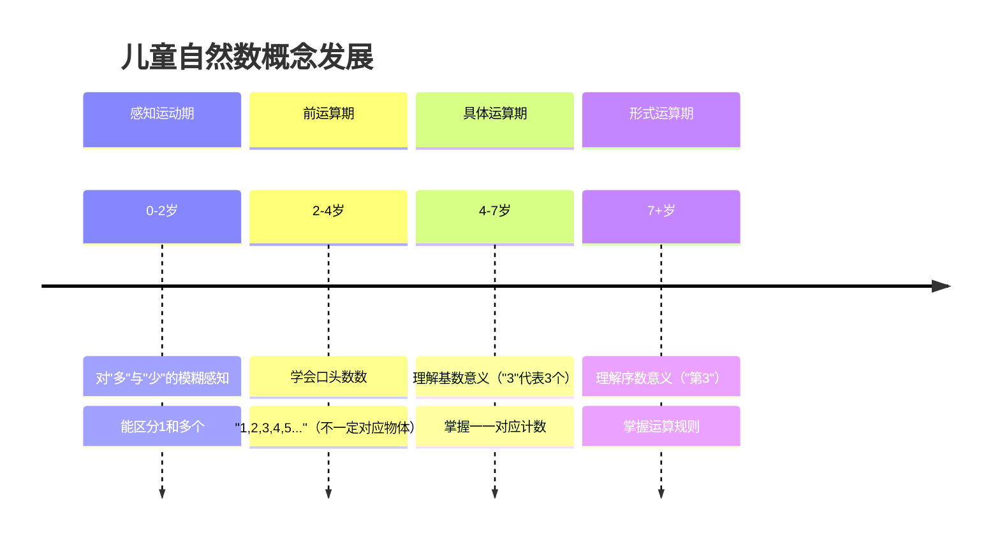
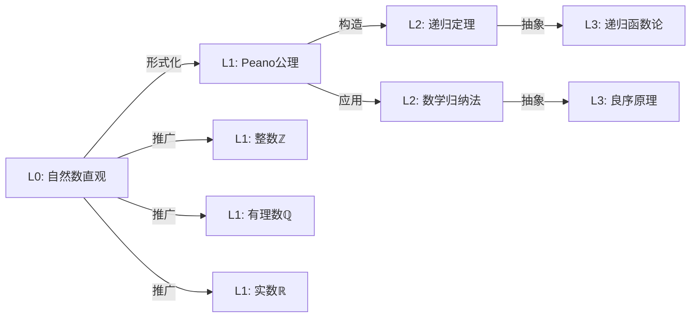

# L0-01: 自然数与计数

**概念编号**: L0-01
**所属家族**: 数与计数
**核心定位**: 数学最原始的概念起点

---

## 📌 直观描述

### 1.1 核心直观

自然数是人类认知中**最原始的数学概念**，源于对离散对象数量的感知。

> **日常表述**: "我有3个苹果"、"来了5个人"、"这是第2个"

### 1.2 多重表征

| 表征类型 | 具体表现 | 示例 |
|---------|---------|------|
| **手指表征** | 用手指计数 | 1=☝️ 2=✌️ 3=👌 |
| **物体表征** | 具体物品 | ● ● ● = 3 |
| **语言表征** | 数词 | 一、二、三... |
| **符号表征** | 数字符号 | 1, 2, 3, ... |
| **动作表征** | 点头/数数 | 逐一点数 |

### 1.3 关键直觉特征

```

自然数的直观特征:
├─ 离散性: 一个个独立的"单位"
├─ 顺序性: 1→2→3→... 有固定的先后
├─ 无限性: 可以一直数下去，没有尽头
├─ 累加性: 3个加上2个等于5个
└─ 对应性: 能和其他集合的元素一一对应

```

---

## 🌍 物理世界对应

### 2.1 日常实例

| 场景 | 自然数体现 |
|-----|-----------|
| **日常生活** | 电话号码、门牌号、日期 |
| **商业活动** | 商品价格、数量统计、账单金额 |
| **时间计量** | 年份、月份、天数、小时数 |
| **空间位置** | 楼层编号、座位号、公交路线 |
| **体育运动** | 比分、排名、记录 |

### 2.2 认知发展



### 2.3 跨文化观察

| 文化 | 计数系统特点 |
|-----|-------------|
| 中文 | 十进制，逻辑性强（十一、十二...） |
| 英语 | 有历史残留（eleven, twelve） |
| 罗马 | 加法原则（VI = 5+1） |
| 玛雅 | 二十进制（手指+脚趾） |
| 二进制 | 计算机基础（0和1） |

---

## ❓ 向L1层过渡的关键问题

### 3.1 形式化困境

| 直观问题 | 形式化挑战 | L1回答 |
|---------|-----------|--------|
| 什么是"1"？ | 数字是对象还是符号？ | 1是自然数，是后继运算的起点 |
| 什么是"下一个"？ | 如何精确定义后继？ | S(n) = n + 1，是Peano公理的核心 |
| 为什么1+1=2？ | 加法的本质是什么？ | 由后继运算递归定义 |
| 自然数有多少个？ | "无限"是什么含义？ | 无穷公理保证存在性 |

### 3.2 核心过渡问题

```

从L0到L1的关键跳跃:

Q1: 什么是自然数?
   L0回答: "1, 2, 3, ... 用来数数的数"
   L1回答: "满足Peano公理的数学结构"

Q2: 0是自然数吗?
   L0回答: "有争议，有人说没有"
   L1回答: "由定义决定，现代数学通常包括0"

Q3: 如何证明1+1=2?
   L0回答: "数一下就知道"
   L1回答: "根据加法的递归定义证明"

Q4: 自然数集存在吗?
   L0回答: "当然存在，一直数下去"
   L1回答: "需要无穷公理保证其存在性"

```

### 3.3 反例与边界

| 情况 | 说明 | 形式化处理 |
|-----|------|-----------|
| "第0个" | 直觉上奇怪 | 现代数学接受0为起点 |
| 分数个 | "2.5个人"无意义 | 区分计数与测量 |
| 无穷大 | "无穷多个" | 严格区分潜无穷与实无穷 |
| 负数 | "欠3个" | 扩展到整数系 |

---

## 🔗 与L1层概念的关联

### 4.1 关联图谱



### 4.2 具体关联

| L1概念 | 关联说明 | 文档链接 |
|-------|---------|---------|
| **Peano公理** | 自然数的严格公理化定义 | [../L1-形式化定义层/01-Peano公理.md](../L1-形式化定义层/01-Peano公理.md) |
| **数学归纳法** | 自然数结构的证明方法 | [../L1-形式化定义层/02-数学归纳法.md](../L1-形式化定义层/02-数学归纳法.md) |
| **良序原理** | 自然数集的基本性质 | [../L1-形式化定义层/03-良序原理.md](../L1-形式化定义层/03-良序原理.md) |
| **递归定义** | 基于自然数的构造方法 | [../L1-形式化定义层/04-递归定义.md](../L1-形式化定义层/04-递归定义.md) |

### 4.3 学习路径

```

自然数学习路径:

L0: 计数经验 ─────────────────────────┐
   ↓                                   │
   理解"多"与"少"                      │
   ↓                                   │
   掌握口头数数 ←── 儿童发展            │
   ↓                                   │
   一一对应计数 ────┐                   │
   ↓               │                   │
过渡: "什么是数?" ←┼── 关键问题        │
   ↓               │                   │
L1: Peano公理 ────┘                   │
   ↓                                   │
   数学归纳法 ←────────────────────────┘
   ↓
L2: 数论定理（算术基本定理等）
   ↓
L3: 抽象代数（半群、幺半群）

```

---

## 📝 学习建议

### 5.1 初学者任务

1. **数数练习**: 用不同方式数100以内的数
2. **对应游戏**: 将数字与具体物体配对
3. **规律发现**: 找出100以内数的规律（奇偶、整除等）

### 5.2 进阶思考

1. 为什么人类普遍使用十进制？
2. 如果没有手指，计数系统会怎样发展？
3. 动物有"数感"吗？

---

**文档信息**

- **创建日期**: 2026年4月3日
- **概念级别**: L0（直观/经验）
- **目标读者**: 数学初学者、教育工作者
- **关联文档**: 50个L0概念文档之一
