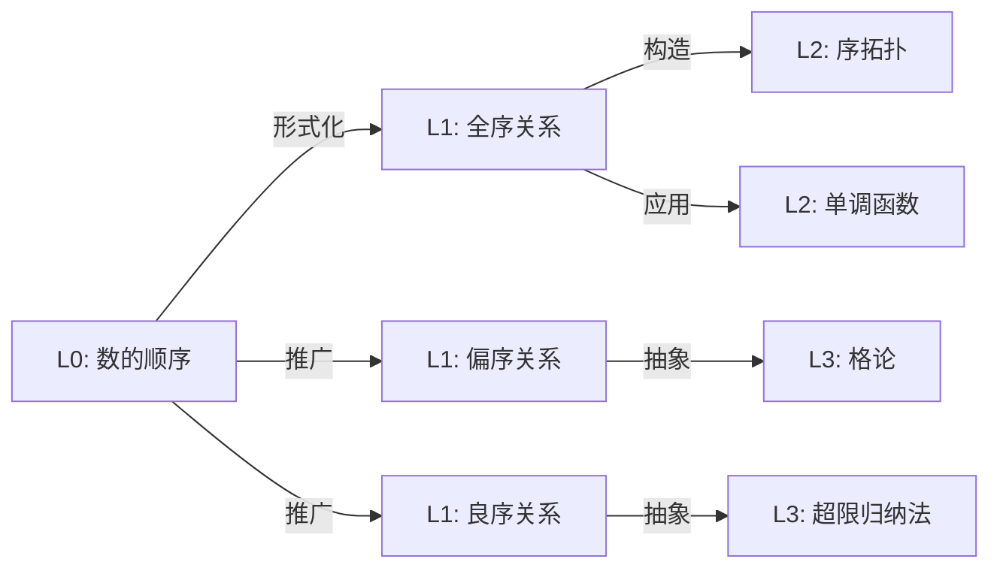

# L0-02: 数的顺序

**概念编号**: L0-02
**所属家族**: 数与计数
**核心定位**: 数的结构化排列

---

## 📌 直观描述

### 1.1 核心直观

数的顺序是指数在一条"线"上的**先后排列关系**——有的数在前面，有的数在后面。

> **日常表述**: "3在5前面"、"7比4大"、"数轴上越往右越大"

### 1.2 多重表征

| 表征类型 | 具体表现 | 示例 |
|---------|---------|------|
| **数轴表征** | 水平直线上的点 | ○───○───○───○──→ 1   2   3   4 |
| **阶梯表征** | 向上或向下的阶梯 | 越往上数字越大 |
| **排队表征** | 人的先后顺序 | 第1名、第2名、第3名... |
| **温度计** | 温度的升降 | 越高温度越高 |
| **时间线** | 历史事件先后 | 从前到后按时间排列 |

### 1.3 关键直觉特征

```

数的顺序直观特征:
├─ 全序性: 任意两个数都能比较大小
├─ 传递性: 若a<b且b<c，则a<c
├─ 稠密感: 任意两数之间总能插入其他数（对有理数/实数）
├─ 方向性: 从小到大有固定方向
└─ 距离感: 数之间"相隔多远"有直观感受

```

---

## 🌍 物理世界对应

### 2.1 日常实例

| 场景 | 顺序体现 |
|-----|---------|
| **比赛排名** | 第1名、第2名、第3名（序数） |
| **温度计量** | -10°C < 0°C < 25°C |
| **楼层编号** | 地下2层 < 地面 < 地上10层 |
| **时间顺序** | 昨天 < 今天 < 明天 |
| **年龄大小** | 5岁 < 10岁 < 成年 |
| **成绩排名** | 从高到低排列 |

### 2.2 认知发展

| 年龄段 | 顺序认知能力 |
|-------|-------------|
| 3-4岁 | 能比较5以内的大小 |
| 5-6岁 | 理解"第几个"的序数概念 |
| 7-8岁 | 能比较100以内的数 |
| 9-10岁 | 理解负数的大小关系 |
| 11+岁 | 理解分数/小数的大小比较 |

### 2.3 数轴的起源

```

数轴的历史发展:

古代 ──────────────────────────────────────→ 现代
   │                                          │
   │  印度-阿拉伯数字                         │  Descartes
   │  位置记数法 (7世纪)                      │  解析几何 (1637)
   │       │                                  │       │
   │       ↓                                  │       ↓
   │  0 1 2 3 4 5 6 7 8 9                    │  代数与几何的统一
   │       │                                  │       │
   └───────┼──────────────────────────────────┘       │
           ↓                                          ↓
         数的符号化表示                          坐标系的诞生

```

---

## ❓ 向L1层过渡的关键问题

### 3.1 形式化困境

| 直观问题 | 形式化挑战 | L1回答 |
|---------|-----------|--------|
| 为什么1<2？ | 大小的本质是什么？ | 由后继关系定义：a < b 当且仅当存在c使a+c=b |
| 负数怎么比大小？ | "更大"在负数域的含义 | 在数轴上的位置：越右越大 |
| 分数如何比较？ | 不同分母如何统一？ | 通分后比较分子 |
| 无限小存在吗？ | 0.999... 与 1的关系 | 实数完备性：二者相等 |

### 3.2 核心过渡问题

```

从L0到L1的关键跳跃:

Q1: 什么是"小于"?
   L0回答: "在数轴左边"、"更少"
   L1回答: "存在正数c使得a+c=b"

Q2: 为什么顺序具有传递性?
   L0回答: "显然如此"
   L1回答: "由加法的结合律和传递性证明"

Q3: 任意两个数都能比较吗?
   L0回答: "当然可以"
   L1回答: "在良序集中是公理，一般偏序集不一定"

Q4: 数轴上的点与数一一对应吗?
   L0回答: "看起来是"
   L1回答: "实数完备性保证了这一点"

```

### 3.3 反例与边界

| 反例 | 说明 | 形式化处理 |
|-----|------|-----------|
| 复数 | 3+2i与2+3i谁大？ | 复数域不是有序域 |
| 矩阵 | 两个矩阵如何比较？ | 可以定义偏序或半序 |
| 集合 | {1,2}与{2,3}谁大？ | 可以用包含关系定义偏序 |
| 向量 | 向量的"大小"是模长 | 方向无法比较 |

---

## 🔗 与L1层概念的关联

### 4.1 关联图谱



### 4.2 具体关联

| L1概念 | 关联说明 | 文档链接 |
|-------|---------|---------|
| **全序关系** | 任意元素可比较的序 | [../L1-形式化定义层/05-全序关系.md](./../../../ref/Books/AbstractAlgebra/Paulsen W. Abstract Algebra. An Interactive Approach 3ed 2025/01-核心概念/05-环.md) |
| **偏序关系** | 部分元素可比较的序 | [../L1-形式化定义层/06-偏序关系.md](./36-大小关系.md) |
| **良序原理** | 自然数集的良好排序性 | [../L1-形式化定义层/03-良序原理.md](./../../../数学家理念体系/策梅洛数学理念/01-核心理论/03-良序定理.md) |
| **序拓扑** | 基于序结构的拓扑 | [../L1-形式化定义层/07-序拓扑.md](./../L3-理论建构层/03-几何拓扑方向/07-低维拓扑.md) |

---

**文档信息**

- **创建日期**: 2026年4月3日
- **概念级别**: L0（直观/经验）
