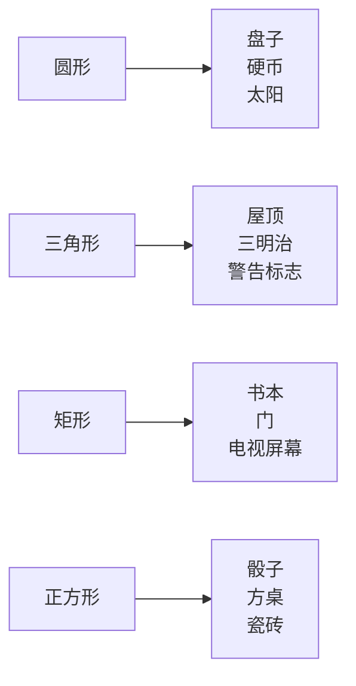
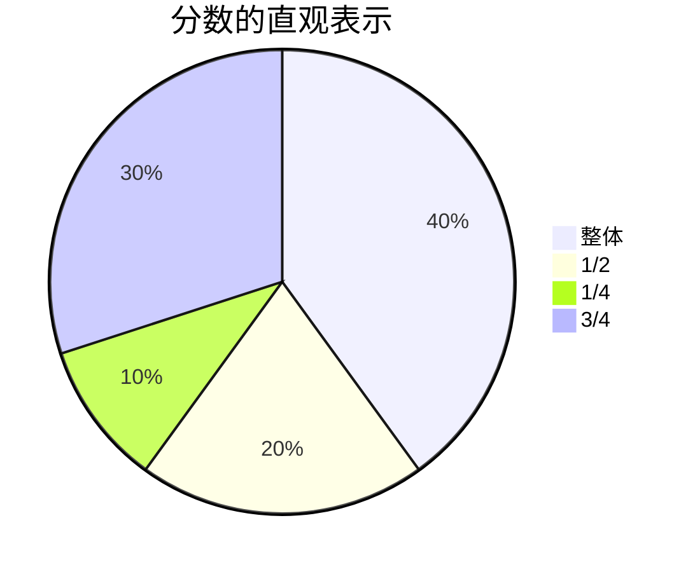
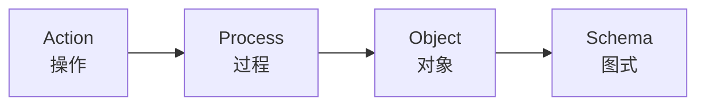
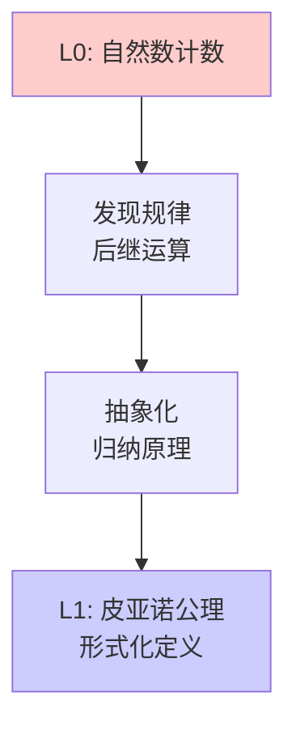
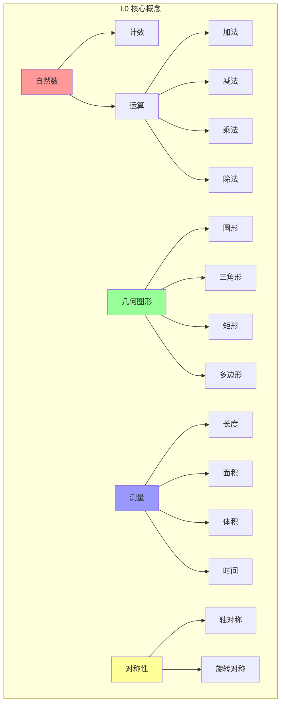
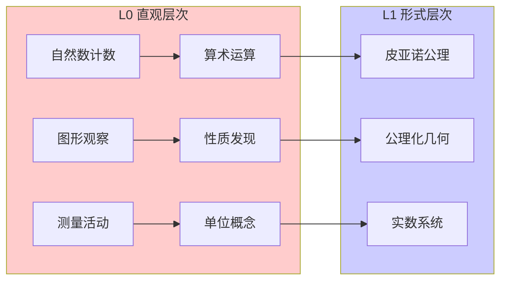

# L0 直观/经验层次 (L0-Intuitive)

## 概述

**L0-Intuitive** 是数学知识层次体系的基础层级，代表基于直觉、经验、具体实例的数学认知。这一层次是人类数学思维的自然起点，无需严格的形式化定义，通过日常生活中的例子和直观感知来理解数学概念。

---

## 一、定义与核心特征

### 1.1 定义

L0 直观/经验层次是指个体通过与物理世界和日常经验的直接交互所形成的数学认知水平。在这一层次，数学概念以**具象化**、**形象化**的方式呈现，依赖于感官知觉、操作经验和直觉判断。

数学的 L0 层次特征包括：

- **经验基础**：源于现实世界的观察和操作
- **直觉驱动**：依赖直观感受而非逻辑推导
- **具体实例**：通过具体例子理解抽象概念
- **非形式化**：无需严格的定义和证明

### 1.2 核心特征详解

#### 1.2.1 直觉性与经验性

L0 层次的数学认知建立在对物理世界的直接感知上。例如：

- 儿童通过数苹果、手指来学习计数
- 通过折纸理解对称性
- 通过堆砌积木理解空间关系

这种认知方式不依赖于符号系统或公理化框架，而是依赖于**感知-动作循环**（perception-action cycle）。

#### 1.2.2 具体性与形象性

L0 层次的数学概念总是与具体的物理对象或直观图像相联系：

| 抽象概念 | L0 具体表现 |
|---------|------------|
| 数字 | 实物计数：苹果、石子、手指 |
| 几何形状 | 实际物体：圆形盘子、方形桌子 |
| 对称性 | 镜像反射、折叠重合 |
| 连续性 | 水流不断、画线不停 |

#### 1.2.3 操作性与实验性

L0 层次强调通过**实际操作**来探索数学：

- 用尺子测量长度
- 用圆规画圆
- 用计算器进行数值实验
- 用物理模型验证几何性质

---

## 二、L0 层次的学习机制

### 2.1 皮亚杰认知发展阶段

根据皮亚杰的认知发展理论，L0 层次对应于：


L0 层次主要覆盖前三个阶段，强调**具体操作**和**直观经验**。

### 2.2 具身认知理论

具身认知（Embodied Cognition）理论认为，数学概念源于身体与环境的交互：

- **空间概念**：来源于身体的方位感知（上下、左右、前后）
- **数量概念**：来源于手指计数和物体操作
- **几何概念**：来源于对物体形状和运动轨迹的观察

### 2.3 直觉数学的心理机制

研究表明，人类天生具有**数感**（number sense）和**空间感**（spatial sense）：

1. **近似数量系统**（ANS）：能够快速估算数量，无需精确计数
2. **心理数轴**：将数字与空间位置相关联
3. **几何直觉**：能够感知基本的几何性质（直线、曲线、角度）

---

## 三、典型示例

### 3.1 自然数计数

#### 直觉理解

自然数是人类最早接触的数学概念，源于计数需求。

```mermaid
graph TD
    A[实物集合] --> B[一一对应]
    B --> C[数词序列]
    C --> D[数量概念]
    D --> E[自然数]</p>

    style A fill:#ffffcc
    style B fill:#ffffcc
    style C fill:#ccffcc
    style D fill:#ccffcc
    style E fill:#ccccff
```

#### 具体实例

- **手指计数**：用双手的10根手指表示1-10
- **结绳记事**：古代文明用绳结记录数量
- **算盘计算**：通过珠子的位置表示数值

#### 教学策略

1. **实物操作**：使用积木、计数棒等教具
2. **生活情境**：超市购物、分糖果等场景
3. **游戏化学习**：数独、数字拼图等

### 3.2 几何图形的直观认识

#### 直觉理解

几何概念源于对物理世界形状的观察和分类。



#### 性质探索（非形式化）

| 图形 | 直观性质 | 探索方法 |
|-----|---------|---------|
| 圆 | 到中心距离相等 | 用绳子和铅笔画圆 |
| 三角形 | 三边封闭 | 用三根小棒拼接 |
| 矩形 | 对边相等，四角相同 | 折叠纸张验证 |
| 对称图形 | 折叠重合 | 剪纸、镜像实验 |

### 3.3 基本运算的直观意义

#### 加法：合并与增加

- **物理意义**：两个集合的合并
- **实例**：3个苹果 + 2个苹果 = 5个苹果
- **动作表征**：手指的并拢、数轴上的向右移动

#### 减法：分离与减少

- **物理意义**：从整体中取出一部分
- **实例**：5个糖果吃掉2个，还剩3个
- **动作表征**：手指的分开、数轴上的向左移动

#### 乘法：重复与阵列

- **物理意义**：相同数量的重复累积
- **实例**：3排桌子，每排4张，共12张
- **视觉表征**：矩形阵列

#### 除法：均分与分组

- **物理意义**：将总量均分或按组分配
- **实例**：12块糖分给3个小朋友，每人4块
- **操作表征**：实际分物活动

### 3.4 分数的直观理解

#### 部分-整体关系



#### 具体操作

- **折纸**：将正方形纸对折得到1/2
- **分披萨**：圆形分割理解分数大小
- **数线**：在0和1之间定位分数

### 3.5 对称性的直观认识

#### 轴对称

- **实例**：蝴蝶翅膀、人脸、字母A
- **验证**：折叠实验，观察是否重合

#### 中心对称

- **实例**：雪花、风车、字母S
- **验证**：旋转180度观察是否重合

### 3.6 度量的直观理解

#### 长度

- **非标准单位**：步长、拃（张开的手掌宽度）
- **标准单位**：厘米尺、米尺的应用

#### 面积

- **覆盖法**：用正方形纸片覆盖平面图形
- **实例**：地板砖铺设、墙纸计算

#### 体积

- **填充法**：用单位立方体填充容器
- **实例**：液体倒入、沙子填充

---

## 四、L0 层次的教育意义

### 4.1 数学学习的起点

L0 层次是形式化数学教育的**必要基础**。研究表明：

- 缺乏具体经验支撑的形式化学习容易导致**机械记忆**
- 直觉理解是深度理解的**先决条件**
- 具体操作促进**概念内化**

### 4.2 概念发展的轨迹

根据杜宾斯基的**APOS理论**，概念理解的发展轨迹为：



L0 层次主要对应于 **Action（操作）** 阶段，是向更高层次发展的必经阶段。

### 4.3 教学原则

#### 4.3.1 具体-形象-抽象原则（CPA）

1. **Concrete（具体）**：使用实物教具
2. **Pictorial（形象）**：使用图形、图表表示
3. **Abstract（抽象）**：引入符号和公式

#### 4.3.2 从做中学

- 强调操作和探索
- 允许试错和发现
- 鼓励动手实践

#### 4.3.3 情境化学习

- 联系日常生活
- 创设真实问题情境
- 激发学习动机

---

## 五、L0 到 L1 的过渡

### 5.1 过渡的必要性

虽然 L0 层次是数学认知的基础，但纯直觉的局限性包括：

- **精确性不足**：直觉可能导致错误判断
- **适用范围有限**：复杂概念无法直观理解
- **交流困难**：缺乏标准化表达方式

### 5.2 过渡的标志

从 L0 向 L1 过渡的标志性特征：

| L0 特征 | L1 特征 |
|--------|--------|
| 依赖具体实例 | 使用变量和符号 |
| 直观判断 | 逻辑推理 |
| 操作性定义 | 公理化定义 |
| 经验验证 | 证明验证 |

### 5.3 过渡策略

1. **逐步抽象化**：从具体例子提炼共同特征
2. **符号化**：引入数学符号表示概念
3. **形式化验证**：从实验验证过渡到逻辑证明
4. **元认知反思**：思考"为什么"而不仅是"是什么"

### 5.4 过渡的示例：从自然数到皮亚诺公理



---

## 六、L0 层次的判断标准

### 6.1 内容判断标准

一个数学概念描述属于 L0 层次，如果满足以下条件：

| 维度 | 判断标准 |
|-----|---------|
| **表达方式** | 使用日常语言，避免专业术语 |
| **例证方式** | 以具体实例为主，不使用抽象符号 |
| **验证方式** | 依赖实验、操作、观察 |
| **认知方式** | 基于直觉和感知 |
| **适用范围** | 具体数值、具体图形 |

### 6.2 学习者能力评估

评估学习者处于 L0 层次的能力指标：

1. **能够**：
   - 使用实物进行计数和运算
   - 识别和描述常见几何图形
   - 通过操作验证简单的数学性质
   - 解决生活中的简单数学问题

2. **尚未能够**：
   - 理解和使用数学符号系统
   - 进行抽象推理
   - 理解形式化定义
   - 构造和验证数学证明

### 6.3 文档标注规范

在 FormalMath 项目中，L0 层次文档的标注规范：

```markdown
---
level: L0-Intuitive
domain: [领域名称]
prerequisites: []
next_level: L1-Formal
tags: ["直观", "经验", "具体"]
---
```

---

## 七、L0 层次的知识图谱

### 7.1 核心概念网络



### 7.2 与 L1 的接口



---

## 八、跨领域的 L0 表现

### 8.1 代数

- 用字母表示未知数（初步符号化）
- 简单的等式平衡观念（天平模型）
- 模式识别和延续（数列规律）

### 8.2 几何

- 空间方位（上下左右前后）
- 图形分类（按边数、按角）
- 简单变换（平移、旋转、翻转）

### 8.3 数据分析

- 数据收集（调查、统计）
- 图表阅读（条形图、饼图）
- 平均数的直觉（公平分配）

### 8.4 概率

- 可能性大小（一定、可能、不可能）
- 简单实验（掷骰子、抛硬币）
- 频率的稳定性（大量重复实验）

---

## 九、常见问题与误区

### 9.1 直觉的局限性

| 直觉观念 | 数学现实 | 纠正方法 |
|---------|---------|---------|
| "乘法使数变大" | 乘以小于1的数会变小 | 具体例子：0.5 × 4 = 2 |
| "除法使数变小" | 除以小于1的数会变大 | 具体例子：4 ÷ 0.5 = 8 |
| "所有图形都有面积公式" | 复杂图形可能没有简单公式 | 探索不规则图形 |
| "直线就是笔直的线" | 直线是无限延伸的 | 几何画板演示 |

### 9.2 教学中的注意事项

1. **避免过早形式化**：不要在学生尚未建立直觉理解时引入符号
2. **重视操作经验**：确保每个学生都有充分的动手操作机会
3. **鼓励多元表征**：支持学生用自己的方式表达数学思想
4. **循序渐进**：遵循从具体到抽象的发展规律

---

## 十、总结

L0 直观/经验层次是数学知识体系的**根基**，它为后续的形式化学习提供了必要的认知基础。在这一层次：

- **核心是直觉**：基于感知和经验的自然认知
- **方法是操作**：通过具体活动探索数学
- **目标是理解**：建立对数学概念的直观把握
- **方向是过渡**：为进入 L1 形式化层次做准备

正如数学家庞加莱所说："直觉是数学发现的工具。" L0 层次培养的数学直觉，是数学创造力和深度理解的源泉。

---

## 参考文献

1. Piaget, J. (1952). The Origins of Intelligence in Children.
2. Lakoff, G., & Núñez, R. E. (2000). Where Mathematics Comes From.
3. Dehaene, S. (2011). The Number Sense.
4. Dubinsky, E., & McDonald, M. A. (2001). APOS: A Constructivist Theory of Learning.
5. 史宁中. (2016). 数学基本思想18讲.

---

## 附录：L0 层次概念清单

### 数与运算

- [ ] 自然数的认识与计数
- [ ] 整数的初步概念
- [ ] 分数的初步认识
- [ ] 小数的初步认识
- [ ] 四则运算的直观意义
- [ ] 运算律的直观验证

### 几何

- [ ] 基本平面图形识别
- [ ] 基本立体图形识别
- [ ] 空间方位
- [ ] 简单测量
- [ ] 对称性观察

### 量与测量

- [ ] 长度测量
- [ ] 质量测量
- [ ] 时间测量
- [ ] 货币计算
- [ ] 面积估算
- [ ] 体积估算

### 数据处理

- [ ] 数据收集
- [ ] 简单统计
- [ ] 图表阅读
- [ ] 平均数概念

---

*文档版本：1.0*
*创建日期：2026年4月*
*层次级别：L0-Intuitive*
