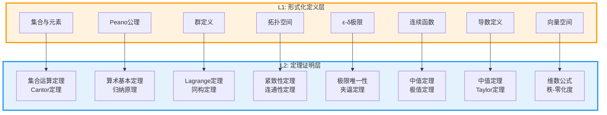
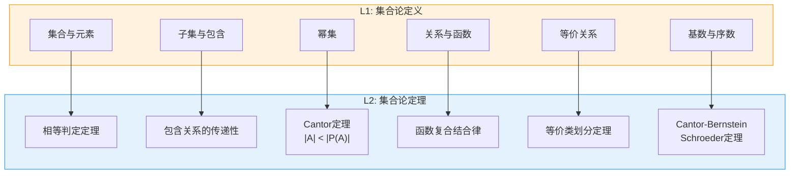
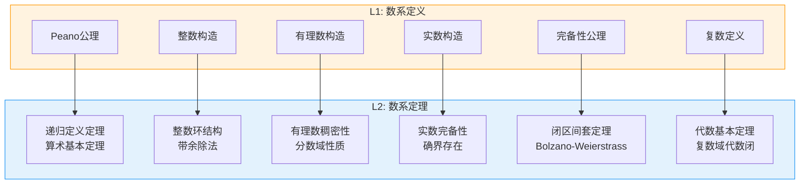
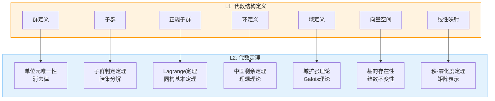
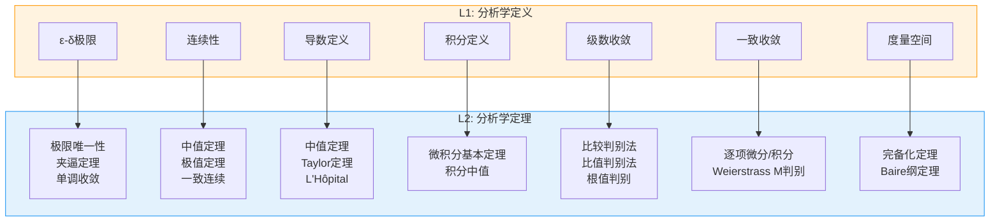
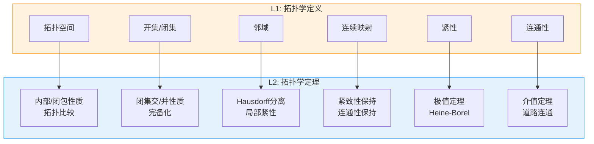
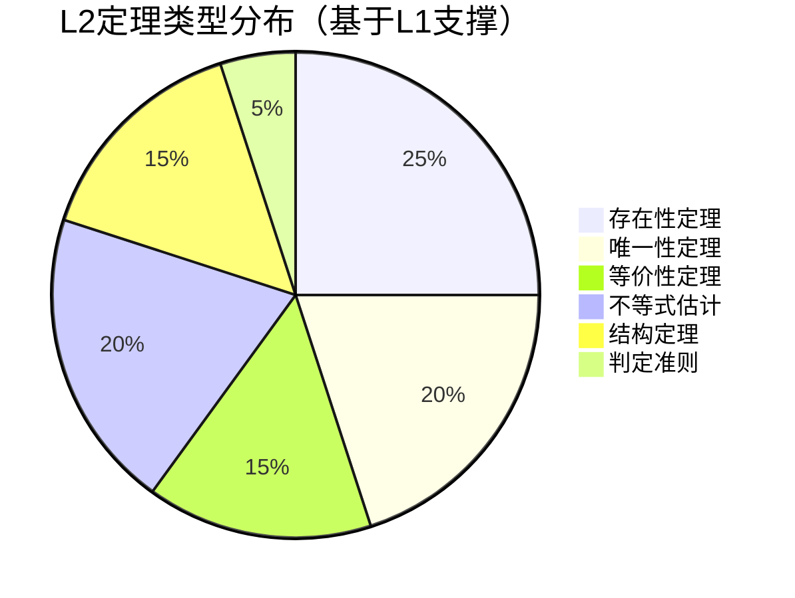
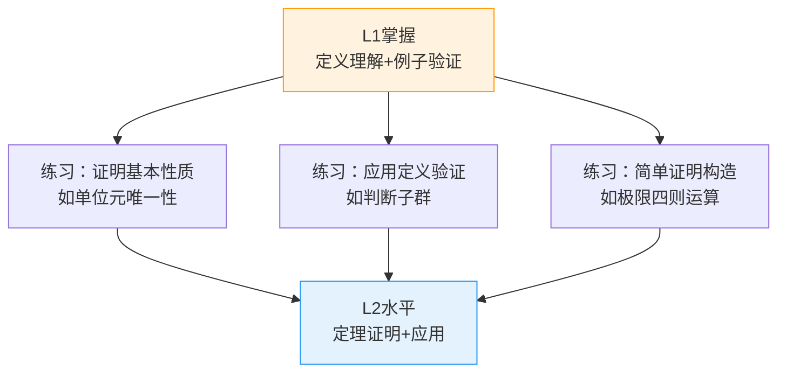

msc_primary: "00A99"
msc_secondary: ["97C30", "03B30"]
level: L1-Formal
document_type: 层次关系图
version: 1.0
---

# L1→L2层次递进关系图

**文档编号**: FM.HIERARCHY.L1-L2.00  
**创建日期**: 2026年4月3日  
**版本**: 1.0

---

## 一、概述

本文档详细描述L1（形式化定义层次）到L2（定理证明层次）的递进关系，展示每个L1核心概念如何支撑一组L2定理，形成数学知识的逻辑递进结构。

---

## 二、总体递进关系图



---

## 三、分领域递进关系

### 3.1 集合论基础



**详细对应表**：

| L1定义 | 支撑的L2定理群 | 定理数量 |
|--------|---------------|---------|
| 集合与元素 | 相等判定、空集唯一性 | 5+ |
| 子集与包含 | 包含关系性质、幂集单调性 | 8+ |
| 幂集 | Cantor定理、幂集代数 | 3+ |
| 关系与函数 | 函数复合、逆函数判定 | 10+ |
| 等价关系 | 等价类划分、商集性质 | 6+ |
| 基数与序数 | 基数比较、序数算术 | 15+ |

### 3.2 数系构造



### 3.3 代数结构



### 3.4 分析学基础



### 3.5 拓扑学基础



---

## 四、关键递进路径

### 4.1 极限概念链


### 4.2 代数结构链


### 4.3 拓扑结构链


---

## 五、L1-L2对应矩阵

### 5.1 核心对应表

| L1概念 | 数量 | 支撑L2定理数 | 典型定理 |
|--------|------|-------------|---------|
| 集合论基础 | 15 | 40+ | Cantor定理、等价类划分 |
| 数系构造 | 15 | 35+ | 算术基本定理、代数基本定理 |
| 代数结构 | 25 | 60+ | Lagrange定理、同构定理、秩-零化度 |
| 分析学基础 | 25 | 70+ | 中值定理、微积分基本定理、收敛判别 |
| 拓扑学基础 | 15 | 40+ | 紧致性定理、连通性定理、Tychonoff |
| 逻辑基础 | 5 | 15+ | 完备性定理、可满足性定理 |
| **总计** | **100** | **260+** | - |

### 5.2 定理类型分布



---

## 六、递进路径示例

### 6.1 实数完备性链

```

L1: Dedekind分割定义实数
    ↓
L2: 实数完备性定理（有界集有上确界）
    ↓
L2: 闭区间套定理
    ↓
L2: Bolzano-Weierstrass定理（有界序列有收敛子列）
    ↓
L2: 紧性定理（闭区间是紧的）
    ↓
L2: 连续函数在闭区间上的极值定理

```

### 6.2 群论基本链

```

L1: 群公理定义（G1-G4）
    ↓
L2: 单位元唯一性、逆元唯一性、消去律
    ↓
L2: 子群判定定理
    ↓
L2: 陪集划分、Lagrange定理（|G| = |H|[G:H]）

    ↓
L2: 正规子群、商群构造
    ↓
L2: 第一同构定理（G/ker φ ≅ im φ）

```

### 6.3 微积分链

```

L1: ε-δ极限定义
    ↓
L2: 极限唯一性、夹逼定理
    ↓
L2: 连续性定义与性质
    ↓
L2: 导数定义与中值定理
    ↓
L2: Riemann积分定义
    ↓
L2: 微积分基本定理（∫ₐᵇ f'(x)dx = f(b) - f(a)）

```

---

## 七、层次转化条件

### 7.1 从L1到L2的转化标准

| 能力维度 | L1水平 | L2水平 | 转化标志 |
|----------|-------|-------|---------|
| **理解深度** | 能复述定义 | 能推导定理 | 证明简单性质 |
| **应用能力** | 验证对象满足定义 | 运用定理解决问题 | 解决标准习题 |
| **推理能力** | 理解证明步骤 | 构造完整证明 | 独立证明简单定理 |
| **联系能力** | 知道概念间关系 | 建立定理网络 | 绘制依赖图 |

### 7.2 典型转化路径



---

**文档信息**
- **创建**: 2026年4月3日
- **字数**: 约2500字
- **适用范围**: L1到L2层次转化指导
- **维护状态**: 持续更新
