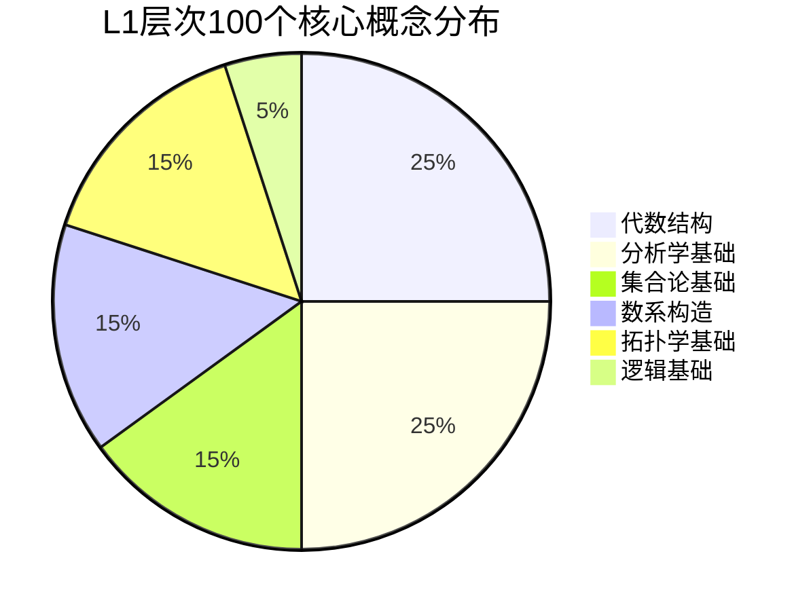
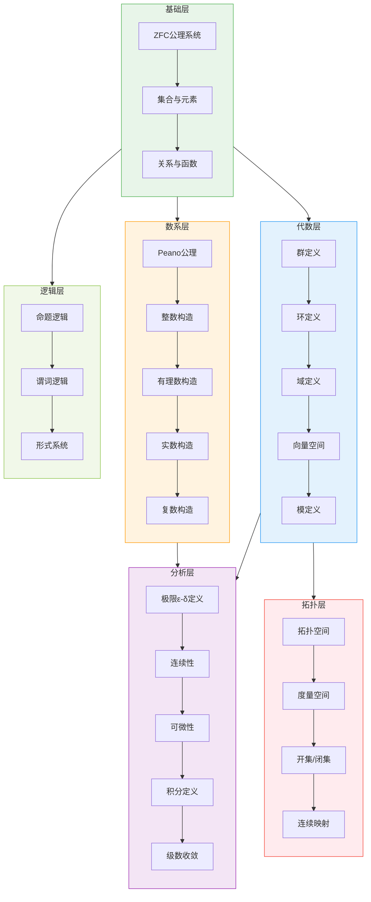
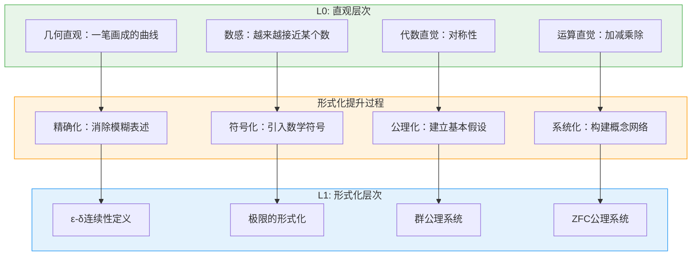
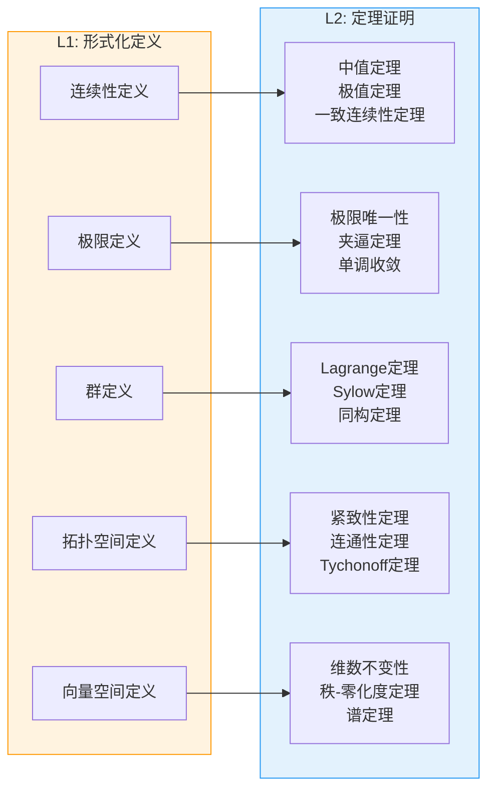
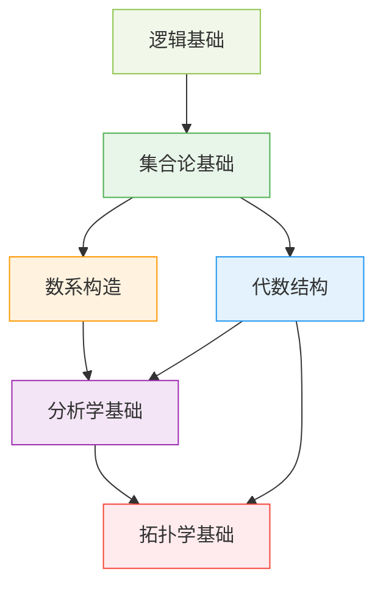

# L1层次总览：形式化定义层

**文档编号**: FM.HIERARCHY.L1.00
**创建日期**: 2026年4月3日
**版本**: 1.0

---

## 📋 目录

- [L1层次总览：形式化定义层](#l1层次总览形式化定义层)
  - [📋 目录](#-目录)
  - [1. 概述](#1-概述)
    - [L1层次的核心使命](#l1层次的核心使命)
    - [L1层次的判定标准](#l1层次的判定标准)
  - [2. L1层次知识图谱](#2-l1层次知识图谱)
    - [2.1 核心概念分布](#21-核心概念分布)
    - [2.2 层次结构图](#22-层次结构图)
  - [3. L1概念分类目录](#3-l1概念分类目录)
    - [3.1 集合论基础（15个）](#31-集合论基础15个)
    - [3.2 数系构造（15个）](#32-数系构造15个)
    - [3.3 代数结构（25个）](#33-代数结构25个)
    - [3.4 分析学基础（25个）](#34-分析学基础25个)
    - [3.5 拓扑学基础（15个）](#35-拓扑学基础15个)
    - [3.6 逻辑基础（5个）](#36-逻辑基础5个)
  - [4. 从L0到L1的提升路径](#4-从l0到l1的提升路径)
    - [典型提升示例](#典型提升示例)
  - [5. L1→L2递进关系](#5-l1l2递进关系)
    - [详细递进关系表](#详细递进关系表)
  - [6. 文档索引](#6-文档索引)
    - [按分类索引](#按分类索引)
    - [依赖关系图（跨分类）](#依赖关系图跨分类)

---

## 1. 概述

**L1-形式化定义层** 是FormalMath知识层次体系的核心基石，包含约 **100个核心形式化概念**。这一层次实现了从直观理解到严格数学定义的跨越，是连接经验认知（L0）与定理证明（L2）的关键桥梁。

### L1层次的核心使命

### L1层次的判定标准

| 维度 | L1标准 | 关键特征 |
|------|--------|----------|
| **语言** | 精确的数学符号 | 使用∀, ∃, ∈, ⊆等量词和集合符号 |
| **定义** | 公理化或构造性 | 从基本公理出发，无循环定义 |
| **结构** | 清晰的逻辑依赖 | 概念之间有明确的先修关系 |
| **严格性** | ε-δ精确化 | 消除所有模糊性表述 |

---

## 2. L1层次知识图谱

### 2.1 核心概念分布

### 2.2 层次结构图

---

## 3. L1概念分类目录

### 3.1 集合论基础（15个）

| 序号 | 概念 | 文档路径 | 核心定义 | 依赖概念 |
|------|------|----------|----------|----------|
| 01 | 集合与元素 | `01-集合论基础/01-集合与元素.md` | $A = \{x \mid P(x)\}$ | - |
| 02 | ZFC公理系统 | `01-集合论基础/02-ZFC公理系统.md` | 9条基本公理 | 集合与元素 |
| 03 | 子集与包含 | `01-集合论基础/03-子集与包含.md` | $A \subseteq B \Leftrightarrow \forall x(x \in A \Rightarrow x \in B)$ | 集合与元素 |
| 04 | 幂集 | `01-集合论基础/04-幂集.md` | $\mathcal{P}(A) = \{B \mid B \subseteq A\}$ | 子集与包含 |
| 05 | 并交补运算 | `01-集合论基础/05-并交补运算.md` | $A \cup B, A \cap B, A^c$ | 集合与元素 |
| 06 | 笛卡尔积 | `01-集合论基础/06-笛卡尔积.md` | $A \times B = \{(a,b) \mid a \in A, b \in B\}$ | 集合与元素 |
| 07 | 关系 | `01-集合论基础/07-关系.md` | $R \subseteq A \times B$ | 笛卡尔积 |
| 08 | 等价关系 | `01-集合论基础/08-等价关系.md` | 自反、对称、传递 | 关系 |
| 09 | 偏序关系 | `01-集合论基础/09-偏序关系.md` | 自反、反对称、传递 | 关系 |
| 10 | 函数与映射 | `01-集合论基础/10-函数与映射.md` | $f: A \to B, \forall a \exists! b$ | 关系 |
| 11 | 单射/满射/双射 | `01-集合论基础/11-映射性质.md` | 单射、满射、双射定义 | 函数与映射 |
| 12 | 基数与序数 | `01-集合论基础/12-基数与序数.md` | $|A| = |B| \Leftrightarrow \exists$ 双射 | 双射 |
| 13 | 可数与不可数 | `01-集合论基础/13-可数与不可数.md` | $\aleph_0, 2^{\aleph_0}$ | 基数与序数 |
| 14 | 选择公理 | `01-集合论基础/14-选择公理.md` | $\forall$ 集族 $\neq \emptyset, \exists$ 选择函数 | ZFC公理系统 |
| 15 | 超限归纳 | `01-集合论基础/15-超限归纳.md` | 良序集上的归纳原理 | 选择公理 |

### 3.2 数系构造（15个）

| 序号 | 概念 | 文档路径 | 核心定义 | 依赖概念 |
|------|------|----------|----------|----------|
| 01 | Peano公理 | `02-数系构造/01-Peano公理.md` | 自然数的5条公理 | ZFC公理系统 |
| 02 | 数学归纳法 | `02-数系构造/02-数学归纳法.md` | 基础步+归纳步 | Peano公理 |
| 03 | 整数构造 | `02-数系构造/03-整数构造.md` | $\mathbb{Z} = \mathbb{N} \times \mathbb{N}/\sim$ | Peano公理、等价关系 |
| 04 | 有理数构造 | `02-数系构造/04-有理数构造.md` | $\mathbb{Q} = \mathbb{Z} \times \mathbb{Z}^*/\sim$ | 整数构造 |
| 05 | Dedekind分割 | `02-数系构造/05-Dedekind分割.md` | 有理数的分割对 $(A,B)$ | 有理数构造 |
| 06 | Cauchy序列 | `02-数系构造/06-Cauchy序列.md` | $|a_m - a_n| < \varepsilon$ | 有理数构造 |
| 07 | 实数构造 | `02-数系构造/07-实数构造.md` | $\mathbb{R} = \text{Cauchy}(\mathbb{Q})/\sim$ | Cauchy序列 |
| 08 | 完备性公理 | `02-数系构造/08-完备性公理.md` | 有界集有上确界 | 实数构造 |
| 09 | 复数定义 | `02-数系构造/09-复数定义.md` | $\mathbb{C} = \mathbb{R}^2$ with $i^2 = -1$ | 实数构造 |
| 10 | 复数运算 | `02-数系构造/10-复数运算.md` | $+$, $\times$, 共轭, 模 | 复数定义 |
| 11 | 代数数 | `02-数系构造/11-代数数.md` | $\exists f \in \mathbb{Q}[x], f(\alpha) = 0$ | 复数定义 |
| 12 | 超越数 | `02-数系构造/12-超越数.md` | 非代数数 | 代数数 |
| 13 | p进数 | `02-数系构造/13-p进数.md` | $\mathbb{Q}_p = \widehat{\mathbb{Q}}^{|\cdot|_p}$ | 有理数构造 |
| 14 | 序数理论 | `02-数系构造/14-序数理论.md` | 传递且被 $\in$ 良序的集合 | 超限归纳 |
| 15 | 基数运算 | `02-数系构造/15-基数运算.md` | $\aleph_\alpha, \beth_\alpha$ | 序数理论 |

### 3.3 代数结构（25个）

| 序号 | 概念 | 文档路径 | 核心定义 | 依赖概念 |
|------|------|----------|----------|----------|
| 01 | 二元运算 | `03-代数结构/01-二元运算.md` | $*: G \times G \to G$ | 函数与映射 |
| 02 | 半群 | `03-代数结构/02-半群.md` | 封闭+结合 | 二元运算 |
| 03 | 幺半群 | `03-代数结构/03-幺半群.md` | 半群+单位元 | 半群 |
| 04 | 群定义 | `03-代数结构/04-群定义.md` | 封闭、结合、单位、逆元 | 幺半群 |
| 05 | 群的性质 | `03-代数结构/05-群的性质.md` | 单位元唯一、逆元唯一 | 群定义 |
| 06 | 子群 | `03-代数结构/06-子群.md` | $H \subseteq G$，运算封闭 | 群定义 |
| 07 | 陪集 | `03-代数结构/07-陪集.md` | $aH = \{ah \mid h \in H\}$ | 子群 |
| 08 | 正规子群 | `03-代数结构/08-正规子群.md` | $gHg^{-1} = H$ | 子群 |
| 09 | 商群 | `03-代数结构/09-商群.md` | $G/N$ with $(aN)(bN) = abN$ | 正规子群 |
| 10 | 群同态 | `03-代数结构/10-群同态.md` | $\phi(ab) = \phi(a)\phi(b)$ | 群定义 |
| 11 | 环定义 | `03-代数结构/11-环定义.md` | $(R, +, \cdot)$ 满足8条公理 | 群定义、二元运算 |
| 12 | 整环 | `03-代数结构/12-整环.md` | 无零因子的交换环 | 环定义 |
| 13 | 域定义 | `03-代数结构/13-域定义.md` | 非零元都可逆的交换环 | 整环 |
| 14 | 理想 | `03-代数结构/14-理想.md` | 子环，吸收乘法 | 环定义 |
| 15 | 商环 | `03-代数结构/15-商环.md` | $R/I$ | 理想 |
| 16 | 向量空间 | `03-代数结构/16-向量空间.md` | $(V, +, \cdot)$ 满足8条公理 | 域定义 |
| 17 | 线性无关 | `03-代数结构/17-线性无关.md` | $\sum c_i v_i = 0 \Rightarrow c_i = 0$ | 向量空间 |
| 18 | 基与维数 | `03-代数结构/18-基与维数.md` | 极大线性无关组，$|B|$ | 线性无关 |
| 19 | 线性映射 | `03-代数结构/19-线性映射.md` | $T(av + bw) = aT(v) + bT(w)$ | 向量空间 |
| 20 | 矩阵表示 | `03-代数结构/20-矩阵表示.md` | $A \in F^{m \times n}$ | 线性映射 |
| 21 | 模定义 | `03-代数结构/21-模定义.md` | 环上的"向量空间" | 环定义、向量空间 |
| 22 | 代数 | `03-代数结构/22-代数.md` | 向量空间+乘法双线性 | 向量空间 |
| 23 | 李代数 | `03-代数结构/23-李代数.md` | $[x,y] = -[y,x]$，Jacobi恒等式 | 代数 |
| 24 | 范畴定义 | `03-代数结构/24-范畴定义.md` | 对象+态射+复合 | 集合与元素 |
| 25 | 函子 | `03-代数结构/25-函子.md` | 范畴间的结构保持映射 | 范畴定义 |

### 3.4 分析学基础（25个）

| 序号 | 概念 | 文档路径 | 核心定义 | 依赖概念 |
|------|------|----------|----------|----------|
| 01 | 极限ε-δ定义 | `04-分析学基础/01-极限epsilon-delta定义.md` | $\forall \varepsilon > 0, \exists N...$ | 实数构造 |
| 02 | 序列极限 | `04-分析学基础/02-序列极限.md` | $\lim_{n \to \infty} a_n = L$ | 极限ε-δ定义 |
| 03 | 函数极限 | `04-分析学基础/03-函数极限.md` | $\lim_{x \to a} f(x) = L$ | 极限ε-δ定义 |
| 04 | 连续性定义 | `04-分析学基础/04-连续性定义.md` | $\lim_{x \to a} f(x) = f(a)$ | 函数极限 |
| 05 | 一致连续 | `04-分析学基础/05-一致连续.md` | $\forall \varepsilon, \exists \delta, \forall x,y...$ | 连续性定义 |
| 06 | 导数定义 | `04-分析学基础/06-导数定义.md` | $f'(x) = \lim_{h \to 0} \frac{f(x+h)-f(x)}{h}$ | 函数极限 |
| 07 | 可微性 | `04-分析学基础/07-可微性.md` | $\exists f'(x)$ | 导数定义 |
| 08 | 偏导数 | `04-分析学基础/08-偏导数.md` | $\frac{\partial f}{\partial x_i}$ | 导数定义 |
| 09 | 方向导数 | `04-分析学基础/09-方向导数.md` | $D_v f$ | 导数定义 |
| 10 | 微分形式 | `04-分析学基础/10-微分形式.md` | $df = f'(x)dx$ | 可微性 |
| 11 | Riemann积分 | `04-分析学基础/11-Riemann积分.md` | $\lim_{\|P\| \to 0} \sum f(\xi_i)\Delta x_i$ | 实数构造、极限 |
| 12 | 定积分 | `04-分析学基础/12-定积分.md` | $\int_a^b f(x)dx$ | Riemann积分 |
| 13 | 反常积分 | `04-分析学基础/13-反常积分.md` | $\int_a^\infty$ or 无界函数 | 定积分 |
| 14 | 级数收敛 | `04-分析学基础/14-级数收敛.md` | $\sum a_n$ 收敛 $\Leftrightarrow S_n \to S$ | 序列极限 |
| 15 | 绝对收敛 | `04-分析学基础/15-绝对收敛.md` | $\sum |a_n| < \infty$ | 级数收敛 |
| 16 | 一致收敛 | `04-分析学基础/16-一致收敛.md` | $\forall \varepsilon, \exists N, \forall n \geq N, \forall x$ | 级数收敛 |
| 17 | 幂级数 | `04-分析学基础/17-幂级数.md` | $\sum a_n x^n$ | 级数收敛 |
| 18 | 收敛半径 | `04-分析学基础/18-收敛半径.md` | $R = 1/\limsup |a_n|^{1/n}$ | 幂级数 |
| 19 | 度量空间 | `04-分析学基础/19-度量空间.md` | $(X, d)$ 满足3条公理 | 实数构造 |
| 20 | 开球与闭球 | `04-分析学基础/20-开球与闭球.md` | $B(x, r) = \{y \mid d(x,y) < r\}$ | 度量空间 |
| 21 | 完备性 | `04-分析学基础/21-完备性.md` | Cauchy列收敛 | 度量空间、Cauchy序列 |
| 22 | 紧性 | `04-分析学基础/22-紧性.md` | 任意开覆盖有有限子覆盖 | 拓扑空间 |
| 23 | 连通性 | `04-分析学基础/23-连通性.md` | 不能分为两个非空不交开集 | 拓扑空间 |
| 24 | 范数 | `04-分析学基础/24-范数.md` | $\|\cdot\|$ 满足3条公理 | 向量空间 |
| 25 | 内积 | `04-分析学基础/25-内积.md` | $\langle \cdot, \cdot \rangle$ 正定双线性 | 向量空间 |

### 3.5 拓扑学基础（15个）

| 序号 | 概念 | 文档路径 | 核心定义 | 依赖概念 |
|------|------|----------|----------|----------|
| 01 | 拓扑空间 | `05-拓扑学基础/01-拓扑空间.md` | $(X, \tau)$，$\tau$ 满足3条公理 | 幂集 |
| 02 | 开集 | `05-拓扑学基础/02-开集.md` | $U \in \tau$ | 拓扑空间 |
| 03 | 闭集 | `05-拓扑学基础/03-闭集.md` | $X \setminus U \in \tau$ | 开集 |
| 04 | 邻域 | `05-拓扑学基础/04-邻域.md` | $\exists U \in \tau, x \in U \subseteq N$ | 开集 |
| 05 | 内部 | `05-拓扑学基础/05-内部.md` | 最大开子集 | 开集 |
| 06 | 闭包 | `05-拓扑学基础/06-闭包.md` | 最小闭超集 | 闭集 |
| 07 | 边界 | `05-拓扑学基础/07-边界.md` | $\partial A = \bar{A} \setminus A^\circ$ | 内部、闭包 |
| 08 | 连续映射 | `05-拓扑学基础/08-连续映射.md` | $f^{-1}(V) \in \tau_X$ for $V \in \tau_Y$ | 拓扑空间 |
| 09 | 同胚 | `05-拓扑学基础/09-同胚.md` | 双射连续且逆连续 | 连续映射 |
| 10 | 子空间拓扑 | `05-拓扑学基础/10-子空间拓扑.md` | $\tau_A = \{A \cap U \mid U \in \tau\}$ | 拓扑空间 |
| 11 | 乘积拓扑 | `05-拓扑学基础/11-乘积拓扑.md` | 由投影连续生成的最粗拓扑 | 拓扑空间 |
| 12 | 商拓扑 | `05-拓扑学基础/12-商拓扑.md` | 使商映射连续的最细拓扑 | 拓扑空间、等价关系 |
| 13 | Hausdorff空间 | `05-拓扑学基础/13-Hausdorff空间.md` | 不同点有不交邻域 | 拓扑空间 |
| 14 | 第二可数 | `05-拓扑学基础/14-第二可数.md` | 有可数基 | 拓扑空间 |
| 15 | 流形 | `05-拓扑学基础/15-流形.md` | 局部同胚于$\mathbb{R}^n$的Hausdorff空间 | 同胚、Hausdorff空间 |

### 3.6 逻辑基础（5个）

| 序号 | 概念 | 文档路径 | 核心定义 | 依赖概念 |
|------|------|----------|----------|----------|
| 01 | 命题逻辑 | `06-逻辑基础/01-命题逻辑.md` | 命题、联结词、真值表 | - |
| 02 | 谓词逻辑 | `06-逻辑基础/02-谓词逻辑.md` | 谓词、量词、辖域 | 命题逻辑 |
| 03 | 形式系统 | `06-逻辑基础/03-形式系统.md` | $(\mathcal{L}, A, R)$ | 谓词逻辑 |
| 04 | 证明论 | `06-逻辑基础/04-证明论.md` | $\Gamma \vdash \phi$ | 形式系统 |
| 05 | 模型论 | `06-逻辑基础/05-模型论.md` | $\mathcal{M} \models \phi$ | 谓词逻辑 |

---

## 4. 从L0到L1的提升路径

### 典型提升示例

| L0直观理解 | 提升路径 | L1形式化定义 |
|-----------|---------|-------------|
| "连续就是一笔画成" | 精确化邻域概念 | $\forall \varepsilon > 0, \exists \delta > 0...$ |
| "极限就是越来越接近" | 符号化趋近过程 | $\forall \varepsilon > 0, \exists N, n > N \Rightarrow |a_n - L| < \varepsilon$ |
| "群就是对称性" | 公理化对称运算 | 封闭+结合+单位元+逆元 |
| "集合就是一堆东西" | 公理化集合构造 | ZFC公理系统 |

---

## 5. L1→L2递进关系

L1层次的形式化定义为L2层次的定理证明提供了基础。以下是核心L1概念与其支撑的L2定理之间的对应关系：

### 详细递进关系表

| L1定义概念 | 支撑的L2定理群 |
|-----------|---------------|
| **连续性定义** | 中间值定理、极值定理、一致连续性定理、Rolle定理 |
| **极限定义** | 极限唯一性、夹逼定理、单调有界定理、Cauchy收敛准则 |
| **导数定义** | 中值定理、Taylor定理、L'Hôpital法则、反函数定理 |
| **积分定义** | 微积分基本定理、积分中值定理、变量替换公式 |
| **级数收敛** | 比较判别法、比值判别法、根值判别法、Abel定理 |
| **群定义** | Lagrange定理、Cayley定理、同态基本定理、类方程 |
| **正规子群** | 第一同构定理、Jordan-Hölder定理、可解群判定 |
| **向量空间** | 基的存在性、维数不变性、维数公式、同构定理 |
| **线性映射** | 秩-零化度定理、矩阵表示定理、对角化判据 |
| **拓扑空间** | 紧致性定理、连通性定理、分离性定理、Urysohn引理 |
| **度量空间** | 完备化定理、Baire纲定理、Arzelà-Ascoli定理 |
| **连续性(拓扑)** | 紧致集的连续像紧致、连通集的连续像连通 |

---

## 6. 文档索引

### 按分类索引

| 分类 | 概念数量 | 文档目录 |
|------|---------|----------|
| 集合论基础 | 15 | `01-集合论基础/` |
| 数系构造 | 15 | `02-数系构造/` |
| 代数结构 | 25 | `03-代数结构/` |
| 分析学基础 | 25 | `04-分析学基础/` |
| 拓扑学基础 | 15 | `05-拓扑学基础/` |
| 逻辑基础 | 5 | `06-逻辑基础/` |

### 依赖关系图（跨分类）

---

**文档信息**

- **创建**: 2026年4月3日
- **字数**: 约3500字
- **适用范围**: FormalMath项目L1层次导航
- **维护状态**: 持续更新

**相关文档**

- [L0-直观经验层次](../L0-直观经验层次.md) - 前驱层次
- [L1-形式化定义层次](../L1-形式化定义层次.md) - 层次定义
- [L2-定理证明层次](../L2-定理证明层次.md) - 后继层次
