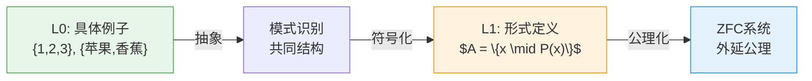
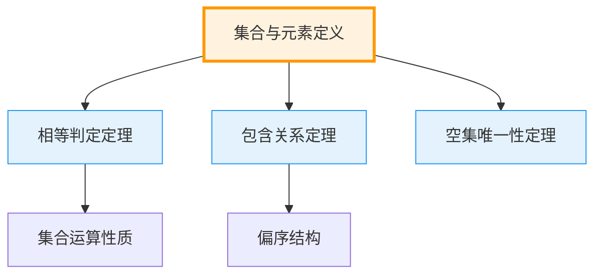
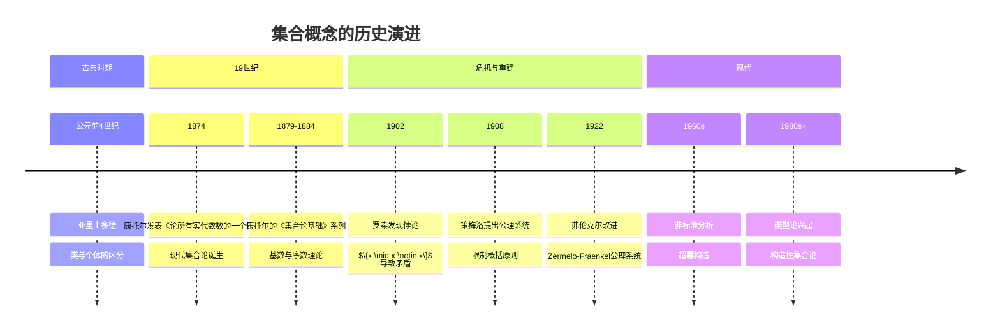

msc_primary: "03E99"
msc_secondary: ["03B30", "97E60"]
level: L1-Formal
domain: 集合论
concept: 集合与元素
prerequisites: []
next_level: ["子集与包含", "ZFC公理系统"]
tags: ["集合论", "基础概念", "形式化定义"]
---

# L1: 集合与元素 (Set and Element)

**概念编号**: 01-001  
**层次**: L1-形式化定义层  
**创建日期**: 2026年4月3日

---

## 一、严格形式化定义

### 1.1 朴素定义（非形式化）

**定义 1.1.1**（朴素集合论）  
集合是确定对象的无序整体。构成集合的对象称为该集合的**元素**。

形式化表述：
- 若 $A$ 是集合，$x$ 是对象，则 $x \in A$ 表示"$x$ 是 $A$ 的元素"
- $x \notin A$ 表示"$x$ 不是 $A$ 的元素"

### 1.2 ZFC框架下的定义

在ZFC公理集合论中，集合和元素的关系由**属于关系** $\in$ 刻画：

**定义 1.1.2**（属于关系）  
$\in$ 是一个二元关系，$x \in y$ 表示"$x$ 是 $y$ 的元素"。

**外延公理**（Axiom of Extensionality）  
$$A = B \iff \forall x (x \in A \Leftrightarrow x \in B)$$

即：两个集合相等当且仅当它们有相同的元素。

---

## 二、从L0到L1的提升路径

### 2.1 L0直观理解

```

L0描述：
- "集合就像一个大袋子，里面装着一些东西"
- "元素就是袋子里的东西"
- "{1, 2, 3} 是一个集合，1、2、3是它的元素"

```

### 2.2 形式化提升过程

| 提升步骤 | L0表述 | L1形式化 |
|---------|-------|----------|
| 1. 精确化 | "一堆东西" | 确定的对象整体（well-defined） |
| 2. 关系化 | "属于" | 二元关系 $\in$ |
| 3. 公理化 | "袋子里的东西" | 外延公理刻画相等性 |
| 4. 符号化 | "1, 2, 3" | $\{1, 2, 3\}$ 或 $\{x \mid P(x)\}$ |

### 2.3 提升的关键洞察



---

## 三、依赖的L1概念（先修）

作为最基础的L1概念，**集合与元素**不依赖其他L1概念，但它依赖于：

| 层次 | 概念 | 关系说明 |
|------|------|---------|
| L0 | 对象/个体直观 | 形成"元素"的直觉 |
| L0 | 整体/集体概念 | 形成"集合"的直觉 |
| 元数学 | 一阶逻辑 | 用于形式化表述 |

---

## 四、支撑的L2定理（后继）

基于集合与元素的定义，可推导以下L2定理群：

### 4.1 基本定理

| 定理 | 内容 | 证明要点 |
|------|------|----------|
| 相等判定定理 | $A = B \land x \in A \Rightarrow x \in B$ | 外延公理+逻辑推理 |
| 空集唯一性 | $\exists! \emptyset$ | 外延公理+存在性公理 |
| 包含关系的反对称性 | $A \subseteq B \land B \subseteq A \Rightarrow A = B$ | 外延公理直接推论 |

### 4.2 定理依赖图



---

## 五、定义的历史背景

### 5.1 历史发展脉络



### 5.2 关键人物

| 人物 | 贡献 | 时代 |
|------|------|------|
| **Georg Cantor** (1845-1918) | 创立集合论，引入基数和序数 | 1870s-1880s |
| **Bertrand Russell** (1872-1970) | 发现罗素悖论，推动公理化 | 1902 |
| **Ernst Zermelo** (1871-1953) | 提出Zermelo公理系统 | 1908 |
| **Abraham Fraenkel** (1891-1965) | 完善为ZFC系统 | 1922 |

### 5.3 罗素悖论与公理化

罗素悖论揭示了朴素集合论的内在矛盾：

```

定义 R = {x | x ∉ x}

问题：R ∈ R 还是 R ∉ R?

- 若 R ∈ R，则由定义 R ∉ R，矛盾！
- 若 R ∉ R，则由定义 R ∈ R，矛盾！

```

**解决方案**：限制概括原则（分离公理模式）  
$$\{x \in A \mid P(x)\}$$

只允许从已知集合中分离子集，而非任意构造集合。

---

## 六、相关概念对比

### 6.1 集合 vs 类 (Class)

| 特征 | 集合 (Set) | 真类 (Proper Class) |
|------|-----------|---------------------|
| 大小 | "小" | "太大" |
| 元素性 | 可以是其他集合的元素 | 不能是任何集合的元素 |
| 示例 | $\mathbb{N}, \mathbb{R}, \{\emptyset\}$ | 所有集合的类 $V$，所有序数的类 $Ord$ |
| 公理 | 受ZFC公理约束 | 在NBG系统中处理 |

### 6.2 不同公理系统中的处理

```

ZFC: 只有集合，真类用公式表示
NBG: 集合+类，类可以是变元
MK: 允许类上的概括
类型论: 分层处理，避免自指

```

---

## 七、实例与说明

### 7.1 典型集合示例

| 集合 | 描述法 | 元素 |
|------|-------|------|
| 空集 | $\emptyset$ 或 $\{\}$ | 无 |
| 单元素集 | $\{\emptyset\}$ | $\emptyset$ |
| 自然数集 | $\mathbb{N} = \{0, 1, 2, ...\}$ | 有限序数 |
| 有限集 | $\{1, 2, 3\}$ | 1, 2, 3 |
| 描述集 | $\{x \in \mathbb{N} \mid x < 5\}$ | 0, 1, 2, 3, 4 |

### 7.2 常见误区

| 误区 | 正确理解 |
|------|---------|
| $a \in \{a\}$ 但 $a \neq \{a\}$ | 元素与单元素集不同 |
| $\{\emptyset\} \neq \emptyset$ | 包含空集的集合不等于空集 |
| $\{1, 2\} = \{2, 1\} = \{1, 1, 2\}$ | 集合无序且无重复 |

---

## 八、形式化验证（Lean4示例）

```lean4
-- 集合相等的定义（外延性）
axiom Set.ext {A B : Set} : 
  (∀ x, x ∈ A ↔ x ∈ B) → A = B

-- 元素关系的基本性质
theorem element_equality (A B : Set) (x : Element) 
  (h : A = B) (h' : x ∈ A) : x ∈ B := by
  rw [h] at h'
  exact h'

```

---

**文档信息**
- **创建**: 2026年4月3日
- **字数**: 约2000字
- **层次**: L1-Formal
- **概念编号**: 01-001
