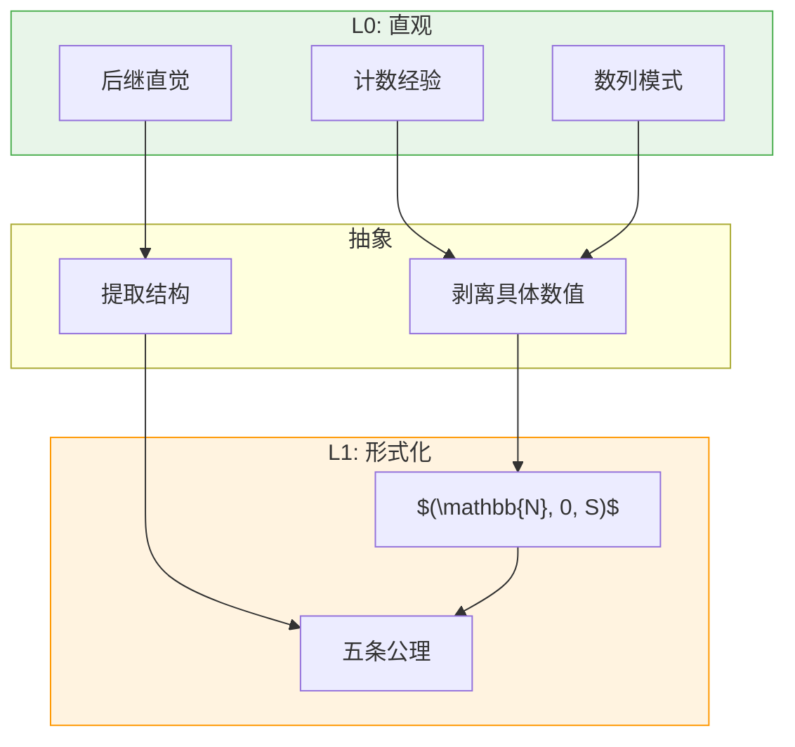
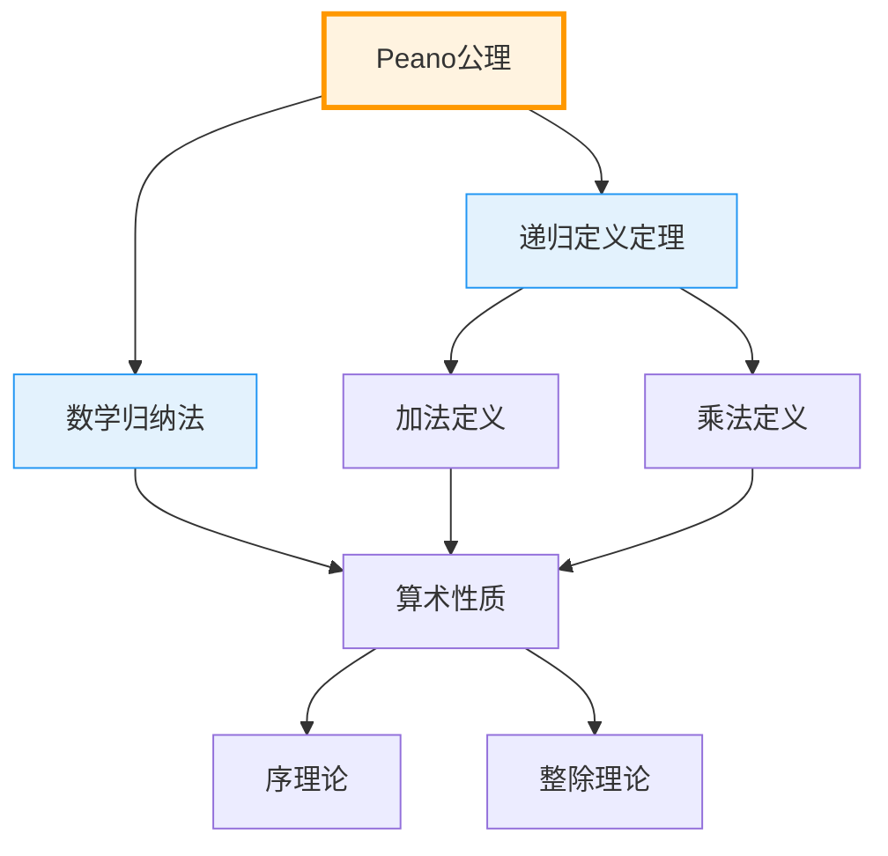
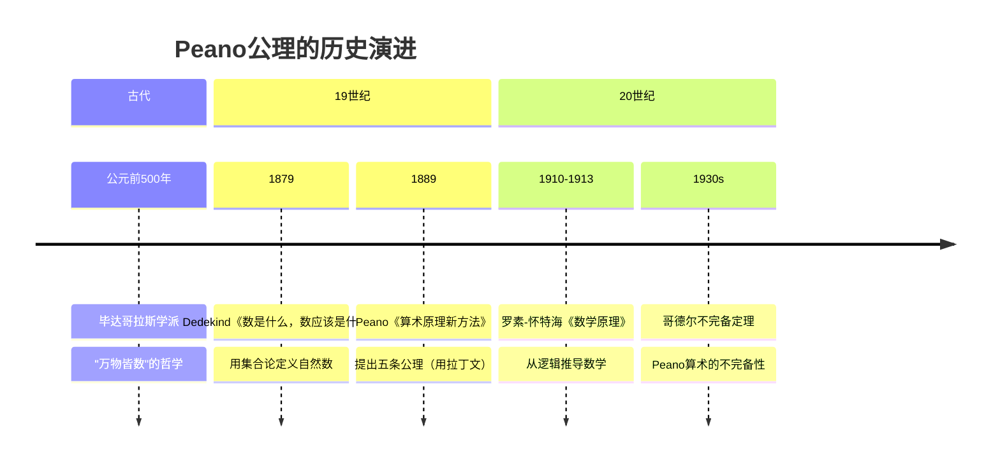

# L1: 自然数的Peano公理 (Peano Axioms)

**概念编号**: 02-001  
**层次**: L1-形式化定义层  
**创建日期**: 2026年4月3日

---

## 1. 严格形式化定义

### 1.1 Peano公理系统

**公理 1.1.1**（Peano公理系统，1889）  
自然数系统 $(\mathbb{N}, 0, S)$ 满足以下五条公理：

| 公理 | 符号表述 | 含义 |
|------|---------|------|
| **P1** | $0 \in \mathbb{N}$ | $0$ 是自然数（初始元） |
| **P2** | $\forall n \in \mathbb{N}: S(n) \in \mathbb{N}$ | 后继运算封闭 |
| **P3** | $\forall n \in \mathbb{N}: S(n) \neq 0$ | $0$ 不是任何数的后继 |
| **P4** | $\forall m,n \in \mathbb{N}: S(m) = S(n) \Rightarrow m = n$ | 后继运算单射 |
| **P5** | $\forall P \subseteq \mathbb{N}: (0 \in P \land (n \in P \Rightarrow S(n) \in P)) \Rightarrow P = \mathbb{N}$ | 数学归纳原理 |

### 1.2 结构说明

```mermaid
graph LR
    0["0"] -->|S| 1["S0 = 1"]
    1 -->|S| 2["SS0 = 2"]
    2 -->|S| 3["SSS0 = 3"]
    3 -->|...| "..."
    
    style 0 fill:#ff9999
    style 1 fill:#ffcc99
    style 2 fill:#ffff99
    style 3 fill:#ccff99
```

**关键结构要素**：
- **初始元**: $0$（也可选择 $1$）
- **后继函数**: $S: \mathbb{N} \to \mathbb{N}$
- **归纳原理**: 保证自然数的"最小性"

---

## 2. 从L0到L1的提升路径

### 2.1 L0直观理解

```
L0描述：
- "自然数就是 0, 1, 2, 3, 用来计数的数"
- "每个数后面跟着下一个数"
- "数列可以一直数下去"
- "从0开始，每次加1"
```

### 2.2 形式化提升过程

| 提升步骤 | L0表述 | L1形式化 | 目的 |
|---------|-------|----------|------|
| 1. 去具体化 | "0, 1, 2..." | 抽象符号系统 | 摆脱阿拉伯数字的依赖 |
| 2. 关系化 | "后面跟着" | 后继函数 $S$ | 精确描述"下一个" |
| 3. 公理化 | "一直数下去" | 五条公理 | 刻画所有性质 |
| 4. 归纳化 | "每个数都有" | P5归纳原理 | 保证完全性 |

### 2.3 提升的关键洞察



---

## 3. 依赖的L1概念（先修）

| 概念 | 作用 | 依赖程度 |
|------|------|---------|
| **集合与元素** | $\mathbb{N}$ 是集合，$0$ 是元素 | 必需 |
| **函数与映射** | $S$ 是函数 $S: \mathbb{N} \to \mathbb{N}$ | 必需 |
| **等价关系** | 用于定义自然数的相等 | 间接 |

---

## 4. 支撑的L2定理（后继）

### 4.1 基本定理群

| 定理 | 内容 | 证明方法 |
|------|------|----------|
| **加法唯一性** | 存在唯一的二元运算 $+$ 满足：$n + 0 = n$，$n + S(m) = S(n + m)$ | 递归定理 |
| **乘法唯一性** | 存在唯一的二元运算 $\times$ 满足：$n \times 0 = 0$，$n \times S(m) = n \times m + n$ | 递归定理 |
| **序关系** | $n \leq m \Leftrightarrow \exists k: n + k = m$ | 归纳法 |
| **三分律** | $\forall m,n: m < n \lor m = n \lor m > n$ | 双重归纳 |

### 4.2 定理依赖图



### 4.3 递归定理（核心）

**定理 4.3.1**（原始递归定理）  
设 $A$ 为集合，$a \in A$，$g: A \times \mathbb{N} \to A$。则存在唯一的函数 $f: \mathbb{N} \to A$ 满足：
- $f(0) = a$
- $f(S(n)) = g(f(n), n)$

这是定义加法和乘法的基础。

---

## 5. 定义的历史背景

### 5.1 历史发展



### 5.2 关键人物

| 人物 | 贡献 | 时代 |
|------|------|------|
| **Richard Dedekind** (1831-1916) | 首次用集合论严格定义自然数，递归方法 | 1888 |
| **Giuseppe Peano** (1858-1932) | 系统化五条公理，拉丁文表述 | 1889 |
| **Charles Sanders Peirce** (1839-1914) | 归纳原理的早期形式 | 1880s |

### 5.3 与Dedekind定义的关系

**Dedekind的集合论定义**（1888）：
- 集合 $\mathbb{N}$ 是**归纳集**：包含 $0$，且对后继封闭
- $\mathbb{N}$ 是**最小**的归纳集

**等价性**：  
Dedekind的构造与Peano公理等价，两者刻画了相同的结构。

---

## 6. 扩展与变体

### 6.1 从1开始的版本

有些系统选择 $1$ 而非 $0$ 作为初始元：

| 版本 | 初始元 | 特点 |
|------|-------|------|
| Peano原版 | $1$ | 符合"自然数从1开始"的传统 |
| 现代标准 | $0$ | 与集合论、计算机科学统一 |
| 两者关系 | $1 = S(0)$ | 形式等价 |

### 6.2 在ZFC中的实现

```
定义（ZFC）：
- 0 := ∅（空集）
- S(n) := n ∪ {n}（后继）
- ℕ := {x | x 是归纳集的元素} ∩ 所有归纳集

示例：
- 0 = ∅
- 1 = {∅} = {0}
- 2 = {∅, {∅}} = {0, 1}
- 3 = {∅, {∅}, {∅, {∅}}} = {0, 1, 2}
- ...
每个自然数是其所有前驱的集合（von Neumann序数）
```

---

## 7. 形式化验证（Lean4示例）

```lean4
-- Peano公理的形式化
structure PeanoSystem where
  N : Type                    -- 自然数类型
  zero : N                    -- 初始元 0
  succ : N → N                -- 后继函数
  -- 公理
  succ_ne_zero : ∀ n : N, succ n ≠ zero
  succ_inj : ∀ m n : N, succ m = succ n → m = n
  induction : ∀ P : N → Prop, 
    P zero → (∀ n, P n → P (succ n)) → ∀ n, P n

-- 加法递归定义
def add (n m : ℕ) : ℕ :=
  match m with
  | 0 => n
  | succ k => succ (add n k)

-- 加法结合律证明（归纳法）
theorem add_assoc (a b c : ℕ) : (a + b) + c = a + (b + c) := by
  induction c with
  | zero => rfl
  | succ k ih => 
    simp [add, ih]
```

---

**文档信息**
- **创建**: 2026年4月3日
- **字数**: 约2200字
- **层次**: L1-Formal
- **概念编号**: 02-001
