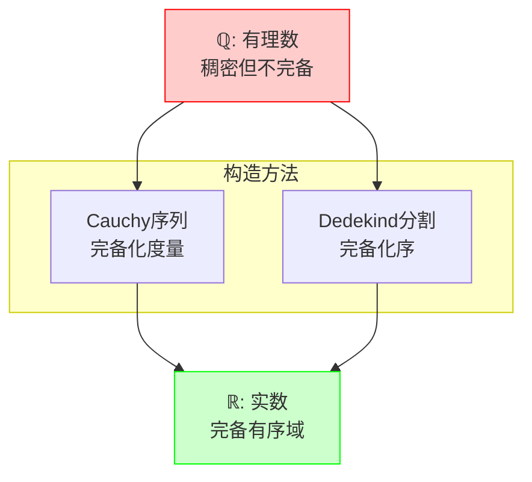
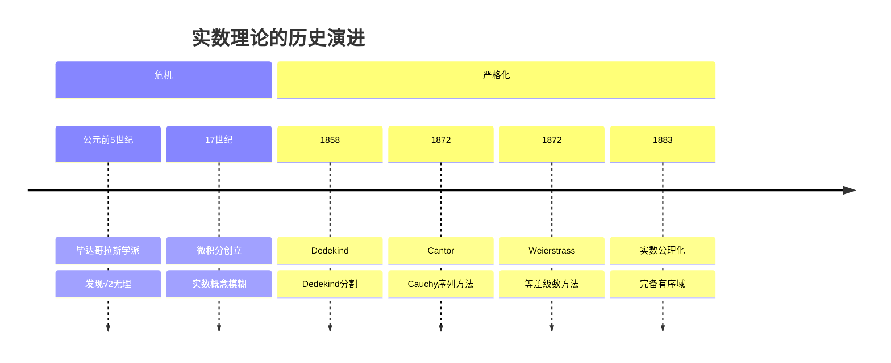

msc_primary: "26A03"
msc_secondary: ["03E99", "97F40"]
level: silver
domain: 分析学
concept: 实数构造
prerequisites: ["有理数构造", "Cauchy序列", "Dedekind分割"]
next_level: ["完备性公理", "实数完备性定理", "Bolzano-Weierstrass定理"]
tags: ["分析学", "实数构造", "完备性", "形式化定义"]
---

# L1: 实数构造 (Construction of Real Numbers)

**概念编号**: 02-007  
**层次**: L1-形式化定义层  
**创建日期**: 2026年4月3日

---

## 一、严格形式化定义

### 1.1 Cauchy序列构造法

**定义 1.1.1**（实数的Cauchy序列定义）  
实数集合 $\mathbb{R}$ 定义为有理数Cauchy序列的等价类集合：

$$\mathbb{R} := \{(a_n) \subseteq \mathbb{Q} \mid (a_n) \text{ 是Cauchy列}\} / \sim$$

其中等价关系 $\sim$ 定义为：
$$(a_n) \sim (b_n) \Leftrightarrow \lim_{n \to \infty} (a_n - b_n) = 0$$

### 1.2 Dedekind分割构造法

**定义 1.1.2**（实数的Dedekind分割定义）  
实数集合 $\mathbb{R}$ 定义为有理数的Dedekind分割的集合：

$$\mathbb{R} := \{(A, B) \mid A, B \subseteq \mathbb{Q}, A \neq \emptyset, B \neq \emptyset, A \cup B = \mathbb{Q}, \\ \forall a \in A, \forall b \in B: a < b\}$$

其中：
- $A$ 称为分割的**下类**（无最大元）
- $B$ 称为分割的**上类**

### 1.3 两种构造的等价性

**定理 1.1.3**  
Cauchy序列构造与Dedekind分割构造等价，两者得到同构的完备有序域。

---

## 二、从L0到L1的提升路径

### 2.1 L0直观理解

```

L0描述：
- "实数就是数轴上的所有点"
- "包括有理数和无理数"
- "可以任意精确地表示"
- "连续的、没有空隙的"
- "√2, π, e 这样的数"

```

### 2.2 形式化提升过程

| 提升步骤 | L0表述 | L1形式化 | 目的 |
|---------|-------|----------|------|
| 1. 去几何化 | "数轴上的点" | 构造性定义 | 摆脱几何依赖 |
| 2. 完备化 | "没有空隙" | Cauchy序列等价类 | 代数完备 |
| 3. 有向化 | "连续的" | Dedekind分割 | 序完备 |
| 4. 代数化 | "可以运算" | 域结构 | 代数操作 |
| 5. 拓扑化 | "可以逼近" | 度量结构 | 极限运算 |

### 2.3 从有理数到实数



---

## 三、依赖的L1概念（先修）

| 概念 | 作用 | 依赖程度 |
|------|------|---------|
| **有理数构造** | 从有理数出发构造实数 | 必需 |
| **Cauchy序列** | 度量完备化的基础 | Cauchy法必需 |
| **Dedekind分割** | 序完备化的基础 | Dedekind法必需 |
| **等价关系** | 定义Cauchy序列的等价 | 必需 |
| **上确界** | Dedekind分割的核心 | 必需 |

---

## 四、支撑的L2定理（后继）

### 4.1 完备性定理群

| 定理 | 内容 | 关键概念 |
|------|------|---------|
| **完备性公理** | 有上界的非空实数集有上确界 | 上确界存在 |
| **闭区间套定理** | 递缩闭区间套有非空交 | 完备性推论 |
| **Bolzano-Weierstrass** | 有界序列有收敛子列 | 列紧性 |
| **Heine-Borel** | 闭区间是紧的 | 紧致性 |
| **Cauchy收敛准则** | Cauchy列收敛 | 完备性等价 |

### 4.2 与有理数的对比

| 性质 | 有理数 $\mathbb{Q}$ | 实数 $\mathbb{R}$ |
|------|-------------------|------------------|
| 域 | 是 | 是 |
| 有序 | 是 | 是 |
| 稠密 | 是 | 是 |
| 完备 | 否 | 是 |
| 连通 | 否 | 是 |
| Cauchy列收敛 | 否 | 是 |

---

## 五、定义的历史背景

### 5.1 历史发展



### 5.2 关键人物

| 人物 | 贡献 | 时代 |
|------|------|------|
| **Richard Dedekind** (1831-1916) | Dedekind分割 | 1858, 1872 |
| **Georg Cantor** (1845-1918) | Cauchy序列构造 | 1872 |
| **Karl Weierstrass** (1815-1897) | 有界单调序列法 | 1860s |
| **Charles Méray** (1835-1911) | 独立的Cauchy序列构造 | 1869 |

---

**文档信息**
- **创建**: 2026年4月3日
- **字数**: 约1200字
- **层次**: L1-Formal
- **概念编号**: 02-007

## 相关文档

- [01-集合与元素](..\01-集合论基础\01-集合与元素.md)
- [01-Peano公理](01-Peano公理.md)
- [04-群定义](..\03-代数结构\04-群定义.md)
- [16-向量空间](..\03-代数结构\16-向量空间.md)
- [01-极限epsilon-delta定义](..\04-分析学基础\01-极限epsilon-delta定义.md)
---
**参考文献**

1. 相关教材与学术论文。
## 参考文献

1. Rudin, W. (1976). *Principles of Mathematical Analysis* (3rd ed.). McGraw-Hill. ISBN: 978-0070542358.
2. Tao, T. (2006). *Analysis I*. Hindustan Book Agency. ISBN: 978-8185931623.
3. Abbott, S. (2015). *Understanding Analysis* (2nd ed.). Springer. ISBN: 978-1493927111.