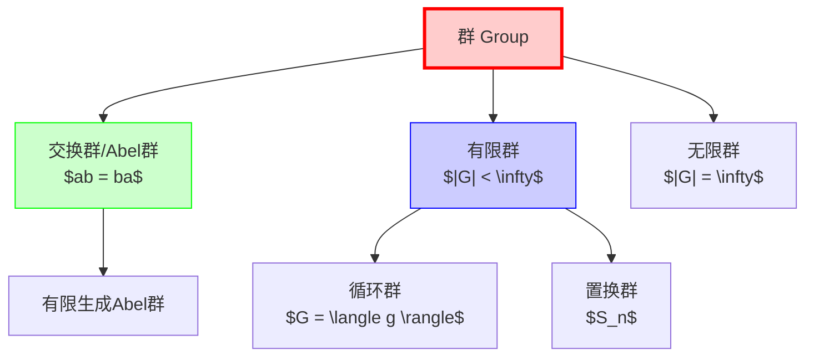
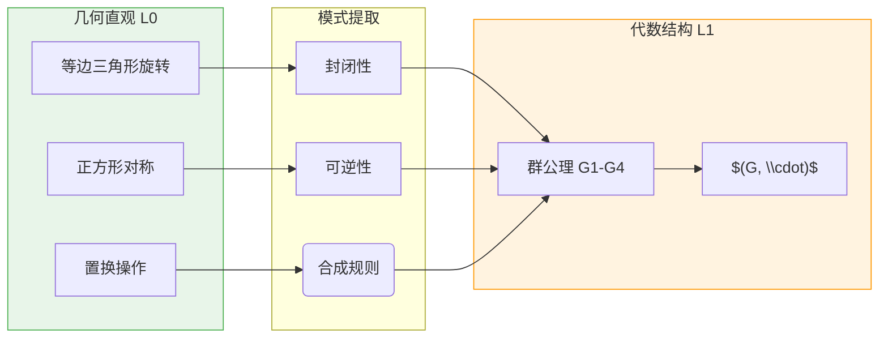
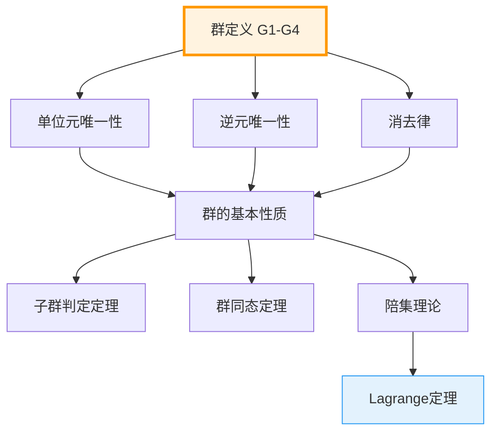
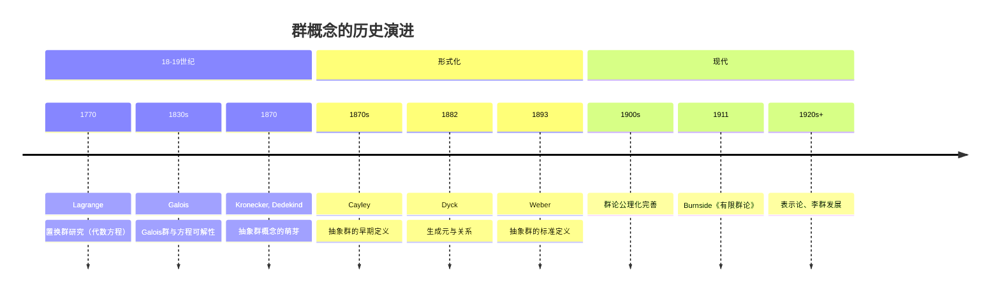

msc_primary: "20A05"
msc_secondary: ["20B30", "97H40"]
level: L1-Formal
domain: 代数学
concept: 群定义
prerequisites: ["二元运算", "集合与元素"]
next_level: ["子群", "群同态", "Lagrange定理"]
tags: ["代数结构", "群论", "公理系统", "形式化定义"]
---

# L1: 群的定义 (Group Definition)

**概念编号**: 03-004  
**层次**: L1-形式化定义层  
**创建日期**: 2026年4月3日

---

## 一、严格形式化定义

### 1.1 群的公理化定义

**定义 1.1.1**（群）  
一个**群** $(G, \cdot)$ 是一个集合 $G$ 配备一个二元运算 $\cdot: G \times G \to G$，满足以下四条公理：

| 公理 | 名称 | 符号表述 | 含义 |
|------|------|---------|------|
| **G1** | 封闭性 | $\forall a,b \in G: a \cdot b \in G$ | 运算结果仍在群内 |
| **G2** | 结合律 | $\forall a,b,c \in G: (a \cdot b) \cdot c = a \cdot (b \cdot c)$ | 运算顺序无关 |
| **G3** | 单位元 | $\exists e \in G, \forall a \in G: e \cdot a = a \cdot e = a$ | 存在中性元素 |
| **G4** | 逆元 | $\forall a \in G, \exists a^{-1} \in G: a \cdot a^{-1} = a^{-1} \cdot a = e$ | 每个元素可逆 |

### 1.2 等价表述

**定义 1.1.2**（简化版本）  
若二元运算 $\cdot$ 的封闭性已隐含在函数定义中，则群只需满足：
- 结合律 (G2)
- 左单位元：$\exists e, \forall a: e \cdot a = a$
- 左逆元：$\forall a, \exists a^{-1}: a^{-1} \cdot a = e$

**定理**：以上三条可推出群的四条标准公理。

### 1.3 群的分类



---

## 二、从L0到L1的提升路径

### 2.1 L0直观理解

```

L0描述：
- "群就是有对称性的对象"
- "可以连续操作，最后能还原"
- "像拼图，可以旋转、翻转，拼回去"
- "运算有顺序，但加括号不影响结果"
- "有一个'什么都不做'的操作"
- "每个操作都可以撤销"

```

### 2.2 形式化提升过程

| 提升步骤 | L0表述 | L1形式化 | 数学目的 |
|---------|-------|----------|---------|
| 1. 抽象化 | "对称性" | 代数运算结构 | 摆脱几何依赖 |
| 2. 关系化 | "连续操作" | 二元运算 $\cdot$ | 精确描述合成 |
| 3. 约束化 | "能还原" | 逆元公理 | 保证可逆性 |
| 4. 中性化 | "什么都不做" | 单位元公理 | 提供基准点 |
| 5. 一致性 | "顺序无关" | 结合律 | 确保良定义性 |

### 2.3 对称性到代数结构



---

## 三、依赖的L1概念（先修）

| 概念 | 作用 | 依赖程度 |
|------|------|---------|
| **集合与元素** | $G$ 是集合，元素 $a, b, c \in G$ | 必需 |
| **二元运算** | $\cdot: G \times G \to G$ 是映射 | 必需 |
| **函数与映射** | 理解运算作为函数 | 间接 |
| **等价关系** | 用于定义群同态的核 | 间接 |

---

## 四、支撑的L2定理（后继）

### 4.1 基本定理群

| 定理 | 内容 | 依赖的公理 |
|------|------|-----------|
| **单位元唯一性** | 群的单位元唯一 | G2, G3 |
| **逆元唯一性** | 每个元素的逆元唯一 | G2, G4 |
| **消去律** | $ab = ac \Rightarrow b = c$ | G2, G4 |
| **$(a^{-1})^{-1} = a$** | 逆元的逆是自身 | G2, G4 |
| **$(ab)^{-1} = b^{-1}a^{-1}$** | 乘积的逆 | G2, G4 |
| **方程可解性** | $ax = b$ 有唯一解 | G1-G4 |

### 4.2 定理依赖图



### 4.3 单位元唯一性证明（示例）

**定理**：群 $(G, \cdot)$ 的单位元唯一。

**证明**：
假设 $e$ 和 $e'$ 都是单位元，则：

$$e = e \cdot e' = e'$$

- 第一个等号：$e'$ 是单位元，故 $e \cdot e' = e$
- 第二个等号：$e$ 是单位元，故 $e \cdot e' = e'$

因此 $e = e'$，单位元唯一。$\square$

---

## 五、定义的历史背景

### 5.1 历史发展



### 5.2 关键人物

| 人物 | 贡献 | 时代 |
|------|------|------|
| **Évariste Galois** (1811-1832) | 创立Galois理论，置换群研究 | 1830s |
| **Arthur Cayley** (1821-1895) | 提出抽象群概念 | 1850s-1870s |
| **Walther von Dyck** (1856-1934) | 生成元与关系表述 | 1882 |
| **Heinrich Weber** (1842-1913) | 抽象群的标准定义 | 1893 |
| **Sophus Lie** (1842-1899) | 连续群（李群） | 1870s-1890s |

### 5.3 从置换群到抽象群

**历史演变**：
1. **置换群**（Lagrange, Galois）：$S_n$ 的子群
2. **变换群**（Klein）：几何变换的群
3. **抽象群**（Cayley, Weber）：纯粹代数结构

**Cayley定理**（支撑L2）：  
每个群都同构于某个置换群的子群。  
这说明抽象群的一般性——置换群是群的"原型"。

---

## 六、典型示例

### 6.1 常见群示例

| 群 | 集合 | 运算 | 单位元 | 类型 |
|-----|------|------|-------|------|
| $(\mathbb{Z}, +)$ | 整数 | 加法 | $0$ | 无限Abel群 |
| $(\mathbb{Q}^*, \times)$ | 非零有理数 | 乘法 | $1$ | 无限Abel群 |
| $(\mathbb{Z}_n, +)$ | 模 $n$ 剩余类 | 加法 | $[0]$ | 有限Abel群 |
| $(S_n, \circ)$ | $n$ 元置换 | 复合 | $id$ | 有限群（$n \geq 3$ 非Abel） |
| $(GL_n(\mathbb{R}), \cdot)$ | 可逆实矩阵 | 矩阵乘法 | $I_n$ | 无限群（$n \geq 2$ 非Abel） |
| $(\{1, -1\}, \times)$ | $\{\pm 1\}$ | 乘法 | $1$ | 2阶循环群 |

### 6.2 凯莱表（乘法表）

**$\mathbb{Z}_3$ 的加法群**：

| $+$ | 0 | 1 | 2 |
|-----|---|---|---|
| 0 | 0 | 1 | 2 |
| 1 | 1 | 2 | 0 |
| 2 | 2 | 0 | 1 |

**验证**：
- 封闭性：表中所有元素都在 $\{0, 1, 2\}$
- 单位元：0（第一行/列）
- 逆元：$0^{-1}=0$, $1^{-1}=2$, $2^{-1}=1$
- 结合律：需逐一验证（或从整数加法继承）

---

## 七、形式化验证（Lean4示例）

```lean4
-- 群结构定义
class Group (G : Type) where
  mul : G → G → G
  one : G
  inv : G → G
  -- 公理
  mul_assoc : ∀ a b c : G, mul (mul a b) c = mul a (mul b c)
  one_mul : ∀ a : G, mul one a = a
  mul_one : ∀ a : G, mul a one = a
  mul_left_inv : ∀ a : G, mul (inv a) a = one
  mul_right_inv : ∀ a : G, mul a (inv a) = one

-- 记号
infix:70 " * " => Group.mul
notation:max "𝟙" => Group.one  -- \bbone
postfix:max "⁻¹" => Group.inv   -- \inv

-- 单位元唯一性定理
theorem one_unique {G : Type} [Group G] (e : G) 
  (h : ∀ a : G, e * a = a) : e = 𝟙 := by
  calc
    e = e * 𝟙 := by rw [Group.mul_one]
    _ = 𝟙 := by rw [h]

-- 逆元唯一性定理
theorem inv_unique {G : Type} [Group G] (a b : G)
  (h : a * b = 𝟙) : b = a⁻¹ := by
  calc
    b = 𝟙 * b := by rw [Group.one_mul]
    _ = (a⁻¹ * a) * b := by rw [Group.mul_left_inv]
    _ = a⁻¹ * (a * b) := by rw [Group.mul_assoc]
    _ = a⁻¹ * 𝟙 := by rw [h]
    _ = a⁻¹ := by rw [Group.mul_one]

```

---

**文档信息**
- **创建**: 2026年4月3日
- **字数**: 约2400字
- **层次**: L1-Formal
- **概念编号**: 03-004
