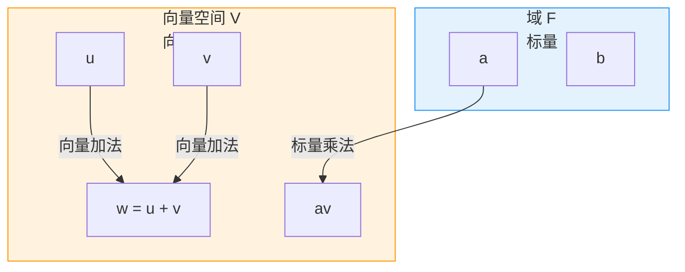
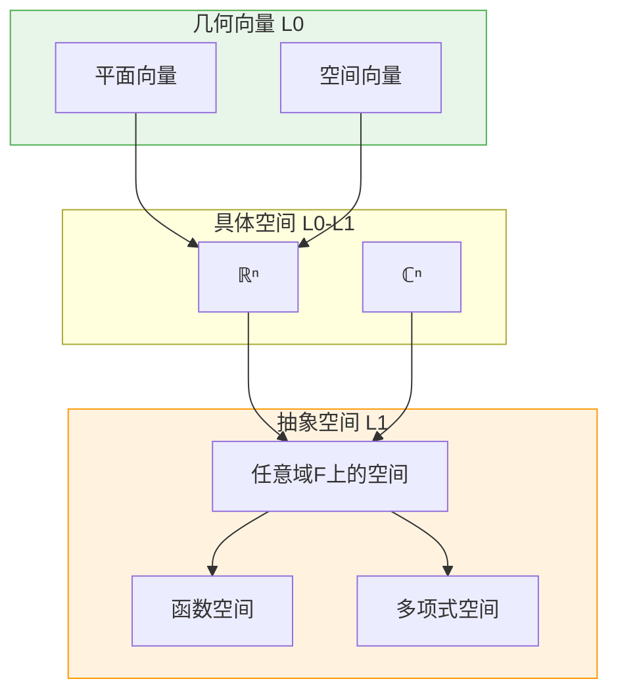
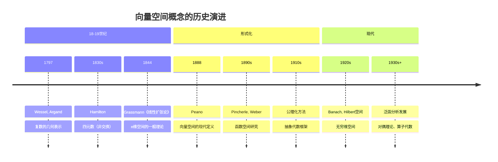

msc_primary: "15A03"
msc_secondary: ["15A04", "97H60"]
level: L1-Formal
domain: 代数学
concept: 向量空间定义
prerequisites: ["域定义", "群定义", "二元运算"]
next_level: ["线性无关", "基与维数", "线性映射", "秩-零化度定理"]
tags: ["代数结构", "向量空间", "线性代数", "形式化定义"]
---

# L1: 向量空间定义 (Vector Space)

**概念编号**: 03-016  
**层次**: L1-形式化定义层  
**创建日期**: 2026年4月3日

---

## 一、严格形式化定义

### 1.1 向量空间的公理化定义

**定义 1.1.1**（向量空间）  
设 $F$ 是一个域。一个**向量空间**（或**线性空间**）是三元组 $(V, +, \cdot)$，其中：
- $V$ 是一个非空集合（称为**向量集**）
- $+: V \times V \to V$ 是向量加法
- $\cdot: F \times V \to V$ 是标量乘法

满足以下**八条公理**：

**加法公理**（$(V, +)$ 是Abel群）：

| 公理 | 名称 | 表述 |
|------|------|------|
| V1 | 加法结合律 | $\mathbf{u} + (\mathbf{v} + \mathbf{w}) = (\mathbf{u} + \mathbf{v}) + \mathbf{w}$ |
| V2 | 零向量 | $\exists \mathbf{0} \in V, \forall \mathbf{v}: \mathbf{v} + \mathbf{0} = \mathbf{v}$ |
| V3 | 加法逆元 | $\forall \mathbf{v}, \exists (-\mathbf{v}): \mathbf{v} + (-\mathbf{v}) = \mathbf{0}$ |
| V4 | 加法交换律 | $\mathbf{u} + \mathbf{v} = \mathbf{v} + \mathbf{u}$ |

**标量乘法公理**：

| 公理 | 名称 | 表述 |
|------|------|------|
| V5 | 分配律（对向量） | $a \cdot (\mathbf{u} + \mathbf{v}) = a \cdot \mathbf{u} + a \cdot \mathbf{v}$ |
| V6 | 分配律（对标量） | $(a + b) \cdot \mathbf{v} = a \cdot \mathbf{v} + b \cdot \mathbf{v}$ |
| V7 | 标量乘法结合 | $a \cdot (b \cdot \mathbf{v}) = (ab) \cdot \mathbf{v}$ |
| V8 | 单位元 | $1 \cdot \mathbf{v} = \mathbf{v}$（$1$ 是 $F$ 的乘法单位元）|

### 1.2 记法与术语

| 术语 | 符号 | 说明 |
|------|------|------|
| 向量 | $\mathbf{u}, \mathbf{v}, \mathbf{w}$ | 向量空间的元素 |
| 标量 | $a, b, c$ | 域 $F$ 的元素 |
| 零向量 | $\mathbf{0}$ | 加法的单位元 |
| 负向量 | $-\mathbf{v}$ | $\mathbf{v}$ 的加法逆元 |

### 1.3 结构示意



---

## 二、从L0到L1的提升路径

### 2.1 L0直观理解

```

L0描述：
- "向量就是有大小和方向的箭头"
- "可以相加（平行四边形法则）"
- "可以拉伸/压缩（数乘）"
- "像力、速度这样的物理量"
- "平面/空间中的点"

```

### 2.2 形式化提升过程

| 提升步骤 | L0表述 | L1形式化 | 目的 |
|---------|-------|----------|------|
| 1. 去几何化 | "箭头" | 抽象集合元素 | 摆脱几何依赖 |
| 2. 代数化 | "平行四边形" | 加法公理 | 代数结构 |
| 3. 一般化 | "实数倍数" | 域上标量乘法 | 一般域 |
| 4. 公理化 | "可以相加" | 8条公理 | 完整刻画 |

### 2.3 从具体空间到抽象空间



---

## 三、依赖的L1概念（先修）

| 概念 | 作用 | 依赖程度 |
|------|------|---------|
| **域定义** | 标量乘法的基础 | 必需 |
| **群定义** | $(V, +)$ 是Abel群 | 必需 |
| **二元运算** | 加法和标量乘法是运算 | 必需 |
| **集合与元素** | $V$ 是集合 | 必需 |

---

## 四、支撑的L2定理（后继）

### 4.1 基本定理群

| 定理 | 内容 | 依赖的公理 |
|------|------|-----------|
| **零向量唯一** | 零向量唯一 | V2 |
| **$0 \cdot \mathbf{v} = \mathbf{0}$** | 零标量乘向量得零向量 | V6, V8 |
| **$(-1) \cdot \mathbf{v} = -\mathbf{v}$** | 负标量乘向量得负向量 | V6, V8 |
| **消去律** | $\mathbf{u} + \mathbf{w} = \mathbf{v} + \mathbf{w} \Rightarrow \mathbf{u} = \mathbf{v}$ | V1-V4 |

### 4.2 结构定理

| 定理 | 内容 | 关键概念 |
|------|------|---------|
| **基的存在性** | 每个空间有基（选择公理） | 线性无关、张成 |
| **维数不变性** | 所有基的元素个数相同 | 基、维数 |
| **同构定理** | $\dim V = n$ 则 $V \cong F^n$ | 坐标映射 |
| **维数公式** | $\dim(U + W) = \dim U + \dim W - \dim(U \cap W)$ | 子空间 |
| **秩-零化度** | $\dim V = \text{rank}(T) + \text{null}(T)$ | 线性映射 |

---

## 五、定义的历史背景

### 5.1 历史发展



### 5.2 关键人物

| 人物 | 贡献 | 时代 |
|------|------|------|
| **Hermann Grassmann** (1809-1877) | 创立线性代数的一般理论 | 1844 |
| **Giuseppe Peano** (1858-1932) | 向量空间的现代公理化定义 | 1888 |
| **David Hilbert** (1862-1943) | Hilbert空间，积分方程 | 1900s |
| **Stefan Banach** (1892-1945) | Banach空间，泛函分析 | 1922 |

---

## 六、典型示例

### 6.1 常见向量空间

| 空间 | 向量 | 标量域 | 说明 |
|------|------|-------|------|
| $F^n$ | $n$元组 | $F$ | 标准坐标空间 |
| $M_{m \times n}(F)$ | $m \times n$矩阵 | $F$ | 矩阵空间 |
| $F[x]$ | 多项式 | $F$ | 无穷维 |
| $C([a, b])$ | 连续函数 | $\mathbb{R}$ 或 $\mathbb{C}$ | 函数空间 |
| $\ell^p$ | $p$次可和序列 | $\mathbb{R}$ 或 $\mathbb{C}$ | Banach空间 |
| $L^p(\mu)$ | $p$次可积函数 | $\mathbb{R}$ 或 $\mathbb{C}$ | Lebesgue空间 |

### 6.2 子空间示例

$\mathbb{R}^3$ 的子空间：
- $\{\mathbf{0}\}$（零子空间）
- 过原点的直线
- 过原点的平面
- $\mathbb{R}^3$ 本身

---

## 七、形式化验证（Lean4示例）

```lean4
-- 向量空间结构
class VectorSpace (F : Type) [Field F] (V : Type) where
  add : V → V → V
  smul : F → V → V
  zero : V
  neg : V → V
  -- 加法公理
  add_assoc : ∀ u v w : V, add (add u v) w = add u (add v w)
  zero_add : ∀ v : V, add zero v = v
  add_zero : ∀ v : V, add v zero = v
  add_left_neg : ∀ v : V, add (neg v) v = zero
  add_comm : ∀ u v : V, add u v = add v u
  -- 标量乘法公理
  smul_add : ∀ a : F, ∀ u v : V, smul a (add u v) = add (smul a u) (smul a v)
  add_smul : ∀ a b : F, ∀ v : V, smul (a + b) v = add (smul a v) (smul b v)
  mul_smul : ∀ a b : F, ∀ v : V, smul a (smul b v) = smul (a * b) v
  one_smul : ∀ v : V, smul 1 v = v

-- 记号
infix:65 " +ᵥ " => VectorSpace.add
infix:75 " • " => VectorSpace.smul
notation "𝟎" => VectorSpace.zero
postfix:max "⁻ᵛ" => VectorSpace.neg

-- 零标量乘向量得零向量
theorem zero_smul {F V : Type} [Field F] [VectorSpace F V] 
  (v : V) : (0 : F) • v = 𝟎 := by
  have h : (0 : F) • v + (0 : F) • v = (0 : F) • v := by
    rw [← VectorSpace.add_smul]
    simp
  have h' : (0 : F) • v = 𝟎 := by
    rw [← VectorSpace.add_zero ((0 : F) • v)]
    nth_rw 2 [← h]
    rw [VectorSpace.add_assoc]
    rw [VectorSpace.add_left_neg]
    rw [VectorSpace.zero_add]
  exact h'

```

---

**文档信息**
- **创建**: 2026年4月3日
- **字数**: 约2200字
- **层次**: L1-Formal
- **概念编号**: 03-016
