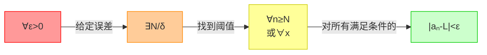
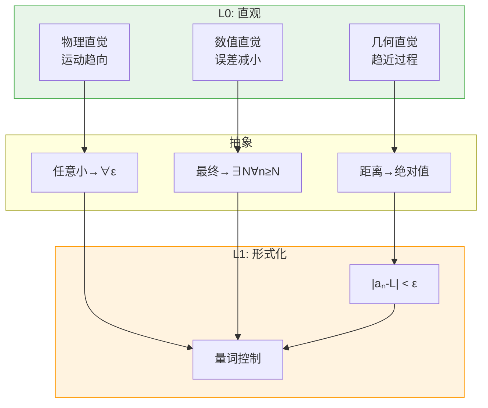
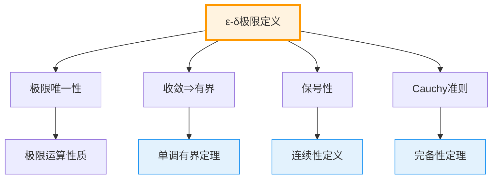
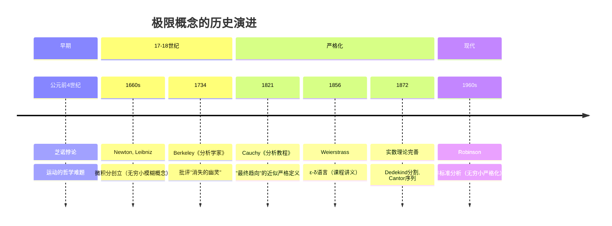

msc_primary: "26A03"
msc_secondary: ["26E35", "97I30"]
level: L1-Formal
domain: 分析学
concept: 极限的ε-δ定义
prerequisites: ["实数构造", "绝对值", "量词逻辑"]
next_level: ["连续性定义", "导数定义", "Bolzano-Weierstrass定理"]
tags: ["分析学", "极限", "epsilon-delta", "形式化定义"]
---

# L1: 极限的ε-δ定义 (ε-δ Definition of Limit)

**概念编号**: 04-001  
**层次**: L1-形式化定义层  
**创建日期**: 2026年4月3日

---

## 一、严格形式化定义

### 1.1 序列极限的ε-N定义

**定义 1.1.1**（序列极限）  
设 $(a_n)$ 是实数序列，$L \in \mathbb{R}$。称 $L$ 是 $(a_n)$ 的**极限**，记作 $\lim_{n \to \infty} a_n = L$，如果：

$$\forall \varepsilon > 0, \exists N \in \mathbb{N}, \forall n \geq N: |a_n - L| < \varepsilon$$

### 1.2 函数极限的ε-δ定义

**定义 1.1.2**（函数极限）  
设 $f: D \to \mathbb{R}$，$a$ 是 $D$ 的聚点，$L \in \mathbb{R}$。称 $\lim_{x \to a} f(x) = L$，如果：

$$\forall \varepsilon > 0, \exists \delta > 0, \forall x \in D: 0 < |x - a| < \delta \Rightarrow |f(x) - L| < \varepsilon$$

### 1.3 结构分析



**量词结构的意义**：

| 量词 | 意义 | 直观解释 |
|------|------|---------|
| $\forall \varepsilon > 0$ | 任意小的误差 | 无论你要求多精确 |
| $\exists N/\delta$ | 存在阈值 | 我总能找到一个界限 |
| $\forall n \geq N$ | 对所有后续项 | 从某点开始 |
| $|a_n - L| < \varepsilon$ | 误差控制 | 都满足你的精度要求 |

---

## 二、从L0到L1的提升路径

### 2.1 L0直观理解

```

L0描述：
- "极限就是一个数列越来越接近的数"
- "函数值趋向于某个点"
- "可以任意接近但不一定达到"
- "像跑步，越来越接近终点线"
- "误差越来越小"

```

### 2.2 形式化提升过程

| 提升步骤 | L0表述 | L1形式化 | 目的 |
|---------|-------|----------|------|
| 1. 精确化 | "越来越接近" | $|a_n - L|$ | 距离量化 |
| 2. 误差化 | "任意小" | $\forall \varepsilon > 0$ | 任意精度要求 |
| 3. 条件化 | "从某点开始" | $\exists N, \forall n \geq N$ | 确定范围 |
| 4. 控制化 | "误差小于..." | $|a_n - L| < \varepsilon$ | 严格不等式 |
| 5. 顺序化 | "先给精度，再找范围" | $\forall \varepsilon \exists N$ | 量词顺序至关重要 |

### 2.3 量词顺序的重要性

```

正确顺序：∀ε>0, ∃N, ∀n≥N: |aₙ-L|<ε

           ↓
      "无论多精确，我都能做到"

错误顺序：∃N, ∀ε>0, ∀n≥N: |aₙ-L|<ε

           ↓
      "存在一个点，从此所有项都相等"
      （这是常数列！）

```

### 2.4 提升的关键洞察



---

## 三、依赖的L1概念（先修）

| 概念 | 作用 | 依赖程度 |
|------|------|---------|
| **实数构造** | $|a_n - L|$ 需要实数上的度量 | 必需 |
| **绝对值** | 定义距离 $|x - y|$ | 必需 |
| **量词逻辑** | $\forall, \exists$ 的精确使用 | 必需 |
| **不等式** | $<, \leq$ 的运算 | 必需 |
| **有序域** | 比较大小 | 间接 |

---

## 四、支撑的L2定理（后继）

### 4.1 极限的基本定理

| 定理 | 内容 | 依赖的L1 |
|------|------|---------|
| **极限唯一性** | 若极限存在则唯一 | ε-δ定义直接推论 |
| **夹逼定理** | $a_n \leq b_n \leq c_n$，$a_n, c_n \to L$ 则 $b_n \to L$ | ε-δ定义 |
| **有界性** | 收敛数列有界 | 取 $\varepsilon = 1$ |
| **保号性** | $a_n \to L > 0$ 则从某项起 $a_n > 0$ | ε-δ定义 |
| **四则运算** | 极限的加减乘除 | ε-δ定义+不等式技巧 |

### 4.2 定理依赖图



### 4.3 极限唯一性证明（示例）

**定理**：数列的极限若存在则唯一。

**证明**：  
设 $\lim a_n = L$ 且 $\lim a_n = M$。对任意 $\varepsilon > 0$：

- 由 $a_n \to L$，存在 $N_1$ 使得 $n \geq N_1 \Rightarrow |a_n - L| < \varepsilon/2$
- 由 $a_n \to M$，存在 $N_2$ 使得 $n \geq N_2 \Rightarrow |a_n - M| < \varepsilon/2$

取 $N = \max(N_1, N_2)$，则当 $n \geq N$：

$$|L - M| \leq |L - a_n| + |a_n - M| < \varepsilon/2 + \varepsilon/2 = \varepsilon$$

因 $\varepsilon$ 任意，故 $|L - M| = 0$，即 $L = M$。$\square$

---

## 五、定义的历史背景

### 5.1 历史发展



### 5.2 关键人物

| 人物 | 贡献 | 时代 |
|------|------|------|
| **Augustin-Louis Cauchy** (1789-1857) | "最终趋向"定义，极限严格化的先驱 | 1821 |
| **Karl Weierstrass** (1815-1897) | ε-δ语言的创立者 | 1850s-1860s |
| **Bernard Bolzano** (1781-1848) | 早期严格极限概念 | 1817 |
| **Abraham Robinson** (1918-1974) | 非标准分析（无穷小严格化） | 1960s |

### 5.3 Cauchy与Weierstrass

**Cauchy的定义**（1821）：  
> "当一个变量逐次所取的值无限趋向于一个定值，最终使它的值与该定值的差要多小就多小，这个定值就称为其他所有值的**极限**。"

**Weierstrass的改进**（1856）：  
将"无限趋向"、"要多小就多小"转化为精确的 ε-δ 语言，彻底消除了模糊性。

**关键区别**：
- Cauchy："最终使...要多小就多小"（仍有"无限"的模糊）
- Weierstrass："$\forall \varepsilon > 0, \exists N$..."（完全精确）

---

## 六、扩展与变体

### 6.1 各种极限类型

| 类型 | 定义 | 应用场景 |
|------|------|---------|
| **双侧极限** | $x \to a$ | 连续性、导数 |
| **右极限** | $x \to a^+$ | 分段函数、边界 |
| **左极限** | $x \to a^-$ | 分段函数、边界 |
| **无穷极限** | $x \to \infty$ | 渐近线、增长 |
| **无穷远处的极限** | $x \to a, f(x) \to \infty$ | 奇点、垂直渐近线 |

### 6.2 单侧极限定义

**右极限**：
$$\lim_{x \to a^+} f(x) = L \Leftrightarrow \forall \varepsilon > 0, \exists \delta > 0, \forall x: a < x < a + \delta \Rightarrow |f(x) - L| < \varepsilon$$

---

## 七、形式化验证（Lean4示例）

```lean4
-- 序列极限的定义
def SeqLimit (a : ℕ → ℝ) (L : ℝ) : Prop :=
  ∀ ε > 0, ∃ N : ℕ, ∀ n ≥ N, |a n - L| < ε

-- 记号
notation:50 a " ⟶ " L => SeqLimit a L

-- 极限唯一性证明
theorem limit_unique (a : ℕ → ℝ) (L M : ℝ) 
  (hL : a ⟶ L) (hM : a ⟶ M) : L = M := by
  by_contra h
  have hLM : |L - M| > 0 := by

    apply abs_pos.mpr
    exact sub_ne_zero_of_ne h
  
  let ε := |L - M| / 2

  have hε : ε > 0 := by positivity
  
  obtain ⟨N₁, hN₁⟩ := hL ε hε
  obtain ⟨N₂, hN₂⟩ := hM ε hε
  
  let N := max N₁ N₂
  have h₁ := hN₁ N (le_max_left _ _)
  have h₂ := hN₂ N (le_max_right _ _)
  
  have h₃ : |L - M| < |L - M| := by

    calc

      |L - M| = |(L - a N) + (a N - M)| := by ring_nf
      _ ≤ |L - a N| + |a N - M| := by apply abs_add
      _ = |a N - L| + |a N - M| := by rw [abs_sub_comm]

      _ < ε + ε := by linarith
      _ = |L - M| := by ring
  
  linarith -- 矛盾：|L-M| < |L-M|

-- 常数列极限
theorem const_limit (c : ℝ) : (λ _ => c) ⟶ c := by
  intro ε hε
  use 0
  intro n hn
  simp [hε]

```

---

**文档信息**
- **创建**: 2026年4月3日
- **字数**: 约2500字
- **层次**: L1-Formal
- **概念编号**: 04-001
