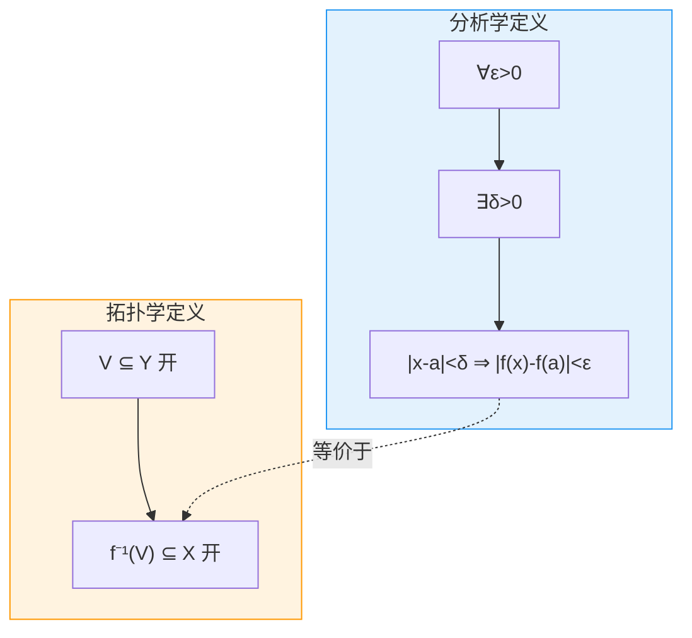
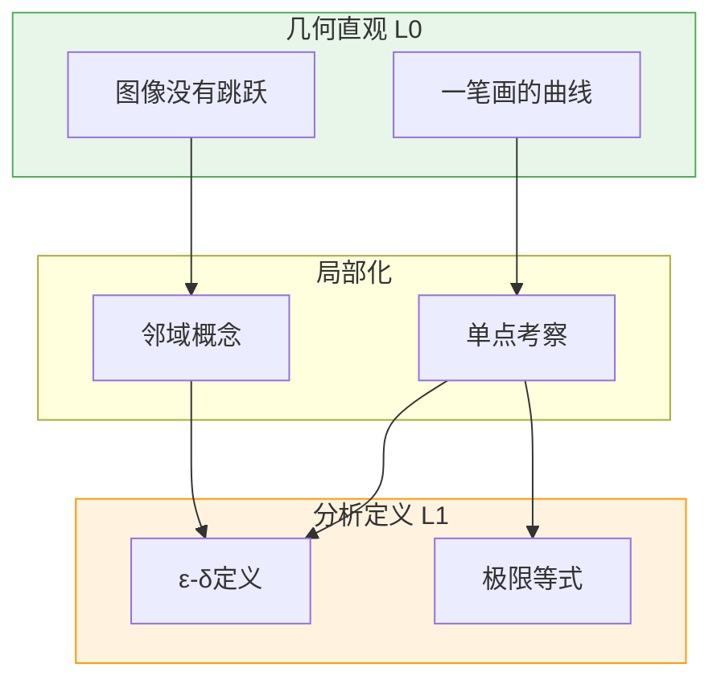
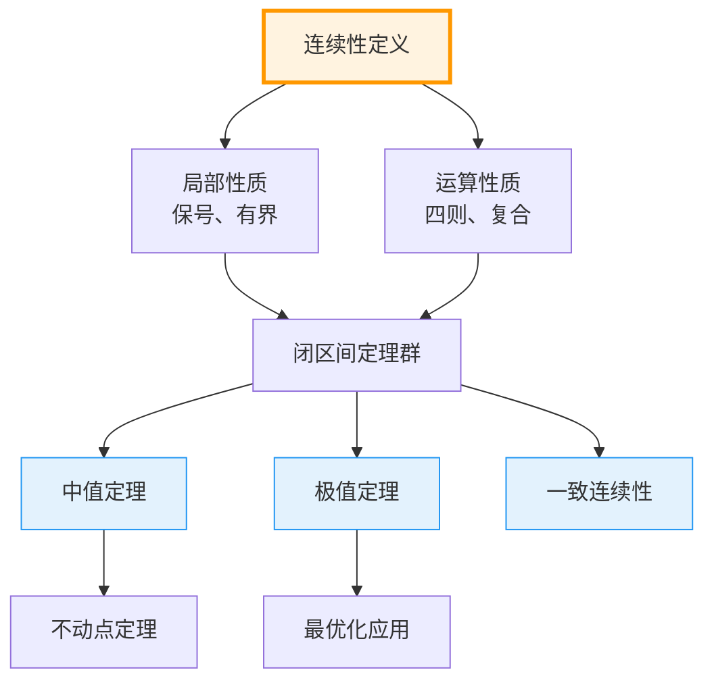
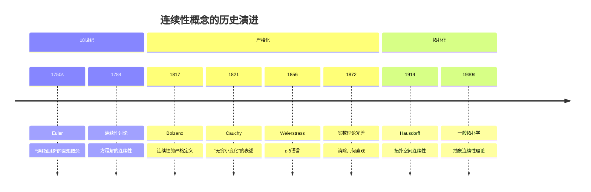

msc_primary: "26A15"
msc_secondary: ["26E05", "97I35"]
level: silver
domain: 分析学
concept: 连续性定义
prerequisites: ["极限epsilon-delta定义", "函数与映射"]
next_level: ["中值定理", "极值定理", "一致连续"]
tags: ["分析学", "连续性", "epsilon-delta", "形式化定义"]
---

# L1: 连续性定义 (Continuity)

**概念编号**: 04-004  
**层次**: L1-形式化定义层  
**创建日期**: 2026年4月3日

---

## 一、严格形式化定义

### 1.1 点连续性的ε-δ定义

**定义 1.1.1**（点连续性）  
设 $f: D \to \mathbb{R}$，$a \in D$。称 $f$ 在点 $a$ **连续**，如果：

$$\forall \varepsilon > 0, \exists \delta > 0, \forall x \in D: |x - a| < \delta \Rightarrow |f(x) - f(a)| < \varepsilon$$

### 1.2 等价表述

**定义 1.1.2**（用极限表述）  
$f$ 在 $a$ 连续当且仅当：
$$\lim_{x \to a} f(x) = f(a)$$

即：极限存在且等于函数值。

### 1.3 整体连续性

**定义 1.1.3**（区间上的连续性）  
函数 $f: I \to \mathbb{R}$ 在区间 $I$ 上**连续**，如果 $f$ 在 $I$ 的每一点都连续。

记法：$f \in C(I)$ 或 $C^0(I)$

### 1.4 拓扑学定义

**定义 1.1.4**（拓扑连续性）  
设 $X, Y$ 是拓扑空间。映射 $f: X \to Y$ 是**连续的**，如果：
$$\forall V \subseteq Y \text{ 开集}: f^{-1}(V) \subseteq X \text{ 是开集}$$

即：开集的原像是开集。

### 1.5 结构比较



---

## 二、从L0到L1的提升路径

### 2.1 L0直观理解

```

L0描述：
- "连续就是一笔画成，没有断开"
- "图像没有跳跃，没有洞"
- "小的输入变化引起小的输出变化"
- "可以一笔画完的曲线"
- "不会突然跳来跳去"

```

### 2.2 形式化提升过程

| 提升步骤 | L0表述 | L1形式化 | 目的 |
|---------|-------|----------|------|
| 1. 局部化 | "一笔画" | 点连续性 | 逐点定义 |
| 2. 误差化 | "小的变化" | $\forall \varepsilon > 0$ | 量化精度 |
| 3. 邻域化 | "周围" | $\exists \delta > 0$ | 确定范围 |
| 4. 蕴含化 | "引起" | $|x-a|<\delta \Rightarrow ...$ | 逻辑关系 |
| 5. 拓扑化 | "没有断开" | 开集原像 | 一般空间 |

### 2.3 从几何到分析



---

## 三、依赖的L1概念（先修）

| 概念 | 作用 | 依赖程度 |
|------|------|---------|
| **极限定义** | 连续性 = 极限 = 函数值 | 必需 |
| **函数与映射** | $f$ 是函数 | 必需 |
| **绝对值** | 距离度量 | 必需 |
| **拓扑空间** | 拓扑连续性定义 | 可选 |

---

## 四、支撑的L2定理（后继）

### 4.1 基本定理群

| 定理 | 内容 | 条件 |
|------|------|------|
| **局部保号性** | $f(a) > 0$ 则在某邻域 $f(x) > 0$ | 点连续 |
| **局部有界性** | $f$ 在 $a$ 连续则在某邻域有界 | 点连续 |
| **连续的四则运算** | 连续函数的和、差、积、商（非零）连续 | 点连续 |
| **复合连续性** | $f$ 连续，$g$ 连续，则 $g \circ f$ 连续 | 点连续 |

### 4.2 闭区间上的定理

| 定理 | 内容 | 关键条件 |
|------|------|---------|
| **有界性定理** | $f \in C[a,b]$ 则 $f$ 有界 | 闭区间+连续 |
| **极值定理** | $f \in C[a,b]$ 则 $f$ 取到最大最小值 | 闭区间+连续 |
| **介值定理** | $f(a) < c < f(b)$ 则 $\exists \xi: f(\xi) = c$ | 区间+连续 |
| **一致连续性** | $f \in C[a,b]$ 则一致连续 | 闭区间+连续 |

### 4.3 定理依赖图



---

## 五、定义的历史背景

### 5.1 历史发展



### 5.2 关键人物

| 人物 | 贡献 | 时代 |
|------|------|------|
| **Bernard Bolzano** (1781-1848) | 连续性的严格定义先驱 | 1817 |
| **Augustin-Louis Cauchy** (1789-1857) | "无穷小变化"表述 | 1821 |
| **Karl Weierstrass** (1815-1897) | ε-δ严格定义 | 1856-1860s |
| **Felix Hausdorff** (1868-1942) | 拓扑连续性 | 1914 |

---

## 六、典型示例

### 6.1 连续函数示例

| 函数 | 连续性 | 说明 |
|------|-------|------|
| 常数函数 $f(x) = c$ | 处处连续 | $\delta$ 任意 |
| 恒等函数 $f(x) = x$ | 处处连续 | 取 $\delta = \varepsilon$ |
| 多项式函数 | 处处连续 | 连续函数的四则运算 |
| $e^x, \sin x, \cos x$ | 处处连续 | 基本初等函数 |
| $\ln x$ | $x > 0$ 连续 | 定义域内连续 |

### 6.2 间断点分类

```

间断点类型：

1. 可去间断点：
   lim(x→a) f(x) 存在，但不等于 f(a) 或 f(a) 无定义
   例：f(x) = sin(x)/x 在 x=0（补充定义 f(0)=1 可去）

2. 跳跃间断点：
   左右极限都存在但不相等
   例：f(x) = sign(x) 在 x=0

3. 无穷间断点：
   lim(x→a) f(x) = ∞
   例：f(x) = 1/x 在 x=0

4. 振荡间断点：
   极限不存在，无限振荡
   例：f(x) = sin(1/x) 在 x=0

```

---

## 七、形式化验证（Lean4示例）

```lean4
-- 点连续性定义
def ContinuousAt (f : ℝ → ℝ) (a : ℝ) : Prop :=
  ∀ ε > 0, ∃ δ > 0, ∀ x : ℝ, |x - a| < δ → |f x - f a| < ε

-- 区间上连续性
def ContinuousOn (f : ℝ → ℝ) (I : Set ℝ) : Prop :=
  ∀ a ∈ I, ContinuousAt f a

-- 常数函数连续
theorem continuous_const (c : ℝ) : ContinuousAt (λ _ => c) a := by
  intro ε hε
  use 1
  constructor
  · norm_num
  · intro x hx
    simp
    exact hε

-- 恒等函数连续
theorem continuous_id : ContinuousAt (λ x => x) a := by
  intro ε hε
  use ε
  constructor
  · exact hε
  · intro x hx
    simpa using hx

-- 连续函数的和连续
theorem continuous_add {f g : ℝ → ℝ} {a : ℝ}
  (hf : ContinuousAt f a) (hg : ContinuousAt g a) :
  ContinuousAt (λ x => f x + g x) a := by
  intro ε hε
  obtain ⟨δ₁, hδ₁, h₁⟩ := hf (ε / 2) (by linarith)
  obtain ⟨δ₂, hδ₂, h₂⟩ := hg (ε / 2) (by linarith)
  use min δ₁ δ₂
  constructor
  · exact lt_min hδ₁ hδ₂
  · intro x hx
    have h3 : |x - a| < δ₁ := by

      calc

        |x - a| < min δ₁ δ₂ := hx

        _ ≤ δ₁ := by apply min_le_left
    have h4 : |x - a| < δ₂ := by

      calc

        |x - a| < min δ₁ δ₂ := hx

        _ ≤ δ₂ := by apply min_le_right
    have h5 : |f x - f a| < ε / 2 := h₁ x h3
    have h6 : |g x - g a| < ε / 2 := h₂ x h4

    calc

      |(f x + g x) - (f a + g a)| = |(f x - f a) + (g x - g a)| := by ring_nf
      _ ≤ |f x - f a| + |g x - g a| := by apply abs_add

      _ < ε / 2 + ε / 2 := by linarith
      _ = ε := by ring

```

---

**文档信息**
- **创建**: 2026年4月3日
- **字数**: 约2300字
- **层次**: L1-Formal
- **概念编号**: 04-004

## 相关文档

- [01-集合与元素](..\01-集合论基础\01-集合与元素.md)
- [01-Peano公理](..\02-数系构造\01-Peano公理.md)
- [07-实数构造](..\02-数系构造\07-实数构造.md)
- [04-群定义](..\03-代数结构\04-群定义.md)
- [16-向量空间](..\03-代数结构\16-向量空间.md)
---
**参考文献**

1. 相关教材与学术论文。
## 参考文献

1. Rudin, W. (1976). *Principles of Mathematical Analysis* (3rd ed.). McGraw-Hill. ISBN: 978-0070542358.
2. Tao, T. (2006). *Analysis I*. Hindustan Book Agency. ISBN: 978-8185931623.
3. Abbott, S. (2015). *Understanding Analysis* (2nd ed.). Springer. ISBN: 978-1493927111.