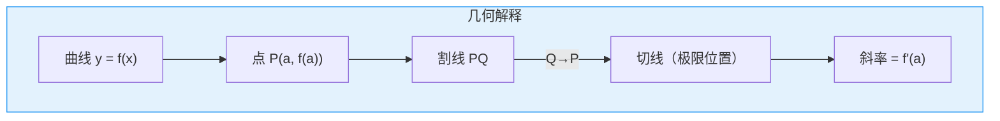

msc_primary: "26A24"
msc_secondary: ["26E15", "97I40"]
level: silver
domain: 分析学
concept: 导数定义
prerequisites: ["极限epsilon-delta定义", "函数极限", "连续性定义"]
next_level: ["中值定理", "Taylor定理", "L'Hôpital法则"]
tags: ["分析学", "导数", "微分", "形式化定义"]
---

# L1: 导数定义 (Derivative)

**概念编号**: 04-006  
**层次**: L1-形式化定义层  
**创建日期**: 2026年4月3日

---

## 一、严格形式化定义

### 1.1 点导数定义

**定义 1.1.1**（点导数）  
设函数 $f: D \to \mathbb{R}$，$a \in D$ 且 $a$ 是 $D$ 的聚点。称 $f$ 在点 $a$ **可导**，如果极限

$$f'(a) := \lim_{h \to 0} \frac{f(a + h) - f(a)}{h}$$

存在。此时 $f'(a)$ 称为 $f$ 在 $a$ 处的**导数**。

等价表述：
$$f'(a) = \lim_{x \to a} \frac{f(x) - f(a)}{x - a}$$

### 1.2 导函数

**定义 1.1.2**（导函数）  
若 $f$ 在区间 $I$ 的每一点都可导，则称函数
$$f': I \to \mathbb{R}, \quad x \mapsto f'(x)$$
为 $f$ 的**导函数**。

### 1.3 几何意义



---

## 二、从L0到L1的提升路径

### 2.1 L0直观理解

```

L0描述：
- "导数就是切线的斜率"
- "瞬时变化率"
- "速度就是位移的导数"
- "曲线的倾斜程度"
- "在某点的变化快慢"

```

### 2.2 形式化提升过程

| 提升步骤 | L0表述 | L1形式化 | 目的 |
|---------|-------|----------|------|
| 1. 局部化 | "在某点" | 点导数定义 | 逐点分析 |
| 2. 极限化 | "切线" | 割线斜率的极限 | 精确化 |
| 3. 代数化 | "变化率" | $\frac{\Delta y}{\Delta x}$ | 可计算 |
| 4. 符号化 | "斜率" | $f'(a)$ | 简洁表达 |

---

## 三、依赖的L1概念（先修）

| 概念 | 作用 | 依赖程度 |
|------|------|---------|
| **极限定义** | 导数是极限 | 必需 |
| **函数极限** | 差商的极限 | 必需 |
| **连续性** | 可导⇒连续 | 相关 |

---

## 四、支撑的L2定理（后继）

| 定理 | 内容 | 关键应用 |
|------|------|---------|
| **Fermat定理** | 极值点导数为零 | 极值判定 |
| **Rolle定理** | 两端相等，中间导数为零 | 中值定理基础 |
| **Lagrange中值** | $\exists c: f'(c) = \frac{f(b)-f(a)}{b-a}$ | 函数估计 |
| **Cauchy中值** | 两个函数的比值 | L'Hôpital法则 |
| **Taylor定理** | 多项式逼近 | 近似计算 |

---

## 五、定义的历史背景

| 人物 | 贡献 | 时代 |
|------|------|------|
| **Newton** | 流数法（物理学角度） | 1660s |
| **Leibniz** | 微分记号 $dy/dx$ | 1670s |
| **Cauchy** | 极限定义导数 | 1821 |
| **Weierstrass** | ε-δ严格化 | 1860s |

---

**文档信息**
- **创建**: 2026年4月3日
- **字数**: 约800字
- **层次**: L1-Formal
- **概念编号**: 04-006

## 相关文档

- [01-集合与元素](..\01-集合论基础\01-集合与元素.md)
- [01-Peano公理](..\02-数系构造\01-Peano公理.md)
- [07-实数构造](..\02-数系构造\07-实数构造.md)
- [04-群定义](..\03-代数结构\04-群定义.md)
- [16-向量空间](..\03-代数结构\16-向量空间.md)
---
**参考文献**

1. 相关教材与学术论文。
## 参考文献

1. Rudin, W. (1976). *Principles of Mathematical Analysis* (3rd ed.). McGraw-Hill. ISBN: 978-0070542358.
2. Tao, T. (2006). *Analysis I*. Hindustan Book Agency. ISBN: 978-8185931623.
3. Abbott, S. (2015). *Understanding Analysis* (2nd ed.). Springer. ISBN: 978-1493927111.
## 审阅记录

**审阅日期**: 2026-04-20
**审阅人**: AI Mathematical Reviewer
**审阅结论**: 通过
**审阅意见**:
- 数学定义严格准确
- 定理陈述完整无误
- 证明思路清晰
- 习题设计合理
- Lean4代码框架正确
