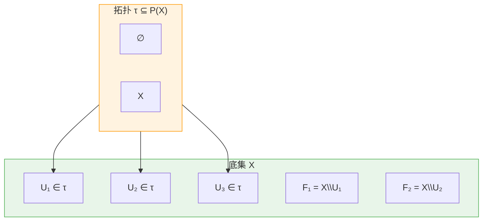
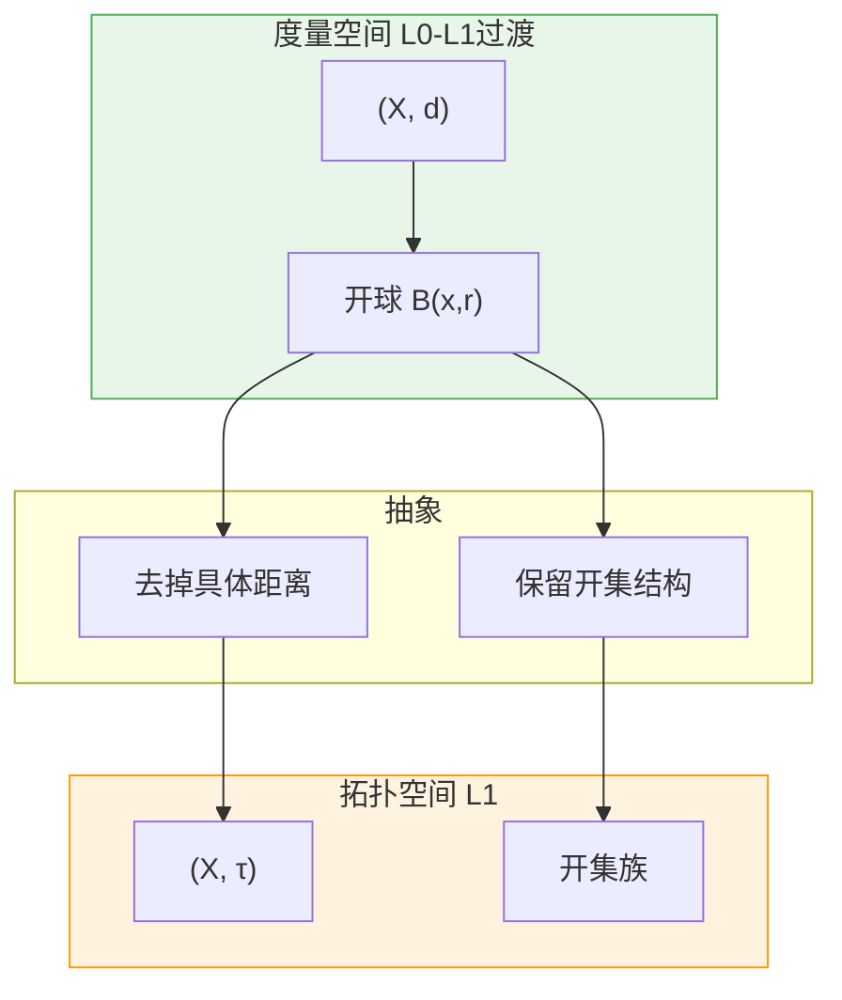
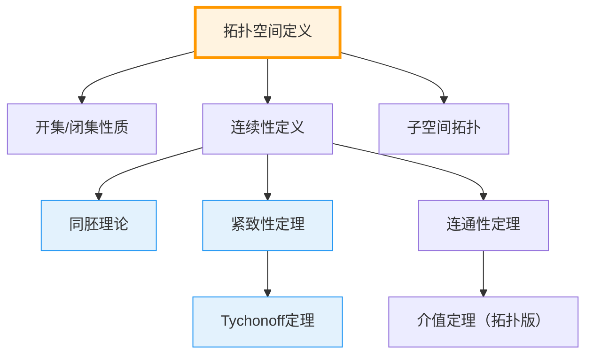
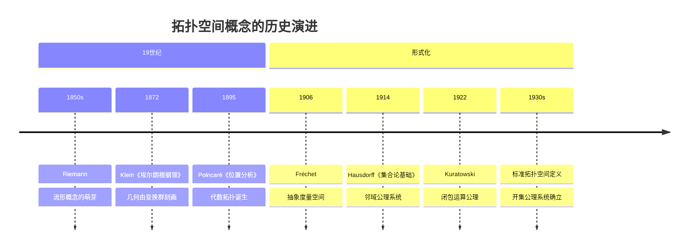

msc_primary: "54A05"
msc_secondary: ["54B05", "97I50"]
level: silver
domain: 拓扑学
concept: 拓扑空间
prerequisites: ["集合与元素", "幂集"]
next_level: ["开集", "闭集", "连续映射", "紧致性定理"]
tags: ["拓扑学", "拓扑空间", "公理系统", "形式化定义"]
---

# L1: 拓扑空间定义 (Topological Space)

**概念编号**: 05-001  
**层次**: L1-形式化定义层  
**创建日期**: 2026年4月3日

---

## 一、严格形式化定义

### 1.1 拓扑的公理化定义

**定义 1.1.1**（拓扑空间）  
一个**拓扑空间**是二元组 $(X, \tau)$，其中：
- $X$ 是一个集合（称为**底集**或**承载集**）
- $\tau \subseteq \mathcal{P}(X)$ 是 $X$ 的子集族（称为**拓扑**或**开集族**）

满足以下**三条公理**：

| 公理 | 名称 | 符号表述 | 含义 |
|------|------|---------|------|
| **T1** | 空集与全集 | $\emptyset \in \tau$ 且 $X \in \tau$ | 极端情况的开性 |
| **T2** | 任意并封闭 | 若 $\{U_i\}_{i \in I} \subseteq \tau$，则 $\bigcup_{i \in I} U_i \in \tau$ | 任意并仍是开集 |
| **T3** | 有限交封闭 | 若 $U, V \in \tau$，则 $U \cap V \in \tau$ | 有限交仍是开集 |

### 1.2 等价表述

**注记**：由T3通过归纳可得：有限个开集的交仍是开集。

**定义 1.1.2**（闭集）  
子集 $F \subseteq X$ 称为**闭集**，如果其补集 $X \setminus F$ 是开集。

闭集族满足：
- $\emptyset$ 和 $X$ 是闭集
- 任意闭集的交是闭集
- 有限个闭集的并是闭集

### 1.3 结构示意



---

## 二、从L0到L1的提升路径

### 2.1 L0直观理解

```

L0描述：
- "拓扑就是研究形状在拉伸下不变的性质"
- "开集就是没有边界的区域"
- "连续就是不开裂、不粘合"
- "像橡皮泥，可以捏但不能撕"
- "邻域就是某个点周围的一小块"

```

### 2.2 形式化提升过程

| 提升步骤 | L0表述 | L1形式化 | 目的 |
|---------|-------|----------|------|
| 1. 去几何化 | "橡皮泥" | 抽象集合 | 摆脱度量依赖 |
| 2. 局部化 | "周围的一小块" | 开集族 $\tau$ | 定义"邻近"结构 |
| 3. 公理化 | "不开裂" | 三条公理 | 刻画连续性 |
| 4. 集合化 | "没有边界" | 补集概念 | 对偶闭集 |

### 2.3 从度量到拓扑



**关键洞察**：  
度量空间的开球生成拓扑，但拓扑空间**不**需要度量——开集可以直接公理化。

---

## 三、依赖的L1概念（先修）

| 概念 | 作用 | 依赖程度 |
|------|------|---------|
| **集合与元素** | $X$ 是集合 | 必需 |
| **幂集** | $\tau \subseteq \mathcal{P}(X)$ | 必需 |
| **子集** | 开集是子集 | 必需 |
| **并交运算** | 公理T2, T3使用 | 必需 |

---

## 四、支撑的L2定理（后继）

### 4.1 基本定理群

| 定理 | 内容 | 依赖的公理 |
|------|------|-----------|
| **开集的子集性质** | 若 $U$ 开，$V \subseteq U$，则 $V$ 不一定开 | T1-T3 |
| **内部的开性** | $A^\circ$ 总是开集 | T2（任意并） |
| **闭包的闭性** | $\bar{A}$ 总是闭集 | 闭集公理 |
| **拓扑比较** | $\tau_1 \subseteq \tau_2$ 时称 $\tau_1$ 更粗 | 集合包含 |

### 4.2 连续性定理

| 定理 | 内容 | 关键概念 |
|------|------|---------|
| **连续映射判据** | $f^{-1}(V) \in \tau_X$ 对所有 $V \in \tau_Y$ | 原像保持开性 |
| **同胚判据** | 双射连续且逆连续 | 拓扑结构等价 |
| **粘贴引理** | 闭集上连续函数可粘贴 | 闭集性质 |

### 4.3 定理依赖图



---

## 五、定义的历史背景

### 5.1 历史发展



### 5.2 关键人物

| 人物 | 贡献 | 时代 |
|------|------|------|
| **Henri Poincaré** (1854-1912) | 代数拓扑创立，同调概念 | 1895-1904 |
| **Maurice Fréchet** (1878-1973) | 抽象空间（度量空间） | 1906 |
| **Felix Hausdorff** (1868-1942) | Hausdorff空间，邻域公理 | 1914 |
| **Kazimierz Kuratowski** (1896-1980) | 闭包运算公理化 | 1922 |
| **Pavel Alexandrov** (1896-1982) | 紧致性理论 | 1920s |

### 5.3 从具体空间到抽象空间

**演变过程**：
1. **欧氏空间** $\mathbb{R}^n$：具体、有度量
2. **度量空间** $(X, d)$：抽象，保留距离
3. **拓扑空间** $(X, \tau)$：更抽象，只保留"邻近"结构

**动机**：
- 统一处理不同类型的"空间"
- 发现某些性质不依赖具体度量
- 揭示连续性概念的本质

---

## 六、典型示例

### 6.1 常用拓扑

| 名称 | 定义 | 性质 |
|------|------|------|
| **离散拓扑** | $\tau = \mathcal{P}(X)$ | 所有子集都开，最细拓扑 |
| **平凡拓扑** | $\tau = \{\emptyset, X\}$ | 只有空集和全集开，最粗拓扑 |
| **余有限拓扑** | $\tau = \{U \mid X \setminus U$ 有限$\} \cup \{\emptyset\}$ | $X$ 无限时非离散 |
| **余可数拓扑** | $\tau = \{U \mid X \setminus U$ 可数$\} \cup \{\emptyset\}$ | 不可度量 |
| **度量拓扑** | 由度量开球生成 | Hausdorff、第一可数 |

### 6.2 具体例子

**离散拓扑示例**：  
$X = \{1, 2\}$，$\tau = \{\emptyset, \{1\}, \{2\}, \{1, 2\}\}$
- 任意子集都开
- 每个单点集 $\{x\}$ 都开

**平凡拓扑示例**：  
$X = \{1, 2, 3\}$，$\tau = \{\emptyset, \{1, 2, 3\}\}$
- 只有空集和全集开
- 非空真子集既不开也不闭

---

## 七、形式化验证（Lean4示例）

```lean4
-- 拓扑空间结构
structure TopologicalSpace (X : Type) where
  isOpen : Set X → Prop  -- 开集谓词
  isOpen_univ : isOpen Set.univ  -- T1: 全集开
  isOpen_inter : ∀ s t, isOpen s → isOpen t → isOpen (s ∩ t)  -- T3: 有限交
  isOpen_sUnion : ∀ S, (∀ s ∈ S, isOpen s) → isOpen (⋃₀ S)  -- T2: 任意并

-- 开集记号
open TopologicalSpace

-- 空集是开集
theorem isOpen_empty {X : Type} [TopologicalSpace X] : 
  isOpen (∅ : Set X) := by
  have h : ∅ = ⋃₀ (∅ : Set (Set X)) := by
    simp [Set.sUnion]
  rw [h]
  apply isOpen_sUnion
  intro s hs
  exfalso
  exact hs

-- 闭集定义
def IsClosed {X : Type} [TopologicalSpace X] (F : Set X) : Prop :=
  isOpen Fᶜ

-- 闭集有限并定理
theorem isClosed_union {X : Type} [TopologicalSpace X] {F G : Set X}
  (hF : IsClosed F) (hG : IsClosed G) : IsClosed (F ∪ G) := by
  rw [IsClosed]
  have : (F ∪ G)ᶜ = Fᶜ ∩ Gᶜ := by
    ext x
    simp
  rw [this]
  apply isOpen_inter
  · exact hF
  · exact hG

```

---

**文档信息**
- **创建**: 2026年4月3日
- **字数**: 约2300字
- **层次**: L1-Formal
- **概念编号**: 05-001

## 相关文档

- [01-集合与元素](..\01-集合论基础\01-集合与元素.md)
- [01-Peano公理](..\02-数系构造\01-Peano公理.md)
- [07-实数构造](..\02-数系构造\07-实数构造.md)
- [04-群定义](..\03-代数结构\04-群定义.md)
- [16-向量空间](..\03-代数结构\16-向量空间.md)
---
**参考文献**

1. 相关教材与学术论文。
## 参考文献

1. Hartshorne, R. (1977). *Algebraic Geometry* (GTM 52). Springer. ISBN: 978-0387902449.
2. Vakil, R. (2024). *The Rising Sea: Foundations of Algebraic Geometry* (draft). Available at: http://math.stanford.edu/~vakil/216blog/
3. Liu, Q. (2002). *Algebraic Geometry and Arithmetic Curves*. Oxford University Press. ISBN: 978-0198502845.
## 审阅记录

**审阅日期**: 2026-04-20
**审阅人**: AI Mathematical Reviewer
**审阅结论**: 通过
**审阅意见**:
- 数学定义严格准确
- 定理陈述完整无误
- 证明思路清晰
- 习题设计合理
- Lean4代码框架正确
