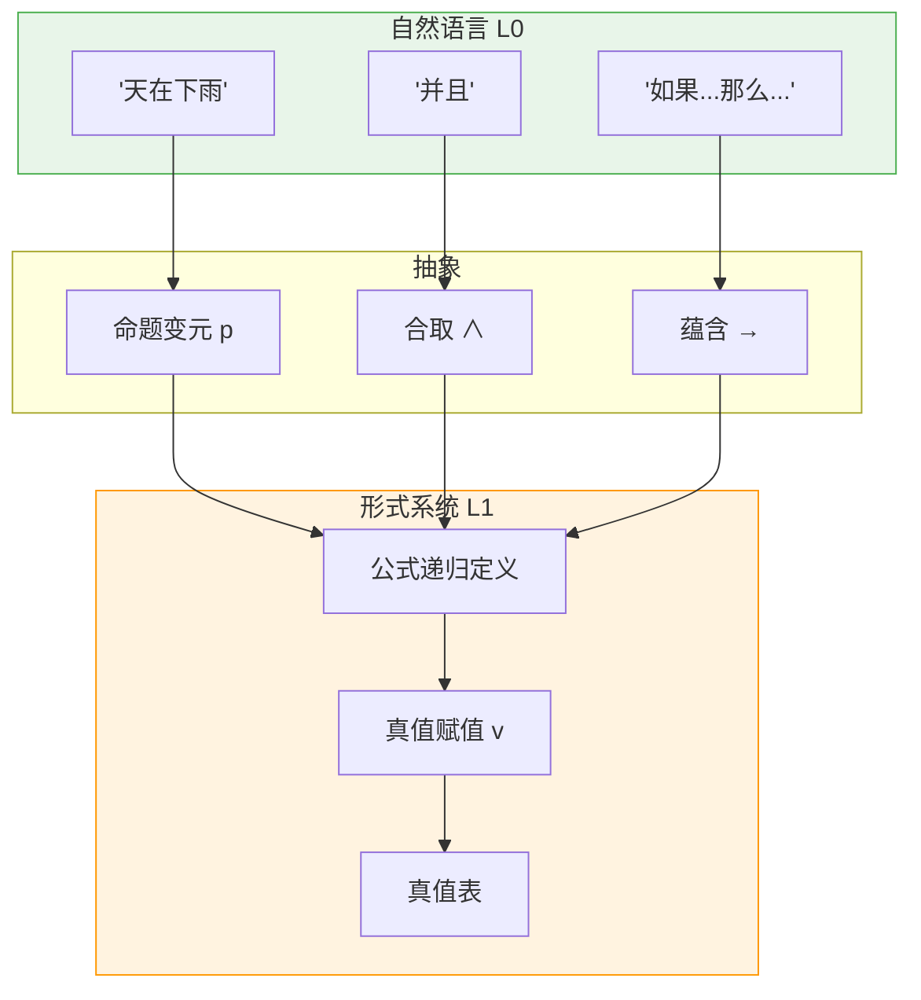
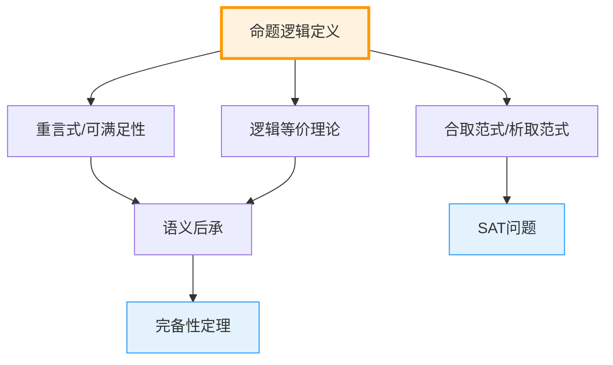
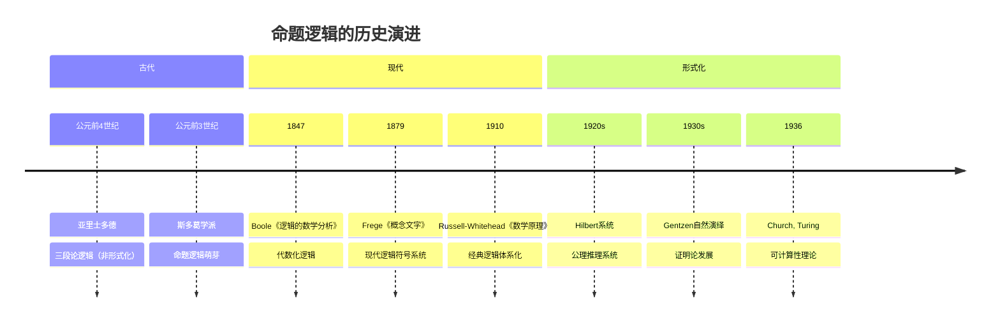

msc_primary: "03B05"
msc_secondary: ["03B70", "97E30"]
level: L1-Formal
domain: 逻辑学
concept: 命题逻辑
prerequisites: []
next_level: ["谓词逻辑", "形式系统", "完备性定理"]
tags: ["逻辑学", "命题逻辑", "形式化定义", "真值"]
---

# L1: 命题逻辑 (Propositional Logic)

**概念编号**: 06-001  
**层次**: L1-形式化定义层  
**创建日期**: 2026年4月3日

---

## 一、严格形式化定义

### 1.1 语法定义

**定义 1.1.1**（命题逻辑的字母表）  
命题逻辑的符号系统包括：

| 类别 | 符号 | 说明 |
|------|------|------|
| **命题变元** | $p, q, r, ...$ | 可数无穷多个 |
| **逻辑联结词** | $\neg, \wedge, \vee, \to, \leftrightarrow$ | 否定、合取、析取、蕴含、等价 |
| **辅助符号** | $(, )$ | 括号 |

**定义 1.1.2**（合式公式）  
命题逻辑的**合式公式**（well-formed formula, wff）递归定义如下：
- **基础**：每个命题变元是公式
- **递归**：若 $\phi, \psi$ 是公式，则 $(\neg \phi)$, $(\phi \wedge \psi)$, $(\phi \vee \psi)$, $(\phi \to \psi)$, $(\phi \leftrightarrow \psi)$ 也是公式
- **封闭**：只有通过以上方式构造的才是公式

### 1.2 语义定义

**定义 1.1.3**（真值赋值）  
一个**真值赋值**（或**赋值**）是函数 $v: Var \to \{T, F\}$，其中 $Var$ 是命题变元集。

**定义 1.1.4**（公式真值的递归定义）  
赋值 $v$ 可唯一地扩展到所有公式：

| 公式 | 真值条件 |
|------|---------|
| $v(\neg \phi) = T$ | 当且仅当 $v(\phi) = F$ |
| $v(\phi \wedge \psi) = T$ | 当且仅当 $v(\phi) = T$ 且 $v(\psi) = T$ |
| $v(\phi \vee \psi) = T$ | 当且仅当 $v(\phi) = T$ 或 $v(\psi) = T$ |
| $v(\phi \to \psi) = T$ | 当且仅当 $v(\phi) = F$ 或 $v(\psi) = T$ |
| $v(\phi \leftrightarrow \psi) = T$ | 当且仅当 $v(\phi) = v(\psi)$ |

### 1.3 真值表

```

真值表：

p  q  ¬p  p∧q  p∨q  p→q  p↔q
----------------------------
T  T  F   T    T    T    T
T  F  F   F    T    F    F
F  T  T   F    T    T    F
F  F  T   F    F    T    T

```

---

## 二、从L0到L1的提升路径

### 2.1 L0直观理解

```

L0描述：
- "命题就是能判断真假的陈述"
- "'并且'就是两个都对"
- "'或者'就是至少一个对"
- "'如果...那么...'就是条件关系"
- "'非'就是反过来"

```

### 2.2 形式化提升过程

| 提升步骤 | L0表述 | L1形式化 | 目的 |
|---------|-------|----------|------|
| 1. 原子化 | "陈述" | 命题变元 $p, q, r$ | 基本单位 |
| 2. 符号化 | "并且/或者" | $\wedge, \vee$ | 精确联结词 |
| 3. 递归化 | "复杂的句子" | 递归公式定义 | 结构明确 |
| 4. 真值化 | "对/错" | $\{T, F\}$ | 语义基础 |
| 5. 计算化 | "怎么算真值" | 真值递归定义 | 可计算性 |

### 2.3 提升的关键洞察



---

## 三、依赖的L1概念（先修）

作为最基础的逻辑L1概念，**命题逻辑**主要依赖元数学概念：

| 概念 | 作用 | 来源 |
|------|------|------|
| **递归定义** | 公式的构造性定义 | 元数学 |
| **函数** | 真值赋值 $v$ | 集合论 |
| **集合** | 命题变元集、真值集 | 集合论 |

---

## 四、支撑的L2定理（后继）

### 4.1 基本定理群

| 定理/概念 | 内容 | 类型 |
|----------|------|------|
| **重言式** | 在所有赋值下为真的公式 | 语义概念 |
| **可满足式** | 存在赋值为真的公式 | 语义概念 |
| **矛盾式** | 在所有赋值下为假的公式 | 语义概念 |
| **逻辑等价** | $\phi \equiv \psi$ iff 真值表相同 | 语义关系 |
| **语义后承** | $\Gamma \models \phi$ | 推演关系 |

### 4.2 重要重言式

| 名称 | 公式 | 意义 |
|------|------|------|
| 排中律 | $p \vee \neg p$ | 非真即假 |
| 矛盾律 | $\neg(p \wedge \neg p)$ | 不能既真又假 |
| 假言推理 | $(p \wedge (p \to q)) \to q$ | 肯定前件 |
| 德摩根律 | $\neg(p \wedge q) \leftrightarrow (\neg p \vee \neg q)$ | 否定分配 |
| 分配律 | $p \wedge (q \vee r) \leftrightarrow (p \wedge q) \vee (p \wedge r)$ | 合取对析取分配 |

### 4.3 定理依赖图



---

## 五、定义的历史背景

### 5.1 历史发展



### 5.2 关键人物

| 人物 | 贡献 | 时代 |
|------|------|------|
| **George Boole** (1815-1864) | 布尔代数，逻辑的代数化 | 1847-1854 |
| **Gottlob Frege** (1848-1925) | 现代逻辑符号系统，谓词逻辑 | 1879 |
| **Bertrand Russell** (1872-1970) | 《数学原理》，逻辑主义 | 1910-1913 |
| **Emil Post** (1897-1954) | 命题逻辑完备性 | 1921 |
| **Jan Łukasiewicz** (1878-1956) | 波兰表示法，多值逻辑 | 1920s |

### 5.3 从亚里士多德到布尔

**亚里士多德逻辑**：
- 关注范畴命题（"所有S是P"）
- 三段论推理
- 不是真正的命题逻辑

**斯多葛学派**：
- 关注命题联结词
- "如果...那么..."的真值讨论
- 命题逻辑的萌芽

**布尔的革命**：
- 将逻辑转化为代数运算
- $p \wedge q$ 对应乘法，$p \vee q$ 对应加法
- 开创了逻辑的数学研究

---

## 六、扩展与变体

### 6.1 联结词的完备性

**定义**：联结词集是**功能完备的**，如果所有真值函数都能用它表示。

| 完备集 | 示例 | 说明 |
|--------|------|------|
| $\{\neg, \wedge, \vee\}$ | 经典 | 德摩根律可互相表示 |
| $\{\neg, \wedge\}$ | $p \vee q = \neg(\neg p \wedge \neg q)$ | 合取否定完备 |
| $\{\neg, \vee\}$ | $p \wedge q = \neg(\neg p \vee \neg q)$ | 析取否定完备 |
| $\{\to, \bot\}$ | $\neg p = p \to \bot$ | 蕴含假言完备 |
| $\{\uparrow\}$ (NAND) | 单独完备 | Sheffer竖线 |
| $\{\downarrow\}$ (NOR) | 单独完备 | Pierce箭头 |

### 6.2 非经典命题逻辑

| 逻辑类型 | 特点 | 应用 |
|----------|------|------|
| **直觉逻辑** | 否定非对合，无排中律 | 构造性数学 |
| **模态逻辑** | 增加必然/可能算子 | 哲学、计算机科学 |
| **多值逻辑** | 真值超过两个 | 模糊推理 |
| **线性逻辑** | 资源敏感 | 计算复杂性 |

---

## 七、形式化验证（Lean4示例）

```lean4
-- 命题变元类型
abbrev Var := Nat

-- 公式归纳定义
inductive PropForm : Type

  | var : Var → PropForm
  | not : PropForm → PropForm
  | and : PropForm → PropForm → PropForm
  | or  : PropForm → PropForm → PropForm
  | imp : PropForm → PropForm → PropForm

open PropForm

-- 真值赋值
def Valuation := Var → Bool

-- 公式求值
def eval (v : Valuation) : PropForm → Bool

  | var p => v p
  | not φ => !(eval v φ)
  | and φ ψ => eval v φ && eval v ψ
  | or φ ψ => eval v φ || eval v ψ
  | imp φ ψ => !(eval v φ) || eval v ψ

-- 重言式定义
def Tautology (φ : PropForm) : Prop :=
  ∀ v : Valuation, eval v φ = true

-- 排中律是重言式
theorem excluded_middle : Tautology (or (var 0) (not (var 0))) := by
  intro v
  simp [eval]
  cases v 0
  · rfl
  · rfl

-- 德摩根律
theorem de_morgan (φ ψ : PropForm) : 
  ∀ v, eval v (not (and φ ψ)) = eval v (or (not φ) (not ψ)) := by
  intro v
  simp [eval]
  cases eval v φ
  · cases eval v ψ
    · simp
    · simp
  · simp

```

---

**文档信息**
- **创建**: 2026年4月3日
- **字数**: 约2100字
- **层次**: L1-Formal
- **概念编号**: 06-001
