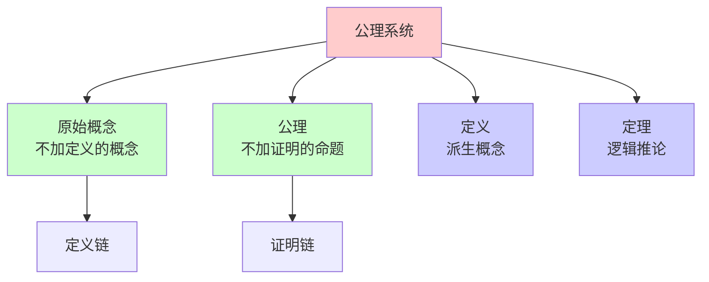
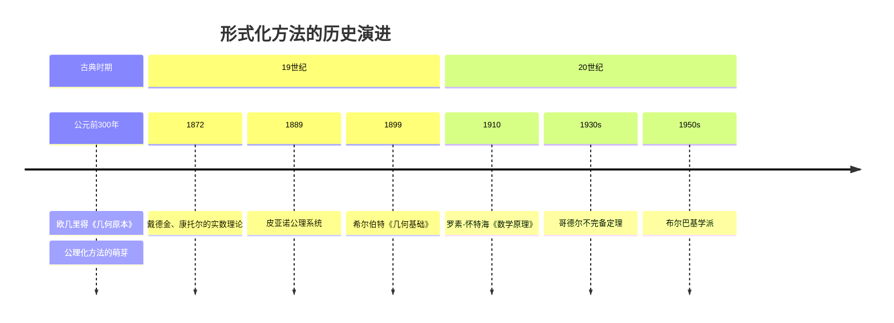
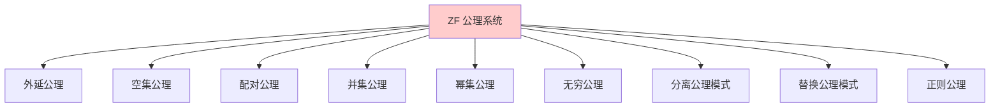
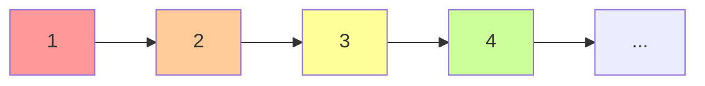
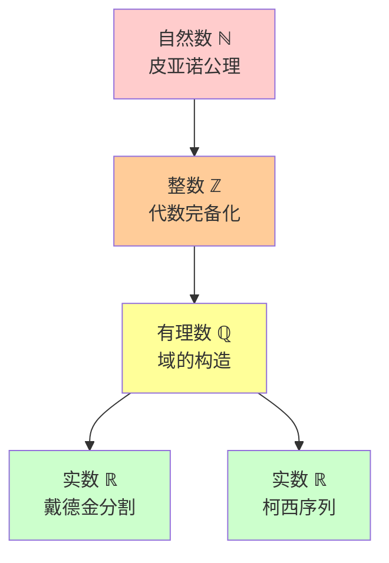
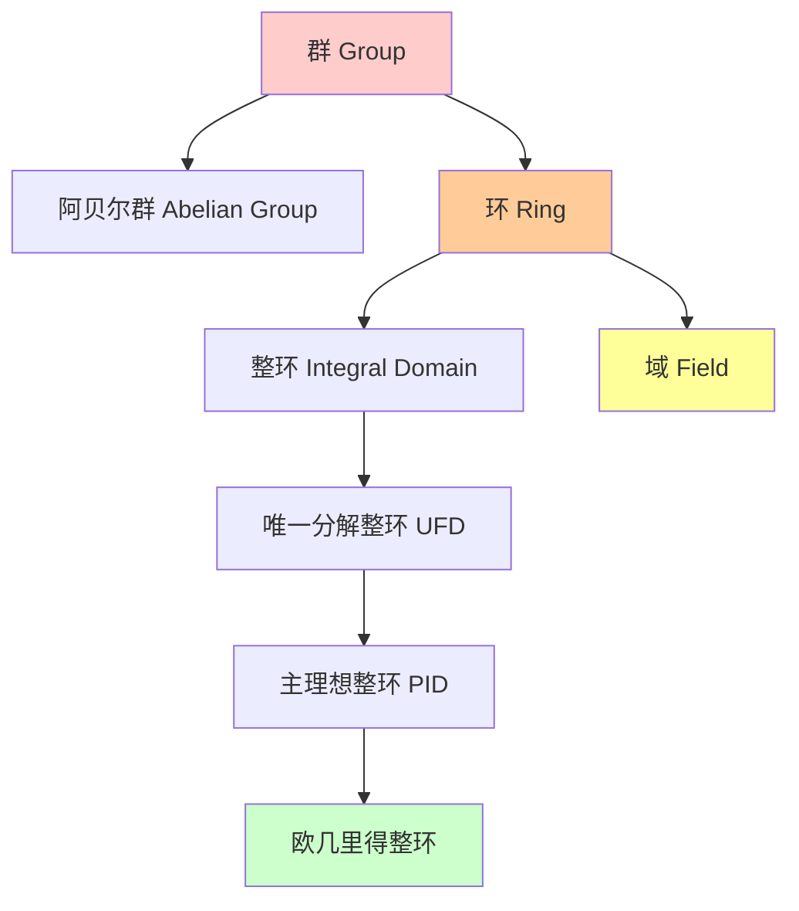
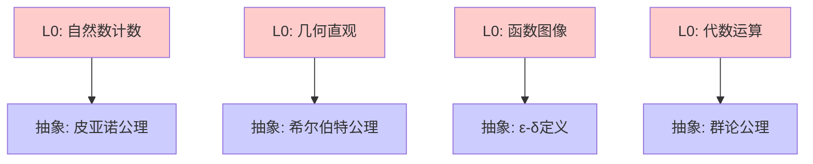
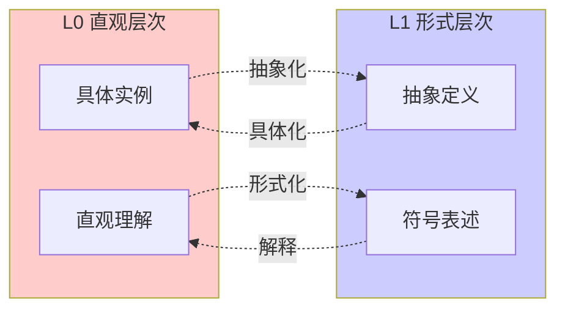
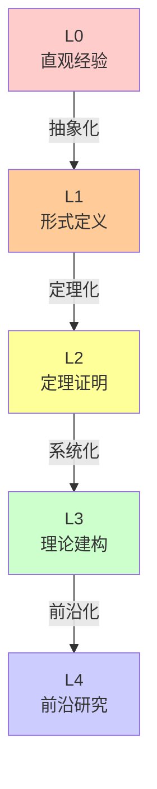
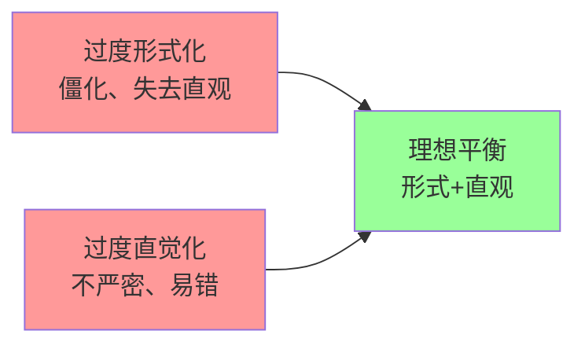

# L1 形式化定义层次 (L1-Formal)

## 概述

**L1-Formal** 是数学知识层次体系的第二个层级，标志着从直觉经验向严格数学的飞跃。在这一层次，数学概念通过**公理化系统**、**严格定义**和**符号语言**得到精确表述，建立起现代数学的形式化基础。

---

## 一、定义与核心特征

### 1.1 定义

L1 形式化定义层次是指使用严格的数学语言（包括符号系统、公理、定义）来精确表述数学概念和结构的认知水平。这一层次的核心特征是**精确性**、**抽象性**和**系统性**。

数学形式化的本质在于：

- **去直觉化**：摆脱对具体实例的依赖
- **符号化**：使用精确的数学语言表达
- **公理化**：从基本假设出发构建理论
- **系统化**：建立概念之间的逻辑关联

### 1.2 核心特征详解

#### 1.2.1 公理化方法

公理化是 L1 层次的标志性方法。一个公理系统包含：



**公理系统的性质**：

- **相容性**：公理之间无矛盾
- **独立性**：公理之间互不蕴含
- **完备性**：能够判定所有命题的真假

#### 1.2.2 严格定义

L1 层次的定义遵循严格的逻辑规范：

**定义的结构**：

```

被定义项 := 邻近的属 + 种差

```

**示例**：群的定义
> 群是一个集合 G 配上一个二元运算 ·，满足：
>
> 1. 结合律：∀a,b,c∈G, (a·b)·c = a·(b·c)
> 2. 单位元：∃e∈G, ∀a∈G, e·a = a·e = a
> 3. 逆元：∀a∈G, ∃a⁻¹∈G, a·a⁻¹ = a⁻¹·a = e

#### 1.2.3 符号系统

L1 层次建立了精确的符号语言：

| 符号类型 | 示例 | 含义 |
|---------|-----|------|
| 逻辑符号 | ∀, ∃, ∧, ∨, ¬, →, ↔ | 量词和逻辑联结词 |
| 集合符号 | ∈, ⊆, ∪, ∩, ∅ | 集合关系与运算 |
| 运算符号 | +, ×, ∘, · | 代数运算 |
| 关系符号 | =, <, ≤, ∼, ≅ | 各种等价和序关系 |

---

## 二、形式化的历史发展

### 2.1 从欧几里得到希尔伯特



### 2.2 关键里程碑

#### 2.2.1 欧几里得的贡献

- 《几何原本》建立了第一个公理系统
- 采用"定义-公设-公理-命题"的结构
- 影响数学发展两千余年

#### 2.2.2 希尔伯特的形式化

- 明确区分了直观与形式
- 建立了完整的几何公理系统
- 提出形式系统的元数学研究

#### 2.2.3 布尔巴基的结构主义

- 强调数学结构的核心地位
- 从集合论出发构建整个数学
- 编写《数学原本》系列著作

---

## 三、核心领域的形式化

### 3.1 集合论基础

#### 3.1.1 ZF 公理系统



#### 3.1.2 基本定义

**定义（集合的相等）**：

```

A = B ⟺ ∀x (x ∈ A ⟺ x ∈ B)

```

**定义（子集）**：

```

A ⊆ B ⟺ ∀x (x ∈ A → x ∈ B)

```

**定义（幂集）**：

```

𝒫(A) = {B | B ⊆ A}

```

### 3.2 数系的建构

#### 3.2.1 自然数的形式化

**皮亚诺公理**：

1. 1 是自然数
2. 每个自然数有唯一的后继
3. 1 不是任何自然数的后继
4. 不同的自然数有不同的后继
5. 归纳原理



#### 3.2.2 从自然数到实数



### 3.3 代数结构的形式化

#### 3.3.1 群的公理化

**定义（群）**：群 (G, ·) 是一个集合 G 配上二元运算 ·: G × G → G，满足：

| 公理 | 形式化表述 | 含义 |
|-----|-----------|------|
| 结合律 | ∀a,b,c ∈ G: (a·b)·c = a·(b·c) | 运算顺序不影响结果 |
| 单位元 | ∃e ∈ G, ∀a ∈ G: e·a = a·e = a | 存在中性元素 |
| 逆元 | ∀a ∈ G, ∃a⁻¹ ∈ G: a·a⁻¹ = a⁻¹·a = e | 每个元素可逆 |

#### 3.3.2 代数结构的层次



### 3.4 拓扑空间的形式化

#### 3.4.1 定义

**定义（拓扑空间）**：拓扑空间是二元组 (X, τ)，其中：

- X 是集合
- τ ⊆ 𝒫(X) 满足：
  1. ∅, X ∈ τ
  2. τ 对任意并封闭
  3. τ 对有限交封闭

#### 3.4.2 拓扑概念的形式化

| 概念 | 定义 |
|-----|------|
| 开集 | U ∈ τ |
| 闭集 | X \\ U ∈ τ |
| 邻域 | N 是 x 的邻域若 ∃U ∈ τ, x ∈ U ⊆ N |
| 连续性 | f: X → Y 连续若 ∀V ∈ τᵧ, f⁻¹(V) ∈ τₓ |

### 3.5 分析学的基础

#### 3.5.1 极限的形式化

**定义（序列极限）**：

```

lim(n→∞) aₙ = L ⟺ ∀ε > 0, ∃N ∈ ℕ, ∀n > N: |aₙ - L| < ε

```

**ε-δ 定义的结构分析**：

```mermaid
graph LR
    A[∀ε>0] --> B[∃N∈ℕ]
    B --> C[∀n>N]
    C --> D[|aₙ-L|<ε]

    style A fill:#ff9999
    style B fill:#ffcc99
    style C fill:#ffff99
    style D fill:#ccffcc

```

#### 3.5.2 连续性的 ε-δ 定义

**定义**：函数 f 在 x₀ 连续

```

∀ε > 0, ∃δ > 0, ∀x: |x - x₀| < δ ⇒ |f(x) - f(x₀)| < ε

```

---

## 四、形式化方法的技术细节

### 4.1 逻辑基础

#### 4.1.1 一阶逻辑

**语法要素**：

- **项**：变量、常数、函数作用
- **公式**：原子公式、逻辑联结、量词
- **证明**：公理 + 推理规则

#### 4.1.2 推理规则

| 规则 | 名称 | 形式 |
|-----|------|------|
| MP | 假言推理 | A, A → B ⊢ B |
| ∀+ | 全称引入 | 若 Γ ⊢ A(x)，则 Γ ⊢ ∀x A(x) |
| ∃- | 存在消去 | A(c) ⊢ B，则 ∃x A(x) ⊢ B |

### 4.2 证明方法

#### 4.2.1 直接证明

从已知条件出发，通过逻辑推理到达结论。

**示例**：证明两个偶数的和是偶数

```

设 a, b 是偶数，则 ∃m,n∈ℤ: a=2m, b=2n
因此 a+b = 2m + 2n = 2(m+n)
所以 a+b 是偶数

```

#### 4.2.2 反证法

假设结论不成立，推出矛盾。

**示例**：证明 √2 是无理数

```

假设 √2 = p/q（既约分数）
则 2 = p²/q²，即 p² = 2q²
所以 p² 是偶数，p 是偶数
设 p = 2k，则 4k² = 2q²，即 q² = 2k²
所以 q 也是偶数，与既约矛盾

```

#### 4.2.3 数学归纳法

```mermaid
graph TD
    A[归纳基础<br/>P成立] --> B[归纳假设<br/>假设P成立]
    B --> C[归纳步骤<br/>证明P→P']    C --> D[结论<br/>∀n,P成立]

    style A fill:#ccffcc
    style C fill:#ccffcc
    style D fill:#ffcccc

```

### 4.3 形式化定义的类型

#### 4.3.1 构造性定义

通过构造过程定义对象。

**示例**：有序对的定义（Kuratowski）

```

(a, b) := {{a}, {a, b}}

```

#### 4.3.2 公理化定义

通过公理系统刻画对象的性质。

**示例**：向量空间的公理化定义

#### 4.3.3 递归定义

通过递归方式定义无穷对象。

**示例**：阶乘的递归定义

```

0! = 1,  (n+1)! = (n+1) · n!

```

---

## 五、L1 层次的学习路径

### 5.1 从 L0 到 L1 的过渡



### 5.2 核心能力培养

| 能力 | 培养方法 | 评估标准 |
|-----|---------|---------|
| 符号运用 | 大量练习 | 能准确读写数学符号 |
| 逻辑推理 | 证明训练 | 能完成简单证明 |
| 定义理解 | 对比分析 | 能准确复述和运用定义 |
| 公理思维 | 结构分析 | 能识别公理系统结构 |

### 5.3 常见困难与对策

| 困难 | 原因 | 对策 |
|-----|------|------|
| 符号恐惧 | 符号过于抽象 | 从具体例子出发 |
| 逻辑混乱 | 推理链条过长 | 分步练习 |
| 定义混淆 | 概念边界不清 | 对比分析 |
| 证明无从下手 | 缺乏策略 | 学习典型证明模式 |

---

## 六、L1 层次与其他层次的关系

### 6.1 与 L0 的关系



### 6.2 与 L2 的关系

L1 提供**定义和公理**，L2 在此基础上进行**定理证明**。

**递进关系**：

- L1：建立概念的"是什么"
- L2：探索概念的"推出什么"

### 6.3 层次递进图



---

## 七、L1 层次的判断标准

### 7.1 内容判断标准

| 维度 | L1 标准 | 反例（L0） |
|-----|--------|-----------|
| **语言** | 精确的数学符号 | 日常语言描述 |
| **定义** | 公理化、构造性 | 描述性、举例式 |
| **证明** | 逻辑严密的推导 | 直观验证 |
| **结构** | 清晰的公理系统 | 松散的实例集合 |

### 7.2 学习者能力评估

**已具备 L1 能力的表现**：

- 能准确理解和运用数学符号
- 能复述和解释形式化定义
- 能完成简单的直接证明
- 能识别数学命题的逻辑结构

**尚未达到 L1 的表现**：

- 依赖具体数值进行思考
- 无法理解量词（∀, ∃）的含义
- 混淆必要条件和充分条件
- 无法区分定义和定理

### 7.3 文档标注规范

```markdown
---
level: L1-Formal
domain: [领域名称]
prerequisites: [L0相关概念]
next_level: L2-Theorem
tags: ["形式化", "公理", "定义"]
axiom_system: [公理系统名称]
---

```

---

## 八、形式化的局限性

### 8.1 哥德尔不完备定理

**第一不完备定理**：任何足够强的一致公理系统，都存在不可判定的命题。

**意义**：形式化方法存在内在的局限性，无法通过公理化解决所有数学问题。

### 8.2 形式化与直觉的平衡



---

## 九、实践应用

### 9.1 形式化验证

在现代计算机科学中，L1 层次的形式化方法应用于：

- **程序验证**：证明程序正确性
- **硬件设计**：验证电路设计
- **密码学**：证明协议安全

### 9.2 形式化数学项目

- **Mizar 项目**：使用形式化语言构建数学知识库
- **Coq 证明助手**：交互式定理证明
- **Lean 数学库**：现代形式化数学平台

---

## 十、总结

L1 形式化定义层次是现代数学的**基石**，它通过公理化、符号化和严格定义，将数学从直觉经验提升为精确的科学体系。

**核心要点**：

1. **公理化**是 L1 的核心方法
2. **严格定义**确保概念的精确性
3. **符号系统**实现无歧义的交流
4. **逻辑推理**是证明的基础

正如希尔伯特所言："没有人能把我们从康托尔创造的天堂中驱逐出去。"形式化方法为数学提供了坚实的天堂基石。

---

## 参考文献

1. Hilbert, D. (1899). Grundlagen der Geometrie.
2. Peano, G. (1889). Arithmetices principia, nova methodo exposita.
3. Bourbaki, N. (1968). Elements of Mathematics.
4. Mendelson, E. (2015). Introduction to Mathematical Logic.
5. 张奠宙. (2016). 数学教育概论.

---

*文档版本：1.0*
*创建日期：2026年4月*
*层次级别：L1-Formal*
