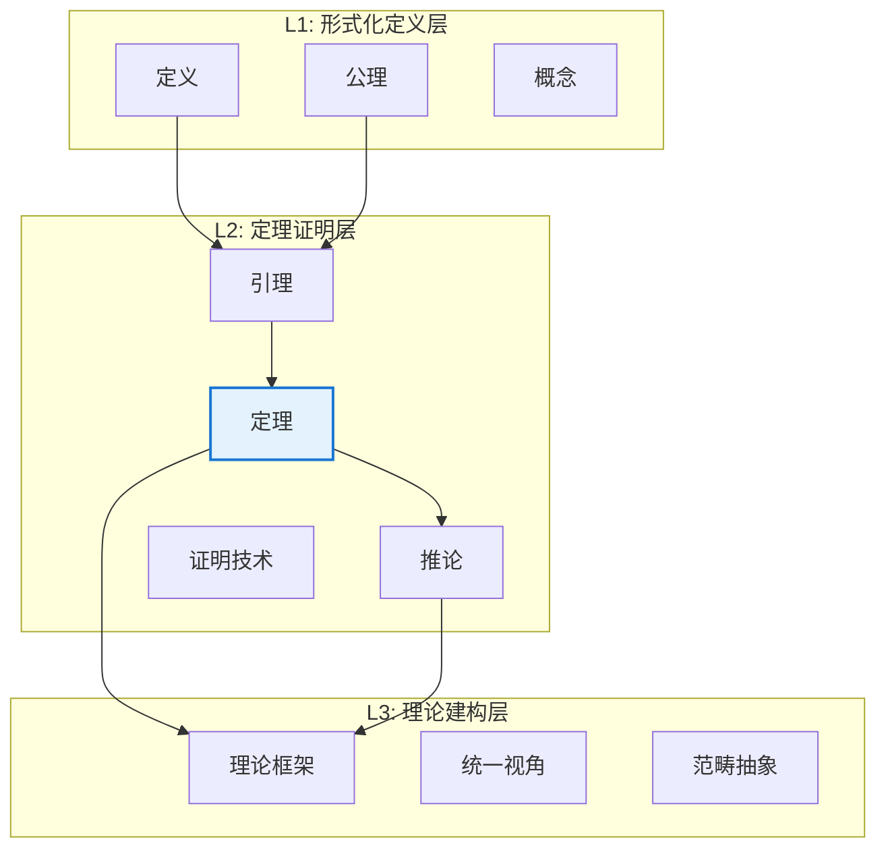
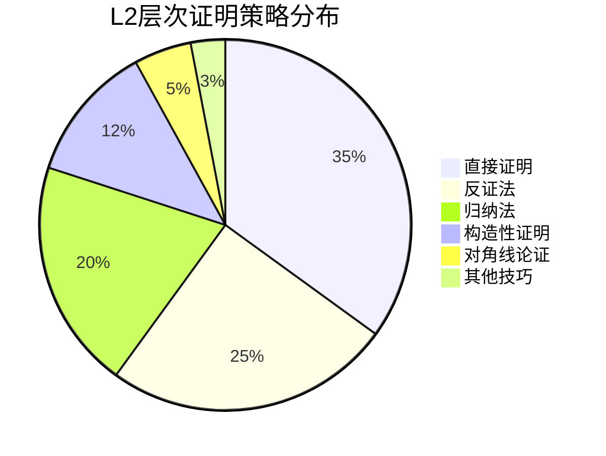
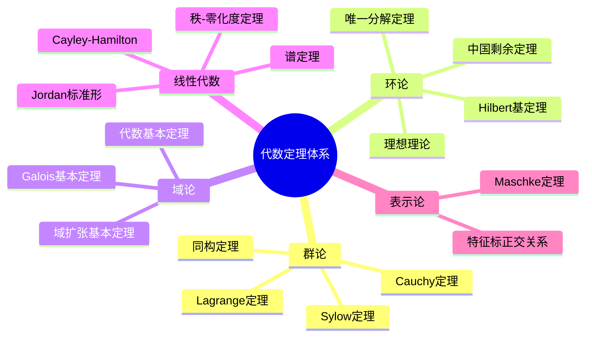
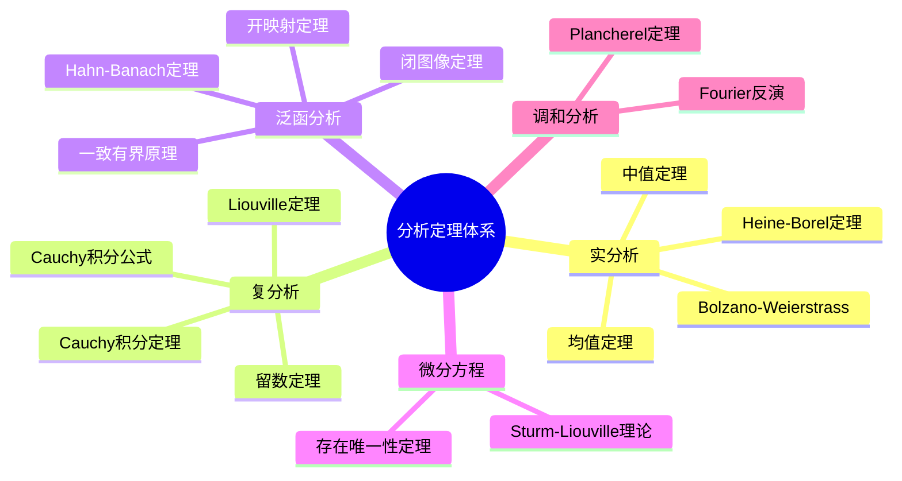
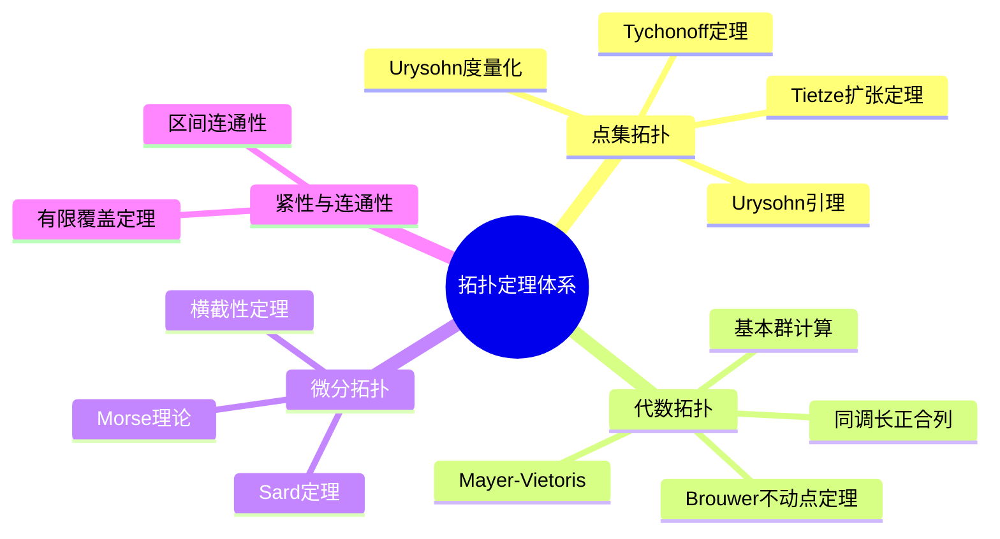
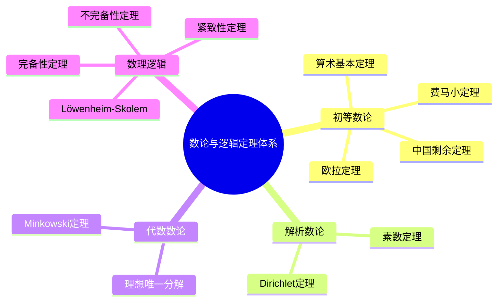
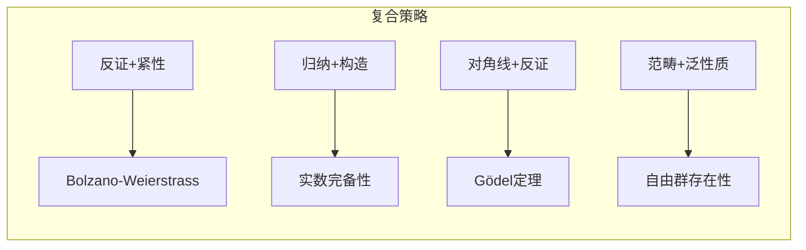
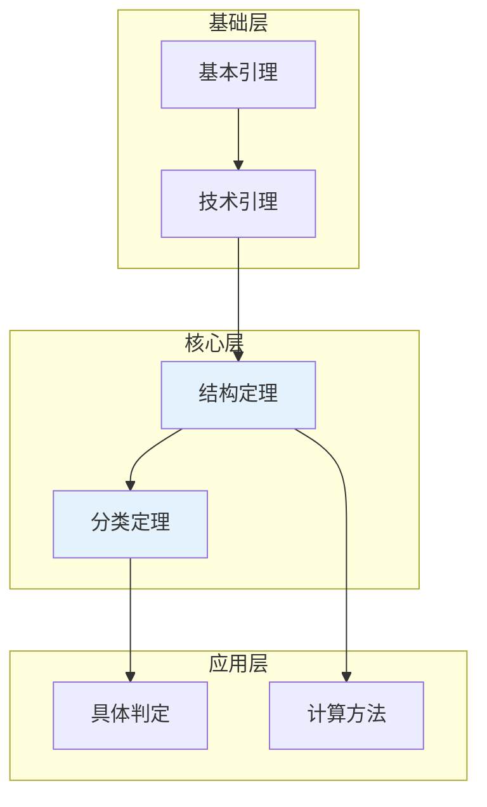
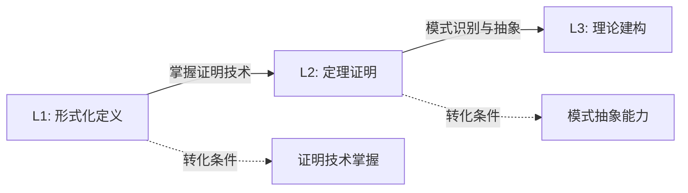
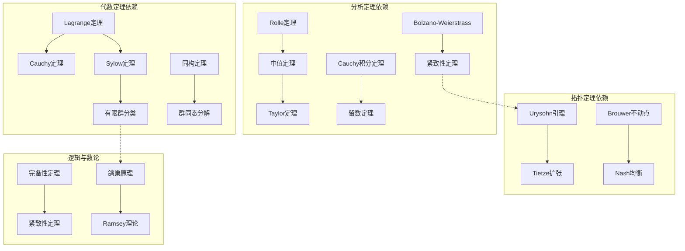

# L2 层次：定理证明层（L2-Theorem Level）

**文档编号**: FM.L2.OVERVIEW
**创建日期**: 2026年4月3日
**版本**: 1.0
**状态**: 第十批推进任务A3

---

## 📋 目录

- L2 层次：定理证明层
  - 1. 层次定义
  - 2. 定理统计总览
  - 3. 分支结构
  - 4. 证明策略分类体系
  - 5. 依赖关系框架
  - 6. L1→L2→L3转化路径
  - 7. 定理文档规范

---

## 一、层次定义

### 1.1 核心定义

**L2层次（定理证明层次）** 是FormalMath五层知识体系的第三层，基于L1层次的形式化定义，通过严格的数学证明建立定理网络，揭示数学概念间的深层逻辑关系。

> **本质**: L2层次构建数学知识的"骨架"，是数学从定义走向推理的关键跃迁。

### 1.2 层次特征

| 特征维度 | L2层次表现 |
|---------|-----------|
| **认知焦点** | 定理陈述与证明构造 |
| **核心活动** | 逻辑推理、证明技巧应用 |
| **成果形式** | 定理-引理-推论体系 |
| **严格性要求** | 每一步都有逻辑依据，可形式化验证 |
| **典型思维** | "证明如下..."、"由定理X可得..." |

### 1.3 与相邻层次的关系



---

## 二、定理统计总览

### 2.1 总体统计

| 数学分支 | 核心定理数 | 引理/技术结果 | 总计 |
|---------|-----------|--------------|------|
| **代数** | 60 | 120+ | 180+ |
| **分析** | 60 | 100+ | 160+ |
| **拓扑** | 40 | 80+ | 120+ |
| **数论与逻辑** | 40 | 60+ | 100+ |
| **总计** | **200** | **360+** | **560+** |

### 2.2 证明策略分布



### 2.3 难度分级

| 难度等级 | 描述 | 数量 | 示例 |
|---------|------|------|------|
| ⭐⭐⭐⭐⭐ | 里程碑式定理 | 20 | Fermat大定理、Gödel不完备性 |
| ⭐⭐⭐⭐☆ | 核心结构定理 | 60 | Lagrange定理、中值定理 |
| ⭐⭐⭐☆☆ | 重要技术定理 | 80 | Cauchy定理、Rolle定理 |
| ⭐⭐☆☆☆ | 基础工具定理 | 40 | 鸽巢原理、介值定理 |

---

## 三、分支结构

### 3.1 代数分支（60个核心定理）



**文档位置**: [代数/](./代数/)

### 3.2 分析分支（60个核心定理）



**文档位置**: [分析/](./分析/)

### 3.3 拓扑分支（40个核心定理）



**文档位置**: [拓扑/](./拓扑/)

### 3.4 数论与逻辑分支（40个核心定理）



**文档位置**: [数论与逻辑/](./数论与逻辑/)

---

## 四、证明策略分类体系

### 4.1 按逻辑结构分类

| 策略类别 | 代码 | 适用场景 | 代表定理 |
|---------|------|---------|---------|
| **直接证明** | DIR | 演绎推理链条清晰 | 群同态基本性质 |
| **反证法** | CON | 否定结论导出矛盾 | √2无理数证明 |
| **数学归纳法** | IND | 自然数/结构递归 | 二项式定理 |
| **构造性证明** | CST | 存在性命题 | 超越数构造 |
| **对角线论证** | DIA | 不可数性/不完备性 | Cantor定理 |
| **紧性论证** | CPT | 无穷→有穷转化 | Heine-Borel |
| **范畴论证** | CAT | 泛性质应用 | 万有对象存在性 |

### 4.2 策略组合示例



---

## 五、依赖关系框架

### 5.1 层次内依赖（L2内部）



### 5.2 跨层次依赖

| 依赖方向 | 关系描述 | 示例 |
|---------|---------|------|
| L1 → L2 | 定义支撑定理 | 群定义 → Lagrange定理 |
| L2 → L2 | 定理间依赖 | Rolle定理 → 中值定理 |
| L2 → L3 | 定理构成理论 | Sylow定理 → 有限群分类 |

---

## 六、L1→L2→L3转化路径

### 6.1 转化条件



### 6.2 典型转化路径示例

**示例：群的Lagrange定理**

```

L1层次（形式化定义）:
├── 群的公理化定义
├── 子群的判定条件
└── 陪集的定义
         ↓ 证明构造
L2层次（定理证明）:
├── Lagrange定理: |H| 整除 |G|

├── 证明关键：陪集划分 + 等势论证
└── 推论：Cauchy定理、Sylow定理基础
         ↓ 理论提升
L3层次（理论建构）:
├── 群作用与轨道-稳定子定理
├── 群扩张理论
└── 有限群分类纲领

```

---

## 七、定理文档规范

### 7.1 文档模板

每个L2定理文档必须包含以下部分：

```markdown
# 定理名称

**MSC分类**: XX-XX
**难度等级**: ⭐⭐⭐☆☆
**证明策略**: [DIR/CON/IND/CST/...]

## 定理陈述

[严格的数学陈述]

## 证明概要

### 关键步骤
1. [步骤1]
2. [步骤2]
...

### 证明策略分析
[使用的证明技巧说明]

## 依赖关系

### 依赖的L1定义
- [定义1]
- [定义2]

### 依赖的L2定理（先修）
- [定理1]
- [定理2]

### 支撑的L3理论
- [理论1]

## 推论与应用

## 历史与意义

```

### 7.2 文档列表

#### 代数分支

| 序号 | 定理名称 | 文档 | 难度 |
|-----|---------|------|------|
| A01 | Lagrange定理 | [01-Lagrange定理.md](./代数/01-Lagrange定理.md) | ⭐⭐⭐☆☆ |
| A02 | Sylow定理 | [02-Sylow定理.md](./代数/02-Sylow定理.md) | ⭐⭐⭐⭐☆ |
| A03 | 同构基本定理 | [03-同构基本定理.md](./代数/03-同构基本定理.md) | ⭐⭐⭐☆☆ |
| A04 | 唯一分解定理 | [04-唯一分解定理.md](./代数/04-唯一分解定理.md) | ⭐⭐⭐☆☆ |
| A05 | 中国剩余定理 | [05-中国剩余定理.md](./代数/05-中国剩余定理.md) | ⭐⭐☆☆☆ |
| A06 | Hilbert基定理 | [06-Hilbert基定理.md](./代数/06-Hilbert基定理.md) | ⭐⭐⭐⭐☆ |
| A07 | 域扩张基本定理 | [07-域扩张基本定理.md](./代数/07-域扩张基本定理.md) | ⭐⭐⭐⭐☆ |
| A08 | Galois基本定理 | [08-Galois基本定理.md](./代数/08-Galois基本定理.md) | ⭐⭐⭐⭐⭐ |
| ... | ... | ... | ... |

#### 分析分支

| 序号 | 定理名称 | 文档 | 难度 |
|-----|---------|------|------|
| AN01 | 中值定理 | [01-中值定理.md](./分析/01-中值定理.md) | ⭐⭐☆☆☆ |
| AN02 | 均值定理 | [02-均值定理.md](./分析/02-均值定理.md) | ⭐⭐☆☆☆ |
| AN03 | Heine-Borel定理 | [03-Heine-Borel定理.md](./分析/03-Heine-Borel定理.md) | ⭐⭐⭐☆☆ |
| AN04 | Bolzano-Weierstrass定理 | [04-Bolzano-Weierstrass定理.md](./分析/04-Bolzano-Weierstrass定理.md) | ⭐⭐⭐☆☆ |
| AN05 | 隐函数定理 | [05-隐函数定理.md](./分析/05-隐函数定理.md) | ⭐⭐⭐⭐☆ |
| AN06 | 逆函数定理 | [06-逆函数定理.md](./分析/06-逆函数定理.md) | ⭐⭐⭐⭐☆ |
| AN07 | Green定理 | [07-Green定理.md](./分析/07-Green定理.md) | ⭐⭐⭐☆☆ |
| AN08 | Stokes定理 | [08-Stokes定理.md](./分析/08-Stokes定理.md) | ⭐⭐⭐⭐☆ |
| ... | ... | ... | ... |

#### 拓扑分支

| 序号 | 定理名称 | 文档 | 难度 |
|-----|---------|------|------|
| T01 | Urysohn引理 | [01-Urysohn引理.md](./拓扑/01-Urysohn引理.md) | ⭐⭐⭐⭐☆ |
| T02 | Tietze扩张定理 | [02-Tietze扩张定理.md](./拓扑/02-Tietze扩张定理.md) | ⭐⭐⭐⭐☆ |
| T03 | Brouwer不动点定理 | [03-Brouwer不动点定理.md](./拓扑/03-Brouwer不动点定理.md) | ⭐⭐⭐⭐☆ |
| T04 | Tychonoff定理 | [04-Tychonoff定理.md](./拓扑/04-Tychonoff定理.md) | ⭐⭐⭐⭐⭐ |
| ... | ... | ... | ... |

#### 数论与逻辑分支

| 序号 | 定理名称 | 文档 | 难度 |
|-----|---------|------|------|
| NL01 | 算术基本定理 | [01-算术基本定理.md](./数论与逻辑/01-算术基本定理.md) | ⭐⭐☆☆☆ |
| NL02 | 费马小定理 | [02-费马小定理.md](./数论与逻辑/02-费马小定理.md) | ⭐⭐☆☆☆ |
| NL03 | 素数定理 | [03-素数定理.md](./数论与逻辑/03-素数定理.md) | ⭐⭐⭐⭐⭐ |
| NL04 | 完备性定理 | [04-完备性定理.md](./数论与逻辑/04-完备性定理.md) | ⭐⭐⭐⭐☆ |
| NL05 | 不完备性定理 | [05-不完备性定理.md](./数论与逻辑/05-不完备性定理.md) | ⭐⭐⭐⭐⭐ |
| ... | ... | ... | ... |

---

## 附录：定理依赖关系总图



---

**文档信息**

- **创建日期**: 2026年4月3日
- **最后更新**: 2026年4月3日
- **文档状态**: 第十批推进任务A3
- **维护责任**: FormalMath项目团队
