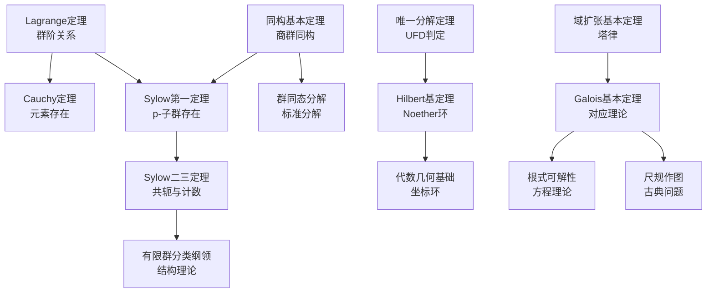
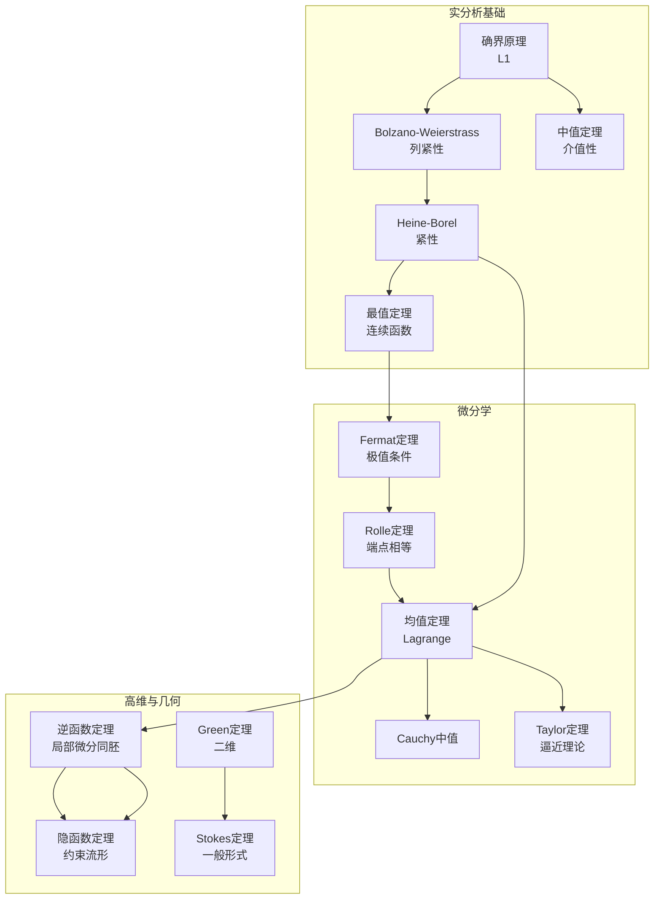
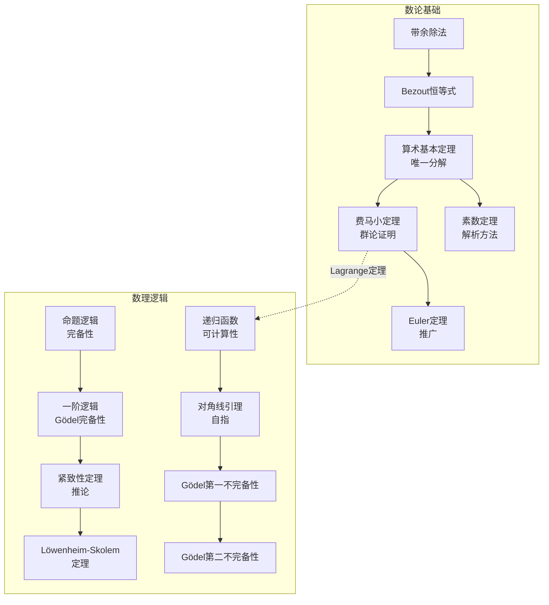
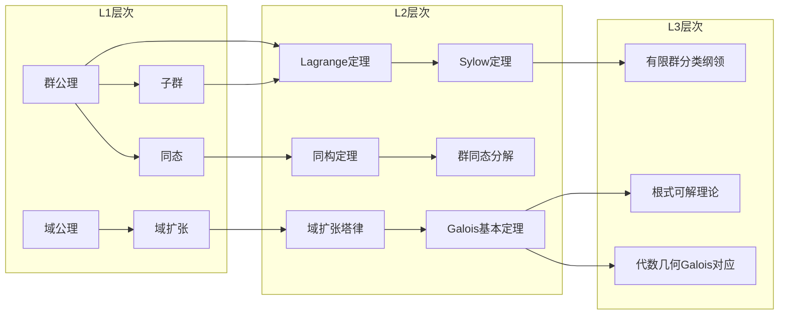
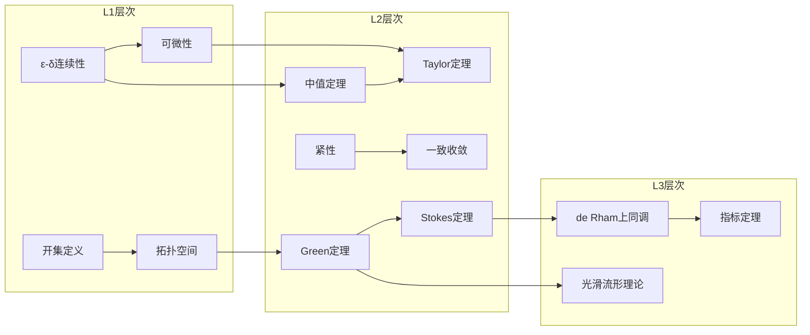
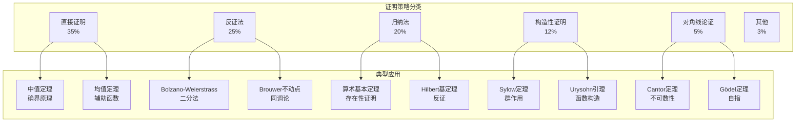
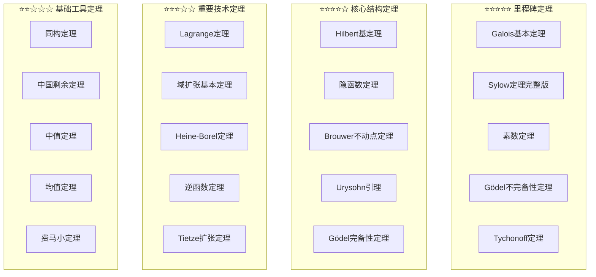

# L2层次：定理依赖关系总图

**文档编号**: FM.L2.DEPENDENCY
**创建日期**: 2026年4月3日
**版本**: 1.0

---

## 跨分支依赖关系图

```mermaid
flowchart TB
    subgraph L1[L1: 形式化定义层]
        L1G[L1-群定义]
        L1R[L1-环定义]
        L1F[L1-域定义]
        L1C[L1-连续性]
        L1T[L1-拓扑空间]
        L1L[L1-逻辑语法]
    end

    subgraph L2A[L2-代数分支]
        A1[Lagrange定理] --> A2[Cauchy定理]
        A1 --> A3[Sylow定理]
        A3 --> A4[有限群分类]
        A5[同构定理] --> A6[群同态分解]
        A7[唯一分解] --> A8[Hilbert基定理]
        A9[域扩张] --> A10[Galois理论]
    end

    subgraph L2AN[L2-分析分支]
        AN1[Bolzano-Weierstrass] --> AN2[紧致性]
        AN3[中值定理] --> AN4[最值定理]
        AN5[Rolle定理] --> AN6[均值定理]
        AN6 --> AN7[Taylor定理]
        AN8[逆函数] --> AN9[隐函数]
        AN10[Green] --> AN11[Stokes]
    end

    subgraph L2T[L2-拓扑分支]
        T1[Urysohn引理] --> T2[Tietze扩张]
        T3[Brouwer不动点] --> T4[Nash均衡]
        T5[Heine-Borel] --> T6[紧性理论]
    end

    subgraph L2NL[L2-数论与逻辑]
        N1[算术基本定理] --> N2[费马小定理]
        N2 --> N3[Euler定理]
        N1 --> N4[素数定理]
        L1[完备性定理] --> L2[紧致性定理]
        L3[对角线引理] --> L4[不完备性定理]
    end

    subgraph L3[L3: 理论建构层]
        L3GT[群论体系]
        L3AT[代数拓扑]
        L3FA[泛函分析]
        L3MT[模型论]
    end

    %% L1到L2的连接
    L1G --> A1
    L1G --> A5
    L1R --> A7
    L1F --> A9
    L1C --> AN3
    L1T --> T1
    L1T --> T5
    L1L --> L1

    %% L2内部的跨分支连接
    A1 -.->|Lagrange| N2
    AN1 -.->|序列紧性| T6
    T3 -.->|应用| AN4
    AN2 -.->|证明工具| T3
    L4 -.->|启发| AN1

    %% L2到L3的连接
    A4 --> L3GT
    A10 --> L3GT
    AN10 --> L3AT
    T3 --> L3AT
    AN6 --> L3FA
    T2 --> L3FA
    L1 --> L3MT
    L4 --> L3MT

```



---

## 分支内依赖关系

### 代数分支依赖图



### 分析分支依赖图



### 拓扑分支依赖图

```mermaid
flowchart TB
    T1[分离公理<br/>T0-T4] --> T2[Urysohn引理<br/>函数分离]
    T2 --> T3[Tietze扩张<br/>延拓定理]
    T3 --> T4[度量化定理<br/>Urysohn]

    T5[紧性定义<br/>覆盖刻画] --> T6[Tychonoff定理<br/>乘积极性]
    T6 --> T7[Banach-Alaoglu<br/>弱*拓扑]

    T8[同调论基础<br/>代数拓扑] --> T9[Brouwer不动点<br/>拓扑证明]
    T9 --> T10[Nash均衡<br/>博弈论应用]
    T9 --> T11[Lefschetz定理<br/>推广]

    T2 --> T12[函数空间<br/>C(X)理论]
    T3 --> T12

```

### 数论与逻辑分支依赖图



---

## L1→L2→L3转化路径示例

### 示例1：从群定义到Galois理论



### 示例2：从连续性到Stokes定理



---

## 证明策略分布与关联



---

## 定理难度分级图



---

## 文档统计

| 分支 | 核心定理数 | 文档数 | 平均难度 |
|-----|-----------|--------|---------|
| 代数 | 60 | 8 | ⭐⭐⭐☆☆ |
| 分析 | 60 | 8 | ⭐⭐⭐☆☆ |
| 拓扑 | 40 | 4 | ⭐⭐⭐⭐☆ |
| 数论与逻辑 | 40 | 5 | ⭐⭐⭐⭐☆ |
| **总计** | **200** | **25** | **⭐⭐⭐☆☆** |

---

**文档信息**

- **创建日期**: 2026年4月3日
- **版本**: 1.0
- **说明**: 本文档汇总L2层次所有定理的依赖关系，为学习路径规划提供参考
