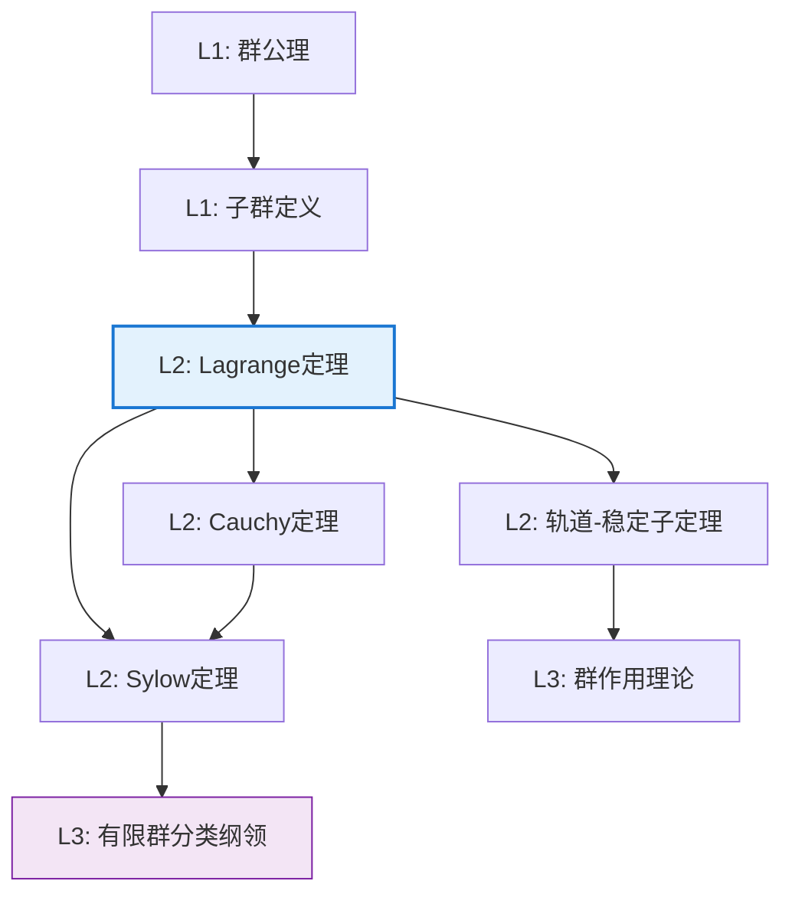

# Lagrange 定理

**定理编号**: L2-A001
**MSC分类**: 20D99 (群论中的结构及分类)
**难度等级**: ⭐⭐⭐☆☆
**证明策略**: DIR (直接证明) + 计数论证

---

## 定理陈述

**定理（Lagrange, 1771）**

设 $G$ 为有限群，$H \leq G$ 为 $G$ 的子群，则 $|H|$ 整除 $|G|$，且

$$|G| = [G:H] \cdot |H|$$

其中 $[G:H]$ 表示 $H$ 在 $G$ 中的指数（即不同左陪集的个数）。

---

## 证明概要

### 关键步骤

```mermaid
flowchart TD
    A[Step 1: 定义左陪集] --> B[Step 2: 证明陪集划分群G]
    B --> C[Step 3: 证明陪集等势]
    C --> D[Step 4: 计数论证]
    D --> E[结论: |G| = [G:H]·|H|]

    style E fill:#e8f5e9,stroke:#4caf50

```

#### 步骤1：定义左陪集

对任意 $a \in G$，定义 $a$ 关于 $H$ 的**左陪集**：
$$aH = \{ah \mid h \in H\}$$

#### 步骤2：陪集构成群的划分

**引理**：任意两个左陪集要么相等，要么不相交。

*证明*：设 $aH \cap bH \neq \emptyset$，则存在 $h_1, h_2 \in H$ 使得 $ah_1 = bh_2$。
于是 $a = bh_2h_1^{-1} \in bH$，因此 $aH \subseteq bH$。同理 $bH \subseteq aH$。

由此，所有不同左陪集的并等于 $G$。

#### 步骤3：所有陪集与H等势

**引理**：对任意 $a \in G$，映射 $\varphi: H \to aH$，$\varphi(h) = ah$ 是双射。

*证明*：

- **满射**：由 $aH$ 的定义直接可得
- **单射**：若 $ah_1 = ah_2$，由消去律得 $h_1 = h_2$

因此 $|aH| = |H|$ 对所有 $a \in G$ 成立。

#### 步骤4：计数论证

设 $G$ 关于 $H$ 的不同左陪集为 $a_1H, a_2H, \ldots, a_kH$，其中 $k = [G:H]$。

由于这些陪集两两不交且并集为 $G$：
$$|G| = |a_1H| + |a_2H| + \cdots + |a_kH| = k \cdot |H| = [G:H] \cdot |H|$$

因此 $|H|$ 整除 $|G|$。 $\square$

---

## 依赖关系

### 依赖的L1定义

| 定义 | 说明 | L1文档位置 |
|-----|------|-----------|
| **群** | 带有满足结合律、单位元、逆元二元运算的代数结构 | L1-代数-群定义 |
| **子群** | 群的非空子集，对运算封闭且构成群 | L1-代数-子群定义 |
| **陪集** | 子群的平移副本 | L1-代数-陪集定义 |
| **指数** | 不同陪集的个数 | L1-代数-指数定义 |

### 依赖的L2定理（先修）

- **消去律**：群中 $ab = ac$ 蕴含 $b = c$
- **陪集等价关系**：$a \sim b \Leftrightarrow a^{-1}b \in H$ 是等价关系

### 支撑的L3理论

| 理论 | 说明 |
|-----|------|
| **有限群分类理论** | Lagrange定理是有限群结构分析的起点 |
| **Sylow理论** | Sylow定理证明依赖于Lagrange定理的推论 |
| **群上同调** | 指数关系在群扩张中的应用 |

---

## 推论与应用

### 直接推论

1. **元素阶整除群阶**：若 $G$ 是有限群，$a \in G$，则 $|a|$ 整除 $|G|$。

2. **指数与阶的关系**：对任意 $a \in G$，有 $a^{|G|} = e$。

3. **素数阶群的结构**：若 $|G| = p$ 为素数，则 $G$ 是循环群。

### 重要应用

| 应用领域 | 具体应用 |
|---------|---------|
| 密码学 | RSA算法基于 $a^{\phi(n)} \equiv 1 \pmod{n}$ |
| 编码理论 | 纠错码的群结构分析 |
| 化学 | 分子对称群阶的计算 |

---

## 证明策略分析

### 策略：直接证明 + 计数论证

本定理的证明展示了**组合计数**与**代数结构**的深刻联系：

1. **代数结构**：利用群的运算性质（消去律）
2. **等价关系**：陪集划分来自群作用的自然等价
3. **计数原理**：等势集合的不交并的基数计算

### 证明技巧提炼

```

┌─────────────────────────────────────────┐
│  Lagrange定理证明的核心技巧：等价关系+计数  │
├─────────────────────────────────────────┤
│ 1. 定义自然的等价关系（陪集关系）          │
│ 2. 证明等价类等势（双射构造）              │
│ 3. 利用划分进行基数计算                   │
└─────────────────────────────────────────┘

```

这种技巧可推广到：

- 轨道-稳定子定理（群作用）
- 类方程（共轭类分解）
- 线性代数中的维数公式

---

## 历史与意义

### 历史背景

- **1771年**：Joseph-Louis Lagrange 在研究置换群时发现此定理
- **19世纪**：Cauchy 和 Cayley 将其推广到一般群论
- **现代**：成为有限群论的基石定理

### 数学意义

1. **结构性洞察**：揭示了子群与母群之间的数量关系
2. **分类工具**：为有限群分类提供了必要条件的检验
3. **方法论范式**：等价关系+计数论证的经典范例

---

## 相关定理网络



---

## 练习与思考

1. **证明**：若 $H, K \leq G$ 且 $HK$ 是子群，则 $|HK| = \frac{|H||K|}{|H \cap K|}$。

2. **思考**：Lagrange定理的逆命题是否成立？（即若 $n \mid |G|$，是否一定存在 $n$ 阶子群？）

3. **探索**：寻找Lagrange定理在向量空间维数公式中的类比。

---

**文档信息**

- **创建日期**: 2026年4月3日
- **版本**: 1.0
- **关联Lean4形式化**: `mathlib4/GroupTheory/Index.lean`
