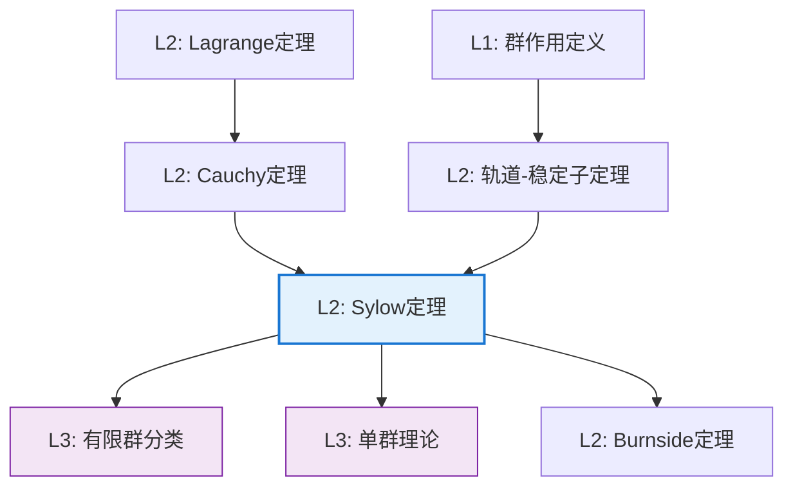

# Sylow 定理

**定理编号**: L2-A002
**MSC分类**: 20D20 (Sylow子群，Sylow性质，π群，π结构)
**难度等级**: ⭐⭐⭐⭐☆
**证明策略**: CST (构造性证明) + ACT (群作用论证)

---

## 定理陈述

设 $G$ 是有限群，$|G| = p^n \cdot m$，其中 $p$ 为素数，$p \nmid m$。

**Sylow第一定理（存在性）**

$G$ 中存在阶为 $p^n$ 的子群，称为 **Sylow $p$-子群**。

**Sylow第二定理（共轭性）**

$G$ 的所有Sylow $p$-子群彼此共轭。

**Sylow第三定理（计数）**

设 $n_p$ 为Sylow $p$-子群的个数，则：

- $n_p \equiv 1 \pmod{p}$
- $n_p \mid m$

---

## 证明概要

### 关键步骤（第一定理）

```mermaid
flowchart TD
    A[Step 1: 考虑集合Ω<br/>含p^n个元素的子集] --> B[Step 2: 定义群作用<br/>左乘作用]
    B --> C[Step 3: 计算|Ω|模p<br/>非p倍数]

    C --> D[Step 4: 存在轨道<br/>长度非p倍数]
    D --> E[Step 5: 稳定子即<br/>Sylow p-子群]

    style E fill:#e8f5e9,stroke:#4caf50

```

#### 步骤1-2：群作用构造

设 $\Omega = \{S \subseteq G \mid |S| = p^n\}$，即 $G$ 的所有 $p^n$ 元子集。

$G$ 在 $\Omega$ 上有自然的左乘作用：$g \cdot S = gS = \{gs \mid s \in S\}$

#### 步骤3：计算 $|\Omega|$ 模 $p$

$$|\Omega| = \binom{p^n m}{p^n}$$

**关键引理**：$\binom{p^n m}{p^n} \equiv m \pmod{p}$

*证明要点*：利用Lucas定理或直接计算 $p$ 在阶乘中的幂次。

由于 $p \nmid m$，故 $p \nmid |\Omega|$。

#### 步骤4：轨道分解分析

由轨道-稳定子定理，$|\Omega| = \sum_{\text{轨道}} |\text{轨道}|$

由于 $|\text{轨道}| = [G : G_S]$ 整除 $|G| = p^n m$，每个轨道长度形如 $p^k$（$0 \leq k \leq n$）。

因 $p \nmid |\Omega|$，必存在某个轨道长度 $p^0 = 1$。

#### 步骤5：稳定子即为Sylow $p$-子群

设 $S$ 所在的轨道长度为1，即 $gS = S$ 对所有 $g \in G_S$ 成立。

由此可证 $|G_S| = p^n$，即 $G_S$ 是Sylow $p$-子群。 $\square$

### 关键步骤（第二、三定理）

```mermaid
flowchart LR
    A[n_p计数] --> B[共轭作用]
    B --> C[计数论证]
    C --> D[n_p ≡ 1 mod p]
    C --> E[n_p | m]

```

#### 第二定理（共轭性）详细证明

**定理重述**: 设 $P$ 和 $Q$ 是 $G$ 的两个Sylow $p$-子群，则存在 $g \in G$ 使得 $Q = gPg^{-1}$。

**证明**:

**步骤1**: 考虑 $Q$ 在 $G/P$ 上的左乘作用。

$G/P$ 是 $P$ 在 $G$ 中的左陪集集合，$|G/P| = [G:P] = m$。

$Q$ 通过左乘作用在 $G/P$ 上：$q \cdot (gP) = (qg)P$。

**步骤2**: 应用轨道-稳定子定理分析轨道。

由轨道-稳定子定理：
$$|G/P| = \sum_{\text{轨道}} |\text{轨道}| = \sum_{\text{轨道}} [Q : Q_{gP}]$$

其中 $Q_{gP} = \{q \in Q : qgP = gP\}$ 是稳定子群。

**步骤3**: 利用 $p \nmid |G/P|$ 导出存在不动点。

由于 $|Q| = p^n$，每个轨道长度 $[Q : Q_{gP}]$ 是 $p$ 的幂（整除 $|Q|$）。

而 $|G/P| = m$，且 $p \nmid m$。

因此，在轨道分解中，必存在长度为 $p^0 = 1$ 的轨道。

**步骤4**: 分析不动点的含义。

设 $gP$ 是不动点，即 $qgP = gP$ 对所有 $q \in Q$ 成立。

这意味着 $g^{-1}qg \in P$ 对所有 $q \in Q$ 成立。

即 $g^{-1}Qg \subseteq P$。

**步骤5**: 由阶数相等导出共轭关系。

由于 $|Q| = |P| = p^n$，且 $g^{-1}Qg \subseteq P$，故 $g^{-1}Qg = P$。

因此 $Q = gPg^{-1}$，即 $Q$ 与 $P$ 共轭。 $\square$

#### 第三定理（计数）详细证明

**定理重述**: 设 $n_p$ 为Sylow $p$-子群的个数，则 $n_p \equiv 1 \pmod{p}$ 且 $n_p \mid m$。

**证明**:

**部分1: $n_p \mid m$**

**步骤1**: 考虑 $G$ 在Sylow $p$-子群集合 $X = \{P_1, P_2, \ldots, P_{n_p}\}$ 上的共轭作用。

由第二定理，这个作用是传递的（只有一个轨道）。

**步骤2**: 应用轨道-稳定子定理。

取固定的Sylow $p$-子群 $P \in X$，其稳定子为：
$$G_P = \{g \in G : gPg^{-1} = P\} = N_G(P)$$

即 $P$ 的正规化子。

由轨道-稳定子定理：
$$n_p = |X| = [G : N_G(P)] = \frac{|G|}{|N_G(P)|}$$

**步骤3**: 导出整除关系。

由于 $P \leq N_G(P)$，有 $|P| \mid |N_G(P)|$，即 $p^n \mid |N_G(P)|$。

因此：
$$n_p = \frac{|G|}{|N_G(P)|} = \frac{p^n \cdot m}{|N_G(P)|} = \frac{m}{|N_G(P)|/p^n}$$

这显示 $n_p \mid m$。

**部分2: $n_p \equiv 1 \pmod{p}$**

**步骤4**: 考虑 $P$ 在 $X$ 上的共轭作用（限制作用）。

$P$ 通过共轭作用在Sylow $p$-子群集合 $X$ 上。

**步骤5**: 分析 $P$ 的不动点。

$Q \in X$ 是 $P$ 的不动点当且仅当 $gQg^{-1} = Q$ 对所有 $g \in P$ 成立。

即 $P \leq N_G(Q)$。

**步骤6**: 利用Sylow子群的性质。

$P$ 和 $Q$ 都是 $N_G(Q)$ 的Sylow $p$-子群（因为 $|N_G(Q)|$ 中 $p$ 的最高幂次与 $|G|$ 相同）。

在 $N_G(Q)$ 中应用第二定理，$P$ 和 $Q$ 共轭。

但 $Q \lhd N_G(Q)$，故 $N_G(Q)$ 中只有一个Sylow $p$-子群。

因此 $P = Q$。

**结论**: $P$ 在 $X$ 上的作用只有一个不动点，即 $P$ 本身。

**步骤7**: 应用轨道-稳定子定理计数。

$X$ 在 $P$ 的作用下分解为轨道：
$$n_p = |X| = \sum_{\text{轨道}} |\text{轨道}|$$

每个轨道长度整除 $|P| = p^n$，故是 $p$ 的幂。

只有一个轨道长度为1（对应不动点 $P$），其余轨道长度都是 $p$ 的倍数。

因此：
$$n_p = 1 + \sum_{\text{非平凡轨道}} |\text{轨道}| \equiv 1 \pmod{p}$$ $\square$

---

## 依赖关系

### 依赖的L1定义

| 定义 | 说明 |
|-----|------|
| **p-群** | 阶为 $p$ 的幂的群 |
| **Sylow p-子群** | 极大p-子群（阶为 $p^n$，其中 $p^n \mid |G|$ 但 $p^{n+1} \nmid |G|$）|
| **群作用** | 群在集合上的同态 $G \to \text{Sym}(\Omega)$ |
| **轨道-稳定子** | 轨道长度 = 指数 $[G : G_x]$ |

### 依赖的L2定理（先修）

- **Lagrange定理**：$|G| = [G:H] \cdot |H|$
- **轨道-稳定子定理**：$|Gx| = [G : G_x]$
- **Cauchy定理**：若 $p \mid |G|$，则 $G$ 有 $p$ 阶元

### 支撑的L3理论

| 理论 | 应用 |
|-----|------|
| **有限单群分类** | Sylow定理是单群判定的基本工具 |
| **可解群理论** | Burnside $p^a q^b$ 定理的证明基础 |
| **表示论** | 模表示论中块理论的起点 |

---

## 推论与应用

### 重要推论

1. **Cauchy定理的强化**：Sylow第一定理直接蕴含Cauchy定理。

2. **正规Sylow子群判定**：
   - 若 $n_p = 1$，则唯一的Sylow $p$-子群正规
   - 若 $n_p = 1$，记 $P \lhd G$

3. **pq阶群结构**（$p < q$ 为素数）：
   - 若 $p \nmid (q-1)$，则 $pq$ 阶群循环
   - 若 $p \mid (q-1)$，则存在唯一的非交换群

### 典型应用：判定群的可解性

**定理（Burnside）**：$p^a q^b$ 阶群是可解群。

*证明要点*：利用Sylow定理分析正规化子的结构。

---

## 证明策略分析

### 策略：群作用 + 计数论证

Sylow定理的证明展示了**群作用**的强大威力：

```

┌─────────────────────────────────────────┐
│  Sylow定理证明的核心思想：                │
│  1. 在合适的集合上定义群作用              │
│  2. 利用数论条件分析轨道结构              │
│  3. 从轨道信息提取子群信息                │
└─────────────────────────────────────────┘

```

### 创新点

- **集合构造**：考虑所有 $p^n$ 元子集而非单元素子集
- **模 $p$ 论证**：在计数中利用同余条件
- **稳定子提取**：从轨道信息构造目标子群

---

## 历史与意义

### 历史背景

- **1872年**：Peter Ludwig Mejdell Sylow 发表三篇论文
- **来源**：受Cauchy和Galois工作启发
- **影响**：为有限群论建立了系统性工具

### 数学意义

1. **逆定理的突破**：Lagrange定理的逆命题在Sylow子群情形成立
2. **结构性结果**：提供了一类"极大"子群的存在性和共轭性
3. **计数信息**：$n_p$ 的限制为群结构分析提供强约束

---

## 相关定理网络



---

**文档信息**

- **创建日期**: 2026年4月3日
- **版本**: 1.0
- **关联Lean4形式化**: `mathlib4/GroupTheory/Sylow.lean`
