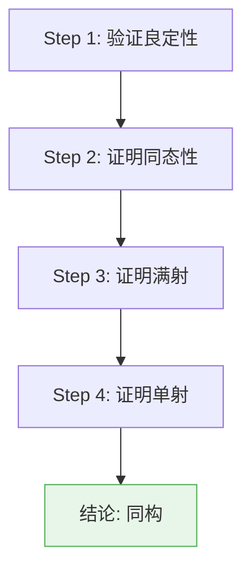
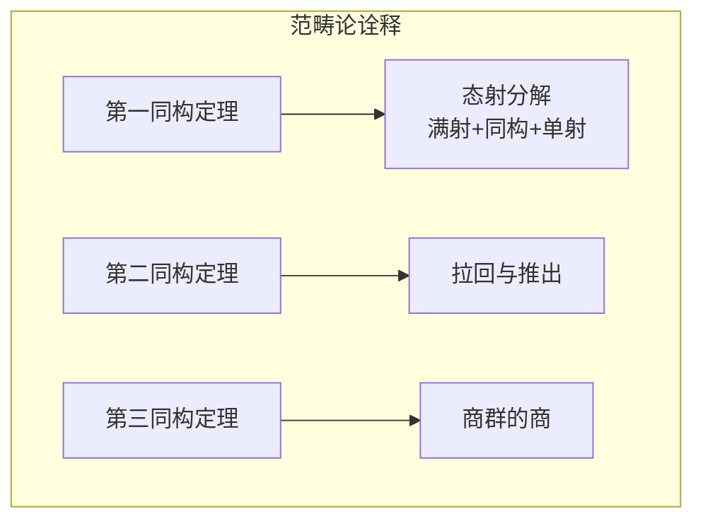
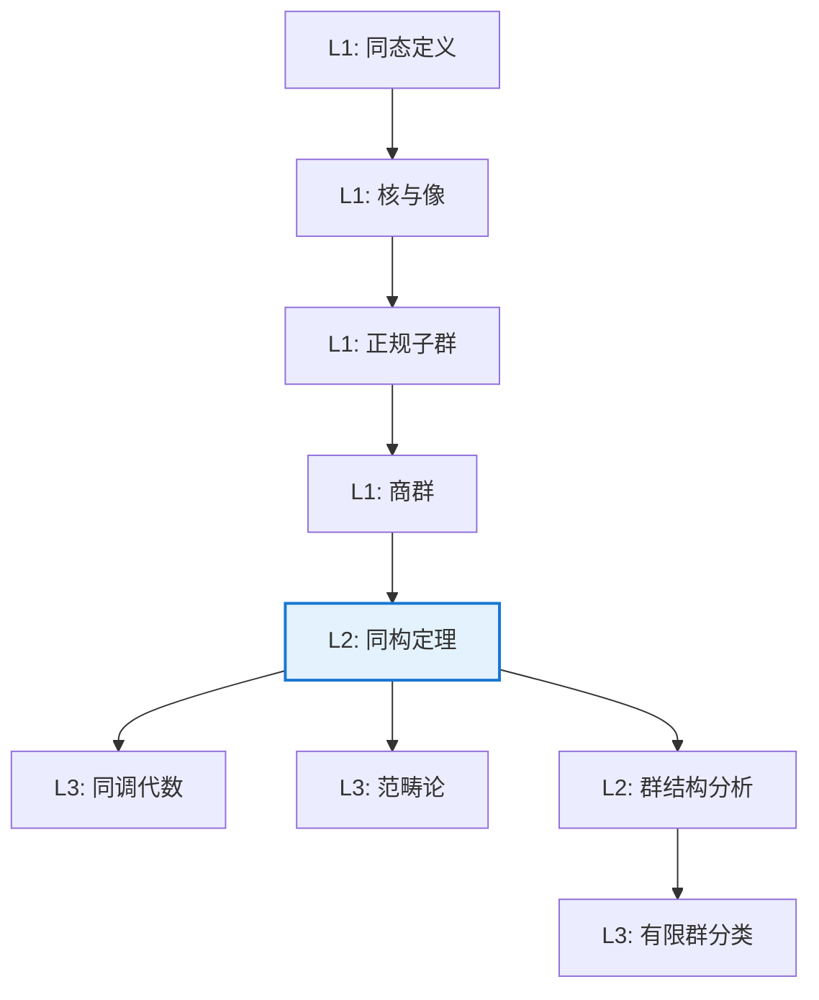

# 同构基本定理

**定理编号**: L2-A003  
**MSC分类**: 20A05 (群论中的公理方法及基本概念)  
**难度等级**: ⭐⭐⭐☆☆  
**证明策略**: DIR (直接证明) + CST (显式同构构造)

---

## 定理陈述

### 第一同构定理

设 $\varphi: G \to H$ 是群同态，则

$$G / \ker\varphi \cong \text{Im}\varphi$$

同构映射为 $\bar{\varphi}: g\ker\varphi \mapsto \varphi(g)$。

### 第二同构定理（钻石定理）

设 $H \leq G$，$N \lhd G$，则

$$HN/N \cong H/(H \cap N)$$

### 第三同构定理

设 $N \lhd G$，$K \lhd G$，$N \subseteq K$，则

$$(G/N)/(K/N) \cong G/K$$

---

## 证明概要（第一同构定理）

### 关键步骤

#### 步骤1：良定性验证

需证：若 $g_1\ker\varphi = g_2\ker\varphi$，则 $\varphi(g_1) = \varphi(g_2)$。

*证明*：$g_1\ker\varphi = g_2\ker\varphi \Rightarrow g_1^{-1}g_2 \in \ker\varphi$
$$\Rightarrow \varphi(g_1^{-1}g_2) = e \Rightarrow \varphi(g_1) = \varphi(g_2)$$

#### 步骤2：同态性

$$\bar{\varphi}(g_1\ker\varphi \cdot g_2\ker\varphi) = \bar{\varphi}(g_1g_2\ker\varphi) = \varphi(g_1g_2) = \varphi(g_1)\varphi(g_2) = \bar{\varphi}(g_1\ker\varphi)\bar{\varphi}(g_2\ker\varphi)$$

#### 步骤3：满射性

由定义，$\text{Im}\bar{\varphi} = \text{Im}\varphi$。

#### 步骤4：单射性

$$\bar{\varphi}(g_1\ker\varphi) = \bar{\varphi}(g_2\ker\varphi) \Rightarrow \varphi(g_1) = \varphi(g_2)$$
$$\Rightarrow g_1^{-1}g_2 \in \ker\varphi \Rightarrow g_1\ker\varphi = g_2\ker\varphi$$

因此 $\bar{\varphi}$ 是同构。 $\square$

---

## 依赖关系

### 依赖的L1定义

| 定义 | 说明 |
|-----|------|
| **群同态** | 保持运算的映射 $\varphi(gh) = \varphi(g)\varphi(h)$ |
| **核** | $\ker\varphi = \{g \in G \mid \varphi(g) = e_H\}$ |
| **像** | $\text{Im}\varphi = \{\varphi(g) \mid g \in G\}$ |
| **商群** | $G/N$ 对正规子群 $N$ 的陪集群 |
| **同构** | 双射同态 |

### 依赖的L2定理（先修）

- **核的正规性**：$\ker\varphi \lhd G$
- **正规子群判定**：$N \lhd G$ 当且仅当 $N$ 是某同态的核
- **商群良定性**：陪集乘法定义良好当且仅当 $N \lhd G$

### 支撑的L3理论

| 理论 | 应用 |
|-----|------|
| **同调代数** | 长正合序列的基本工具 |
| **模论** | 模的同构定理 |
| **格论** | 子群格的同构定理 |

---

## 推论与应用

### 重要推论

1. **群分类原理**：群 $G$ 的结构可通过同态像和核来理解

2. **商群简化**：研究 $G/N$ 比直接研究 $G$ 更简单

3. **正规子群刻画**：$N \lhd G$ 当且仅当 $N$ 是同态核

### 应用示例：循环群结构

**定理**：设 $G = \langle g \rangle$ 是 $n$ 阶循环群，$d \mid n$，则存在唯一的 $d$ 阶子群。

*证明*：考虑同态 $\varphi: \mathbb{Z} \to G$，$k \mapsto g^k$。由第一同构定理，$G \cong \mathbb{Z}/n\mathbb{Z}$，其子群对应于 $n\mathbb{Z}$ 的包含子群。

---

## 范畴论视角

在阿贝尔范畴中，同构定理体现为：
- **第一定理**：态射的标准分解
- **第二定理**：拉回与推出的关系
- **第三定理**：商对象的自然同构

---

## 相关定理网络

---

**文档信息**
- **创建日期**: 2026年4月3日
- **版本**: 1.0
