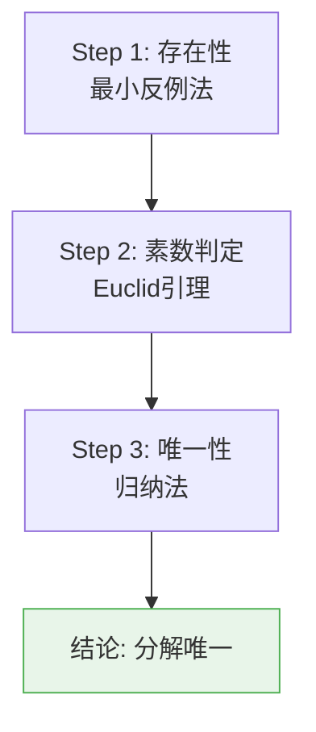
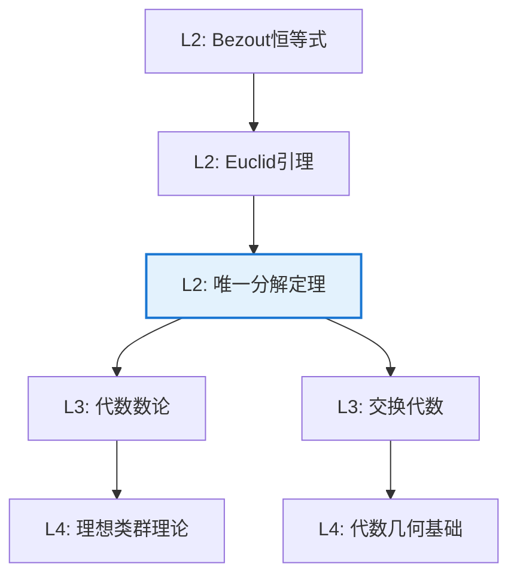

# 唯一分解定理

**定理编号**: L2-A004  
**MSC分类**: 13F15 (环和模中的整除性，唯一分解环等)  
**难度等级**: ⭐⭐⭐☆☆  
**证明策略**: IND (归纳法) + CON (反证法)

---

## 定理陈述

### 整数唯一分解定理（算术基本定理）

每个大于1的整数 $n$ 可唯一地（不计因子顺序）表示为素数的乘积：

$$n = p_1^{a_1} p_2^{a_2} \cdots p_k^{a_k}$$

其中 $p_1 < p_2 < \cdots < p_k$ 为素数，$a_i \geq 1$。

### 一般唯一分解整环

**定义**：整环 $R$ 称为**唯一分解整环（UFD）**，如果：
1. 每个非零非单位元可分解为不可约元的乘积（存在性）
2. 分解在相伴意义下唯一（唯一性）

---

## 证明概要（整数情形）

### 关键步骤

#### 步骤1：存在性（归纳法/最小反例）

**命题**：每个 $n > 1$ 可分解为素数乘积。

*证明*：假设存在不能分解的最小整数 $n$。则 $n$ 不是素数，故 $n = ab$，$1 < a, b < n$。
由最小性，$a, b$ 均可分解，故 $n$ 可分解，矛盾。

#### 步骤2：素数性质（Euclid引理）

**引理**：若素数 $p \mid ab$，则 $p \mid a$ 或 $p \mid b$。

*证明*：若 $p \nmid a$，则 $\gcd(p,a) = 1$，由Bezout恒等式，存在 $x, y$ 使得 $px + ay = 1$。
两边乘 $b$ 得 $pbx + aby = b$。因 $p \mid ab$，故 $p \mid b$。

#### 步骤3：唯一性（归纳法）

设 $n = p_1 \cdots p_r = q_1 \cdots q_s$ 为两个分解。

由Euclid引理，$p_1$ 整除某个 $q_j$，因 $q_j$ 素，故 $p_1 = q_j$（在相伴意义下）。
约去后由归纳假设即得唯一性。 $\square$

---

## 证明概要（一般UFD判定）

**定理**：主理想整环（PID）是唯一分解整环。

### 关键步骤

| 步骤 | 内容 | 关键工具 |
|-----|------|---------|
| 1 | 证明PID满足ACC（升链条件） | 理想的并仍是理想 |
| 2 | 由ACC得分解存在性 | 不可约元分解 |
| 3 | 证明PID中不可约元是素元 | 主理想极大性 |
| 4 | 由素元性质得唯一性 | Euclid引理推广 |

---

## 依赖关系

### 依赖的L1定义

| 定义 | 说明 |
|-----|------|
| **素数** | 大于1的整数，正因子只有1和自身 |
| **不可约元** | 非单位元，不能分解为两个非单位的乘积 |
| **素元** | 非单位元 $p$，若 $p \mid ab$ 则 $p \mid a$ 或 $p \mid b$ |
| **相伴** | $a \sim b$ 当且仅当存在单位 $u$ 使得 $a = ub$ |
| **整环** | 无零因子的交换环 |

### 依赖的L2定理（先修）

- **Bezout恒等式**：$\gcd(a,b) = d \Rightarrow \exists x,y: ax + by = d$
- **Euclid算法**：计算最大公因子的有效方法
- **主理想结构**：PID中每个理想都是主理想

### 支撑的L3理论

| 理论 | 应用 |
|-----|------|
| **代数数论** | 整数环的唯一分解，理想类群测量失败程度 |
| **代数几何** | 坐标环的几何性质与UFD关系 |
| **同调代数** | 分解定理在高维的推广 |

---

## 推论与应用

### 数论应用

1. **约数个数公式**：若 $n = \prod p_i^{a_i}$，则 $\tau(n) = \prod (a_i + 1)$

2. **GCD与LCM计算**：
   $$\gcd(a,b) = \prod p_i^{\min(a_i, b_i)}$$
   $$\text{lcm}(a,b) = \prod p_i^{\max(a_i, b_i)}$$

3. **Dirichlet卷积**：数论函数的代数结构基础

### 非UFD示例

$$\mathbb{Z}[\sqrt{-5}] = \{a + b\sqrt{-5} \mid a, b \in \mathbb{Z}\}$$

在此环中，$6 = 2 \cdot 3 = (1 + \sqrt{-5})(1 - \sqrt{-5})$ 给出两种不同的不可约分解。

这导致了**理想理论**的诞生（Kummer, Dedekind）。

---

## 历史与意义

### 历史背景

- **公元前300年**：Euclid《几何原本》证明存在性和部分唯一性
- **17-18世纪**：Euler、Legendre等系统使用
- **19世纪**：Gauss证明二次整数环的唯一分解，发现三次四次情形的失败
- **现代**：Dedekind用理想理论解决非唯一分解问题

### 数学意义

1. **算术基础**：整数算术的基石
2. **结构洞察**：揭示整数的乘性结构
3. **推广范式**：引导代数数论和交换代数的发展

---

## 相关定理网络

---

**文档信息**
- **创建日期**: 2026年4月3日
- **版本**: 1.0
