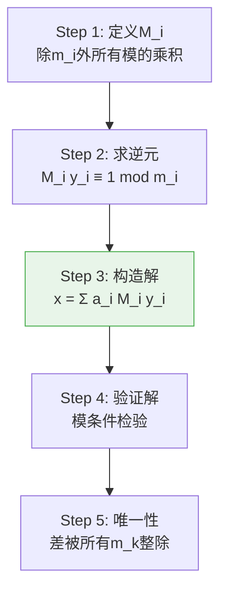
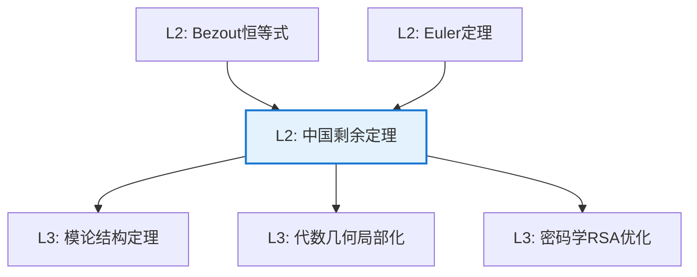

# 中国剩余定理

**定理编号**: L2-A005  
**MSC分类**: 11A05 (乘法结构；Euler函数)  
**难度等级**: ⭐⭐☆☆☆  
**证明策略**: CST (构造性证明) + DIR (直接证明)

---

## 定理陈述

### 经典形式

设 $m_1, m_2, \ldots, m_n$ 两两互素，$a_1, a_2, \ldots, a_n$ 为任意整数。则同余方程组

$$\begin{cases}
x \equiv a_1 \pmod{m_1} \\
x \equiv a_2 \pmod{m_2} \\
\vdots \\
x \equiv a_n \pmod{m_n}
\end{cases}$$

存在唯一解（模 $M = m_1m_2\cdots m_n$）。

### 环论形式

设 $R$ 为交换环，$I_1, I_2, \ldots, I_n$ 两两互素理想（即 $I_i + I_j = R$ 对 $i \neq j$）。则

$$R/(I_1 \cap \cdots \cap I_n) \cong R/I_1 \times \cdots \times R/I_n$$

当 $R = \mathbb{Z}$，$I_k = (m_k)$ 时，此即经典形式。

---

## 证明概要

### 关键步骤

#### 步骤1-2：构造辅助元素

设 $M = m_1 m_2 \cdots m_n$，$M_i = M/m_i$。

因 $\gcd(M_i, m_i) = 1$（两两互素条件），存在 $y_i$ 使得
$$M_i y_i \equiv 1 \pmod{m_i}$$

#### 步骤3：显式构造解

$$x = a_1 M_1 y_1 + a_2 M_2 y_2 + \cdots + a_n M_n y_n$$

#### 步骤4：验证解

对任意 $k$，当 $i \neq k$ 时，$m_k \mid M_i$，故
$$x \equiv a_k M_k y_k \equiv a_k \cdot 1 = a_k \pmod{m_k}$$

#### 步骤5：唯一性

若 $x, x'$ 都是解，则 $m_k \mid (x - x')$ 对所有 $k$。
因 $m_k$ 两两互素，故 $M \mid (x - x')$。

因此解在模 $M$ 意义下唯一。 $\square$

---

## 依赖关系

### 依赖的L1定义

| 定义 | 说明 |
|-----|------|
| **同余** | $a \equiv b \pmod{m}$ 当且仅当 $m \mid (a-b)$ |
| **互素** | $\gcd(a,b) = 1$ |
| **理想** | 环的子集，对加法和环乘法封闭 |
| **商环** | $R/I$，即理想 $I$ 的陪集环 |

### 依赖的L2定理（先修）

- **Bezout恒等式**：$\gcd(a,b) = 1 \Rightarrow \exists x,y: ax + by = 1$
- **Euler定理**：$a^{\phi(n)} \equiv 1 \pmod{n}$（当 $\gcd(a,n) = 1$）

### 支撑的L3理论

| 理论 | 应用 |
|-----|------|
| **模论** | 模的结构分解 |
| **代数数论** | 理想分解的局部-整体原理 |
| **密码学** | RSA算法的实现基础 |

---

## 推论与应用

### 计算应用

1. **大数模运算分解**：计算模大数可分解为模小数运算

2. **多项式插值**：Lagrange插值公式与CRT的相似性

3. **并行计算**：大整数运算可并行处理

### 密码学应用

**RSA优化**：利用CRT加速解密

若私钥为 $d$，模数为 $n = pq$，则：
- 计算 $m_p = c^d \mod p$
- 计算 $m_q = c^d \mod q$
- 用CRT合并得到 $m \mod n$

速度提升约4倍（因模数减半，指数运算代价为 $O(\log^3 n)$）。

---

## 历史与意义

### 历史背景

- **公元3-5世纪**：中国《孙子算经》记载"物不知数"问题
- **问题**："今有物不知其数，三三数之剩二，五五数之剩三，七七数之剩二，问物几何？"
- **解**：23（最小正整数解）
- **近代**：Gauss在《算术研究》中给出系统理论

### 数学意义

1. **结构同构**：展示整体与局部结构的对应
2. **计算工具**：提供高效的模运算方法
3. **抽象原型**：环直积分解的典范例子

---

## 相关定理网络

---

**文档信息**
- **创建日期**: 2026年4月3日
- **版本**: 1.0
