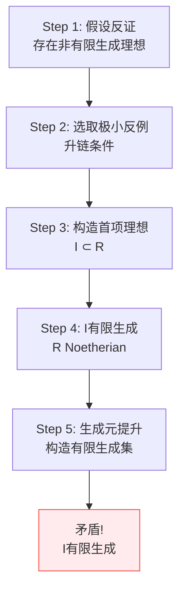
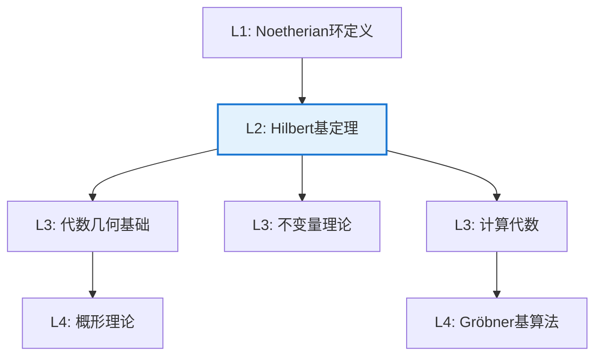

# Hilbert 基定理

**定理编号**: L2-A006  
**MSC分类**: 13E05 (Noetherian环和模)  
**难度等级**: ⭐⭐⭐⭐☆  
**证明策略**: CON (反证法) + CST (构造性证明)

---

## 定理陈述

**定理（Hilbert, 1890）**

若 $R$ 是Noetherian环，则多项式环 $R[x]$ 也是Noetherian环。

**等价形式**：若 $R$ 的每个理想都是有限生成的，则 $R[x]$ 的每个理想也是有限生成的。

**推论**：$R[x_1, x_2, \ldots, x_n]$ 是Noetherian环。

---

## 证明概要

### 关键步骤

#### 步骤1-2：反证设定

假设 $J \subseteq R[x]$ 不是有限生成的。可选取**极小的**这样的理想（由Zorn引理或升链条件）。

#### 步骤3：构造首项理想

对 $f \in R[x]$，设 $\text{LT}(f)$ 为首项系数。定义
$$I = \{\text{LT}(f) \mid f \in J\} \subseteq R$$

**验证 $I$ 是理想**：若 $a = \text{LT}(f)$，$b = \text{LT}(g)$，则适当选择多项式可使 $a + b$ 和 $ra$ 都在 $I$ 中。

#### 步骤4-5：有限生成与提升

因 $R$ Noetherian，$I = (a_1, \ldots, a_m)$。

选取 $f_1, \ldots, f_m \in J$ 使得 $\text{LT}(f_i) = a_i$。

**关键论证**：对任意 $f \in J$，用带余除法约化，可证 $J = (f_1, \ldots, f_m)$，矛盾。 $\square$

---

## 依赖关系

### 依赖的L1定义

| 定义 | 说明 |
|-----|------|
| **Noetherian环** | 满足ACC的环（理想升链稳定） |
| **有限生成理想** | $I = (a_1, \ldots, a_n)$ |
| **多项式环** | $R[x]$，系数在 $R$ 中的多项式 |
| **首项系数** | 多项式最高次项的系数 |

### 依赖的L2定理（先修）

- **ACC等价条件**：$R$ Noetherian 当且仅当每个理想有限生成
- **多项式带余除法**：$f = qg + r$，$\deg r < \deg g$

### 支撑的L3理论

| 理论 | 应用 |
|-----|------|
| **代数几何** | 仿射簇的理想有限生成，代数集的基有限性 |
| **计算代数** | Gröbner基理论，多项式方程组求解 |
| **交换代数** | 形式幂级数环、完备化的性质 |

---

## 推论与应用

### 代数几何意义

**定理**：每个仿射代数集都是有限个超曲面的交。

*解释*：若 $X \subseteq \mathbb{A}^n$ 是代数集，则 $I(X) \subseteq k[x_1, \ldots, x_n]$ 是有限生成的。

### 不变量理论

Hilbert最初动机：证明不变量环的有限生成性。

**定理**：设 $G$ 是 $GL_n(\mathbb{C})$ 的有限子群，则不变量环 $\mathbb{C}[x_1, \ldots, x_n]^G$ 是有限生成的。

### 计算应用

1. **Gröbner基**：理想有限生成性的计算实现
2. **消去理论**：多项式方程组求解
3. **自动定理证明**：几何定理的机器证明

---

## 历史与意义

### 历史背景

- **1888-1890年**：Hilbert解决不变量理论中的Gordan问题
- **Gordan的反应**："这不是数学，这是神学！"（针对非构造性证明）
- **后续发展**：Hilbert后来给出构造性证明
- **现代**：符号计算和计算机代数的理论基础

### 数学意义

1. **存在性证明的典范**：展示非构造性证明的力量
2. **代数几何基础**：使代数集的研究可行
3. **计算转向**：推动了交换代数的算法化

---

## 相关定理网络

---

**文档信息**
- **创建日期**: 2026年4月3日
- **版本**: 1.0
