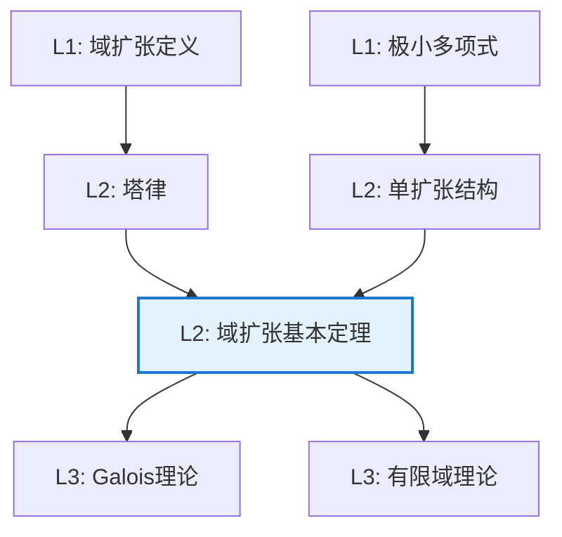

# 域扩张基本定理

**定理编号**: L2-A007  
**MSC分类**: 12F05 (代数扩张)  
**难度等级**: ⭐⭐⭐⭐☆  
**证明策略**: DIR (直接证明) + CST (构造性证明)

---

## 定理陈述

设 $K/F$ 是域扩张。

### 有限扩张基本定理

**定理**：若 $[K:F] = n$（有限），则：
1. $K$ 中每个元素都是 $F$ 上的代数元
2. 对 $\alpha \in K$，$[F(\alpha):F]$ 整除 $n$
3. $\alpha$ 在 $F$ 上的极小多项式次数整除 $n$

### 代数扩张结构定理

**定理**：以下等价：
1. $K/F$ 是有限扩张
2. $K/F$ 是有限生成的代数扩张
3. 存在代数元 $\alpha_1, \ldots, \alpha_n$ 使得 $K = F(\alpha_1, \ldots, \alpha_n)$

### 塔律（Degree Formula）

若 $F \subseteq K \subseteq L$，则
$$[L:F] = [L:K] \cdot [K:F]$$

---

## 证明概要

### 塔律证明

```mermaid
flowchart TD
    A[Step 1: 选取K/F的基<br/>{α_i}] --> B[Step 2: 选取L/K的基<br/>{β_j}]
    B --> C[Step 3: 证明{α_i β_j}<br/>是L/F的基]
    C --> D[Step 4: 计数论证<br/>dim = mn]
    
    style C fill:#e8f5e9,stroke:#4caf50

```

#### 详细证明

设 $\{\alpha_1, \ldots, \alpha_m\}$ 是 $K$ 作为 $F$-向量空间的基，$\{\beta_1, \ldots, \beta_n\}$ 是 $L$ 作为 $K$-向量空间的基。

**生成性**：对任意 $\gamma \in L$，
$$\gamma = \sum_{j=1}^n b_j \beta_j = \sum_{j=1}^n \sum_{i=1}^m a_{ij} \alpha_i \beta_j$$

其中 $b_j \in K$，$a_{ij} \in F$。

**线性无关性**：设 $\sum_{i,j} a_{ij} \alpha_i \beta_j = 0$，整理得
$$\sum_j \left(\sum_i a_{ij} \alpha_i\right) \beta_j = 0$$

由 $\{\beta_j\}$ 在 $K$ 上线性无关，得 $\sum_i a_{ij} \alpha_i = 0$ 对所有 $j$。
再由 $\{\alpha_i\}$ 在 $F$ 上线性无关，得 $a_{ij} = 0$。

因此 $\{\alpha_i \beta_j\}$ 是 $L/F$ 的基，$[L:F] = mn$。 $\square$

---

## 依赖关系

### 依赖的L1定义

| 定义 | 说明 |
|-----|------|
| **域扩张** | 包含关系 $F \subseteq K$，$K$ 是 $F$ 上的向量空间 |
| **扩张次数** | $[K:F] = \dim_F K$ |
| **代数元** | $\alpha$ 满足某个 $F$ 上的非零多项式 |
| **极小多项式** | 首一的次数最小的满足多项式 |
| **单扩张** | $F(\alpha)$，$F$ 添加 $\alpha$ 的最小扩域 |

### 依赖的L2定理（先修）

- **单扩张结构**：$F(\alpha) \cong F[x]/(m_\alpha(x))$
- **扩域维数**：$[F(\alpha):F] = \deg m_\alpha(x)$
- **向量空间维数**：基的势（在有限情形下）

### 支撑的L3理论

| 理论 | 应用 |
|-----|------|
| **Galois理论** | 扩张次数与Galois群阶的关系 |
| **代数几何** | 函数域的扩张结构 |
| **编码理论** | 有限域扩张的构造 |

---

## 推论与应用

### 常用推论

1. **不可约性保持**：若 $[K:F]$ 素数，则不存在中间域

2. **代数元的运算**：若 $\alpha, \beta$ 代数，则 $\alpha + \beta$、$\alpha\beta$、$\alpha^{-1}$ 都代数

3. **代数闭包存在**：每个域都有代数闭包

### 尺规作图判定

**经典问题**：三等分角、倍立方、化圆为方。

*关键原理*：尺规作图可构造的数满足 $[\mathbb{Q}(\alpha):\mathbb{Q}] = 2^k$。

例如，$\sqrt[3]{2}$ 的极小多项式 $x^3 - 2$ 次数为3，不是2的幂，故倍立方不可尺规作图。

---

## 相关定理网络



---

**文档信息**
- **创建日期**: 2026年4月3日
- **版本**: 1.0
