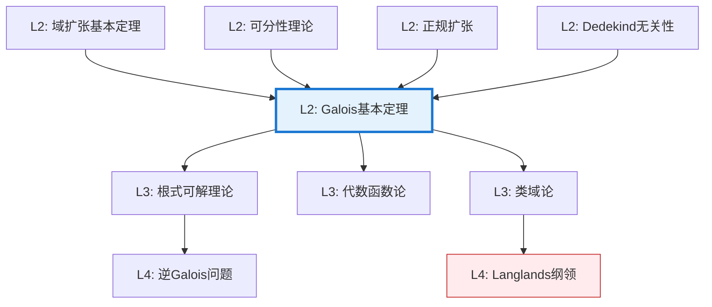

# Galois 基本定理

**定理编号**: L2-A008  
**MSC分类**: 12F10 (可分扩张，Galois理论)  
**难度等级**: ⭐⭐⭐⭐⭐  
**证明策略**: DIR (直接证明) + CST (对应构造) + SYM (对称性论证)

---

## 定理陈述

设 $K/F$ 是**有限Galois扩张**，$G = \text{Gal}(K/F)$ 为其Galois群。

**Galois基本定理（主定理）**

存在一一对应（反序）：

$$\{\text{中间域 } F \subseteq E \subseteq K\} \longleftrightarrow \{\text{子群 } H \leq G\}$$

对应规则：
- 域 $E \mapsto$ 群 $\text{Gal}(K/E) = \{\sigma \in G \mid \sigma|_E = \text{id}_E\}$

- 子群 $H \mapsto$ 域 $K^H = \{x \in K \mid \sigma(x) = x, \forall \sigma \in H\}$

**对应性质**：
1. **反序性**：$E_1 \subseteq E_2 \Leftrightarrow H_2 \leq H_1$
2. **指数关系**：$[E_2:E_1] = [H_1:H_2]$
3. **正规对应**：$E/F$ 正规 $\Leftrightarrow$ $H \lhd G$，此时 $\text{Gal}(E/F) \cong G/H$

---

## 证明概要

### 关键步骤

```mermaid
flowchart TD
    A[Step 1: 定义对应<br/>E↦Gal(K/E), H↦K^H] --> B[Step 2: 证明K^{Gal(K/E)}=E<br/>Artin引理]
    B --> C[Step 3: 证明Gal(K/K^H)=H<br/>阶数论证]
    C --> D[Step 4: 验证对应性质<br/>反序/指数/正规]
    D --> E[结论: 双射对应]
    
    style B fill:#e8f5e9,stroke:#4caf50
    style C fill:#e8f5e9,stroke:#4caf50

```

#### 步骤1：定义对应

- **固定子域映射**：对 $H \leq G$，定义 $K^H = \{x \in K \mid \sigma(x) = x, \forall \sigma \in H\}$
- **固定群映射**：对中间域 $E$，定义 $\text{Gal}(K/E) = \{\sigma \in G \mid \sigma|_E = \text{id}\}$

#### 步骤2：Artin引理

**引理**：$[K:K^H] = |H|$

*证明要点*：设 $H = \{\sigma_1, \ldots, \sigma_m\}$，证明 $K$ 中任意 $m+1$ 个元素在 $K^H$ 上线性相关。
利用Dedekind无关性引理：不同的域嵌入 $K \to \overline{K}$ 在 $K$ 上线性无关。

#### 步骤3：双射验证

**验证 $K^{\text{Gal}(K/E)} = E$**：
- 显然 $E \subseteq K^{\text{Gal}(K/E)}$
- 由Artin引理，$[K:K^{\text{Gal}(K/E)}] = |\text{Gal}(K/E)| = [K:E]$（Galois扩张定义）

- 故 $K^{\text{Gal}(K/E)} = E$

**验证 $\text{Gal}(K/K^H) = H$**：
- 显然 $H \subseteq \text{Gal}(K/K^H)$
- 由阶数：$|\text{Gal}(K/K^H)| = [K:K^H] = |H|$，故相等

#### 步骤4：对应性质

**反序性**：由定义直接验证。

**指数关系**：利用塔律和Lagrange定理。

**正规对应**：$E/F$ 正规 $\Leftrightarrow$ $\sigma(E) = E$ 对所有 $\sigma \in G$ $\Leftrightarrow$ $H$ 正规。

此时 $\text{Gal}(E/F) \cong G/H$ 由限制映射给出。 $\square$

---

## 依赖关系

### 依赖的L1定义

| 定义 | 说明 |
|-----|------|
| **Galois扩张** | 正规且可分的有限扩张 |
| **Galois群** | $\text{Gal}(K/F) = \{\text{固定 } F \text{ 的自同构}\}$ |
| **正规扩张** | 极小多项式分裂的扩张 |
| **可分扩张** | 极小多项式无重根的扩张 |
| **固定域** | 群作用的不动点子域 |

### 依赖的L2定理（先修）

- **域扩张塔律**：$[L:F] = [L:K][K:F]$
- **本原元定理**：有限可分扩张是单扩张
- **Dedekind无关性**：不同嵌入的线性无关性
- **Artin引理**：$[K:K^H] = |H|$

### 支撑的L3理论

| 理论 | 应用 |
|-----|------|
| **可解群理论** | 根式可解判别准则 |
| **代数数论** | 类域论的Galois对应推广 |
| **代数几何** | 覆盖空间的Galois对应 |
| **编码理论** | BCH码的设计理论 |

---

## 推论与应用

### 根式可解性判据

**定理（Galois）**：多项式 $f \in \mathbb{Q}[x]$ 根式可解当且仅当 $\text{Gal}(f)$ 是可解群。

**应用**：
- 一般5次以上多项式不可根式解（$S_n$ 对 $n \geq 5$ 不可解）
- 给出具体多项式可解性判定方法

### 正n边形尺规作图

**定理**：正 $n$ 边形可尺规作图当且仅当 $n = 2^k p_1 \cdots p_m$，其中 $p_i$ 是互异Fermat素数。

*关键*：$\text{Gal}(\mathbb{Q}(\zeta_n)/\mathbb{Q}) \cong (\mathbb{Z}/n\mathbb{Z})^\times$，可解性对应可构造性。

### 经典问题解答

1. **三次方程**：Galois群为 $S_3$ 或 $A_3$，均可解
2. **四次方程**：Galois群为 $S_4, A_4, D_4, V_4$ 或 $C_4$，均可解
3. **五次一般方程**：Galois群为 $S_5$，不可解

---

## 历史与意义

### 历史背景

- **1830年**：Évariste Galois 在决斗前夜写下Galois理论的基本思想
- **1846年**：Liouville 整理发表Galois的工作
- **19世纪末**：Dedekind、Jordan、Weber等完善理论框架
- **20世纪**：Emil Artin 给出现代处理，引入线性无关性方法

### 数学意义

1. **代数方程的终极理论**：彻底解决根式可解问题
2. **对应理论的典范**：建立域与群之间的深刻联系
3. **现代数学的先驱**：引导出范畴论、层论等抽象工具

---

## 相关定理网络



---

**文档信息**
- **创建日期**: 2026年4月3日
- **版本**: 1.0
- **关联Lean4形式化**: `mathlib4/FieldTheory/Galois.lean`
