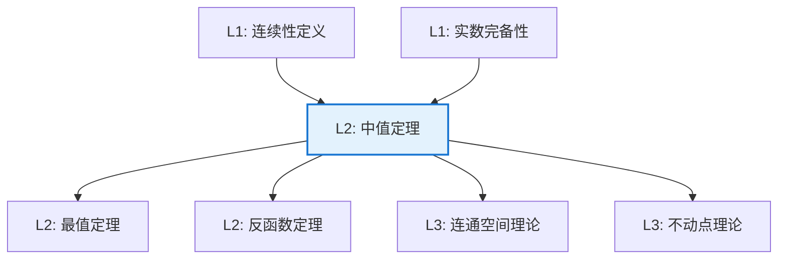

# 中值定理（介值定理）

**定理编号**: L2-AN001  
**MSC分类**: 26A24 (一元实函数微分)  
**难度等级**: ⭐⭐☆☆☆  
**证明策略**: DIR (直接证明) + CST (确界构造)

---

## 定理陈述

**定理（Bolzano-Cauchy 中值定理）**

设 $f: [a,b] \to \mathbb{R}$ 连续，且 $f(a) < c < f(b)$（或 $f(a) > c > f(b)$），则存在 $\xi \in (a,b)$ 使得

$$f(\xi) = c$$

**等价表述**：连续函数将区间映为区间。

---

## 证明概要

### 关键步骤

```mermaid
flowchart TD
    A[Step 1: 构造集合S<br/>S = {x | f(x) < c}] --> B[Step 2: 确界存在<br/>ξ = sup S]

    B --> C[Step 3: 连续性论证<br/>左极限 ≤ c]
    C --> D[Step 4: 反证法<br/>f(ξ) ≠ c 导出矛盾]
    D --> E[结论: f(ξ) = c]
    
    style E fill:#e8f5e9,stroke:#4caf50

```

#### 步骤1-2：确界构造

设 $S = \{x \in [a,b] \mid f(x) < c\}$。

- $S \neq \emptyset$（因 $f(a) < c$，故 $a \in S$）
- $S$ 有上界（$b$ 是上界）

由实数完备性，$\xi = \sup S$ 存在，且 $\xi \in [a,b]$。

#### 步骤3：利用连续性

**证明 $f(\xi) \leq c$**：

由确界定义，存在数列 $\{x_n\} \subseteq S$ 使得 $x_n \to \xi$。
由连续性，$f(x_n) \to f(\xi)$。
因 $f(x_n) < c$，故 $f(\xi) \leq c$。

#### 步骤4：反证完成

**证明 $f(\xi) \geq c$**：

假设 $f(\xi) < c$，由连续性，存在 $\delta > 0$ 使得
$$|x - \xi| < \delta \Rightarrow f(x) < c$$

取 $x = \xi + \delta/2$，则 $f(x) < c$ 且 $x > \xi$，这与 $\xi = \sup S$ 矛盾。

因此 $f(\xi) = c$。 $\square$

---

## 依赖关系

### 依赖的L1定义

| 定义 | 说明 |
|-----|------|
| **连续性** | $\varepsilon$-$\delta$ 定义或序列定义 |
| **区间** | $\mathbb{R}$ 的连通子集 |
| **确界** | 集合的最小上界 |
| **实数完备性** | 有上界的非空集必有上确界 |

### 依赖的L2定理（先修）

- **序列连续性等价**：$f$ 连续当且仅当 $x_n \to x$ 蕴含 $f(x_n) \to f(x)$
- **确界性质**：有界集的上下确界存在

### 支撑的L3理论

| 理论 | 应用 |
|-----|------|
| **连通空间理论** | 连通空间的连续像是连通的 |
| **不动点理论** | Brouwer不动点定理的基础 |
| **度理论** | 映射度的拓扑定义 |

---

## 推论与应用

### 直接推论

1. **零点存在定理**：若 $f(a)f(b) < 0$ 且 $f$ 连续，则 $f$ 在 $(a,b)$ 有零点。

2. **值域性质**：连续函数在闭区间上的值域是闭区间 $[\min f, \max f]$。

3. **反函数连续性**：严格单调连续函数的反函数连续。

### 应用示例

| 应用领域 | 具体应用 |
|---------|---------|
| 数值分析 | 二分法求根的理论基础 |
| 经济学 | 均衡存在性证明（如供需均衡） |
| 气象学 | 等压线、等温线的存在性 |
| 几何学 | 两条曲线交点的存在性 |

---

## 证明策略分析

### 策略：确界原理 + 连续性

本证明展示了**拓扑性质**（连续性）与**序性质**（完备性）的结合：

```

┌─────────────────────────────────────────┐
│  中值定理证明的核心思想：                 │
│  1. 利用实数完备性构造候选点（确界）       │
│  2. 利用连续性证明该点满足条件             │
│  3. 反证法排除其他可能性                   │
└─────────────────────────────────────────┘

```

---

## 相关定理网络



---

**文档信息**
- **创建日期**: 2026年4月3日
- **版本**: 1.0
