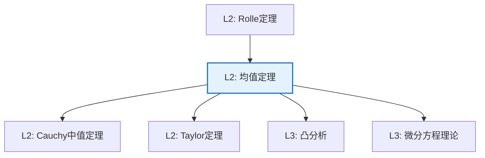

# 微分中值定理（Mean Value Theorem）

**定理编号**: L2-AN002  
**MSC分类**: 26A24 (一元实函数微分)  
**难度等级**: ⭐⭐☆☆☆  
**证明策略**: CST (辅助函数构造) + DIR (直接证明)

---

## 定理陈述

**定理（Lagrange 中值定理）**

设 $f: [a,b] \to \mathbb{R}$ 满足：
1. $f$ 在 $[a,b]$ 上连续
2. $f$ 在 $(a,b)$ 上可导

则存在 $\xi \in (a,b)$ 使得

$$f'(\xi) = \frac{f(b) - f(a)}{b - a}$$

**几何意义**：曲线上存在一点，其切线平行于端点连线。

---

## 证明概要

### 关键步骤

```mermaid
flowchart TD
    A[Step 1: 构造辅助函数<br/>g(x) = f(x) - 割线] --> B[Step 2: 验证g(a) = g(b) = 0]
    B --> C[Step 3: 应用Rolle定理<br/>存在g'(ξ) = 0]
    C --> D[Step 4: 计算g'(ξ)<br/>即得结论]
    
    style D fill:#e8f5e9,stroke:#4caf50

```

#### 步骤1：构造辅助函数

过 $(a, f(a))$ 和 $(b, f(b))$ 的割线方程：
$$L(x) = f(a) + \frac{f(b) - f(a)}{b - a}(x - a)$$

定义辅助函数：
$$g(x) = f(x) - L(x) = f(x) - f(a) - \frac{f(b) - f(a)}{b - a}(x - a)$$

#### 步骤2：验证端点条件

$$g(a) = f(a) - f(a) - 0 = 0$$
$$g(b) = f(b) - f(a) - (f(b) - f(a)) = 0$$

#### 步骤3：应用Rolle定理

$g$ 满足Rolle定理条件：
- $g$ 在 $[a,b]$ 连续
- $g$ 在 $(a,b)$ 可导
- $g(a) = g(b)$

故存在 $\xi \in (a,b)$ 使得 $g'(\xi) = 0$。

#### 步骤4：结论

$$g'(\xi) = f'(\xi) - \frac{f(b) - f(a)}{b - a} = 0$$

因此
$$f'(\xi) = \frac{f(b) - f(a)}{b - a}$$ $\square$

---

## 依赖关系

### 依赖的L1定义

| 定义 | 说明 |
|-----|------|
| **导数** | $f'(x) = \lim_{h \to 0} \frac{f(x+h) - f(x)}{h}$ |
| **连续性** | $\varepsilon$-$\delta$ 定义 |
| **可导性** | 导数存在的条件 |

### 依赖的L2定理（先修）

- **Rolle定理**：若 $f(a) = f(b)$，则存在 $f'(\xi) = 0$
- **最值定理**：闭区间上连续函数必有最值
- **Fermat定理**：极值点处导数为零（若可导）

### 支撑的L3理论

| 理论 | 应用 |
|-----|------|
| **Taylor展开** | 高阶逼近的基础 |
| **Lipschitz分析** | 函数光滑性刻画 |
| **微分方程** | 存在唯一性定理的证明 |

---

## 推论与应用

### 重要推论

1. **单调性判定**：若 $f' > 0$，则 $f$ 严格递增。

2. **常函数判定**：若 $f' = 0$，则 $f$ 为常数。

3. **Lipschitz连续性**：若 $|f'| \leq M$，则 $|f(x) - f(y)| \leq M|x - y|$。

4. **Cauchy中值定理**：对 $f, g$ 存在 $\xi$ 使得 $\frac{f'(\xi)}{g'(\xi)} = \frac{f(b) - f(a)}{g(b) - g(a)}$。

### 应用示例

| 应用 | 说明 |
|-----|------|
| 不等式证明 | $\sin x < x < \tan x$（$0 < x < \pi/2$）|
| 误差估计 | 数值方法的截断误差分析 |
| 物理应用 | 平均速度必在某点达到 |

---

## 相关定理网络



---

**文档信息**
- **创建日期**: 2026年4月3日
- **版本**: 1.0
