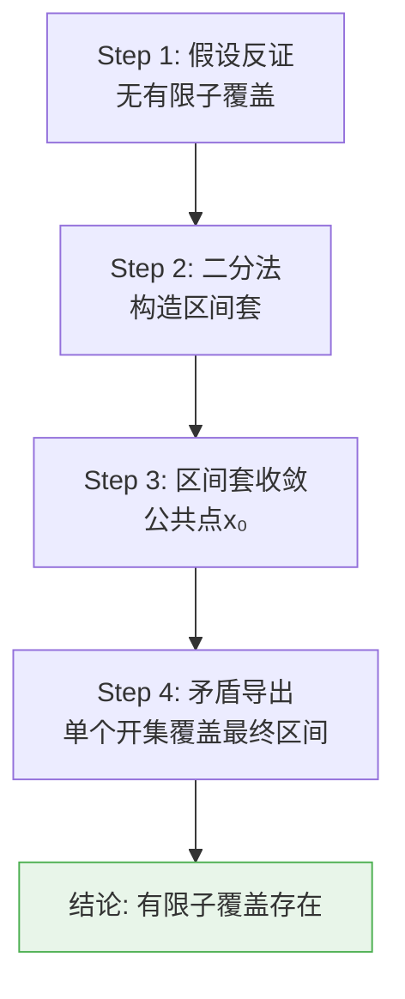
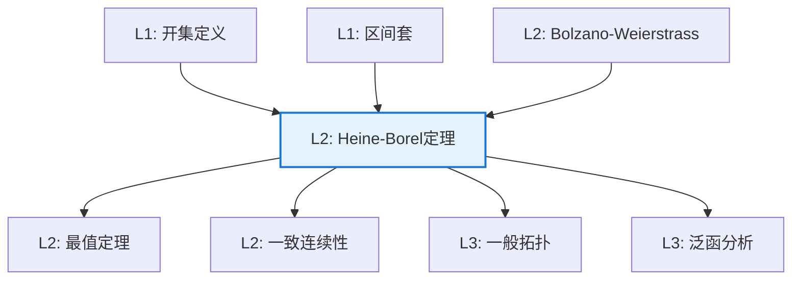

# Heine-Borel 定理

**定理编号**: L2-AN003  
**MSC分类**: 26B05 (连续性及可微性) / 54E45 (紧性)  
**难度等级**: ⭐⭐⭐☆☆  
**证明策略**: CON (反证法) + CPT (紧性论证)

---

## 定理陈述

**定理（Heine-Borel）**

设 $S \subseteq \mathbb{R}^n$，则以下等价：

1. $S$ 是**紧的**（每个开覆盖有有限子覆盖）
2. $S$ 是**有界闭集**

**有限覆盖版本**：闭区间 $[a,b]$ 的任意开覆盖存在有限子覆盖。

---

## 证明概要

### 关键步骤（$[a,b]$ 情形）

#### 步骤1：反证假设

假设 $\mathcal{U}$ 是 $[a,b]$ 的开覆盖，但无有限子覆盖。

#### 步骤2：二分构造

设 $I_0 = [a,b]$，每次将区间二等分，选取**无有限子覆盖**的那一半（至少有一个）。

得到区间套：$I_0 \supseteq I_1 \supseteq I_2 \supseteq \cdots$，$|I_n| = (b-a)/2^n$。

#### 步骤3：区间套收敛

由区间套定理，存在唯一的 $x_0 \in \bigcap I_n$。

#### 步骤4：导出矛盾

因 $\mathcal{U}$ 是覆盖，存在 $U \in \mathcal{U}$ 使得 $x_0 \in U$。
因 $U$ 开，存在 $\varepsilon > 0$ 使得 $(x_0 - \varepsilon, x_0 + \varepsilon) \subseteq U$。

取 $n$ 充分大使 $|I_n| < \varepsilon$，则 $I_n \subseteq U$。

这与"$I_n$ 无有限子覆盖"矛盾（单个 $U$ 即覆盖）。 $\square$

---

## 依赖关系

### 依赖的L1定义

| 定义 | 说明 |
|-----|------|
| **开覆盖** | 一族开集，其并包含目标集 |
| **紧性** | 每个开覆盖有有限子覆盖 |
| **有界集** | 包含于某球内的集合 |
| **闭集** | 补集为开集，或包含所有极限点 |

### 依赖的L2定理（先修）

- **区间套定理**：闭区间套的交非空
- **Bolzano-Weierstrass定理**：有界无限集有聚点
- **有限交性质**：紧性的等价刻画

### 支撑的L3理论

| 理论 | 应用 |
|-----|------|
| **一般拓扑学** | 紧性的一般理论 |
| **函数分析** | 算子紧性，弱紧性 |
| **微分几何** | 流形的紧性，有限性定理 |

---

## 推论与应用

### 重要推论

1. **连续函数最值定理**：紧集上的连续函数有最值。

2. **一致连续性**：紧集上的连续函数一致连续。

3. **序列紧性**：紧度量空间中每个序列有收敛子列。

### 应用示例

| 应用 | 说明 |
|-----|------|
| 优化理论 | 紧约束集上连续目标函数必达最优 |
| 逼近理论 | 最佳逼近元的存在性 |
| 动力系统 | 紧不变集的结构分析 |

---

## 相关定理网络

---

**文档信息**
- **创建日期**: 2026年4月3日
- **版本**: 1.0
