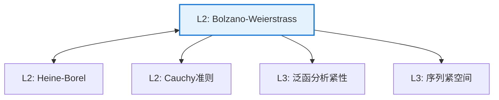

# Bolzano-Weierstrass 定理

**定理编号**: L2-AN004  
**MSC分类**: 40A05 (序列收敛与发散)  
**难度等级**: ⭐⭐⭐☆☆  
**证明策略**: CPT (紧性论证) + CST (对角线构造)

---

## 定理陈述

**定理（Bolzano-Weierstrass）**

设 $\{x_n\}$ 是 $\mathbb{R}^m$ 中的有界序列，则存在收敛子列。

**等价形式**：有界无限集必有聚点。

---

## 证明概要

### 关键步骤（$\mathbb{R}^1$ 情形）

```mermaid
flowchart TD
    A[Step 1: 有界性<br/>序列在[a,b]内] --> B[Step 2: 二分法<br/>构造子列]
    B --> C[Step 3: 区间套<br/>长度趋于0]
    C --> D[Step 4: Cauchy序列<br/>子列收敛]
    
    style D fill:#e8f5e9,stroke:#4caf50

```

#### 步骤1：有界性假设

设 $|x_n| \leq M$ 对所有 $n$，则 $\{x_n\} \subseteq [-M, M]$。

#### 步骤2-3：二分构造

- 将 $[-M, M]$ 二等分，至少一半含无限多项，记为 $I_1$
- 从该半区间中选取序列的一项 $x_{n_1}$
- 重复：将 $I_k$ 二等分，选含无限多项的一半为 $I_{k+1}$，从中选取 $x_{n_{k+1}}$（$n_{k+1} > n_k$）

得到区间套：$I_1 \supseteq I_2 \supseteq \cdots$，$|I_k| = M/2^{k-1}$。

#### 步骤4：收敛性

子列 $\{x_{n_k}\}$ 满足 $x_{n_k} \in I_k$。

对 $m > k$，$x_{n_m} \in I_m \subseteq I_k$，故
$$|x_{n_m} - x_{n_k}| \leq |I_k| = M/2^{k-1}$$

因此 $\{x_{n_k}\}$ 是Cauchy序列，故收敛。 $\square$

---

## 依赖关系

### 依赖的L1定义

| 定义 | 说明 |
|-----|------|
| **有界序列** | 值域有界的序列 |
| **子列** | 保持顺序的子序列 |
| **Cauchy序列** | $|x_m - x_n| \to 0$ |
| **收敛** | 极限存在 |

### 依赖的L2定理（先修）

- **Cauchy收敛准则**：$\mathbb{R}$ 中Cauchy序列收敛
- **区间套定理**：闭区间套的交非空

### 支撑的L3理论

| 理论 | 应用 |
|-----|------|
| **序列紧性** | 度量空间中紧性与序列紧性等价 |
| **弱收敛** | Banach空间中的弱紧性 |
| **分布理论** | 广义函数的紧性论证 |

---

## 推论与应用

### 重要推论

1. **闭区间列紧性**：$[a,b]$ 中每个序列有收敛子列。

2. **有限维空间性质**：$\mathbb{R}^n$ 中有界闭集等价于紧集。

3. **极限点存在性**：有界无限集必有极限点。

### 应用示例

| 应用 | 说明 |
|-----|------|
| 存在性证明 | 极小化序列的存在 |
| 概率论 | 分布函数的紧性 |
| 经济学 | 均衡存在性的序列论证 |

---

## 相关定理网络



---

**文档信息**
- **创建日期**: 2026年4月3日
- **版本**: 1.0
