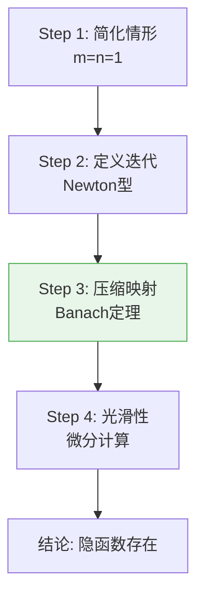
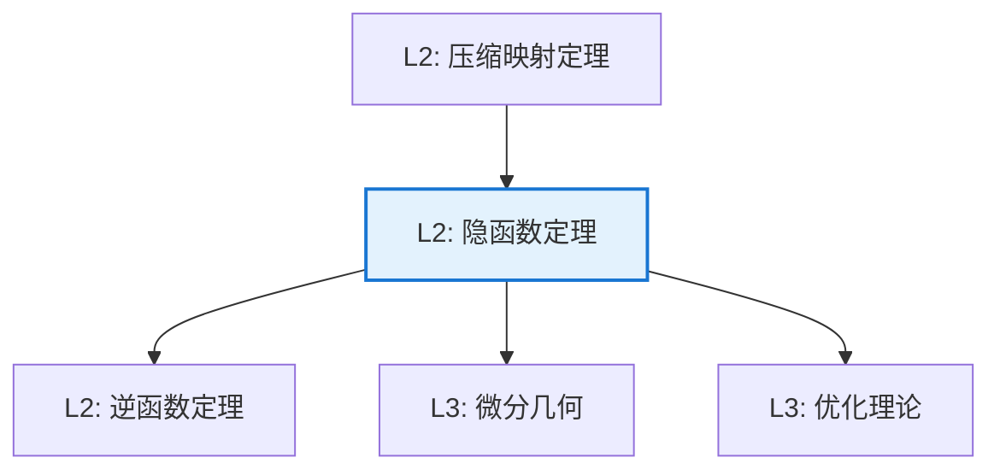

# 隐函数定理

**定理编号**: L2-AN005  
**MSC分类**: 26B10 (隐函数定理，Jacobian，逆变换)  
**难度等级**: ⭐⭐⭐⭐☆  
**证明策略**: CST (迭代构造) + DIR (压缩映射)

---

## 定理陈述

**定理（隐函数定理）**

设 $F: \mathbb{R}^{n+m} \to \mathbb{R}^m$ 是 $C^1$ 函数，$(a,b) \in \mathbb{R}^n \times \mathbb{R}^m$ 满足：
1. $F(a,b) = 0$
2. Jacobian矩阵 $\frac{\partial F}{\partial y}(a,b)$ 可逆

则存在开集 $U \ni a$ 和 $V \ni b$，以及唯一函数 $f: U \to V$ 使得：
- $f(a) = b$
- 对所有 $x \in U$，$F(x, f(x)) = 0$
- $f$ 是 $C^1$ 的，且 $Df(x) = -\left(\frac{\partial F}{\partial y}\right)^{-1} \frac{\partial F}{\partial x}$

---

## 证明概要

### 关键步骤



#### 步骤1：简化情形

考虑 $F(x,y) = 0$，$x, y \in \mathbb{R}$，$\frac{\partial F}{\partial y}(a,b) \neq 0$。

#### 步骤2：Newton迭代构造

定义迭代：
$$y_{n+1} = y_n - \frac{F(x, y_n)}{F_y(x, y_n)}$$

#### 步骤3：压缩映射详细验证

定义映射 $T_x(y) = y - F_y(x,y)^{-1}F(x,y)$（简化为标量情形，矩阵情形类似）。

**验证压缩条件**:

我们需要证明在 $(a,b)$ 的适当小邻域 $U \times V$ 内，$T_x$ 是压缩映射。

**步骤3a: 选取邻域**

由于 $F_y(a,b) \neq 0$（可逆），由连续性，存在邻域 $U_0 \times V$ 使得 $|F_y(x,y)| \geq c > 0$ 对所有 $(x,y) \in U_0 \times V$ 成立。

**步骤3b: 计算导数**

$$\frac{\partial T_x}{\partial y} = 1 - \frac{F_y(x,y) \cdot F_y(x,y) - F(x,y) \cdot F_{yy}(x,y)}{F_y(x,y)^2}$$

在 $(a,b)$ 处，$F(a,b) = 0$，故：
$$\left.\frac{\partial T_x}{\partial y}\right|_{(a,b)} = 1 - \frac{F_y(a,b)^2}{F_y(a,b)^2} = 0$$

**步骤3c: 应用连续性**

由连续性，存在更小的邻域 $U \times V$ 使得 $\left|\frac{\partial T_x}{\partial y}\right| \leq \frac{1}{2}$ 对所有 $(x,y) \in U \times V$ 成立。

**步骤3d: 验证Lipschitz条件**

由中值定理，对 $y_1, y_2 \in V$：
$$|T_x(y_1) - T_x(y_2)| \leq \sup_{\xi \in V}\left|\frac{\partial T_x}{\partial y}(\xi)\right| \cdot |y_1 - y_2| \leq \frac{1}{2}|y_1 - y_2|$$

因此 $T_x$ 是压缩常数为 $\frac{1}{2}$ 的压缩映射。

**步骤3e: 应用Banach不动点定理**

还需验证 $T_x: V \to V$（自映射性）。

由 $F(a,b) = 0$ 和连续性，对任意 $\epsilon > 0$，存在邻域使得 $|F(x,y)| < \epsilon$。

取 $V = [b-\delta, b+\delta]$，对充分小的 $U$ 和 $V$：
$$|T_x(y) - b| \leq |T_x(y) - T_x(b)| + |T_x(b) - b| \leq \frac{1}{2}|y-b| + |F_y(x,b)^{-1}F(x,b)|$$

当 $x$ 充分接近 $a$，$|F(x,b)|$ 足够小，故 $T_x(y) \in V$。

由Banach不动点定理，存在唯一不动点 $y = f(x)$ 使得 $F(x, f(x)) = 0$。

#### 步骤4：光滑性与导数公式详细推导

**步骤4a: 证明 $f$ 连续**

设 $x_1, x_2 \in U$，$y_1 = f(x_1)$，$y_2 = f(x_2)$。

由 $F(x_1, y_1) = F(x_2, y_2) = 0$ 和中值定理：
$$0 = F(x_2, y_2) - F(x_1, y_1) = F_x(\xi)(x_2-x_1) + F_y(\eta)(y_2-y_1)$$

因此：
$$|y_2 - y_1| = \left|\frac{F_x(\xi)}{F_y(\eta)}\right| \cdot |x_2 - x_1|$$

由于 $F_x$ 有界，$F_y$ 有正下界，$f$ 是Lipschitz连续的。

**步骤4b: 推导导数公式**

对 $F(x, f(x)) = 0$ 两边关于 $x$ 求导（链式法则）：
$$\frac{\partial F}{\partial x} + \frac{\partial F}{\partial y} \cdot f'(x) = 0$$

解出：
$$f'(x) = -\left(\frac{\partial F}{\partial y}\right)^{-1} \frac{\partial F}{\partial x}$$

**步骤4c: 证明 $f$ 是 $C^1$**

上式右端是 $x$ 的连续函数（因为 $f$ 连续，$F$ 是 $C^1$），故 $f'$ 连续，即 $f \in C^1$。 $\square$

### 完整证明总结

```
┌─────────────────────────────────────────────────────────┐
│                    隐函数定理证明结构                      │
├─────────────────────────────────────────────────────────┤
│ 1. 简化: 考虑标量情形，理解核心思想                        │
│ 2. 构造: Newton型迭代 y_{n+1} = y_n - F/F_y               │
│ 3. 压缩: 验证 T_x 是压缩映射（关键：导数在解处为0）          │
│ 4. 存在: Banach不动点定理保证唯一不动点                    │
│ 5. 连续: 利用中值定理证明隐函数连续                        │
│ 6. 可微: 隐式微分得到导数公式                             │
│ 7. 光滑: 归纳证明高阶可微性（C^k 和解析情形）               │
└─────────────────────────────────────────────────────────┘
```

---

## 依赖关系

### 依赖的L1定义

| 定义 | 说明 |
|-----|------|
| **$C^1$ 函数** | 连续可微函数 |
| **Jacobian矩阵** | 一阶偏导数矩阵 |
| **可逆矩阵** | 行列式非零的方阵 |

### 依赖的L2定理（先修）

- **逆函数定理**：局部微分同胚的条件
- **压缩映射定理**：Banach不动点定理
- **链式法则**：复合函数求导

### 支撑的L3理论

| 理论 | 应用 |
|-----|------|
| **微分几何** | 子流形的局部参数化 |
| **代数几何** | 隐式定义的簇结构 |
| **优化理论** | 约束优化的Lagrange乘子法 |
| **微分方程** | 解对初值的光滑依赖性 |

---

## 推论与应用

### 重要推论

1. **逆函数定理**：若 $Df(a)$ 可逆，则 $f$ 在 $a$ 附近是局部微分同胚。

2. **秩定理**：常秩映射的标准型。

3. **浸入/淹没局部标准型**：子流形的局部结构。

### 应用示例

| 应用 | 说明 |
|-----|------|
| 经济学 | 比较静态分析，均衡的比较 |
| 物理学 | 相空间中的约束流形 |
| 控制论 | 解对参数的光滑依赖性 |

---

## 相关定理网络



---

**文档信息**
- **创建日期**: 2026年4月3日
- **版本**: 1.0
