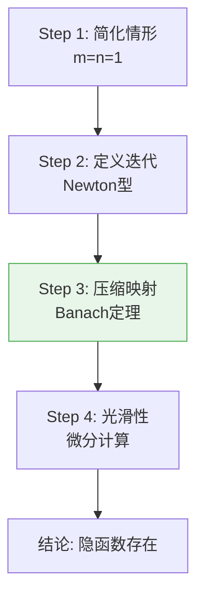
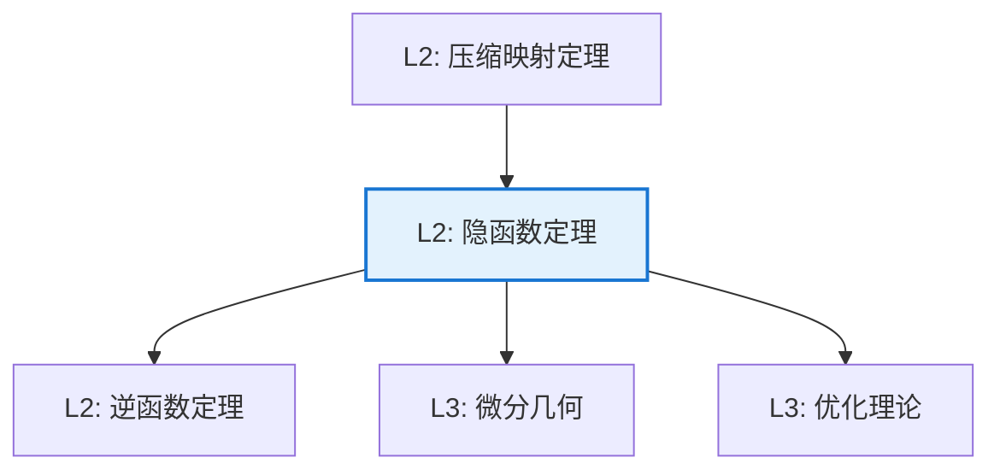

# 隐函数定理

**定理编号**: L2-AN005  
**MSC分类**: 26B10 (隐函数定理，Jacobian，逆变换)  
**难度等级**: ⭐⭐⭐⭐☆  
**证明策略**: CST (迭代构造) + DIR (压缩映射)

---

## 定理陈述

**定理（隐函数定理）**

设 $F: \mathbb{R}^{n+m} \to \mathbb{R}^m$ 是 $C^1$ 函数，$(a,b) \in \mathbb{R}^n \times \mathbb{R}^m$ 满足：
1. $F(a,b) = 0$
2. Jacobian矩阵 $\frac{\partial F}{\partial y}(a,b)$ 可逆

则存在开集 $U \ni a$ 和 $V \ni b$，以及唯一函数 $f: U \to V$ 使得：
- $f(a) = b$
- 对所有 $x \in U$，$F(x, f(x)) = 0$
- $f$ 是 $C^1$ 的，且 $Df(x) = -\left(\frac{\partial F}{\partial y}\right)^{-1} \frac{\partial F}{\partial x}$

---

## 证明概要

### 关键步骤

#### 步骤1：简化情形

考虑 $F(x,y) = 0$，$x, y \in \mathbb{R}$，$\frac{\partial F}{\partial y}(a,b) \neq 0$。

#### 步骤2：Newton迭代构造

定义迭代：
$$y_{n+1} = y_n - \frac{F(x, y_n)}{F_y(x, y_n)}$$

#### 步骤3：压缩映射

在适当小的邻域内，迭代映射是压缩的。由Banach不动点定理，存在唯一不动点 $y = f(x)$。

#### 步骤4：光滑性与导数公式

由隐式微分：
$$F_x + F_y \cdot f'(x) = 0 \Rightarrow f'(x) = -\frac{F_x}{F_y}$$ $\square$

---

## 依赖关系

### 依赖的L1定义

| 定义 | 说明 |
|-----|------|
| **$C^1$ 函数** | 连续可微函数 |
| **Jacobian矩阵** | 一阶偏导数矩阵 |
| **可逆矩阵** | 行列式非零的方阵 |

### 依赖的L2定理（先修）

- **逆函数定理**：局部微分同胚的条件
- **压缩映射定理**：Banach不动点定理
- **链式法则**：复合函数求导

### 支撑的L3理论

| 理论 | 应用 |
|-----|------|
| **微分几何** | 子流形的局部参数化 |
| **代数几何** | 隐式定义的簇结构 |
| **优化理论** | 约束优化的Lagrange乘子法 |
| **微分方程** | 解对初值的光滑依赖性 |

---

## 推论与应用

### 重要推论

1. **逆函数定理**：若 $Df(a)$ 可逆，则 $f$ 在 $a$ 附近是局部微分同胚。

2. **秩定理**：常秩映射的标准型。

3. **浸入/淹没局部标准型**：子流形的局部结构。

### 应用示例

| 应用 | 说明 |
|-----|------|
| 经济学 | 比较静态分析，均衡的比较 |
| 物理学 | 相空间中的约束流形 |
| 控制论 | 解对参数的光滑依赖性 |

---

## 相关定理网络

---

**文档信息**
- **创建日期**: 2026年4月3日
- **版本**: 1.0
