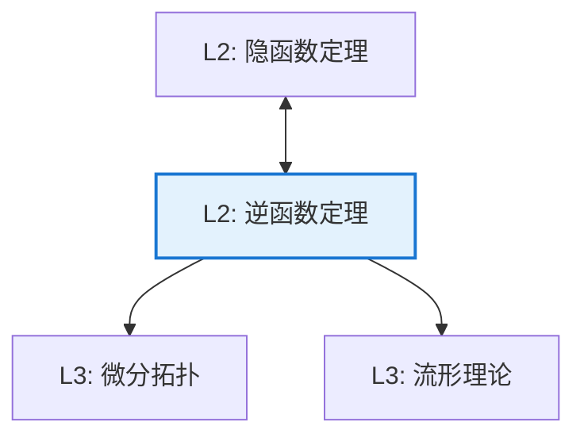

# 逆函数定理

**定理编号**: L2-AN006  
**MSC分类**: 26B10 (隐函数定理，Jacobian，逆变换)  
**难度等级**: ⭐⭐⭐⭐☆  
**证明策略**: CST (迭代构造) + DIR (局部同胚)

---

## 定理陈述

**定理（逆函数定理）**

设 $f: \mathbb{R}^n \to \mathbb{R}^n$ 是 $C^1$ 函数，$a \in \mathbb{R}^n$，且 $Df(a)$ 可逆。则存在开集 $U \ni a$ 和 $V \ni f(a)$ 使得：

1. $f: U \to V$ 是双射
2. $f^{-1}: V \to U$ 是 $C^1$ 的
3. $D(f^{-1})(f(x)) = (Df(x))^{-1}$

即 $f$ 在 $a$ 处是**局部微分同胚**。

---

## 证明概要

### 关键步骤

```mermaid
flowchart TD
    A[Step 1: 线性化<br/>Df(a)可逆] --> B[Step 2: 扰动分析<br/>f(x) ≈ f(a) + Df(a)(x-a)]
    B --> C[Step 3: Newton迭代<br/>构造逆映射]
    C --> D[Step 4: 压缩映射<br/>Banach定理]
    D --> E[结论: 局部逆存在]
    
    style D fill:#e8f5e9,stroke:#4caf50

```

#### 步骤1：标准化

设 $a = 0$，$f(0) = 0$，$Df(0) = I$（单位矩阵）。

一般情形由链式法则可得。

#### 步骤2：扰动分析

对 $y$ 接近0，求解 $f(x) = y$。

写 $f(x) = x + R(x)$，其中 $DR(0) = 0$。

#### 步骤3：Newton迭代

定义：$x_{n+1} = y - R(x_n) = y - f(x_n) + x_n$

#### 步骤4：压缩映射验证

对充分小的 $y$，迭代是压缩的，故收敛到唯一解 $x = g(y)$。

可验证 $g = f^{-1}$ 是 $C^1$ 的。 $\square$

---

## 依赖关系

### 依赖的L1定义

| 定义 | 说明 |
|-----|------|
| **微分同胚** | 可微双射，逆也可微 |
| **Jacobian行列式** | 局部体积变化率 |
| **可逆线性映射** | 行列式非零 |

### 依赖的L2定理（先修）

- **隐函数定理**：$F(x,y) = 0$ 的解
- **压缩映射定理**：Banach不动点定理
- **链式法则**：$D(f^{-1}) = (Df)^{-1}$

### 支撑的L3理论

| 理论 | 应用 |
|-----|------|
| **微分拓扑** | 局部坐标变换 |
| **流形理论** | 坐标卡之间的相容性 |
| **动力系统** | Poincaré映射 |

---

## 推论与应用

### 重要推论

1. **开映射定理**：局部微分同胚是开映射。

2. **维数不变性**：$\mathbb{R}^n$ 与 $\mathbb{R}^m$ 微分同胚当且仅当 $n = m$。

3. **常秩定理**：常秩映射的局部标准型。

### 应用示例

| 应用 | 说明 |
|-----|------|
| 坐标变换 | 曲线/曲面参数化 |
| 流体力学 | Lagrange到Euler坐标 |
| 优化 | 变分法的Jacobi条件 |

---

## 相关定理网络



---

**文档信息**
- **创建日期**: 2026年4月3日
- **版本**: 1.0
