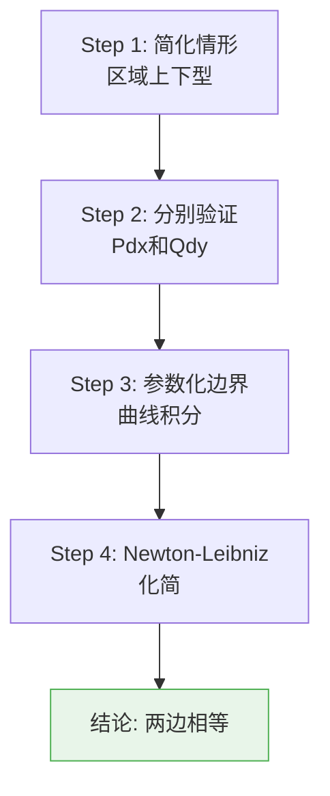
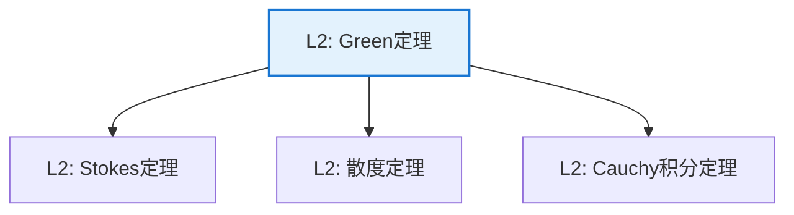

# Green 定理

**定理编号**: L2-AN007  
**MSC分类**: 26B20 (积分公式：Stokes、Gauss、Green等)  
**难度等级**: ⭐⭐⭐☆☆  
**证明策略**: DIR (直接计算) + IND (区域归纳)

---

## 定理陈述

**定理（Green 定理）**

设 $D \subseteq \mathbb{R}^2$ 是有界闭区域，边界 $\partial D$ 是分段光滑的简单闭曲线，取正向（区域在左侧）。设 $P, Q$ 在包含 $D$ 的开集上有连续偏导数，则

$$\oint_{\partial D} P\,dx + Q\,dy = \iint_D \left(\frac{\partial Q}{\partial x} - \frac{\partial P}{\partial y}\right) dA$$

**向量形式**：$\oint_{\partial D} \mathbf{F} \cdot d\mathbf{r} = \iint_D (\nabla \times \mathbf{F}) \cdot \mathbf{k}\, dA$

---

## 证明概要

### 关键步骤

#### 步骤1-2：特殊区域

设 $D = \{(x,y) \mid a \leq x \leq b, \phi_1(x) \leq y \leq \phi_2(x)\}$（上下型）。

**验证** $\displaystyle\iint_D \left(-\frac{\partial P}{\partial y}\right) dA = \oint P\,dx$：

左边：$\displaystyle\int_a^b \int_{\phi_1(x)}^{\phi_2(x)} \left(-\frac{\partial P}{\partial y}\right) dy\,dx = \int_a^b [P(x, \phi_1(x)) - P(x, \phi_2(x))] dx$

右边：沿上下边界的线积分，正是上述表达式。

#### 步骤3：一般区域

一般区域可分解为上下型区域的并，边界积分内部抵消，得证。 $\square$

---

## 依赖关系

### 依赖的L1定义

| 定义 | 说明 |
|-----|------|
| **曲线积分** | $\int_C \mathbf{F} \cdot d\mathbf{r}$ |
| **二重积分** | 区域上的面积分 |
| **偏导数** | $\partial P/\partial y$ 等 |
| **旋度** | $\nabla \times \mathbf{F}$ |

### 依赖的L2定理（先修）

- **Newton-Leibniz公式**：$\int_a^b f'(x)dx = f(b) - f(a)$
- **Fubini定理**：重积分化为累次积分
- **曲线参数化**：线积分的计算

### 支撑的L3理论

| 理论 | 应用 |
|-----|------|
| **Stokes定理** | Green定理的高维推广 |
| **复分析** | Cauchy积分定理的特例 |
| **流体力学** | 环量与旋度的关系 |

---

## 推论与应用

### 重要推论

1. **面积公式**：区域面积 $A = \frac{1}{2}\oint_{\partial D} x\,dy - y\,dx$

2. **复分析联系**：$\oint_C f(z)\,dz = 0$（$f$ 全纯）

3. **守恒场判定**：旋度为零等价于曲线积分与路径无关（单连通区域）

### 应用示例

| 应用 | 说明 |
|-----|------|
| 面积计算 | 不规则区域的面积 |
| 物理学 | 电磁学中的环路定律 |
| 流体力学 | 涡量与环量 |

---

## 相关定理网络

---

**文档信息**
- **创建日期**: 2026年4月3日
- **版本**: 1.0
