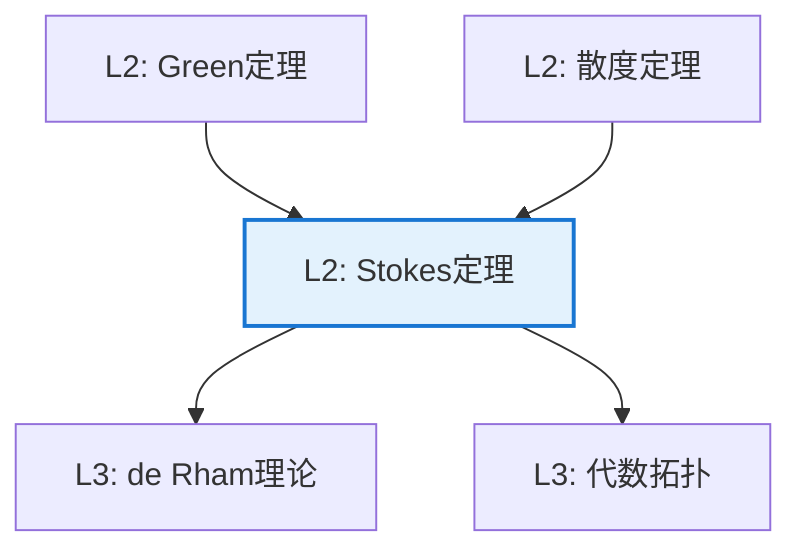

# Stokes 定理

**定理编号**: L2-AN008  
**MSC分类**: 58C35 (流形上的积分)  
**难度等级**: ⭐⭐⭐⭐☆  
**证明策略**: DIR (局部验证) + PTW (单位分解)

---

## 定理陈述

**定理（Stokes 定理）**

设 $M$ 是 $n$ 维有向光滑流形，$\omega$ 是 $M$ 上的 $(n-1)$-形式，具有紧支集，则

$$\int_M d\omega = \int_{\partial M} \omega$$

其中 $\partial M$ 取诱导定向。

**经典形式（$\mathbb{R}^3$）**：
设 $S$ 是有向曲面，边界 $\partial S$，$\mathbf{F}$ 是向量场，则

$$\iint_S (\nabla \times \mathbf{F}) \cdot d\mathbf{S} = \oint_{\partial S} \mathbf{F} \cdot d\mathbf{r}$$

---

## 证明概要

### 关键步骤

```mermaid
flowchart TD
    A[Step 1: 局部坐标<br/>单位分解] --> B[Step 2: 简化到半空间<br/>Hⁿ = {xₙ ≥ 0}]
    B --> C[Step 3: 显式计算<br/>Fubini定理]
    C --> D[Step 4: 边界项匹配<br/>Newton-Leibniz]
    D --> E[结论: 一般形式]
    
    style D fill:#e8f5e9,stroke:#4caf50

```

#### 步骤1：单位分解

由单位分解，只需对支集在坐标卡中的形式证明。

#### 步骤2：半空间情形

设 $\omega$ 支集在 $\mathbb{H}^n = \{x \in \mathbb{R}^n \mid x_n \geq 0\}$ 中。

写 $\omega = \sum_{i=1}^n (-1)^{i-1} f_i dx_1 \wedge \cdots \wedge \widehat{dx_i} \wedge \cdots \wedge dx_n$

#### 步骤3：计算外微分

$$d\omega = \left(\sum_{i=1}^n \frac{\partial f_i}{\partial x_i}\right) dx_1 \wedge \cdots \wedge dx_n$$

#### 步骤4：积分计算

$$\int_{\mathbb{H}^n} d\omega = \sum_{i=1}^n \int_{\mathbb{H}^n} \frac{\partial f_i}{\partial x_i} dV$$

对 $i < n$，积分区域无限，$f_i$ 紧支，故积分为0。

对 $i = n$：
$$\int_{\mathbb{H}^n} \frac{\partial f_n}{\partial x_n} dV = \int_{\mathbb{R}^{n-1}} \left[\int_0^\infty \frac{\partial f_n}{\partial x_n} dx_n\right] d\tilde{x} = -\int_{\mathbb{R}^{n-1}} f_n(x_1, \ldots, x_{n-1}, 0) d\tilde{x}$$

这正是 $\int_{\partial \mathbb{H}^n} \omega$。 $\square$

---

## 依赖关系

### 依赖的L1定义

| 定义 | 说明 |
|-----|------|
| **微分形式** | 反对称张量场 |
| **外微分** | $d: \Omega^k \to \Omega^{k+1}$ |
| **流形定向** | 相容的坐标图册 |
| **诱导定向** | 边界上的相容定向 |
| **形式积分** | 流形上的坐标无关积分 |

### 依赖的L2定理（先修）

- **Green定理**：Stokes定理的2维情形
- **散度定理**：Stokes定理的$n$-形式情形
- **Fubini定理**：重积分化为累次积分

### 支撑的L3理论

| 理论 | 应用 |
|-----|------|
| **de Rham上同调** | 微分形式与拓扑的联系 |
| **代数拓扑** | 同调与上同调的对偶 |
| **数学物理** | 规范场论的作用量 |

---

## 推论与应用

### 重要推论

1. **de Rham定理**：$H^k_{dR}(M) \cong H^k(M; \mathbb{R})$

2. **恰当形式判别**：$d\omega = 0$ 且 $H^k = 0$ 则 $\omega = d\eta$

3. **守恒律**：闭形式的积分只依赖于同调类

### 应用示例

| 应用 | 说明 |
|-----|------|
| 电磁学 | Maxwell方程的积分形式 |
| 流体力学 | Kelvin环量定理 |
| 拓扑学 | 映射度的计算 |

---

## 相关定理网络



---

**文档信息**
- **创建日期**: 2026年4月3日
- **版本**: 1.0
