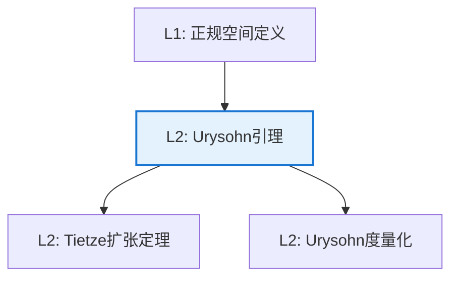

# Urysohn 引理

**定理编号**: L2-T001  
**MSC分类**: 54D15 (分离公理)  
**难度等级**: ⭐⭐⭐⭐☆  
**证明策略**: CST (构造性证明) + IND (归纳构造)

---

## 定理陈述

**定理（Urysohn 引理，1925）**

设 $X$ 是正规空间（$T_4$），$A, B \subseteq X$ 是不相交的闭集。则存在连续函数 $f: X \to [0,1]$ 使得：
- $f|_A = 0$（在 $A$ 上恒为0）
- $f|_B = 1$（在 $B$ 上恒为1）

即正规空间中不相交闭集可用连续函数"分离"。

---

## 证明概要

### 关键步骤

```mermaid
flowchart TD
    A[Step 1: 利用正规性<br/>构造开集族] --> B[Step 2: 有理数索引<br/>U_r 对 r∈ℚ∩[0,1]]
    B --> C[Step 3: 定义f(x)<br/>inf{r | x∈U_r}]

    C --> D[Step 4: 验证连续性<br/>开集原像]
    D --> E[结论: 连续分离函数]
    
    style C fill:#e8f5e9,stroke:#4caf50

```

#### 步骤1-2：构造开集族

利用正规性，构造开集族 $\{U_r\}_{r \in \mathbb{Q} \cap [0,1]}$ 满足：
- $A \subseteq U_0$，$U_1 = X \setminus B$
- $\overline{U_r} \subseteq U_s$ 当 $r < s$

构造方式：枚举有理数，利用正规性逐步添加开集。

#### 步骤3：定义函数

$$f(x) = \inf\{r \in \mathbb{Q} \cap [0,1] \mid x \in U_r\}$$

（约定 $\inf \emptyset = 1$）

#### 步骤4：连续性验证

对任意 $c \in (0,1)$：
- $\{f < c\} = \bigcup_{r < c} U_r$ 是开集
- $\{f > c\} = \bigcup_{r > c} (X \setminus \overline{U_r})$ 是开集

故 $f$ 连续。由构造，$f|_A = 0$，$f|_B = 1$。 $\square$

---

## 依赖关系

### 依赖的L1定义

| 定义 | 说明 |
|-----|------|
| **正规空间** | 不相交闭集有不相交开邻域（$T_4$） |
| **连续函数** | 开集原像开 |
| **闭包** | $\overline{A}$，包含 $A$ 的最小闭集 |
| **下确界** | 集合的最大下界 |

### 依赖的L2定理（先修）

- **正规空间性质**：单点闭 + 闭集分离
- **开集与闭集关系**：补集关系

### 支撑的L3理论

| 理论 | 应用 |
|-----|------|
| **度量化定理** | Urysohn度量化定理的基础 |
| **函数空间** | $C(X)$ 的分离性质 |
| **模糊拓扑** | 连续隶属函数的存在性 |

---

## 推论与应用

### 重要推论

1. **Tietze扩张定理**：正规空间中闭子集上的连续函数可连续扩张到全空间。

2. **Urysohn度量化定理**：第二可数的正则空间可度量化。

3. **正规空间的函数刻画**：$X$ 正规 $\Leftrightarrow$ 任意不相交闭集可被连续函数分离。

### 应用示例

| 应用 | 说明 |
|-----|------|
| 泛函分析 | $C(X)$ 的丰富性 |
| 维数理论 | 覆盖维数的定义 |
| 模糊数学 | 隶属函数的构造 |

---

## 相关定理网络



---

**文档信息**
- **创建日期**: 2026年4月3日
- **版本**: 1.0
