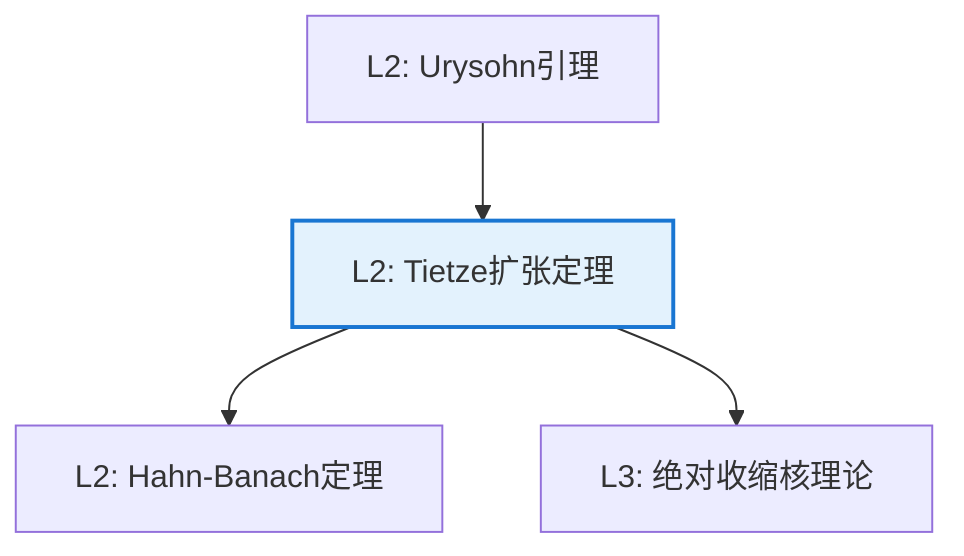

# Tietze 扩张定理

**定理编号**: L2-T002  
**MSC分类**: 54C20 (扩张、限制及相关映射)  
**难度等级**: ⭐⭐⭐⭐☆  
**证明策略**: CST (构造性证明) + IND (逐步逼近)

---

## 定理陈述

**定理（Tietze 扩张定理，1915）**

设 $X$ 是正规空间，$A \subseteq X$ 是闭子集，$f: A \to \mathbb{R}$ 连续。则存在连续扩张 $F: X \to \mathbb{R}$ 使得 $F|_A = f$。

若 $|f| \leq M$，则可取 $|F| \leq M$。

---

## 证明概要

### 关键步骤

```mermaid
flowchart TD
    A[Step 1: 标准化<br/>|f| ≤ 1] --> B[Step 2: 构造F₁<br/>Urysohn引理]

    B --> C[Step 3: 迭代逼近<br/>级数构造]
    C --> D[Step 4: 一致收敛<br/>Weierstrass M判别]
    D --> E[结论: 连续扩张]
    
    style D fill:#e8f5e9,stroke:#4caf50

```

#### 步骤1：标准化

设 $|f| \leq 1$（一般情形线性变换）。

#### 步骤2：第一步逼近

令 $A_0 = f^{-1}([-1, -1/3])$，$B_0 = f^{-1}([1/3, 1])$。

由Urysohn引理，存在 $g_1: X \to [-1/3, 1/3]$ 使得 $g_1|_{A_0} = -1/3$，$g_1|_{B_0} = 1/3$。

则 $|f(x) - g_1(x)| \leq 2/3$ 对所有 $x \in A$。

#### 步骤3：迭代构造

对 $f_1 = f - g_1$ 重复，得 $g_2$，满足 $|g_2| \leq \frac{1}{3} \cdot \frac{2}{3}$，$|f_1 - g_2| \leq (2/3)^2$。

继续得序列 $\{g_n\}$，满足 $|g_n| \leq \frac{1}{3} \cdot \left(\frac{2}{3}\right)^{n-1}$。

#### 步骤4：级数收敛

定义 $F = \sum_{n=1}^\infty g_n$。

- 由Weierstrass M判别法，级数一致收敛，故 $F$ 连续
- $|F| \leq \sum_{n=1}^\infty \frac{1}{3} \cdot \left(\frac{2}{3}\right)^{n-1} = 1$
- 在 $A$ 上，$F|_A = f$ 由构造保证 $\square$

---

## 依赖关系

### 依赖的L1定义

| 定义 | 说明 |
|-----|------|
| **正规空间** | $T_4$ 空间 |
| **闭子集** | 补集为开集的子集 |
| **连续扩张** | $F: X \to Y$ 满足 $F|_A = f$ |
| **一致收敛** | 上确界范数收敛 |

### 依赖的L2定理（先修）

- **Urysohn引理**：不相交闭集的函数分离
- **Weierstrass M判别法**：一致收敛的判别

### 支撑的L3理论

| 理论 | 应用 |
|-----|------|
| **度量空间** | 度量空间中闭集的扩张 |
| **绝对收缩核** | ANR空间的性质 |
| **函数空间** | $C(X)$ 的延拓性质 |

---

## 推论与应用

### 重要推论

1. **度量空间情形**：度量空间中的Tietze定理（可直接构造）。

2. **向量值扩张**：可推广到 $\mathbb{R}^n$ 值函数。

3. **正规性的刻画**：$X$ 正规 $\Leftrightarrow$ 任意闭子集上的连续实函数可扩张。

### 应用示例

| 应用 | 说明 |
|-----|------|
| 泛函分析 | Hahn-Banach定理的几何形式 |
| 逼近论 | 连续函数的最佳逼近 |
| 拓扑学 | ANR空间的判定 |

---

## 相关定理网络



---

**文档信息**
- **创建日期**: 2026年4月3日
- **版本**: 1.0
