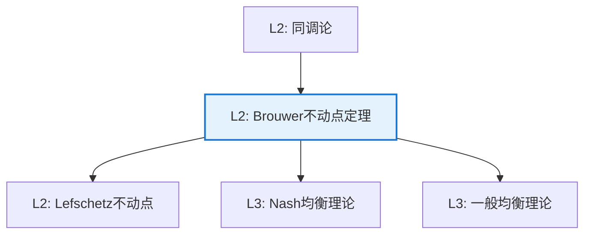

# Brouwer 不动点定理

**定理编号**: L2-T003  
**MSC分类**: 54H25 (连续映射的不动点)  
**难度等级**: ⭐⭐⭐⭐☆  
**证明策略**: CON (反证法) + ALG (代数拓扑)

---

## 定理陈述

**定理（Brouwer 不动点定理，1910）**

设 $B^n = \{x \in \mathbb{R}^n \mid \|x\| \leq 1\}$ 是 $n$ 维闭单位球，$f: B^n \to B^n$ 连续。则存在 $x \in B^n$ 使得 $f(x) = x$。

即 $B^n$ 具有不动点性质。

---

## 证明概要（代数拓扑方法）

### 关键步骤

```mermaid
flowchart TD
    A[Step 1: 假设反证<br/>f无不动点] --> B[Step 2: 定义收缩<br/>r: Bⁿ→Sⁿ⁻¹]
    B --> C[Step 3: 诱导同态<br/>r_*: H_{n-1}(Bⁿ)→H_{n-1}(Sⁿ⁻¹)]
    C --> D[Step 4: 导出矛盾<br/>0 = ℤ]
    D --> E[结论: 不动点存在]
    
    style D fill:#ffebee,stroke:#f44336

```

#### 步骤1：反证假设

假设 $f(x) \neq x$ 对所有 $x \in B^n$。

#### 步骤2：收缩映射的显式构造

**几何构造**:

对每个 $x \in B^n$，考虑从 $f(x)$ 经过 $x$ 的射线：
$$\gamma_x(t) = f(x) + t(x - f(x)), \quad t \geq 0$$

这条射线与边界 $S^{n-1} = \{y : \|y\| = 1\}$ 相交于唯一点 $r(x)$。

**求解 $r(x)$**:

设 $r(x) = f(x) + t_0(x - f(x))$，其中 $t_0 > 0$ 满足 $\|r(x)\| = 1$。

解方程 $\|f(x) + t(x - f(x))\|^2 = 1$:

展开：
$$\|f(x)\|^2 + 2t\langle f(x), x-f(x)\rangle + t^2\|x-f(x)\|^2 = 1$$

这是 $t$ 的二次方程，由于 $f(x) \neq x$（反证假设），$\|x - f(x)\| > 0$。

判别式为正（由几何直观，射线必与球面相交），取正根 $t_0$。

**连续性验证**:

$r(x)$ 的表达式由代数运算（加、减、数乘、内积、开方）构成，这些运算都是连续的。

因此 $r: B^n \to S^{n-1}$ 连续。

**收缩性质验证**:

若 $x \in S^{n-1}$（即 $\|x\| = 1$），射线从 $f(x)$ 经过 $x$ 与球面的交点就是 $x$ 本身（因为 $x$ 已在球面上）。

因此 $r(x) = x$ 对所有 $x \in S^{n-1}$ 成立，即 $r$ 是收缩映射。 $\square$

#### 步骤3：诱导同态

考虑包含映射 $i: S^{n-1} \hookrightarrow B^n$。

$r \circ i = \text{id}_{S^{n-1}}$，故 $(r \circ i)_* = r_* \circ i_* = \text{id}_{H_{n-1}(S^{n-1})}$。

#### 步骤4：导出矛盾

- $H_{n-1}(B^n) = 0$（球可缩）
- $H_{n-1}(S^{n-1}) = \mathbb{Z}$（球面的拓扑不变量）

$i_*: \mathbb{Z} \to 0$ 是零映射，故 $r_* \circ i_* = 0$，与 $r_* \circ i_* = \text{id}$ 矛盾。 $\square$

---

## 依赖关系

### 依赖的L1定义

| 定义 | 说明 |
|-----|------|
| **不动点** | $f(x) = x$ 的点 |
| **连续映射** | 拓扑空间间的连续函数 |
| **收缩** | $r: X \to A$ 满足 $r|_A = \text{id}$ |
| **同调群** | $H_k(X)$，拓扑不变量 |

### 依赖的L2定理（先修）

- **同调函子性质**：$(f \circ g)_* = f_* \circ g_*$
- **球面同调**：$H_{n-1}(S^{n-1}) = \mathbb{Z}$
- **可缩空间同调**：$H_k(B^n) = 0$（$k > 0$）

### 支撑的L3理论

| 理论 | 应用 |
|-----|------|
| **不动点理论** | Lefschetz不动点定理 |
| **博弈论** | Nash均衡的存在性 |
| **微分方程** | 周期解的存在性 |
| **经济学** | 一般均衡理论 |

---

## 推论与应用

### 重要推论

1. **Perron-Frobenius定理**：正矩阵存在正特征值。

2. **Nash均衡存在性**：有限博弈存在混合策略均衡。

3. **庞加莱-Bendixson定理**：平面动力系统的周期轨道。

### 应用示例

| 应用 | 说明 |
|-----|------|
| 经济学 | Arrow-Debreu一般均衡 |
| 博弈论 | Nash均衡的计算 |
| 微分方程 | Brouwer度的应用 |
| 图论 | 图着色的组合证明 |

---

## 相关定理网络



---

**文档信息**
- **创建日期**: 2026年4月3日
- **版本**: 1.0
