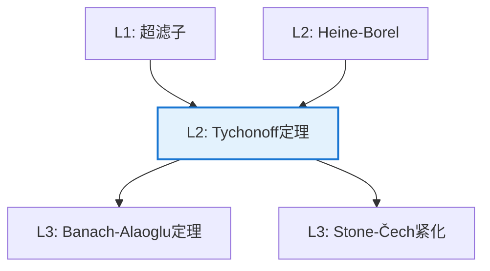

# Tychonoff 定理

**定理编号**: L2-T004  
**MSC分类**: 54D30 (紧性)  
**难度等级**: ⭐⭐⭐⭐⭐  
**证明策略**: CON (反证法) + CST (超滤子/网)

---

## 定理陈述

**定理（Tychonoff 定理，1930）**

设 $\{X_\alpha\}_{\alpha \in I}$ 是一族拓扑空间，则

$$\prod_{\alpha \in I} X_\alpha \text{ 紧} \Leftrightarrow \text{每个 } X_\alpha \text{ 紧}$$

即**任意**个紧空间的乘积是紧的（积拓扑下）。

---

## 证明概要（超滤子方法）

### 关键步骤

```mermaid
flowchart TD
    A[Step 1: 取超滤子<br/>F在∏Xₐ上] --> B[Step 2: 投影超滤子<br/>πₐ(F)在Xₐ]
    B --> C[Step 3: 投影收敛<br/>Xₐ紧⇒极限存在]
    C --> D[Step 4: 乘积收敛<br/>逐分量收敛]
    D --> E[结论: 乘积紧]
    
    style D fill:#e8f5e9,stroke:#4caf50

```

#### 步骤1-2：超滤子投影

设 $\mathcal{F}$ 是 $\prod X_\alpha$ 上的超滤子。

对每个 $\alpha$，投影 $\pi_\alpha(\mathcal{F})$ 是 $X_\alpha$ 上的超滤子。

#### 步骤3：分量收敛

因 $X_\alpha$ 紧，超滤子 $\pi_\alpha(\mathcal{F})$ 收敛到某点 $x_\alpha \in X_\alpha$。

#### 步骤4：乘积收敛详细证明

**引理（逐分量收敛）**: 在积拓扑中，滤子 $\mathcal{F}$ 收敛于 $x = (x_\alpha)$ 当且仅当对每个 $\alpha$，投影滤子 $\pi_\alpha(\mathcal{F})$ 收敛于 $x_\alpha$。

*证明*:

**($\Rightarrow$)**: 若 $\mathcal{F} \to x$，则对 $x$ 的任意邻域 $U$，有 $U \in \mathcal{F}$。

积拓扑的子基由形如 $\pi_\alpha^{-1}(U_\alpha)$ 的集合组成，其中 $U_\alpha$ 是 $X_\alpha$ 中的开集。

若 $U_\alpha$ 是 $x_\alpha$ 的邻域，则 $\pi_\alpha^{-1}(U_\alpha)$ 是 $x$ 的邻域。

因此 $\pi_\alpha^{-1}(U_\alpha) \in \mathcal{F}$，即 $U_\alpha \in \pi_\alpha(\mathcal{F})$。

这说明 $\pi_\alpha(\mathcal{F}) \to x_\alpha$。

**($\Leftarrow$)**: 设对每个 $\alpha$，$\pi_\alpha(\mathcal{F}) \to x_\alpha$。

需证对 $x$ 的任意子基邻域 $\pi_\alpha^{-1}(U_\alpha)$，有 $\pi_\alpha^{-1}(U_\alpha) \in \mathcal{F}$。

由假设，$U_\alpha \in \pi_\alpha(\mathcal{F})$，即存在 $A \in \mathcal{F}$ 使得 $\pi_\alpha(A) \subseteq U_\alpha$。

因此 $A \subseteq \pi_\alpha^{-1}(U_\alpha)$，由滤子向上封闭性，$\pi_\alpha^{-1}(U_\alpha) \in \mathcal{F}$。

由于滤子包含子基则包含基，$\mathcal{F}$ 包含 $x$ 的所有邻域，即 $\mathcal{F} \to x$。 $\square$

**完成Tychonoff定理证明**:

1. 任取 $\prod X_\alpha$ 上的超滤子 $\mathcal{F}$
2. 对每个 $\alpha$，$\pi_\alpha(\mathcal{F})$ 是 $X_\alpha$ 上的超滤子
3. 由 $X_\alpha$ 紧，存在 $x_\alpha \in X_\alpha$ 使得 $\pi_\alpha(\mathcal{F}) \to x_\alpha$
4. 由引理，$\mathcal{F} \to (x_\alpha)$
5. 因此 $\prod X_\alpha$ 紧。 $\square$

### 补充：紧性的超滤子刻画证明

**定理**: 拓扑空间 $X$ 紧当且仅当每个超滤子都收敛。

*证明*:

**($\Rightarrow$)**: 设 $X$ 紧，$\mathcal{F}$ 是超滤子。

假设 $\mathcal{F}$ 不收敛，则对每个 $x \in X$，存在开邻域 $U_x$ 使得 $U_x \notin \mathcal{F}$。

由于 $\mathcal{F}$ 是超滤子，$X \setminus U_x \in \mathcal{F}$。

$\{U_x : x \in X\}$ 是 $X$ 的开覆盖，由紧性，存在有限子覆盖 $U_{x_1}, \ldots, U_{x_n}$。

则 $\bigcup_{i=1}^n U_{x_i} = X \in \mathcal{F}$。

但 $X \setminus U_{x_i} \in \mathcal{F}$ 对所有 $i$，故 $\bigcap_{i=1}^n (X \setminus U_{x_i}) = X \setminus \bigcup_{i=1}^n U_{x_i} = \emptyset \in \mathcal{F}$，矛盾。

**($\Leftarrow$)**: 设每个超滤子收敛，证明 $X$ 紧。

设 $\{U_\alpha\}$ 是开覆盖，假设无有限子覆盖。

则 $\{X \setminus U_\alpha\}$ 有有限交性质，生成滤子 $\mathcal{F}$，包含于某超滤子 $\mathcal{U}$。

由假设，$\mathcal{U} \to x$ 对某 $x \in X$。

存在 $\alpha$ 使得 $x \in U_\alpha$，故 $U_\alpha \in \mathcal{U}$。

但 $X \setminus U_\alpha \in \mathcal{F} \subseteq \mathcal{U}$，故 $\emptyset = U_\alpha \cap (X \setminus U_\alpha) \in \mathcal{U}$，矛盾。 $\square$

---

## 依赖关系

### 依赖的L1定义

| 定义 | 说明 |
|-----|------|
| **紧空间** | 每个开覆盖有有限子覆盖 |
| **积拓扑** | 最粗的使投影连续的拓扑 |
| **超滤子** | 极大的滤子 |
| **超滤子收敛** | 包含所有邻域的超滤子 |

### 依赖的L2定理（先修）

- **紧性的超滤子刻画**：$X$ 紧 $\Leftrightarrow$ 每个超滤子收敛
- **积拓扑的刻画**：网/滤子在积空间收敛 $\Leftrightarrow$ 逐分量收敛

### 支撑的L3理论

| 理论 | 应用 |
|-----|------|
| **泛函分析** | Banach-Alaoglu定理 |
| **Stone-Čech紧化** | 离散空间的紧化 |
| **逻辑学** | 紧致性定理（拓扑证明） |

---

## 推论与应用

### 重要推论

1. **Banach-Alaoglu定理**：Banach空间对偶空间的单位球在弱*拓扑下紧。

2. **Heine-Borel的推广**：$[0,1]^I$ 对任意指标集 $I$ 紧。

3. **逻辑紧致性**：一阶逻辑的紧致性定理（拓扑证明）。

### 应用示例

| 应用 | 说明 |
|-----|------|
| 泛函分析 | 弱收敛的子列提取 |
| 动力系统 | 符号空间的紧性 |
| 数理逻辑 | 模型论中的紧性 |

---

## 历史注记

- **1930年**：Andrey Nikolayevich Tychonoff 证明
- **证明依赖选择公理**：该定理等价于选择公理
- **影响**：一般拓扑学的里程碑结果

---

## 相关定理网络



---

**文档信息**
- **创建日期**: 2026年4月3日
- **版本**: 1.0
