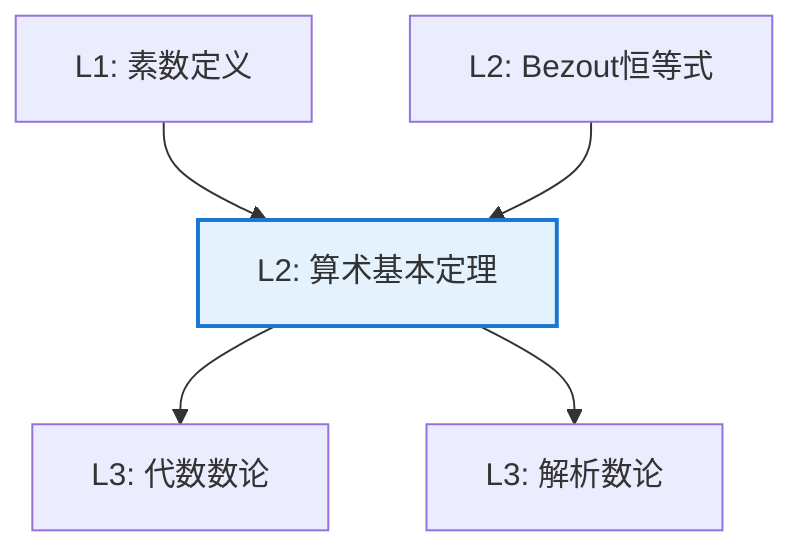

# 算术基本定理（唯一分解定理）

**定理编号**: L2-NL001  
**MSC分类**: 11A51 (因子ization；素数)  
**难度等级**: ⭐⭐☆☆☆  
**证明策略**: IND (归纳法) + CON (反证法)

---

## 定理陈述

**定理（算术基本定理）**

每个大于1的整数 $n$ 可以唯一地（不计因子顺序）表示为：

$$n = p_1^{a_1} p_2^{a_2} \cdots p_k^{a_k}$$

其中 $p_1 < p_2 < \cdots < p_k$ 是素数，$a_i \geq 1$ 是整数。

---

## 证明概要

### 关键步骤

```mermaid
flowchart TD
    A[Step 1: 存在性<br/>最小反例法] --> B[Step 2: Euclid引理<br/>p|ab ⇒ p|a 或 p|b]

    B --> C[Step 3: 唯一性<br/>归纳法]
    C --> D[结论: 分解唯一]
    
    style D fill:#e8f5e9,stroke:#4caf50

```

#### 步骤1：存在性

假设存在不能分解的最小整数 $n > 1$。
- 若 $n$ 素数，则 $n = n$ 是分解
- 若 $n$ 合数，则 $n = ab$，$1 < a, b < n$
- 由最小性，$a, b$ 均可分解，故 $n$ 可分解

矛盾，故存在性成立。

#### 步骤2：Euclid引理

若素数 $p \mid ab$，则 $p \mid a$ 或 $p \mid b$。

*证明*：若 $p \nmid a$，则 $\gcd(p,a) = 1$，存在 $x, y$ 使得 $px + ay = 1$。
乘 $b$ 得 $pbx + aby = b$，故 $p \mid b$。

#### 步骤3：唯一性

设 $n = p_1 \cdots p_r = q_1 \cdots q_s$ 为两个分解。

由Euclid引理，$p_1$ 整除某个 $q_j$，故 $p_1 = q_j$（因 $q_j$ 素）。
约去后由归纳假设即得唯一性。 $\square$

---

## 依赖关系

### 依赖的L1定义

| 定义 | 说明 |
|-----|------|
| **素数** | $>1$ 的整数，正因子只有1和自身 |
| **整除** | $a \mid b$ 当且仅当 $b = ac$ |
| **最大公约数** | $\gcd(a,b)$，最大的公共因子 |
| **互素** | $\gcd(a,b) = 1$ |

### 依赖的L2定理（先修）

- **Bezout恒等式**：$\gcd(a,b) = d \Rightarrow \exists x,y: ax + by = d$
- **带余除法**：$a = bq + r$，$0 \leq r < b$

### 支撑的L3理论

| 理论 | 应用 |
|-----|------|
| **代数数论** | 理想唯一分解定理 |
| **解析数论** | 素数分布，ζ函数 |
| **计算数论** | 因子分解算法 |

---

## 推论与应用

### 重要推论

1. **约数个数**：$\tau(n) = (a_1+1)(a_2+1)\cdots(a_k+1)$

2. **GCD/LCM公式**：
   - $\gcd(a,b) = \prod p_i^{\min(a_i, b_i)}$
   - $\text{lcm}(a,b) = \prod p_i^{\max(a_i, b_i)}$

3. **Dirichlet卷积**：数论函数的代数结构

### 应用示例

| 应用 | 说明 |
|-----|------|
| 密码学 | RSA基于分解困难性 |
| 编码理论 | 循环码的构造 |
| 组合数学 | 计数问题的工具 |

---

## 相关定理网络



---

**文档信息**
- **创建日期**: 2026年4月3日
- **版本**: 1.0
