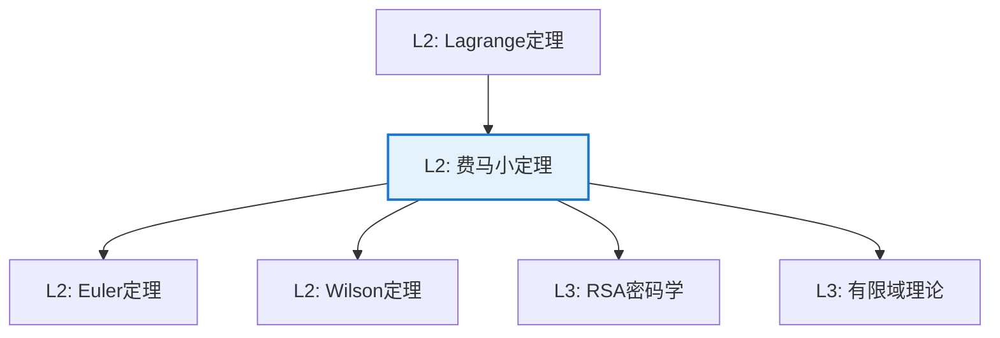

# 费马小定理

**定理编号**: L2-NL002  
**MSC分类**: 11A07 (同余；原根；剩余系)  
**难度等级**: ⭐⭐☆☆☆  
**证明策略**: DIR (直接证明) + ACT (群作用)

---

## 定理陈述

**定理（Fermat 小定理，1640）**

设 $p$ 是素数，$a$ 是整数且 $p \nmid a$，则

$$a^{p-1} \equiv 1 \pmod{p}$$

**等价形式**：对所有整数 $a$，$a^p \equiv a \pmod{p}$。

---

## 证明概要

### 关键步骤（群论方法）

```mermaid
flowchart TD
    A[Step 1: 乘法群<br/>(ℤ/pℤ)*] --> B[Step 2: 群的阶<br/>|(ℤ/pℤ)*| = p-1]

    B --> C[Step 3: Lagrange定理<br/>a^{p-1} = 1]
    C --> D[结论: 同余式成立]
    
    style C fill:#e8f5e9,stroke:#4caf50

```

#### 步骤1：乘法群

$(\mathbb{Z}/p\mathbb{Z})^* = \{1, 2, \ldots, p-1\}$ 在模 $p$ 乘法下构成群。

#### 步骤2：群的阶

$|(\mathbb{Z}/p\mathbb{Z})^*| = p-1$（所有非零元都可逆）。

#### 步骤3：Lagrange定理

对任意 $a \in (\mathbb{Z}/p\mathbb{Z})^*$，由Lagrange定理，$|a|$ 整除 $p-1$。

故 $a^{p-1} = 1$ 在 $(\mathbb{Z}/p\mathbb{Z})^*$ 中，即 $a^{p-1} \equiv 1 \pmod{p}$。 $\square$

---

## 证明概要（组合方法）

### 关键步骤

```mermaid
flowchart TD
    A[Step 1: 考虑p元组<br/>(a₁,...,aₚ)] --> B[Step 2: 循环群作用<br/>ℤ/pℤ]
    B --> C[Step 3: 计数轨道<br/>单点+长度为p]
    C --> D[Step 4: 同余条件<br/>a^p ≡ a]
    
    style D fill:#e8f5e9,stroke:#4caf50

```

#### 详细证明

考虑所有满足 $a_i \in \{1, \ldots, a\}$ 的 $p$-元组 $(a_1, \ldots, a_p)$。

循环群 $\mathbb{Z}/p\mathbb{Z}$ 通过轮换作用于这些元组。

轨道要么：
- 长度为1（所有元素相同）：共 $a$ 个
- 长度为 $p$（循环不同）：共 $\frac{a^p - a}{p}$ 个

因轨道数必须为整数，故 $p \mid (a^p - a)$。 $\square$

---

## 依赖关系

### 依赖的L1定义

| 定义 | 说明 |
|-----|------|
| **模运算** | 整数模 $p$ 的等价类 |
| **乘法群** | 可逆元构成的群 |
| **元素的阶** | 使得 $a^n = 1$ 的最小正整数 $n$ |

### 依赖的L2定理（先修）

- **Lagrange定理**：子群阶整除群阶
- **群作用轨道公式**：轨道-稳定子定理

### 支撑的L3理论

| 理论 | 应用 |
|-----|------|
| **RSA加密** | 公钥密码学基础 |
| **素性测试** | Miller-Rabin测试 |
| **有限域理论** | $\mathbb{F}_p$ 的结构 |

---

## 推论与应用

### 重要推论

1. **Euler定理推广**：$a^{\phi(n)} \equiv 1 \pmod{n}$（当 $\gcd(a,n) = 1$）

2. **Wilson定理**：$(p-1)! \equiv -1 \pmod{p}$

3. **原根存在性**：$(\mathbb{Z}/p\mathbb{Z})^*$ 是循环群

### 应用示例

| 应用 | 说明 |
|-----|------|
| RSA加密 | $a^{ed} \equiv a \pmod{n}$ |
| 素性测试 | Fermat测试，强伪素数 |
| 随机数生成 | 线性同余生成器 |

---

## 相关定理网络



---

**文档信息**
- **创建日期**: 2026年4月3日
- **版本**: 1.0
