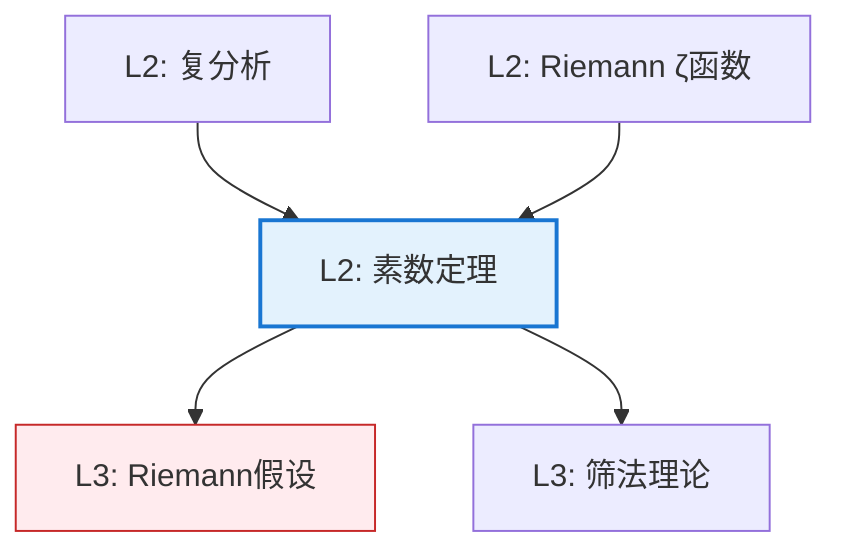

# 素数定理

**定理编号**: L2-NL003  
**MSC分类**: 11N05 (素数分布)  
**难度等级**: ⭐⭐⭐⭐⭐  
**证明策略**: ANA (解析方法) + CST (复分析)

---

## 定理陈述

**定理（素数定理，PNT）**

设 $\pi(x)$ 为不超过 $x$ 的素数个数，则

$$\pi(x) \sim \frac{x}{\ln x}$$

即 $\displaystyle\lim_{x \to \infty} \frac{\pi(x)}{x/\ln x} = 1$。

**等价形式**：第 $n$ 个素数 $p_n \sim n \ln n$。

---

## 证明概要（解析方法）

### 关键步骤

```mermaid
flowchart TD
    A[Step 1: Riemann ζ函数<br/>ζ(s) = Σ n^{-s}] --> B[Step 2: 欧拉乘积<br/>ζ(s) = ∏(1-p^{-s})^{-1}]
    B --> C[Step 3: 零free区域<br/>Re(s) ≥ 1]
    C --> D[Step 4: 围道积分<br/>显式公式]
    D --> E[Step 5: 渐近分析<br/>π(x) ~ x/ln x]
    
    style E fill:#e8f5e9,stroke:#4caf50

```

#### 步骤1-2：ζ函数与欧拉乘积

$$\zeta(s) = \sum_{n=1}^\infty \frac{1}{n^s} = \prod_p \frac{1}{1 - p^{-s}}$$

取对数微分得：
$$-\frac{\zeta'(s)}{\zeta(s)} = \sum_p \frac{\ln p}{p^s - 1}$$

#### 步骤3：零点分布

**关键定理**：$\zeta(s)$ 在 $\text{Re}(s) \geq 1$ 上无零点。

#### 步骤4：显式公式

$$\psi(x) = \sum_{n \leq x} \Lambda(n) = x - \sum_\rho \frac{x^\rho}{\rho} + O(\ln^2 x)$$

其中 $\rho$ 是 $\zeta$ 的非平凡零点，$\Lambda$ 是von Mangoldt函数。

#### 步骤5：渐近推导

利用 $\zeta$ 的零free区域估计，证明余项可控，得：
$$\psi(x) \sim x \Rightarrow \pi(x) \sim \frac{x}{\ln x}$$ $\square$

---

## 依赖关系

### 依赖的L1定义

| 定义 | 说明 |
|-----|------|
| **素数计数函数** | $\pi(x) = \#\{p \leq x \mid p \text{ 素数}\}$ |
| **渐近等价** | $f \sim g$ 当 $\lim f/g = 1$ |
| **Riemann ζ函数** | $\zeta(s) = \sum n^{-s}$（$\text{Re}(s) > 1$） |
| **零点** | 使 $\zeta(s) = 0$ 的复数 $s$ |

### 依赖的L2定理（先修）

- **Euler乘积公式**：ζ函数的乘积表示
- **Cauchy积分定理**：围道积分工具
- **调和级数渐近**：$\sum_{n \leq x} 1/n \sim \ln x$

### 支撑的L3理论

| 理论 | 应用 |
|-----|------|
| **Riemann假设** | 零点分布与误差项 |
| **筛法** | 组合方法与解析方法结合 |
| **随机矩阵** | 零点分布的统计模型 |

---

## 推论与应用

### 重要推论

1. **第n素数**：$p_n \sim n \ln n$

2. **素数间隙**：$p_{n+1} - p_n$ 的平均阶为 $\ln p_n$

3. **孪生素数密度**：若孪生素数无限，则其密度为 $O(x/\ln^2 x)$

### 应用示例

| 应用 | 说明 |
|-----|------|
| 密码学 | RSA素数生成的规模估计 |
| 算法分析 | 涉及素数的算法复杂度 |
| 随机模型 | Cramér模型，素数的随机行为 |

---

## 历史注记

| 年份 | 进展 |
|------|------|
| 1798 | Legendre 猜想 $\pi(x) \sim x/(\ln x - 1.08366)$ |
| 1849 | 高斯猜想 $\pi(x) \sim \text{Li}(x)$ |
| 1859 | Riemann 开创解析方法 |
| 1896 | Hadamard 和 de la Vallée Poussin 独立证明 |
| 1949 | Erdős 和 Selberg 给出初等证明 |

---

## 相关定理网络



---

**文档信息**
- **创建日期**: 2026年4月3日
- **版本**: 1.0
