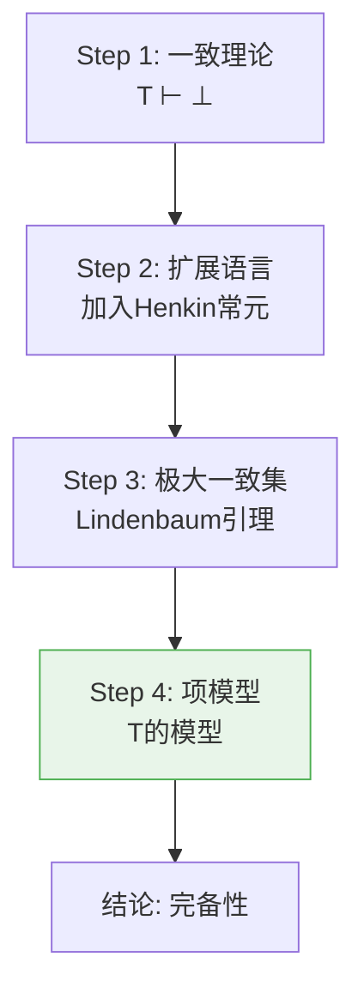
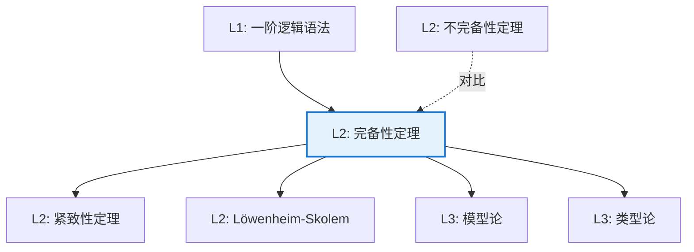

# Gödel 完备性定理

**定理编号**: L2-NL004  
**MSC分类**: 03C05 (等式模型，泛代数和字问题) / 03B10 (经典一阶逻辑)  
**难度等级**: ⭐⭐⭐⭐☆  
**证明策略**: CST (模型构造) + DIR (Henkin构造)

---

## 定理陈述

**定理（Gödel 完备性定理，1929）**

设 $T$ 是一阶理论，$\varphi$ 是句子，则

$$T \vdash \varphi \Leftrightarrow T \models \varphi$$

即：**可证当且仅当语义有效**（所有模型满足）。

**等价形式**：一致的理论有模型。

---

## 证明概要（Henkin构造）

### 关键步骤

#### 步骤1：一致理论

假设 $T$ 一致（$T \nvdash \bot$）。

#### 步骤2：Henkin扩展

对每个公式 $\exists x \varphi(x)$，引入新常元 $c$ 和公理 $\exists x \varphi(x) \to \varphi(c)$。

这保证"存在即有名"。

#### 步骤3：极大一致集

由Lindenbaum引理，将 $T$ 扩展为**极大一致集** $T^*$：
- $T^*$ 一致
- 对任意 $\varphi$，$\varphi \in T^*$ 或 $\neg\varphi \in T^*$

#### 步骤4：项模型构造

定义等价关系：$t \sim s$ 当且仅当 $t = s \in T^*$。

以等价类为论域，自然解释函数和谓词符号，构成 $T$ 的模型。 $\square$

---

## 依赖关系

### 依赖的L1定义

| 定义 | 说明 |
|-----|------|
| **一阶语言** | 量词、变元、谓词、函数的语法 |
| **证明** | 形式系统中的语法推导 $T \vdash \varphi$ |
| **模型** | 语义解释 $\mathcal{M} \models \varphi$ |
| **一致性** | $T \nvdash \bot$（不推出矛盾） |

### 依赖的L2定理（先修）

- **演绎定理**：$T \cup \{\varphi\} \vdash \psi \Leftrightarrow T \vdash \varphi \to \psi$
- **紧致性定理**（完备性的推论）

### 支撑的L3理论

| 理论 | 应用 |
|-----|------|
| **模型论** | 结构分类，稳定性理论 |
| **自动定理证明** | 归结原理， tableau方法 |
| **类型论** | 证明论与范畴论语义 |

---

## 推论与应用

### 重要推论

1. **紧致性定理**：$T$ 有模型当且仅当每个有限子集有模型。

2. **Löwenheim-Skolem定理**：可数语言中的可满足理论有可數模型。

3. **不可判定性**：有效公式的集合是递归可枚举的。

### 应用示例

| 应用 | 说明 |
|-----|------|
| 代数 | 非标准分析，超积构造 |
| 图论 | 无限图的存在性 |
| 计算机科学 | 逻辑程序设计，Prolog |

---

## 与不完备性的关系

| 定理 | 内容 | 意义 |
|------|------|------|
| **完备性定理** | 语义有效 = 语法可证 | 证明系统的充分性 |
| **不完备性定理** | 存在真不可证句子 | 算术的固有限制 |

关键区别：完备性针对**一阶逻辑**本身，不完备性针对**特定理论**（如PA）。

---

## 相关定理网络

---

**文档信息**
- **创建日期**: 2026年4月3日
- **版本**: 1.0
