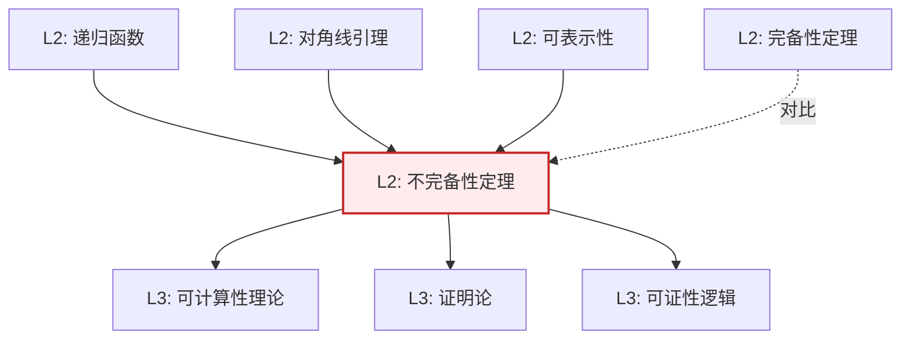

# Gödel 不完备性定理

**定理编号**: L2-NL005  
**MSC分类**: 03F40 (Gödel数与不完全性定理)  
**难度等级**: ⭐⭐⭐⭐⭐  
**证明策略**: DIA (对角线论证) + CST (自指构造)

---

## 定理陈述

### 第一不完备性定理

设 $T$ 是包含皮亚诺算术（PA）的一致可公理化理论，则存在语句 $G$ 使得：
- $T \nvdash G$（$G$ 在 $T$ 中不可证）
- $T \nvdash \neg G$（$\neg G$ 在 $T$ 中不可证）

即 $T$ 是**不完全**的。

### 第二不完备性定理

设 $T$ 如上，则 $T$ 不能证明自身的一致性：

$$T \nvdash \text{Con}(T)$$

其中 $\text{Con}(T)$ 表示"$T$ 是一致的"。

---

## 证明概要（第一定理）

### 关键步骤

```mermaid
flowchart TD
    A[Step 1: Gödel编码<br/>语法对象↔数字] --> B[Step 2: 可表示性<br/>递归关系可表示]
    B --> C[Step 3: 对角线引理<br/>∃G: T⊢G↔¬Prov(⌜G⌝)]
    C --> D[Step 4: 不可证性<br/>假设可证导出矛盾]
    D --> E[结论: G独立]
    
    style C fill:#e8f5e9,stroke:#4caf50
```

#### 步骤1：Gödel编码

将符号、公式、证明等语法对象编码为自然数（Gödel数）。

- $\ulcorner \varphi \urcorner$：公式 $\varphi$ 的编码
- $\text{Prov}_T(n)$：$n$ 编码 $T$ 中的证明

#### 步骤2：可表示性

PA 能表示递归关系。存在公式 $\text{Prov}_T(x)$ 使得：
- $T \vdash \varphi \Rightarrow T \vdash \text{Prov}_T(\ulcorner \varphi \urcorner)$
- $T \nvdash \varphi \Rightarrow T \vdash \neg\text{Prov}_T(\ulcorner \varphi \urcorner)$（在 $T$ 是 $\omega$-一致时）

#### 步骤3：对角线引理

**引理**：对任意公式 $\psi(x)$，存在句子 $G$ 使得
$$T \vdash G \leftrightarrow \psi(\ulcorner G \urcorner)$$

取 $\psi(x) = \neg\text{Prov}_T(x)$，得
$$G: \text{"} G \text{ 在 } T \text{ 中不可证"}$$

#### 步骤4：不可证性证明

假设 $T \vdash G$：
- 由可表示性，$T \vdash \text{Prov}_T(\ulcorner G \urcorner)$
- 由 $G$ 的定义，$T \vdash \neg\text{Prov}_T(\ulcorner G \urcorner)$
- 矛盾！

假设 $T \vdash \neg G$：
- 则 $T \vdash \text{Prov}_T(\ulcorner G \urcorner)$，即 $T$ "相信" $G$ 可证
- 若 $T$ 是 $\omega$-一致的，则实际上 $T \nvdash G$
- 这与 $T \vdash G$ 矛盾

因此 $G$ 在 $T$ 中不可判定。 $\square$

---

## 依赖关系

### 依赖的L1定义

| 定义 | 说明 |
|-----|------|
| **可公理化理论** | 递归可枚举公理集生成的理论 |
| **一致性** | 不推出矛盾（$T \nvdash \bot$）|
| **Gödel编码** | 语法到算术的映射 |
| **递归函数** | 可计算函数 |

### 依赖的L2定理（先修）

- **对角线引理**：自指句子的构造
- **可表示性定理**：递归关系在PA中可表示
- **不动点定理**：公式的不动点存在性

### 支撑的L3理论

| 理论 | 应用 |
|-----|------|
| **可计算性理论** | 停机问题，不可判定性 |
| **证明论** | 序数分析，一致性证明 |
| **模态逻辑** | 可证性逻辑 GL |
| **人工智能** | 形式系统的局限性 |

---

## 推论与影响

### 数学影响

1. **Hilbert计划的终结**：证明算术一致性的有限主义计划不可能完全实现

2. **可判定性边界**：Entscheidungsproblem 的否定解决（Church-Turing）

3. **数学基础转向**：从绝对基础到相对一致性

### 哲学意义

| 议题 | 含义 |
|------|------|
| **数学真理** | 存在超越任何给定公理系统的真理 |
| **机械推理** | 人类直觉超越纯形式推导 |
| **心智与机器** | Lucas-Penrose 论证的来源 |

---

## 不完备性的构造实例

### Gödel语句

$G$: "本语句在PA中不可证"

类似于说谎者悖变的构造，但避免了直接悖论。

### Rosser改进

无需$\omega$-一致性假设，构造更复杂的自指语句。

---

## 相关定理网络



---

**文档信息**
- **创建日期**: 2026年4月3日
- **版本**: 1.0
- **历史意义**: 20世纪数学最重要的结果之一
