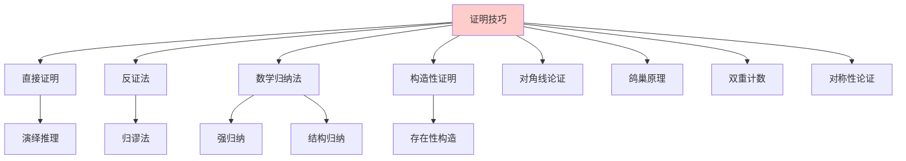
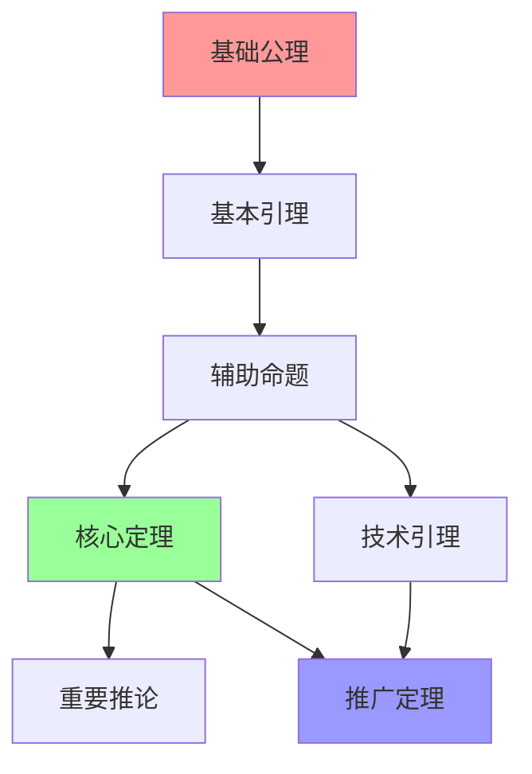
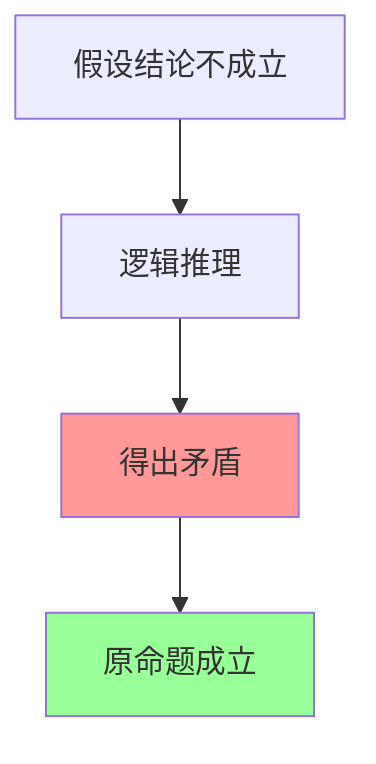
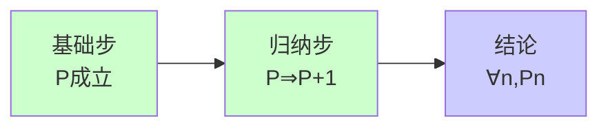
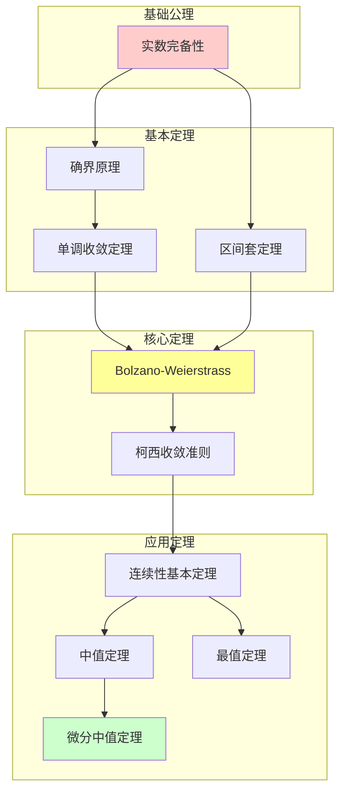
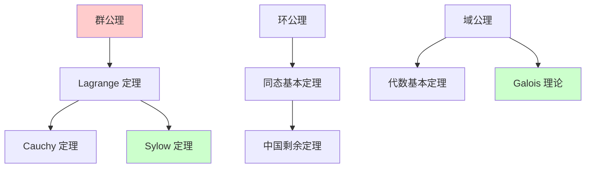
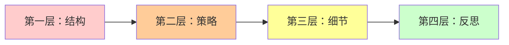
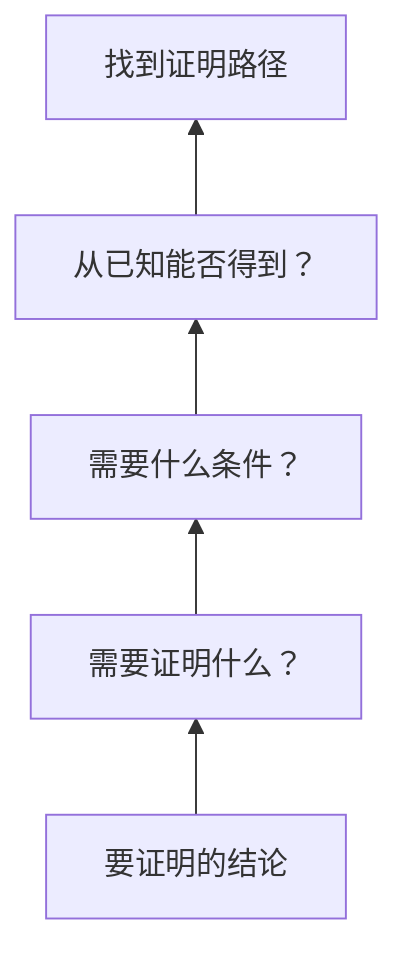
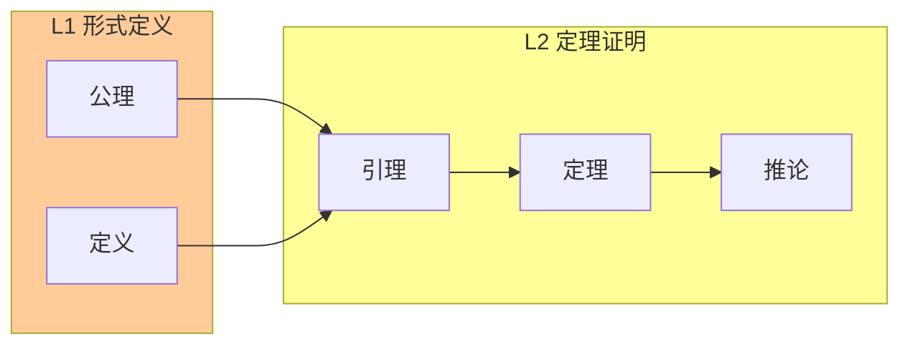

# L2 定理证明层次 (L2-Theorem)

## 概述

**L2-Theorem** 是数学知识层次体系的第三个层级，聚焦于**定理的推导**、**证明技巧的掌握**以及**定理网络的构建**。在这一层次，数学从静态的定义走向动态的推理，建立起概念之间的逻辑关联网络。

---

## 一、定义与核心特征

### 1.1 定义

L2 定理证明层次是指在严格的公理化体系基础上，运用各种证明方法推导数学定理、建立命题之间逻辑关系的认知水平。这一层次的核心是**证明的艺术**——不仅是知道"什么为真"，更要理解"为什么为真"。

### 1.2 核心特征

#### 1.2.1 证明为本

L2 层次的标志性特征是**证明的中心地位**：

- 定理不是被陈述的，而是被**证明**的
- 证明不仅是验证工具，更是**发现工具**
- 证明的质量反映理解的深度

#### 1.2.2 技巧多样性

L2 层次要求掌握多种证明技巧：



#### 1.2.3 定理网络

L2 层次强调定理之间的**相互关联**：



---

## 二、证明方法论

### 2.1 直接证明

#### 2.1.1 基本结构

```

已知条件 P
↓ 逻辑推理
结论 Q

```

#### 2.1.2 经典示例

**定理**：两个奇数的和是偶数。

**证明**：

```

设 a, b 是奇数，则存在整数 m, n 使得：
    a = 2m + 1
    b = 2n + 1
因此：
    a + b = (2m + 1) + (2n + 1)
          = 2m + 2n + 2
          = 2(m + n + 1)
所以 a + b 是偶数。    ∎

```

### 2.2 反证法

#### 2.2.1 逻辑结构



#### 2.2.2 经典示例：质数无穷性

**定理（欧几里得）**：存在无穷多个质数。

**证明**：

```

假设质数只有有限个：p₁, p₂, ..., pₙ
考虑 N = p₁ × p₂ × ... × pₙ + 1
N 除以任何 pᵢ 都余 1，所以 N 不被任何已知质数整除
因此 N 要么是新的质数，要么有新的质因子
这与假设矛盾，故质数有无穷多个。    ∎

```

### 2.3 数学归纳法

#### 2.3.1 原理



#### 2.3.2 变体形式

| 归纳类型 | 适用场景 | 结构 |
|---------|---------|------|
| 简单归纳 | 线性递推 | P(0) ∧ ∀n(P(n)⇒P(n+1)) |
| 强归纳 | 依赖多个前项 | P(0) ∧ ∀n((∀k<n,P(k))⇒P(n)) |
| 结构归纳 | 递归结构 | 基础情形 ∧ 归纳情形 |
| 超限归纳 | 良序集 | 所有前元满足 ⇒ 当前满足 |

### 2.4 构造性证明

#### 2.4.1 存在性证明的两种范式

```mermaid
graph LR
    A[存在性命题<br/>∃x,P(x)] --> B[构造性证明]
    A --> C[非构造性证明]

    B --> B1[明确给出x]<-->B2[验证P(x)]
    C --> C1[反证法]<-->C2[归谬]

    style B fill:#99ff99
    style C fill:#ffcc99

```

#### 2.4.2 经典示例

**定理**：存在无理数 a, b 使得 aᵇ 是有理数。

**构造性证明**：

```

考虑 √2^√2
情形1：若 √2^√2 是有理数，取 a = b = √2
情形2：若 √2^√2 是无理数，则 (√2^√2)^√2 = √2² = 2 是有理数
       取 a = √2^√2, b = √2
无论哪种情形，结论都成立。    ∎

```

---

## 三、核心定理的证明范式

### 3.1 Lagrange 定理

#### 3.1.1 定理陈述

**定理**：若 H 是有限群 G 的子群，则 |H| 整除 |G|。

#### 3.1.2 证明结构

```mermaid
graph TD
    A[定义陪集] --> B[陪集划分群]
    B --> C[陪集等势]
    C --> D[计数论证]
    D --> E[结论：|G| = [G:H]·|H|]

    style E fill:#99ff99

```

#### 3.1.3 详细证明

**证明**：

```

1. 对任意 a ∈ G，定义左陪集 aH = {ah | h ∈ H}

2. 陪集性质：
   (a) 任意两个陪集要么相等，要么不交
   (b) 所有陪集的并等于 G
   (c) 每个陪集与 H 有相同的基数

3. 证明 (c)：定义映射 φ: H → aH，φ(h) = ah
   - φ 是满射（由定义）
   - φ 是单射：若 ah₁ = ah₂，则 h₁ = h₂（消去律）
   - 故 |aH| = |H|

4. 设 G 有 k 个不同的左陪集，则：

   |G| = k · |H|

5. 因此 |H| 整除 |G|。    ∎

```

### 3.2 中值定理

#### 3.2.1 定理陈述

**定理**：若 f 在 [a,b] 上连续，且 f(a) < c < f(b)，
则存在 ξ ∈ (a,b) 使得 f(ξ) = c。

#### 3.2.2 证明策略

```mermaid
graph TD
    A[构造集合<br/>S = {x | f(x) < c}] --> B[确界存在]

    B --> C[连续性论证]
    C --> D[反证排除<br/>f(ξ) < c 和 f(ξ) > c]
    D --> E[结论：f(ξ) = c]

    style E fill:#99ff99

```

### 3.3 鸽巢原理及其应用

#### 3.3.1 基本形式

**定理**：若 n 个物品放入 m 个盒子，且 n > m，
则至少有一个盒子包含至少两个物品。

#### 3.3.2 应用示例

**命题**：在任意 13 个人中，至少有两个人出生在同一个月。

**证明**：

```

物品：13 个人
盒子：12 个月份
由鸽巢原理，结论成立。    ∎

```

### 3.4 对角线论证

#### 3.4.1 Cantor 定理

**定理**：对任意集合 A，|A| < |𝒫(A)|。

#### 3.4.2 证明

```mermaid
graph TD
    A[假设存在双射<br/>f: A → 𝒫(A)] --> B[构造特殊集合<br/>B = {x | x ∉ f(x)}]

    B --> C[B ∈ 𝒫(A)]
    C --> D[存在 a 使 f(a) = B]
    D --> E[矛盾：a ∈ B ⟺ a ∉ B]
    E --> F[假设不成立]

    style E fill:#ff9999
    style F fill:#99ff99

```

---

## 四、证明技巧分类体系

### 4.1 按逻辑结构分类

| 类别 | 技巧 | 典型应用 |
|-----|------|---------|
| 直接 | 演绎推理 | 代数恒等式 |
| 间接 | 反证法 | 无理数证明、无穷性 |
| 归纳 | 数学归纳法 | 数论命题、组合恒等式 |
| 构造 | 显式构造 | 存在性定理 |
| 对角线 | Cantor 论证 | 不可数性证明 |

### 4.2 按数学领域分类

#### 4.2.1 代数证明技巧

- **同态基本定理**：商群同构定理
- **线性代数技巧**：秩-零化度定理
- **Galois 对应**：域扩张与群的对应

#### 4.2.2 分析证明技巧

- **ε-δ 技术**：极限与连续性
- **紧致性论证**：有限覆盖定理
- **单调收敛**：有界单调序列必收敛

#### 4.2.3 组合证明技巧

- **双计数**：从不同角度计数同一集合
- **容斥原理**：并集基数计算
- **生成函数**：组合序列的代数处理

---

## 五、定理网络构建

### 5.1 实分析中的定理层次



### 5.2 代数中的定理网络



### 5.3 证明的模块化

**引理-定理-推论**结构：

```

┌─────────────────────────────────────┐
│           核心定理                  │
│    （主要结果，证明简洁）            │
├─────────────────────────────────────┤
│  引理1    引理2    引理3   技术结果  │
│ （工具）  （工具）  （工具） （工具） │
└─────────────────────────────────────┘
         ↓              ↓
    ┌─────────┐    ┌─────────┐
    │  推论1   │    │  推论2   │
    │（应用1） │    │（应用2） │
    └─────────┘    └─────────┘

```

---

## 六、L2 层次的学习策略

### 6.1 证明阅读能力

#### 6.1.1 分层阅读法



| 层次 | 关注点 | 问题 |
|-----|--------|------|
| 结构 | 整体框架 | 定理假设了什么？要证什么？|
| 策略 | 证明方法 | 使用了什么证明技巧？|
| 细节 | 每一步 | 这步为什么成立？|
| 反思 | 理解深度 | 能否用其他方法证明？|

### 6.2 证明写作能力

#### 6.2.1 写作原则

1. **清晰性**：每一步都明确说明
2. **逻辑性**：论证链条完整
3. **简洁性**：避免冗余步骤
4. **可读性**：适当使用段落和标记

#### 6.2.2 常见错误

| 错误类型 | 示例 | 纠正 |
|---------|------|------|
| 循环论证 | 用待证命题证明自身 | 检查假设和结论 |
| 偷换概念 | 改变定义的使用 | 严格遵循定义 |
| 不充分证明 | 跳步过多 | 补充中间步骤 |
| 过度证明 | 证明显而易见的事实 | 适度简化 |

### 6.3 证明发现策略

#### 6.3.1 倒推法



#### 6.3.2 启发式方法

- **类比**：类似定理的证明方法
- **特例**：从特殊情况入手
- **可视化**：几何直观辅助
- **试验**：具体数值验证猜想

---

## 七、L2 层次与其他层次的关系

### 7.1 与 L1 的关系



**关系特征**：

- L1 提供**原材料**（定义和公理）
- L2 进行**加工**（证明和推导）
- L2 的成果**丰富** L1 的内容

### 7.2 与 L3 的关系

L2 的个体定理在 L3 层次被整合为**理论体系**：

- L2 关注"如何证明单个定理"
- L3 关注"定理如何构成理论"

---

## 八、L2 层次的判断标准

### 8.1 内容判断标准

| 维度 | L2 标准 | L1 对比 |
|-----|--------|--------|
| **焦点** | 定理和证明 | 定义和公理 |
| **活动** | 逻辑推理 | 概念表述 |
| **成果** | 新命题 | 概念框架 |
| **技能** | 证明技巧 | 符号运用 |

### 8.2 学习者能力评估

**已具备 L2 能力的表现**：

- 能独立完成标准定理的证明
- 能识别适用的证明方法
- 能评价证明的优劣
- 能发现证明中的错误

**需要发展的能力**：

- 复杂定理的综合证明
- 证明策略的创造性选择
- 跨领域方法的迁移

---

## 九、经典证明赏析

### 9.1 无穷递降法（费马）

**定理**：方程 x⁴ + y⁴ = z² 无正整数解。

**证明思想**：假设存在解，构造更小的解，导致无限递降矛盾。

### 9.2 概率方法的诞生

**Erdős 的突破性思想**：用概率证明存在性，而不构造具体对象。

### 9.3 同调代数的证明力量

将几何问题转化为代数问题，用**长正合序列**等工具解决。

---

## 十、总结

L2 定理证明层次是数学活动的**核心舞台**。在这一层次：

- **证明**是数学的标志性活动
- **技巧**的掌握需要长期训练
- **网络**的构建体现理解的深度
- **创造**新证明是数学家的核心工作

正如哈代所言："数学家是通过构造模式来创造永恒之美的工匠。"证明就是这些模式中最精美的结构。

---

## 参考文献

1. Hammack, R. (2018). Book of Proof.
2. Solow, D. (2013). How to Read and Do Proofs.
3. Polya, G. (2004). How to Solve It.
4. Velleman, D. J. (2006). How to Prove It.
5. 张景中. (2015). 数学家的眼光.

---

*文档版本：1.0*
*创建日期：2026年4月*
*层次级别：L2-Theorem*
