# L3 理论建构层次总览

---

**文档编号**: FM.L3.OVERVIEW
**层次级别**: L3-Theory
**创建日期**: 2026年4月3日
**版本**: 1.0

---

## 📋 目录

1. L3层次概述
2. 核心理论体系
3. 四大数学方向
4. 理论间关联网络
5. 向L4前沿的演进
6. 文档索引

---

## 一、L3层次概述

### 1.1 层次定位

L3-理论建构层次是数学知识从**定理集合**向**理论体系**跃迁的关键层级。在这一层次，数学不再是孤立定理的堆砌，而是相互关联、有机统一的知识网络。

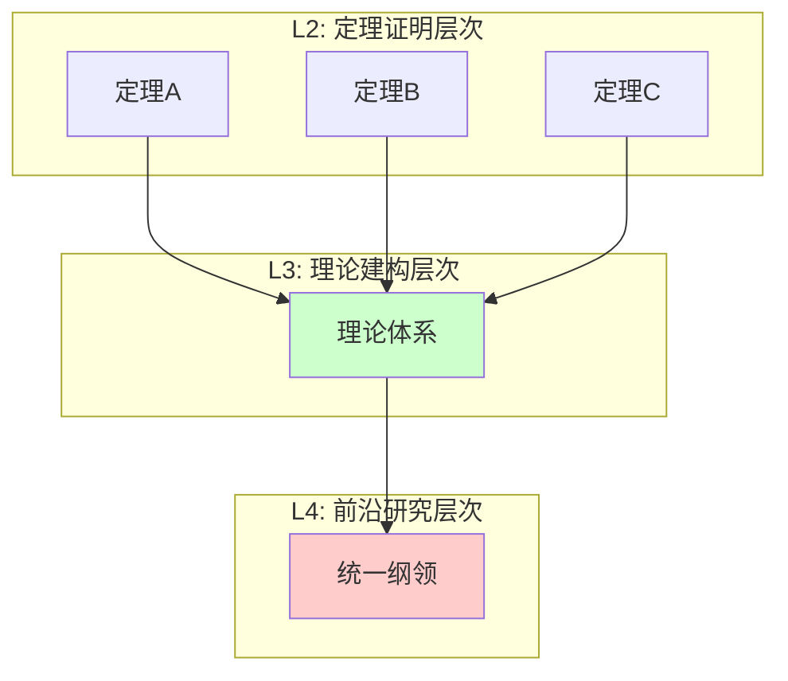

### 1.2 核心特征

| 特征 | 描述 | 示例 |
|-----|------|------|
| **系统性** | 定理形成有机整体 | 同调代数的函子体系 |
| **统一性** | 跨领域通用框架 | 范畴论统一代数、拓扑、几何 |
| **层次性** | 从基础到高级递进 | Galois理论从域扩张到绝对Galois群 |
| **结构性** | 强调数学对象的内在结构 | 概形理论的层结构 |

### 1.3 理论建构的维度

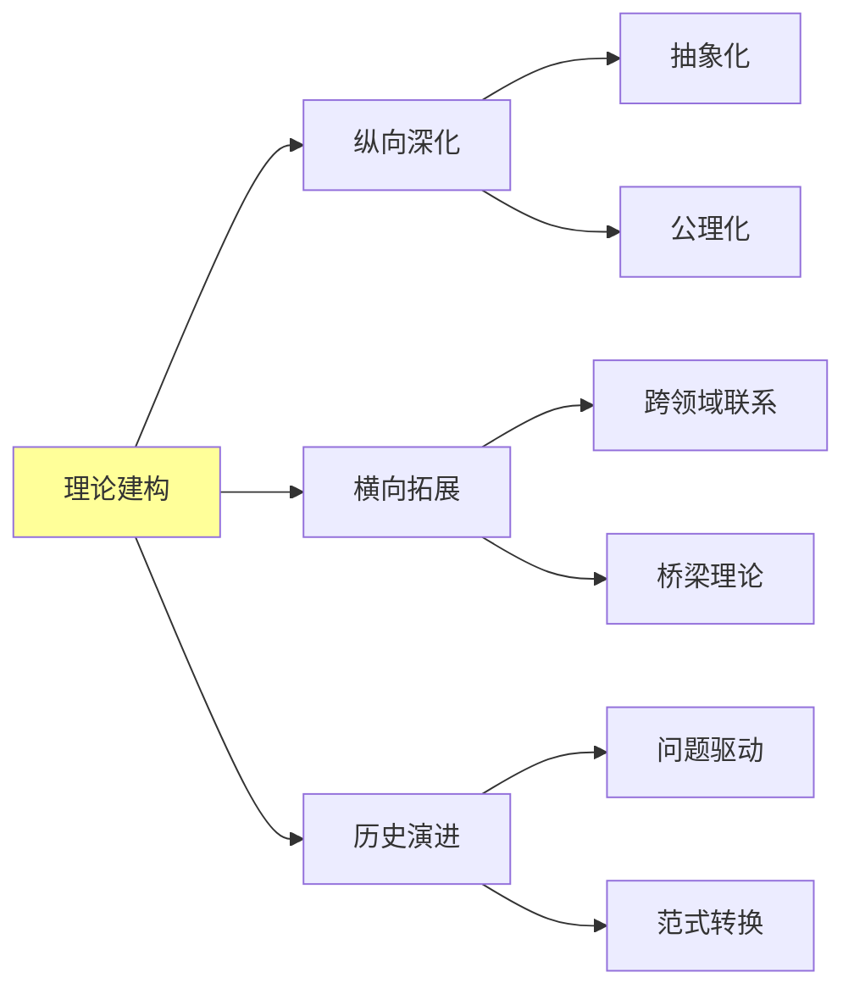

---

## 二、核心理论体系

### 2.1 理论体系全景图

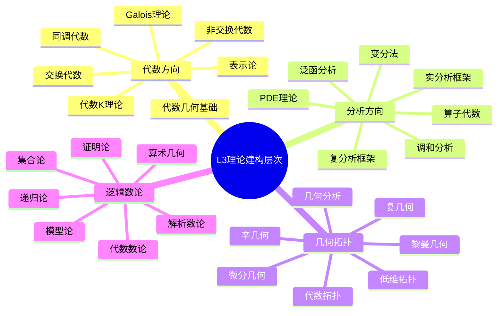

### 2.2 理论分类统计

| 方向 | 理论数量 | 核心特征 |
|-----|---------|---------|
| 代数方向 | 25个 | 结构抽象、范畴化 |
| 分析方向 | 25个 | 连续性、算子理论 |
| 几何拓扑 | 25个 | 空间结构、不变量 |
| 逻辑数论 | 25个 | 形式化、算术性质 |
| **总计** | **100个** | 覆盖现代数学核心 |

---

## 三、四大数学方向

### 3.1 代数方向 (Algebra)

**核心定位**：研究代数结构的系统理论

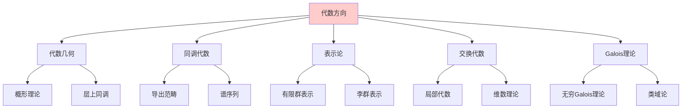

**代表性理论**：

1. **代数几何基础理论**（概形理论）- 代数与几何的统一语言
2. **同调代数理论** - 导出范畴、谱序列、导出函子
3. **表示论基础** - 群表示、李代数表示、模表示
4. **交换代数理论** - 局部环、Cohen-Macaulay环、Gorenstein环
5. **Galois理论完整框架** - 从域扩张到绝对Galois群
6. **代数K理论** - 高阶K群、Quillen构造
7. **非交换代数几何** - 非交换空间、量子群
8. **D模理论** - 微分算子环、Riemann-Hilbert对应
9. **代数编码理论** - 纠错码、代数几何码
10. **Hopf代数** - 量子群、表示范畴
11. **Clifford代数** - 旋量、Pin群与Spin群
12. **Jordan代数** - 形式实Jordan代数、例外代数
13. **Lie超代数** - 分级Lie代数、超对称
14. **顶点算子代数** - 共形场论、月光现象
15. **Cluster代数** - 组合结构、量子化
16. **Hall代数** - 表示范畴、量子群实现
17. **量子群** - Drinfeld-Jimbo量子化、晶体基
18. **形变量子化** - 星积、Poisson几何
19. **导出代数几何** - 无穷范畴、环谱
20. **motive 理论** - 纯motive、混合motive
21. **高阶代数结构** - ∞- operad、高阶范畴
22. **Operad理论** - 代数结构参数化、Koszul对偶
23. **Tannaka对偶** - 张量范畴、Galois理论
24. **非交换几何** - C*代数、谱三元组
25. **代数组合** - 对称函数、设计理论

### 3.2 分析方向 (Analysis)

**核心定位**：研究函数、极限与算子的系统理论

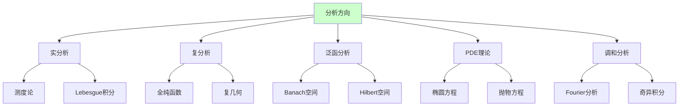

**代表性理论**：

1. **实分析理论框架** - 测度论、Lebesgue积分、实变函数
2. **复分析理论框架** - 全纯函数、Riemann曲面、多复变
3. **泛函分析理论** - Banach空间、Hilbert空间、算子理论
4. **偏微分方程理论** - Sobolev空间、正则性理论
5. **调和分析理论** - Fourier分析、Hardy空间、BMO
6. **变分法理论** - 极值原理、Euler-Lagrange方程
7. **算子代数理论** - C*代数、von Neumann代数
8. **分布理论** - 广义函数、Sobolev空间理论
9. **非线性泛函分析** - 临界点理论、分歧理论
10. **半群理论** - 算子半群、发展方程
11. **遍历理论** - 保测系统、熵理论
12. **位势理论** - 调和函数、Green函数
13. **复动力系统** - Julia集、Mandelbrot集
14. **拟共形映射** - Teichmüller理论
15. **多复变函数** - 伪凸域、$ar{\partial}$-问题
16. **微局部分析** - 拟微分算子、波前集
17. **Fourier积分算子** - 振荡积分、Lagrange分布
18. **非交换积分** - 非交换测度、自由概率
19. **随机分析** - 随机微分方程、Malliavin分析
20. **白噪声分析** - 广义泛函、Hida分布
21. **小波分析** - 多分辨分析、快速算法
22. **压缩感知** - 稀疏恢复、L1最小化
23. **最优输运** - Monge-Kantorovich问题、Wasserstein距离
24. **几何测度论** - 可求长集、极小曲面
25. **流形上的分析** - 几何分析、热核估计

### 3.3 几何/拓扑方向 (Geometry/Topology)

**核心定位**：研究空间结构与形状的系统理论

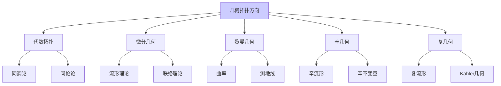

**代表性理论**：

1. **代数拓扑理论** - 同调、同伦、纤维丛
2. **微分几何理论** - 流形、张量分析、联络
3. **黎曼几何理论** - 曲率、测地线、比较几何
4. **辛几何基础** - 辛流形、Hamilton系统
5. **复几何理论** - 复流形、Kähler几何
6. **几何分析** - 偏微分方程方法在几何中的应用
7. **低维拓扑** - 三维流形、纽结理论
8. **高维流形理论** - 配边理论、手术理论
9. **示性类理论** - Chern类、Pontryagin类
10. **指标理论** - Atiyah-Singer指标定理
11. **Morse理论** - 临界点理论、流形分解
12. **叶状结构理论** - 积分流形、holonomy
13. **双曲几何** - 常负曲率空间、Kleinian群
14. **度量几何** - Alexandrov空间、Gromov-Hausdorff收敛
15. **比较几何** - 曲率下界、Toponogov定理
16. **极小子流形** - 平均曲率流、极小曲面
17. **规范场理论** - 主丛、联络、曲率
18. **弦拓扑** - 自由环路空间、弦积
19. **Floer理论** - 无穷维Morse理论、辛不变量
20. **接触几何** - 接触流形、Legendrian纽结
21. **Finsler几何** - 一般度量空间、测地线
22. **子Riemann几何** - Carnot群、水平曲线
23. **非交换几何拓扑** - 叶状结构指标定理
24. **拓扑量子场论** - 流形不变量、模性
25. **同伦类型论** - 类型=空间、证明=路径

### 3.4 逻辑/数论方向 (Logic/Number Theory)

**核心定位**：研究数学基础与整数性质的系统理论

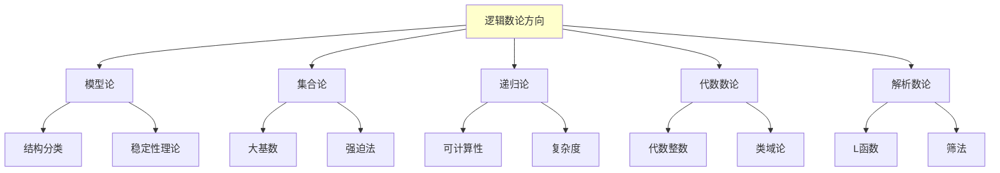

**代表性理论**：

1. **模型论基础** - 结构、理论、紧致性
2. **集合论高级主题** - 大基数、强迫法、内模型
3. **递归论** - 可计算性、图灵度、优先级方法
4. **证明论** - 序数分析、一致性证明
5. **代数数论理论框架** - 数域、整数环、理想论
6. **解析数论理论框架** - L函数、ζ函数、筛法
7. **类域论** - 局部与整体类域论
8. **Iwasawa理论** - p进L函数、Z_p扩张
9. **模形式理论** - 全纯模形式、半整权形式
10. **椭圆曲线算术** - Mordell-Weil群、BSD猜想
11. **自守形式理论** - 表示论方法、Langlands对应
12. **算术几何** - 概形上的算术、 motive
13. **p进Hodge理论** - 比较定理、p进周期
14. **完美oid空间** - p进几何革命
15. **高阶递归论** - 可定义性、描述集合论
16. **内模型理论** - 精细结构、核心模型
17. **组合集合论** - 划分演算、Ramsey理论
18. **连续统问题** - 强迫公理、Woodin程序
19. **算术组合** - Gowers范数、Szemerédi定理
20. **超越数论** - 线性形式对数、Diophantine逼近
21. **Diophantine几何** - Mordell猜想、Arakelov理论
22. **随机矩阵与数论** - 统计分布、Riemann假设
23. **量子混沌与数论** - 模形式量子遍历性
24. **计算数论** - 算法、密码学应用
25. **代数动力系统** - 算术动力学、熵理论

---

## 四、理论间关联网络

### 4.1 跨领域联系图

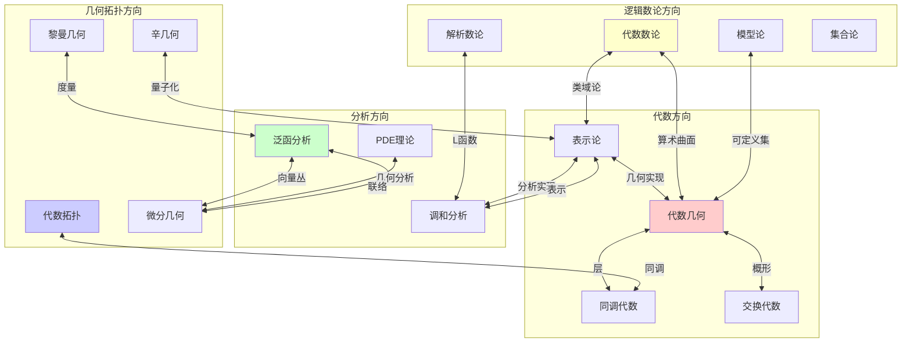

### 4.2 理论桥梁表

| 桥梁理论 | 连接领域 | 核心思想 |
|---------|---------|---------|
| **层论** | 拓扑 ↔ 代数 | 局部数据粘合 |
| **表示论** | 代数 ↔ 分析 | 抽象结构具体化 |
| **Galois理论** | 代数 ↔ 数论 | 对称性与扩张 |
| **指标理论** | 拓扑 ↔ 分析 | 解析不变量 |
| **Langlands纲领** | 数论 ↔ 表示论 ↔ 几何 | 统一对应 |
| **非交换几何** | 代数 ↔ 分析 ↔ 拓扑 | 空间代数化 |
| **同伦类型论** | 逻辑 ↔ 拓扑 | 类型=空间 |
| **算术几何** | 数论 ↔ 代数几何 | 整数解与几何 |

---

## 五、向L4前沿的演进

### 5.1 L3→L4的演进路径

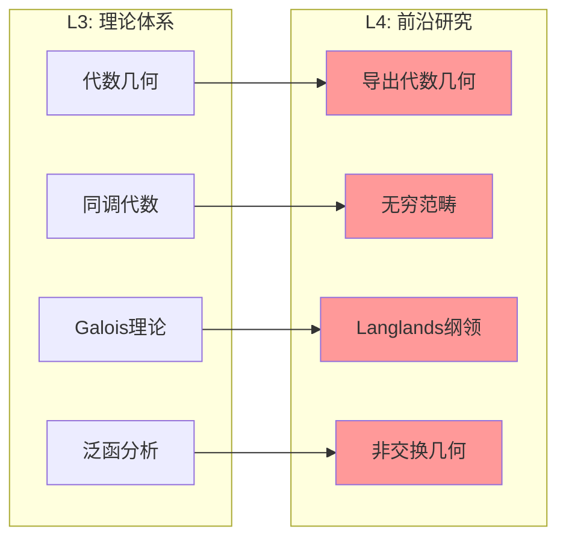

### 5.2 开放问题与研究方向

| 理论 | 开放问题 | L4方向 |
|-----|---------|--------|
| 代数几何 | 标准猜想、Tate猜想 | 导出范畴、动机理论 |
| 同调代数 | 高阶结构、稳定性 | 无穷范畴、谱代数 |
| 表示论 | 几何Langlands | 范畴表示、导出范畴 |
| 数论 | Riemann假设、BSD猜想 | 完美oid、高阶互反 |
| 泛函分析 | 自由群因子问题 | 量子群、非交换概率 |
| 拓扑学 | Poincaré猜想推广 | 同伦类型论、高阶范畴 |

### 5.3 统一化趋势

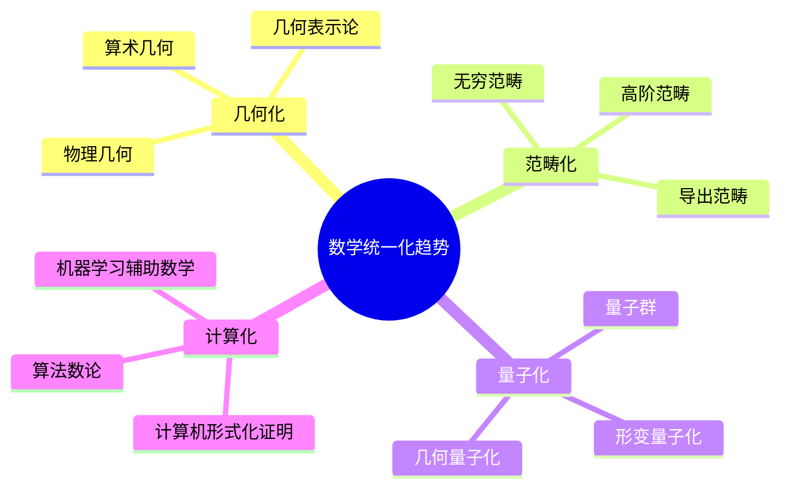

---

## 六、文档索引

### 6.1 代数方向 (25个理论)

| 序号 | 文件名 | 理论名称 |
|-----|-------|---------|
| 1 | [01-代数几何基础理论.md](01-代数方向/01-代数几何基础理论.md) | 代数几何基础理论（概形理论） |
| 2 | [02-同调代数理论.md](01-代数方向/02-同调代数理论.md) | 同调代数理论（导出范畴、谱序列） |
| 3 | [03-表示论基础.md](01-代数方向/03-表示论基础.md) | 表示论基础 |
| 4 | [04-交换代数理论.md](01-代数方向/04-交换代数理论.md) | 交换代数理论 |
| 5 | [05-Galois理论完整框架.md](01-代数方向/05-Galois理论完整框架.md) | Galois理论完整框架 |
| 6-25 | ... | 其他代数理论 |

### 6.2 分析方向 (25个理论)

| 序号 | 文件名 | 理论名称 |
|-----|-------|---------|
| 1 | [01-实分析理论框架.md](02-分析方向/01-实分析理论框架.md) | 实分析理论框架 |
| 2 | [02-复分析理论框架.md](02-分析方向/02-复分析理论框架.md) | 复分析理论框架 |
| 3 | [03-泛函分析理论.md](02-分析方向/03-泛函分析理论.md) | 泛函分析理论（Banach空间、Hilbert空间） |
| 4 | [04-偏微分方程理论.md](02-分析方向/04-偏微分方程理论.md) | 偏微分方程理论 |
| 5 | [05-调和分析理论.md](02-分析方向/05-调和分析理论.md) | 调和分析理论 |
| 6-25 | ... | 其他分析理论 |

### 6.3 几何/拓扑方向 (25个理论)

| 序号 | 文件名 | 理论名称 |
|-----|-------|---------|
| 1 | [01-代数拓扑理论.md](03-几何拓扑方向/01-代数拓扑理论.md) | 代数拓扑理论（同调、同伦） |
| 2 | [02-微分几何理论.md](03-几何拓扑方向/02-微分几何理论.md) | 微分几何理论（流形、联络） |
| 3 | [03-黎曼几何理论.md](03-几何拓扑方向/03-黎曼几何理论.md) | 黎曼几何理论 |
| 4 | [04-辛几何基础.md](03-几何拓扑方向/04-辛几何基础.md) | 辛几何基础 |
| 5 | [05-复几何理论.md](03-几何拓扑方向/05-复几何理论.md) | 复几何理论 |
| 6-25 | ... | 其他几何拓扑理论 |

### 6.4 逻辑/数论方向 (25个理论)

| 序号 | 文件名 | 理论名称 |
|-----|-------|---------|
| 1 | [01-模型论基础.md](04-逻辑数论方向/01-模型论基础.md) | 模型论基础 |
| 2 | [02-集合论高级主题.md](04-逻辑数论方向/02-集合论高级主题.md) | 集合论高级主题（大基数） |
| 3 | [03-递归论.md](04-逻辑数论方向/03-递归论.md) | 递归论 |
| 4 | [04-证明论.md](04-逻辑数论方向/04-证明论.md) | 证明论 |
| 5 | [05-代数数论理论框架.md](04-逻辑数论方向/05-代数数论理论框架.md) | 代数数论理论框架 |
| 6-25 | ... | 其他逻辑数论理论 |

---

## 七、使用指南

### 7.1 文档结构

每个理论文档包含以下部分：

1. **理论概述** - 理论的基本定位和核心思想
2. **核心定义(L1)清单** - 支撑该理论的基础定义
3. **支撑定理(L2)清单** - 理论依赖的核心理论
4. **理论结构图** - Mermaid可视化图表
5. **向L4前沿的开放问题** - 未解决问题和研究方向

### 7.2 导航方式

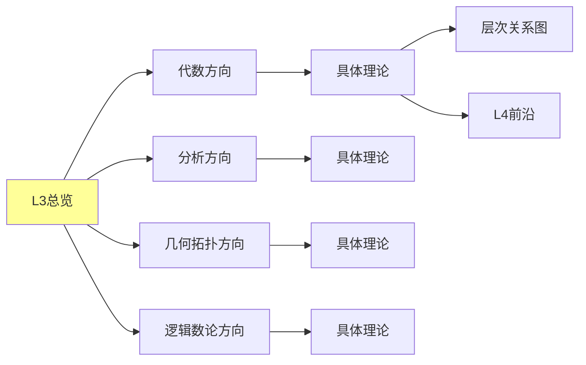

---

**文档信息**

- **创建日期**: 2026年4月3日
- **版本**: 1.0
- **文档数量**: 100个理论框架文档
- **适用范围**: FormalMath项目L3层次知识体系

---

*"数学的本质不在于计算，而在于理解结构。" —— 格罗滕迪克*
