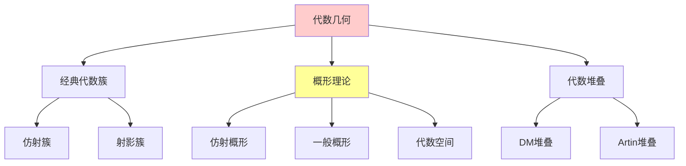
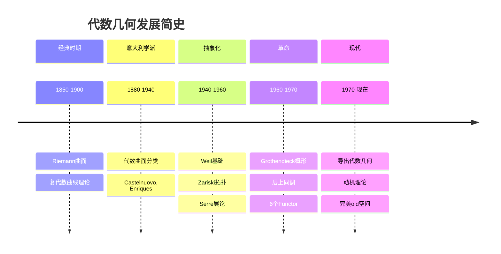
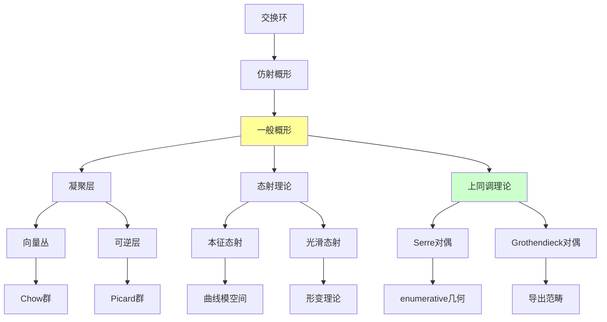
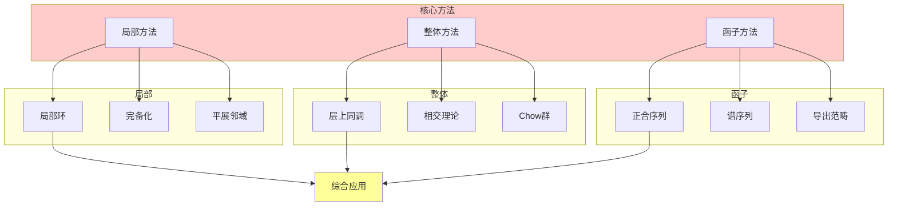
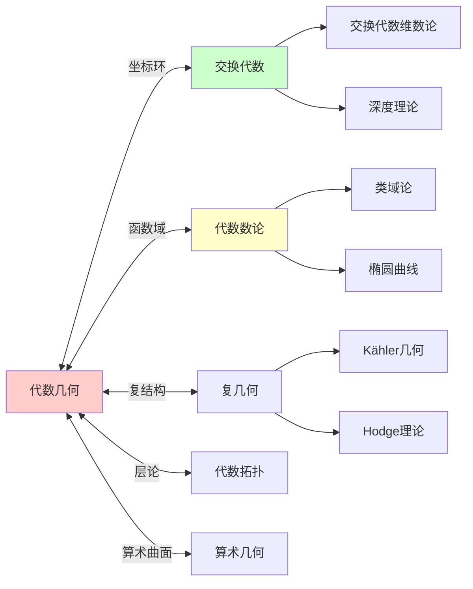
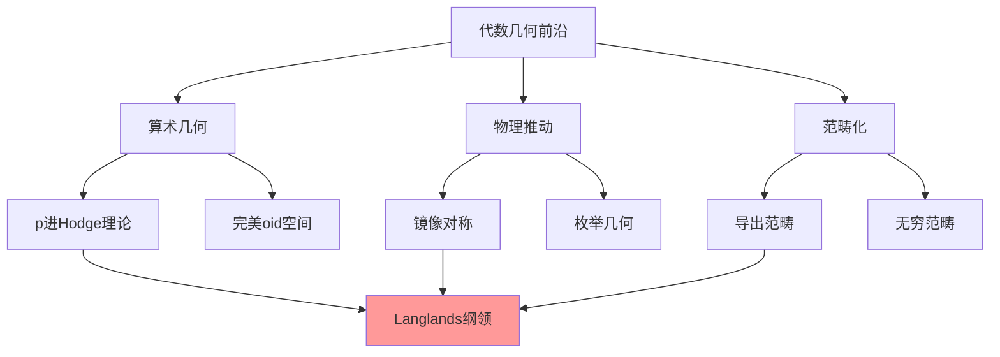

# 代数几何基础理论（概形理论）

---

**文档编号**: FM.L3.ALG.01  
**理论名称**: 代数几何基础理论（概形理论）  
**MSC分类**: 14-XX (代数几何)  
**创建日期**: 2026年4月3日  
**版本**: 1.0

---

## 📋 目录

1. [理论概述](#1-理论概述)
2. [核心定义(L1)清单](#2-核心定义l1清单)
3. [支撑定理(L2)清单](#3-支撑定理l2清单)
4. [理论结构图](#4-理论结构图)
5. [向L4前沿的开放问题](#5-向l4前沿的开放问题)
6. [参考文献](#6-参考文献)

---

## 一、理论概述

### 1.1 理论定位

代数几何是研究**多项式方程的解集**的学科。从经典代数簇到现代**概形理论**，代数几何实现了从具体几何对象到抽象范畴框架的飞跃，成为连接代数、数论、拓扑和物理的桥梁学科。

### 1.2 核心思想

| 核心思想 | 描述 | 重要性 |
|---------|------|-------|
| **函子观点** | 几何对象由其上函数决定 | Yoneda原理 |
| **相对观点** | 在基概形上相对研究 | 纤维化思维 |
| **局部-整体原理** | 局部性质决定整体性质 | 层论基础 |
| **泛性质** | 用普遍性质刻画构造 | 范畴论方法 |

### 1.3 历史演进

---

## 二、核心定义(L1)清单

### 2.1 基础层定义

| 定义名称 | 数学表述 | 层次 |
|---------|---------|-----|
| **仿射概形** | $X = \text{Spec}(A)$, $A$交换环 | L1 |
| **结构层** | $\mathcal{O}_X$, $X$上的正则函数层 | L1 |
| **概形** | 局部同构于仿射概形的环化空间 | L1 |
| **态射** | 局部环化空间的态射 | L1 |
| **纤维积** | $X \times_S Y$的泛性质 | L1 |

### 2.2 几何对象定义

| 定义名称 | 数学表述 | 层次 |
|---------|---------|-----|
| **闭子概形** | 由理想层定义的子概形 | L1 |
| **开浸入** | 同构于开子概形的态射 | L1 |
| **闭浸入** | 由满射环同态诱导的态射 | L1 |
| **有限态射** | 仿射且整体有限的态射 | L1 |
| **本征态射** | 泛闭、分离、有限型 | L1 |

### 2.3 凝聚层定义

| 定义名称 | 数学表述 | 层次 |
|---------|---------|-----|
| **凝聚层** | 局部有限呈示的$\mathcal{O}_X$-模 | L1 |
| **可逆层** | 局部自由的秩1层 | L1 |
| ** ample层** | 整体截断定义浸入的层 | L1 |
| ** Picard群** | 可逆层的同构类群 | L1 |
| **除子** | 余维1闭子簇的形式和 | L1 |

### 2.4 上同调定义

| 定义名称 | 数学表述 | 层次 |
|---------|---------|-----|
| **层上同调** | $H^i(X, \mathcal{F})$, 导出函子 | L1 |
| **Čech上同调** | 开覆盖的极限上同调 | L1 |
| **Serre对偶** | $H^i(X, \mathcal{F})^* \cong H^{n-i}(X, \omega_X \otimes \mathcal{F}^\vee)$ | L1 |
| **Kähler微分** | $\Omega_{X/S}$, 相对微分形式 | L1 |
| **切丛** | 微分层的对偶$\mathcal{T}_X = \Omega_X^\vee$ | L1 |

---

## 三、支撑定理(L2)清单

### 3.1 基本定理

| 定理名称 | 陈述 | 重要性 |
|---------|------|-------|
| **Hilbert零点定理** | $I(V(J)) = \sqrt{J}$ | 代数-几何对应基础 |
| **仿射概形等价** | $\text{AffSch} \cong \text{CRing}^{\text{op}}$ | 对偶性原理 |
| **层化定理** | 预层存在唯一层化 | 层论基础 |
| **Serre定理** | 拟凝聚层的整体截面生成 | 仿射概形特征 |
| **Chevalley定理** | 可构造集的像可构造 | 本征态射性质 |

### 3.2 上同调定理

| 定理名称 | 陈述 | 重要性 |
|---------|------|-------|
| **Serre消失定理** | ample层的高阶上同调消失 | 射影概形工具 |
| **Serre有限性** | 本征态射推进的凝聚层有有限维上同调 | 基本有限性 |
| **Grothendieck消失** | 高维上同调消失 | 维数理论 |
| **Leray谱序列** | $R^pf_* \circ R^qg_* \Rightarrow R^{p+q}(f \circ g)_*$ | 函子复合 |
| **投影公式** | $Rf_*\mathcal{F} \otimes^L \mathcal{G} \cong Rf_*(\mathcal{F} \otimes^L Lf^*\mathcal{G})$ | 推进-拉回对偶 |

### 3.3 对偶性定理

| 定理名称 | 陈述 | 重要性 |
|---------|------|-------|
| **Serre对偶** | 光滑射影簇的Poincaré型对偶 | 上同调计算 |
| **Grothendieck对偶** | 本征态射的右伴随存在性 | 相对对偶理论 |
| **局部对偶** | 局部上同调的对偶性 | 局部理论 |
| **Poincaré对偶** | 复流形的拓扑对偶 | 与代数对偶联系 |

### 3.4 Riemann-Roch型定理

| 定理名称 | 陈述 | 重要性 |
|---------|------|-------|
| **RR曲线** | $l(D) - l(K-D) = \deg D + 1 - g$ | 曲线理论核心 |
| **Hirzebruch-Riemann-Roch** | $\chi(\mathcal{E}) = \int_X \text{ch}(\mathcal{E})\text{Td}(X)$ | 高维推广 |
| **Grothendieck-Riemann-Roch** | 相对情形、Chow群中的等式 | 最一般形式 |
| **Adjunction公式** | $K_Y = (K_X + Y)|_Y$ | 子簇典范丛 |

---

## 四、理论结构图

### 4.1 概念依赖图

### 4.2 方法体系图

### 4.3 与其他理论的联系

---

## 五、向L4前沿的开放问题

### 5.1 经典猜想

| 猜想 | 描述 | 状态 | L4方向 |
|-----|------|------|-------|
| **Hodge猜想** | 有理上同调类是代数闭链的线性组合 | 开放 | motive理论 |
| **Tate猜想** | l进上同调类的代数性 | 开放 | 算术几何 |
| **Bloch-Beilinson猜想** | Chow群的结构 | 开放 | motive理论 |
| **标准猜想** | 代数循环的某种正定性 | 开放 | 韦伊上同调 |
| **Bloch猜想** | 零闭上同调⇒零Chow群 | 开放 | 代数循环 |

### 5.2 新兴方向

| 方向 | 描述 | 关键技术 |
|-----|------|---------|
| **导出代数几何** | 将概形提升到导出范畴层次 | 无穷范畴、环谱 |
| ** motives 理论** | 寻求统一的上同调理论 | Tannaka对偶 |
| **完美oid空间** | p进几何的革命性工具 | 几乎数学 |
| **高维代数簇** | 极小模型计划的完成 | 翻转理论 |
| **枚举几何** | Gromov-Witten理论、镜像对称 | 弦理论 |

### 5.3 研究前沿

---

## 六、参考文献

### 6.1 经典教材

1. **Hartshorne, R.** (1977). *Algebraic Geometry*. Springer.
2. **Liu, Q.** (2002). *Algebraic Geometry and Arithmetic Curves*. Oxford.
3. **Vakil, R.** (2017). *The Rising Sea: Foundations of Algebraic Geometry*. 讲义.

### 6.2 高级专著

4. **Grothendieck, A. & Dieudonné, J.** EGA系列.
5. **Stacks Project Authors.** (2023). *Stacks Project*.
6. **李文威.** (2018). *代数学方法*.

### 6.3 研究文献

7. **Scholze, P.** (2012). Perfectoid spaces. *Publ. Math. IHES*.
8. **Huybrechts, D.** (2006). *Fourier-Mukai Transforms in Algebraic Geometry*.

---

**文档信息**
- **创建日期**: 2026年4月3日
- **最后更新**: 2026年4月3日
- **维护状态**: 活跃
- **相关文档**: 交换代数理论、同调代数理论、算术几何

---

*"代数几何是几何与代数的完美结合，是数学中最美丽的分支之一。"*
