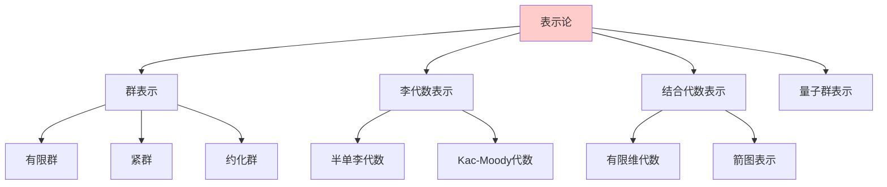
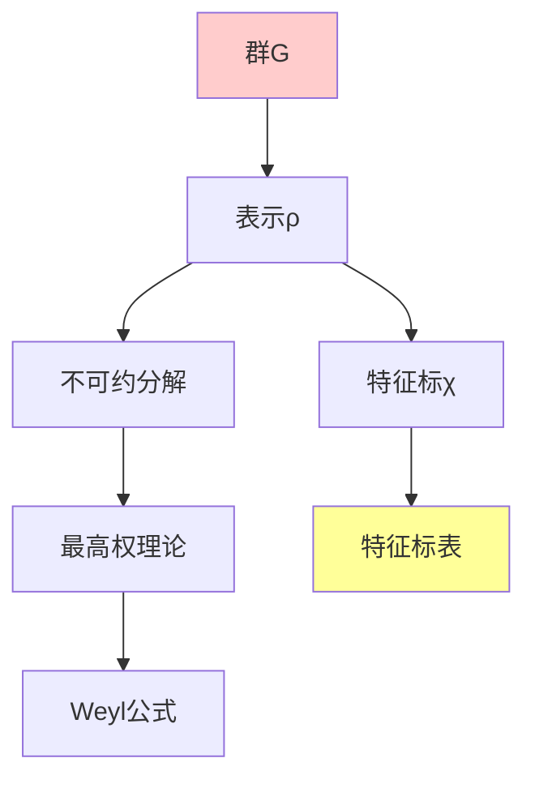

# 表示论基础

---

**文档编号**: FM.L3.ALG.03  
**理论名称**: 表示论基础  
**MSC分类**: @, @ (群表示论, Lie群)  
**创建日期**: 2026年4月3日  
**版本**: 1.0

---

## 一、理论概述

### 1.1 理论定位

表示论研究**抽象代数结构**在**具体向量空间上的作用**，通过线性变换将抽象的群、代数等对象具体化。它是连接代数、分析、几何和物理的核心桥梁。

### 1.2 核心思想

| 核心思想 | 描述 | 重要性 |
|---------|------|-------|
| **线性化** | 抽象结构的线性实现 | 计算工具 |
| **不可约性** | 基本构建块 | 结构分解 |
| **特征标理论** | 表示的数值不变量 | 分类工具 |
| **诱导与限制** | 子群/商群的表示关系 | 递推方法 |

---

## 二、核心定义(L1)清单

| 定义名称 | 数学表述 | 层次 |
|---------|---------|-----|
| **群表示** | ρ: G → GL(V) | L1 |
| **子表示** | 不变子空间 | L1 |
| **不可约表示** | 无非平凡子表示 | L1 |
| **完全可约** | 不可约表示的直和 | L1 |
| **特征标** | χ(g) = tr(ρ(g)) | L1 |
| **诱导表示** | Ind_H^G(ρ) | L1 |
| **限制表示** | Res_H^G(ρ) | L1 |
| **Weyl群** | 根系生成的反射群 | L1 |
| **最高权** | 支配整权 | L1 |

---

## 三、支撑定理(L2)清单

| 定理名称 | 陈述 | 重要性 |
|---------|------|-------|
| **Maschke定理** | 有限群表示完全可约(char=0) | 基本定理 |
| **Schur引理** | 不可约表示间同态 | 结构基础 |
| **特征标正交** | 不可约特征标正交归一 | 分类工具 |
| **Peter-Weyl** | 紧群的L^2分解 | 调和分析 |
| **Weyl特征标公式** | 特征标的显式计算 | 具体计算 |
| **Kazhdan-Lusztig** | 特征标的组合计算 | 深刻结果 |

---

## 四、理论结构图

---

## 五、向L4前沿的开放问题

| 方向 | 描述 | 前沿性 |
|-----|------|-------|
| **几何表示论** | 旗簇的几何方法 | L4 |
| **范畴表示论** | 2-范畴、导出范畴 | L4 |
| **Langlands纲领** | 数论-表示论-几何 | L4 |
| **模表示论** | 正特征的表示 | L4 |

---

**文档信息**
- **创建日期**: 2026年4月3日

---

## 参考文献

- Timothy Gowers (ed.), *The Princeton Companion to Mathematics*, 1st ed., Princeton University Press, 2008, ISBN: 9780691118802 / MR2467561
- Daniel J. Velleman, *How to Prove It: A Structured Approach*, 2nd ed., Cambridge University Press, 2006, ISBN: 9780521675994 / MR2448845